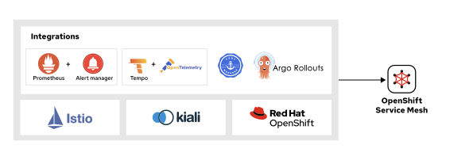
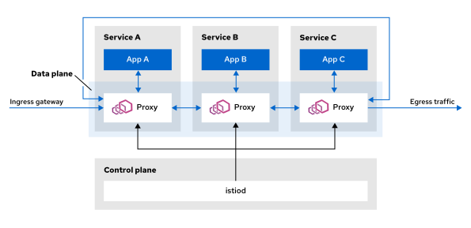
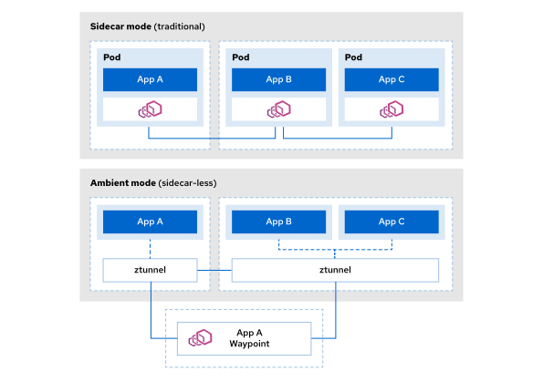
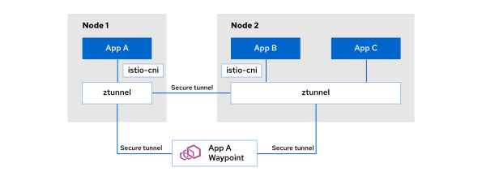
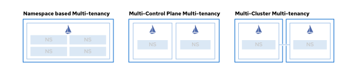

# 모듈 1.1: 오픈시프트 서비스 메시 아키텍처 탐구 (Exploring the OpenShift Service Mesh Architecture)

## 학습 목표 (Objectives)
* OpenShift Service Mesh의 고수준(High-level) 아키텍처를 설명할 수 있습니다.
* 제어 평면(Control Plane)과 데이터 평면(Data Plane)의 차이점을 구별할 수 있습니다.
* OpenShift Service Mesh 핵심 컴포넌트들의 역할을 명확히 파악할 수 있습니다.
* OpenShift Service Mesh가 OpenShift Container Platform과 어떻게 연동되고 통합되는지 설명할 수 있습니다.

---

## 1. Red Hat OpenShift Service Mesh 아키텍처 (Red Hat OpenShift Service Mesh Architecture)

Red Hat OpenShift Service Mesh는 Red Hat OpenShift Container Platform 위에서 실행되며, 크게 두 가지 핵심 영역으로 구성됩니다:

* **OpenShift Service Mesh 리소스:** 오픈 소스 이스티오(Istio) 프로젝트를 기반으로 구축된 핵심 가상 네트워크 및 보안 제어 자원입니다.
* **Kiali:** 레드햇이 제공하는 그래픽 관리 콘솔로, 오픈 소스 키알리(Kiali) 프로젝트를 기반으로 설계되었습니다.

다음 다이어그램은 서비스 메시를 구성하는 고수준 컴포넌트들의 전체 통합 아키텍처를 보여줍니다.


### 제어 평면 및 데이터 평면 아키텍처 (Control Plane and Data Plane Architecture)
서비스 메시의 전반적인 시스템 아키텍처는 논리적으로 제어 평면(Control Plane)과 데이터 평면(Data Plane)의 두 가지 레이어로 엄격하게 분리됩니다.

| 컴포넌트 (Component) | 상세 설명 (Description) |
| :--- | :--- |
| **제어 평면 (Control Plane)** | 제어 평면은 서비스 메시의 두뇌에 해당하는 '관리 및 구성 센터'입니다. 데이터 평면을 통과하는 실시간 네트워크 패킷을 직접 수정하거나 제어하지 않습니다. 대신, 데이터 평면에 지시하여 서비스 보안 정책을 적용하고 텔레메트리 데이터를 수집할 수 있도록 전체 프록시 네트워크를 구성합니다. |
| **데이터 평면 (Data Plane)** | 데이터 평면은 일련의 지능형 프록시(Proxy)들로 구성됩니다. 서비스 메시는 이러한 프록시들을 각각의 애플리케이션 컨테이너와 동일한 포드 내에 나란히 배치하며, 마이크로서비스 간에 발생하는 모든 네트워크 통신을 중간에서 안전하게 가로챕니다. |

---

## 2. Sail Operator와 핵심 이스티오 설정 명세 (The Sail Operator and Istio CRDs)

OpenShift Service Mesh에서 **Sail Operator**는 컨트롤 플레인의 설치 및 전체 수명 주기를 전담 관리하며, 다음과 같은 핵심 커스텀 리소스(CRD) 정의를 통해 가상 인프라를 배포하고 통제합니다.

### Istio
클러스터 전역 수준의 리소스로, 단일 클러스터 상에서 이스티오 컨트롤 플레인을 안전하게 배포하고 일괄 통제하는 역할을 전담합니다.

### IstioRevision
제어 평면의 특정 "리비전(Revision)"을 나타냅니다. 리비전 명칭을 개별화하여 정의함으로써 단일 클러스터 내에 독립된 다중 버전의 컨트롤 플레인을 충돌 없이 동시에 가동할 수 있습니다. 
이를 활용해 구버전 제어 평면과 새 제어 평면을 나란히 안전하게 공존시킬 수 있으며, 네임스페이스 레이블 지정을 통해 워크로드를 새 제어 평면 리비전으로 점진적 마이그레이션하는 카나리(Canary) 스타일의 제어부 업그레이드를 완벽히 실현합니다.
개별 리비전은 자체 독립적인 `istiod` 배포본을 포함합니다. 메시 하위의 개별 워크로드들은 네임스페이스 영역에 `istio.io/rev=<revision-name>` 레이블을 부여하는 것만으로 연동될 특정 리비전의 `istiod` 제어 인스턴스를 선택하여 사이드카 통신을 매핑하게 됩니다.

### IstioRevisionTag
컨트롤 플레인의 특정 리비전 이름에 대한 편리한 별칭(Alias)을 부여하는 리소스입니다. 이 별칭을 사용하면 네임스페이스 레이블을 매번 일일이 수동 수정하지 않고도 대단히 간단하게 카나리 업그레이드를 통제할 수 있습니다.
예를 들어, 네임스페이스에 실제 설치된 물리 버전명인 `istio.io/rev=1-2-3`을 직기재하는 대신 `istio.io/rev=production` 태그를 선언할 수 있습니다. 이후 `IstioRevisionTag` 리소스의 지시 대상을 새로운 리비전 버전으로 전환해 주는 것만으로 연동된 모든 워크로드에 새로운 이스티오 업그레이드가 무중단으로 자동 반영됩니다.

다음은 IstioRevisionTag 리소스를 생성하기 위한 커스텀 리소스 설정 샘플 예시입니다:

```yaml
apiVersion: sailoperator.io/v1
kind: IstioRevisionTag
metadata:
  name: production
  namespace: istio-system
spec:
  targetRef:
    kind: IstioRevision
    name: 1-2-3
```

### IstioCNI
컨테이너 네트워크 인터페이스(CNI) 플러그인을 제어 평면과 완전히 별개로 격리해 관리하는 특화 리소스입니다. Sail Operator에게 지시하여 모든 클러스터 노드 단위로 필수 네트워킹 전송 포드를 자동 배치하도록 명령합니다.
전통적인 사이드카 모드의 경우 각 애플리케이션 포드 내부로 Envoy 프록시를 인젝션하고 모든 통신을 가로챘습니다. 또한 애플리케이션과 Envoy 컨테이너가 가동되기 전, 리다이렉션 방화벽 규칙을 강제 수립하기 위해 매 포드마다 권한 상승(Privileged) 설정이 포함된 초기의 init 컨테이너를 가동해 주어야 했습니다.
하지만 `Istio CNI` 플러그인을 활성화하면, 이러한 위험하고 까다로운 권한 상승 init 컨테이너의 가동 요구 없이도 커널 수준(netfilter/iptables)에서 안전하게 네트워크 가로채기 규칙을 정의해 줍니다. 따라서 엄격한 보안 요건이 수반되는 엔터프라이즈 환경에서는 CNI 플러그인 연동이 매우 권장됩니다. (참고로 차세대 엠비언트 모드 기동 시에는 이 CNI 드라이버가 필수적으로 요구됩니다.)

---

## 3. 오픈시프트 서비스 메시 플랫폼 연동 (OpenShift Service Mesh Integrations)

OpenShift Service Mesh는 오픈시프트 플랫폼 내의 다양한 타 핵심 인프라 오퍼레이터 및 자원들과 통합되어, 메시 워크로드의 관찰 가능성(Observability), 암호화 보안, 그리고 릴리즈 배포 라이프사이클 관리를 극적으로 향상시킵니다.



* **OpenShift Monitoring (모니터링 연동):**
  * 오픈시프트의 기본 프로메테우스(Prometheus) 모니터링 스택과 연계되어 메시 전반의 메트릭 데이터를 수집 및 저장합니다. 
  * 이 수집된 데이터를 바탕으로 Kiali 시각화 플러그인(OSSMCP)이 실시간 트래픽 위상도를 부드럽게 매핑해 주고 서비스들의 기동 헬스 체크 상태를 직관적으로 분석 보고해 줍니다. 또한 Grafana 대시보드나 AlertManager 알림 시스템을 프로메테우스 메트릭과 연동해 함께 가동할 수 있습니다.
* **OpenShift Distributed Tracing & OpenTelemetry (분산 추적 연동):**
  * Grafana Tempo 및 OpenTelemetry 표준 콜렉터를 결합해, 복잡한 마이크로서비스 간에 발생하는 동적인 트래픽 트랜잭션을 마이크로초 단위로 추적하여 장애 병목 지점을 진단할 수 있도록 지원합니다.
* **OpenShift Cert Manager (보안 인증서 자동 갱신):**
  * 서비스 메시는 보안 암호화 통신을 위해 자가 서명 인증서(Self-signed CA)를 내장해 사용하지만, 기업 보안 가이드라인 준수를 위해 외부 공인 인증기관(Active Directory CA 혹은 외부 Commercial CA)과 연계되어 신뢰할 수 있는 SSL 인증서를 주입받아야 할 수 있습니다.
  * Cert Manager 오퍼레이터와 통합되면 `istio-csr` 인증 대행자가 동적으로 CSR 요청서를 발급하고 Cert Manager가 일괄 중앙 통제 갱신을 주도하게 되므로, 메시 내부의 상호 TLS(mTLS) 인증서 관리가 안전하고 완벽하게 자동화됩니다.
* **Argo Workflows / Argo Rollouts (고급 Canary 배포 연동):**
  * 쿠버네티스의 기본 Rolling Update 방식보다 더욱 수려하고 복잡한 점진적 트래픽 이식 배포를 지원합니다.
  * Argo Rollouts와 통합되면, 가상 라우팅 규칙(`VirtualService`)의 내부 가중치 비율을 메트릭 수집 현황에 따라 동적이고 세부적으로 조절하여 안전하게 카나리, 블루-그린 릴리즈를 통제할 수 있습니다.

---

## 4. 제어 평면과 데이터 평면의 실질적 상호 작용 (Control Plane and Data Plane Interaction)

제어 평면은 실시간으로 발생하는 물리적인 서비스 통신(런타임 트래픽) 경로 상에 직접 머무르거나 연동하지 않으며, 오직 데이터 평면의 지능형 프록시들을 프로그래밍하여 제어하는 설계 구조를 유지합니다.



### 제어 및 데이터 평면의 통신 흐름 방식
1. 애플리케이션 개발자 또는 관리자가 오픈시프트 콘솔 및 API를 사용해 `VirtualService`나 `DestinationRule` 같은 이스티오 표준 가상 설정을 생성하거나 수정합니다.
2. 제어 평면 데몬인 `istiod`가 클러스터에 배포된 이러한 설정 명세들의 변화를 실시간으로 모니터링(Watch)합니다.
3. `istiod`가 이 가상의 고수준 설정 규칙들을 가공하여, 실제 프록시 엔진인 Envoy가 해독할 수 있는 전용 바이너리 형태의 xDS 구성 정보로 컴파일 변환합니다.
4. `istiod`가 이 변환된 최신의 설정을 네트워크 상에 배치된 개별 Envoy 사이드카 프록시들에게 암호화 채널을 통해 즉시 안전하게 배포(xDS)합니다.
5. Envoy 프록시가 애플리케이션 가동 중단(Downtime) 현상 없이 새로운 통신 라우팅 규칙을 메모리에 즉각 동적으로 적용하여 통제하기 시작합니다.

이 일련의 프로세스를 거쳐 마이크로서비스들의 결함 주입(Fault Injection), 트래픽 경로 우회, 텔레메트리 메트릭 수집이 어떠한 서비스 단절 현상도 없이 완벽하게 중앙 통제식으로 실시간 운영됩니다.

### 웹어셈블리(WebAssembly, WASM)를 통한 프록시 동적 확장
플랫폼 엔지니어는 핵심 Envoy 프록시 자체의 컴파일 수정 요구 없이도, 가볍고 완전하게 샌드박싱 격리된 **WebAssembly (WASM)** 플러그인 모듈들을 가동함으로써 커스텀 인증 필터, 고유 로그 가공, 특화 텔레메트리 변환 설정을 무중단으로 확장할 수 있습니다. 이는 아주 적은 CPU/메모리 오버헤드로 다중 프로그래밍 언어(C++, Rust, Go) 개발을 지원하며 `WasmPlugin` 커스텀 리소스를 선언하는 것만으로 일괄 제어됩니다.

---

## 5. 데이터 평면 배포 모델 비교 (Data Plane Deployment Models)

서비스 메시 3은 인프라 자원의 가용성 및 보안 요건에 맞추어 사이드카(Sidecar) 방식과 차세대 사이드카리스인 엠비언트(Ambient) 방식의 두 가지 데이터 평면 가동 모델을 완벽히 제공합니다.



### 사이드카 모드 (Sidecar Mode - 전통적 구조)
각 애플리케이션 포드 내부마다 개별 Envoy 프록시가 가위 주입(Injection)되어 포드를 넘나드는 모든 인그레스 및 이그레스 트래픽을 완벽하게 가로챕니다.
* **한계 및 과제:** 각 포드마다 개별 프록시 구동을 위한 메모리/CPU 고유 오버헤드가 발생하며, 수많은 포드가 기동될 시 클러스터의 전반적인 가용 자원 효율과 스케일링 복잡도가 높아지는 단점이 동반됩니다.

### 엠비언트 모드 (Ambient Mode - 차세대 무주입 구조)
사이드카 주입 문제를 근본적으로 극복하기 위해, 가상 네트워크 기능을 L4 보안 오버레이 레이어와 L7 애플리케이션 가공 레이어로 나누어 노드 및 네임스페이스 격리 구조로 설계했습니다.



* **L4 보안 제어 (ztunnel):** 
  * 각 노드 단위로 단 1개씩만 배포되어 가동되는 극도의 초경량 프록시인 `ztunnel`이 노드 내의 모든 포드들의 L4 암호화 보안 터널(mTLS), 전송 모니터링, L4 인가 정책 설정을 가볍고 신속하게 수립합니다. 포드마다 프록시를 띄우지 않으므로 전체 서버 자원을 경이롭게 절약할 수 있습니다.
* **L7 애플리케이션 제어 (Waypoint Proxies):** 
  * L7 수준의 정교한 카나리 트래픽 라우팅, 쿠키 분석, 헤더 매핑 조작 및 서킷 브레이킹 기능이 명시적으로 필수 요구되는 네임스페이스 영역에만 Envoy 기반의 `Waypoint Proxy`를 지정 배포하여 가동합니다.
  * 트래픽이 평소에는 L4 오버레이(`ztunnel`)로 가볍게 달리다가, 정교한 가공이 필요할 시에만 `Waypoint Proxy`를 경유하도록 라우팅되므로 리소스 낭비와 네트워크 대기 지연율(Latency)을 획기적으로 낮출 수 있습니다.
  *(참고: 서비스 메시 3.1 기준 엠비언트 모드는 Technology Preview 상태이며, 완벽히 전폭 지원되는 주류 배포 구조는 여전히 사이드카 모드입니다.)*

---

## 6. 서비스 메시의 규모 확장 및 다중 테넌시 통제 (Scaling OpenShift Service Mesh)

클러스터 내에서 조직의 규모와 애플리케이션 전파 범위가 넓어짐에 따라, 자원 고가용성과 독립 격리성을 유지하기 위해 고도의 확장 모델이 지원됩니다.



### 다중 테넌시 격리 (Multitenancy Features)
* **네임스페이스 기반 단일 제어 모델:** 단일 이스티오 컨트롤 플레인(`Istio` 리소스)을 띄우고, `discoverySelectors` 필터를 사용하여 레이블이 지정된 격리된 특정 네임스페이스들의 자원들만 메시가 바라보도록 안전하게 격리합니다.
* **다중 컨트롤 플레인 격리 모델:** 더 강력한 환경 격리가 수반되는 경우, 단일 오픈시프트 클러스터 내에 독립된 다중 서비스 메시 컨트롤 플레인 버전을 버전 리비전(`revisions`)에 매핑하여 별도 가동함으로써 완벽하게 격리된 부서별 메시 인프라를 동시에 가동할 수 있습니다.

### 다중 클러스터 통합 모델 (Multicluster Deployments)
클러스터를 지리적으로 분산 전파하여 고가용성 및 재해 복구(DR) 네트워크 환경을 수립하기 위해 3가지 다중 제어 모델과 네트워크 토폴로지(Single 또는 Multinetwork)가 제공됩니다:
* **Multi-Primary:** 각 클러스터가 자체 컨트롤 플레인을 보유하고 상호 탐색을 통해 단일 메시 위상을 형성하는 모델 (고가용성 최적화).
* **Primary-Remote:** 주 클러스터가 제어 평면을 가동하고 원격 클러스터들은 이에 결합되어 통신을 중대 위임받는 모델 (중앙 집중 통제).
* **External Control Plane:** 완전히 고립되고 격리된 전용 인프라에서 제어 평면(`istiod`)을 별도로 소유 및 서비스 형태로 공급받고, 하위의 각 개별 독립 클러스터들은 어플리케이션 가동에만 전념하도록 설계된 최고 보안 등급의 아키텍처 모델.

---

## 💻 7. [실습] 클러스터 컴포넌트 실시간 진단

자, 이제 배운 풍부한 지식을 바탕으로 오른쪽 화면에 준비된 주피터 터미널(Terminal 1 & Terminal 2)을 활용해 현재 클러스터에 수립된 실제 컴포넌트 상태를 점검해 봅시다.

### 실습 1. 오퍼레이터 영역 내 Sail Operator 가동 상태 조회
서비스 메시 3의 수명 주기를 제어하고 가이드하는 Sail Operator 파드가 `Running` 상태로 안전하게 가동되고 있는지 첫 번째 터미널(위쪽)에서 진단합니다.
```execute
oc get pods -n openshift-operators -l app.kubernetes.io/name=sail-operator
```

### 실습 2. 노드별 CNI 드라이버 가동 및 배포 스펙 확인
SFC 및 컨테이너 권한 상승 유발 없이 모든 물리 워커 노드 단위로 안전하게 트래픽을 중재해 주는 이스티오 CNI 플러그인의 기동 헬스 체크 상태를 첫 번째 터미널(위쪽)에서 조회합니다.
```execute
oc get daemonset -n openshift-operators
```

### 실습 3. 신규 이스티오 설치 명세 정의서(CRD) 검출
서비스 메시 3에서 컨트롤 플레인의 단일화 배포를 제어하는 최상위 커스텀 리소스 정의서(`istios.sailoperator.io`)가 클러스터에 정상 가동 중인지 두 번째 터미널(아래쪽)에서 확인해 봅니다.
```execute-2
oc get crd | grep sailoperator.io
```

### 실습 4. 자신의 실습 네임스페이스 영역 격리 전환
실습 진행을 위해 자신에게 개별 격리 지정된 전용 프로젝트 네임스페이스 영역으로 이동하여 정상 작동 여부를 두 번째 터미널(아래쪽)에서 점검합니다.
```execute-2
oc project %username%
```

---

이것으로 공식 교재에 수록된 서비스 메시 3.0의 제어 평면, 데이터 평면, 배포 모델별 아키텍처 특징 분석 및 클러스터 진단 실습을 완벽하게 끝마쳤습니다. 다음 장으로 넘어가 컨트롤 플레인을 직접 배포하고 도메인을 설정하는 방법을 이어서 수행하겠습니다.
