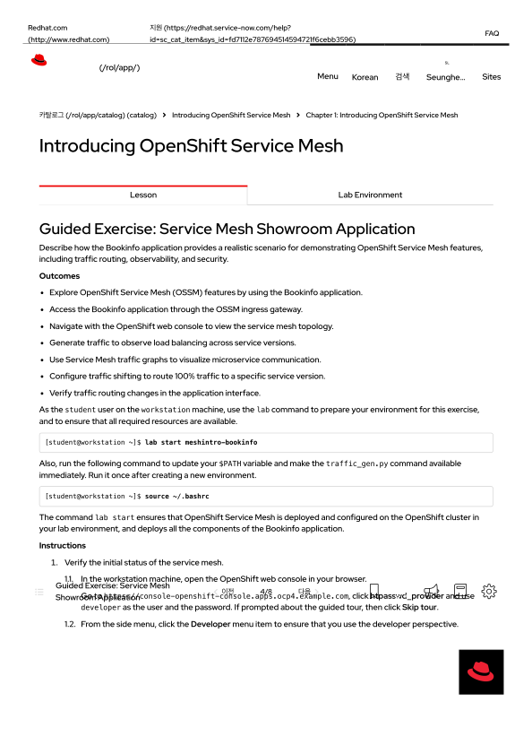
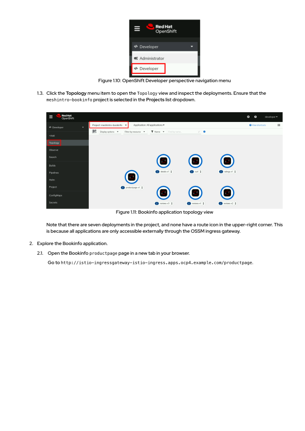
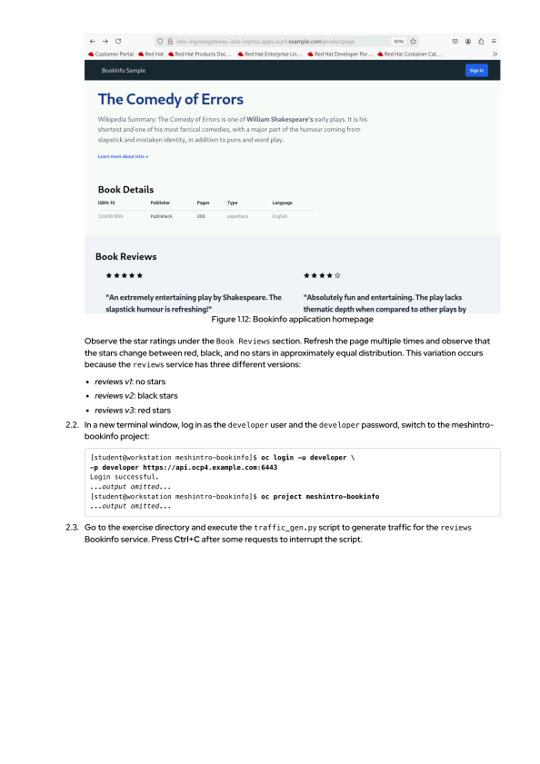
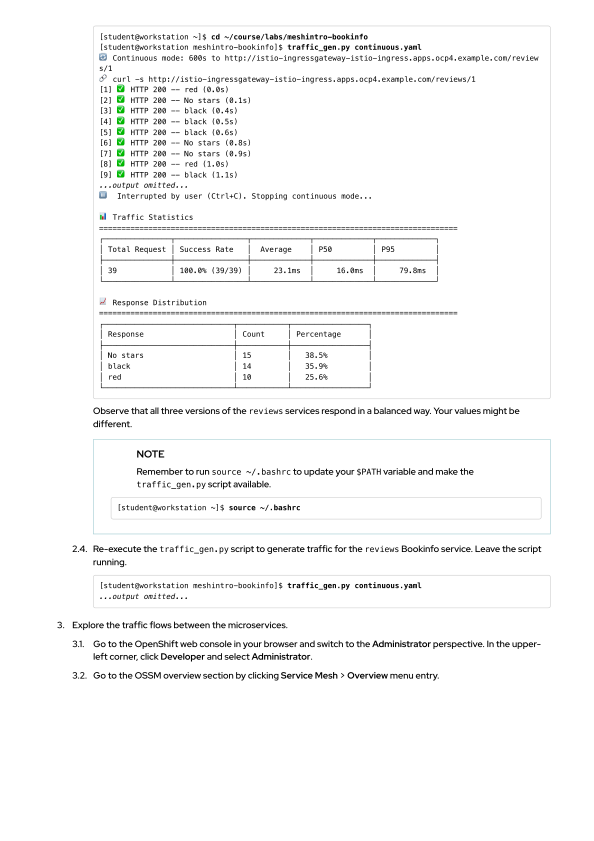
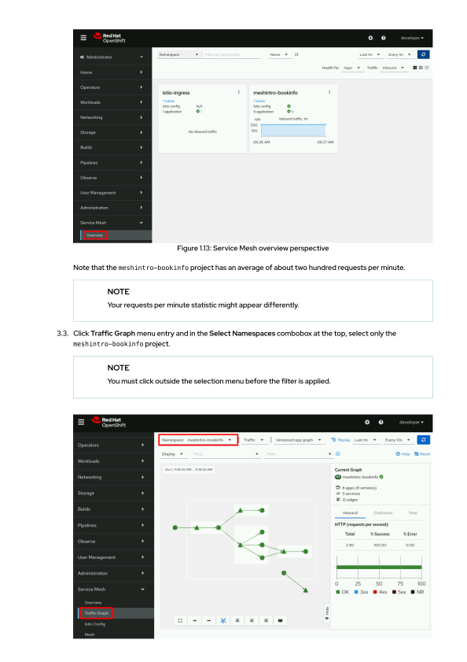
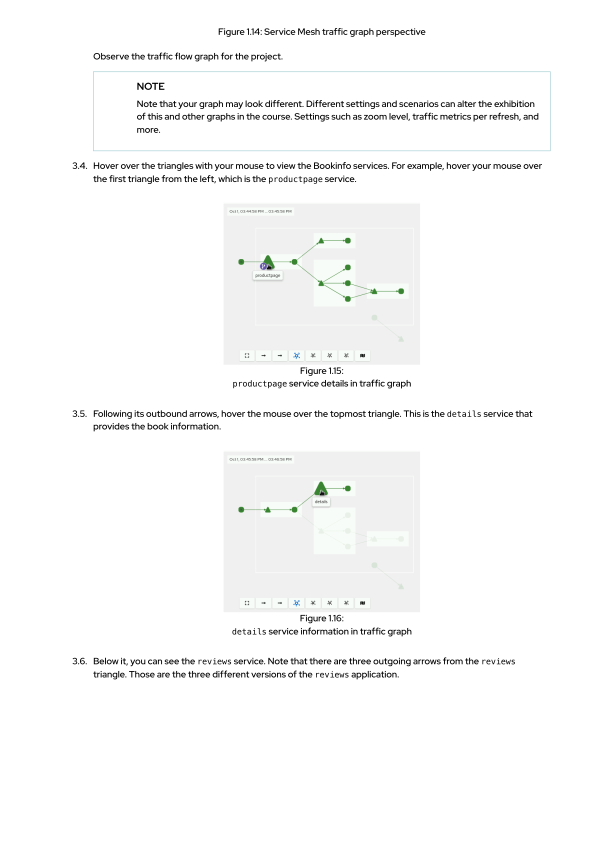
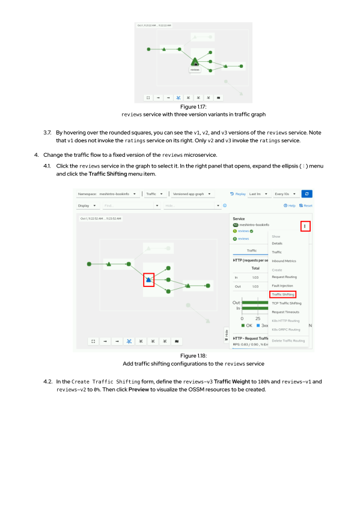
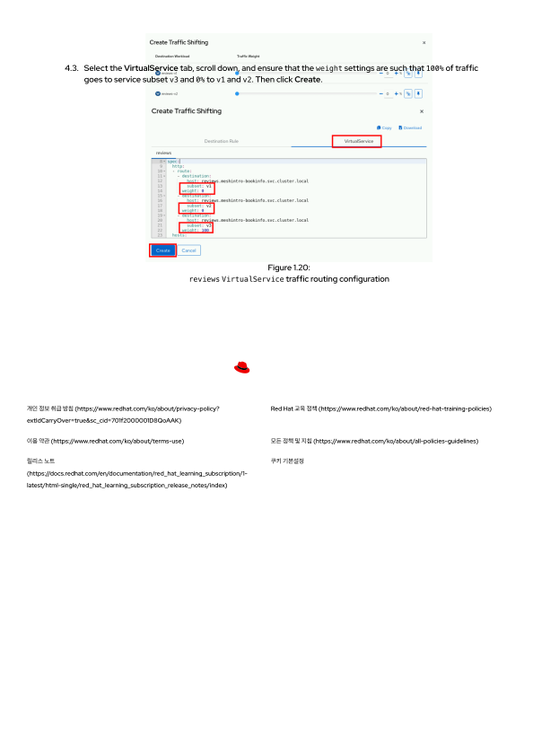

# 모듈 1.2: 서비스 메시 쇼룸 애플리케이션 배포 및 검증 (Service Mesh Showroom Application)

본 실습에서는 Bookinfo 마이크로서비스 애플리케이션을 오픈시프트 환경에 배포하고, 서비스 메시 인그레스 게이트웨이를 통한 외부 접속 제어, Kiali 기반의 실시간 네트워크 토폴로지 및 트래픽 맵 시각화, 그리고 마우스 클릭을 이용한 무중단 트래픽 가중치 분할(Traffic Shifting) 제어 기능을 직접 수행하고 검증합니다.

---

## 🎯 학습 결과 (Outcomes)
* Bookinfo 애플리케이션을 사용하여 OpenShift Service Mesh(OSSM) 기능을 탐색할 수 있습니다.
* OSSM 인그레스 게이트웨이(Ingress Gateway)를 통해 Bookinfo 애플리케이션에 외부 접속할 수 있습니다.
* OpenShift 웹 콘솔을 탐색하여 서비스 메시 위상도(Topology)를 파악할 수 있습니다.
* 실시간 트래픽을 생성하여 서비스 버전별 로드 밸런싱 흐름을 관찰할 수 있습니다.
* 서비스 메시 트래픽 그래프를 사용해 마이크로서비스 간의 통신 상태를 시각화합니다.
* 특정 서비스 버전으로 트래픽을 100% 라우팅하도록 트래픽 가중치 이동(Traffic Shifting)을 구성합니다.
* 애플리케이션 사용자 인터페이스에서 트래픽 라우팅 변경 결과를 실시간으로 검증합니다.

---

## 🏗️ 1. 실습 환경 준비 및 초기화 (Lab Preparation)

워크스테이션 가상 터미널 환경에서 본 실습을 진행하기 위해 가이드 준비 명령어를 구동하고 필수 도구 패스를 즉각 업데이트합니다.

### 🟢 실습 1. Bookinfo 실습 인프라 프로비저닝 트리거
아래 명령을 클릭하여, 오픈시프트 클러스터 상에 서비스 메시 환경을 준비하고 Bookinfo 마이크로서비스 구성 요소를 일괄 자동 배포합니다.
```execute
lab start meshintro-bookinfo
```

### 🟢 실습 2. 터미널 환경 변수 즉시 갱신
배포된 트래픽 제너레이터 명령(`traffic_gen.py`)을 즉각 실행 가능한 상태로 터미널 세션에 불러옵니다. (새 환경을 기동한 후 최초 1회 필수 실행)
```execute
source ~/.bashrc
```

---

## 📑 2. 서비스 메시 초기 상태 검증 (Verify Status)

### 2.1. OpenShift 웹 콘솔 접속 및 개발자 관점 확인
브라우저에서 본인의 오픈시프트 웹 콘솔로 이동하여 `developer` 계정으로 안전하게 로그인한 뒤, 사이드 메뉴 상단의 관점이 **개발자(Developer)** 관점으로 설정되어 있는지 점검합니다.
* **오픈시프트 콘솔 주소:** `https://console-openshift-console.%cluster_subdomain%`



### 2.2. 토폴로지(Topology) 뷰 배포 상태 검사
사이드 메뉴의 **Topology** 메뉴를 클릭하고, 상단 프로젝트 드롭다운에서 **`meshintro-bookinfo`** 프로젝트를 선택하여 총 7개의 마이크로서비스 배포본이 정상 구동되고 있는지 위상도를 검사합니다.



> ⚠️ **주의:** 7개의 모든 애플리케이션 포드 아이콘 우측 상단에 일반적인 '오픈시프트 외부 라우트(Route) 화살표 아이콘'이 표시되지 않는 것을 확인하십시오. 이는 개별 서비스가 외부에 다이렉트 노출되지 않고, **오직 서비스 메시 인그레스 게이트웨이(Ingress Gateway)의 단일 접점을 통해서만 안전하게 통제 및 외부 통신이 제공되기 때문**입니다.

---

## 🌐 3. Bookinfo 애플리케이션 외부 접속 및 탐색 (Explore Application)

### 3.1. Bookinfo 제품 페이지 외부 접속 검증
브라우저에서 새 탭을 열고, 오픈시프트 외부 인그레스 게이트웨이 전용 주소를 사용하여 Bookinfo의 메인 웹 인터페이스인 `productpage` 화면으로 다이렉트 접속을 시험합니다.
* **웹페이지 게이트웨이 주소:** `http://istio-ingressgateway-istio-ingress.%cluster_subdomain%/productpage`



### 3.2. 실시간 로드 밸런싱 관찰 및 버전 변화 요약
메인 페이지의 **Book Reviews** 구획을 주목해 주십시오. 브라우저를 **F5(새로고침)** 키로 여러 번 연속적으로 리프레시하면서, 사용자 화면에 노출되는 별표 평점(Star Ratings)이 대략 균등한 비율로 변경되는 것을 관찰하십시오.
이 변화는 내부의 `reviews` 마이크로서비스가 다음과 같이 서로 다른 3가지 비즈니스 버전으로 병렬 서비스되고 있으며 가볍게 라운드 로빈 로드 밸런싱이 제공되기 때문입니다:
* **`reviews v1`:** 화면에 별표 평점이 전혀 나타나지 않음 (No stars)
* **`reviews v2`:** 화면에 검은색 별표 평점이 노출됨 (Black stars)
* **`reviews v3`:** 화면에 빨간색 별표 평점이 노출됨 (Red stars)

### 3.3. [실습] 터미널 로그인 및 서비스 메시 가입 프로젝트 전환
아래 명령어를 차례로 클릭하여 가상 터미널 상에서 개발자 계정 접속 세션을 획득하고, 실습 네임스페이스인 `meshintro-bookinfo` 프로젝트 범위로 연동을 변경합니다.
```execute
oc login -u developer -p developer https://api.%cluster_subdomain%:6443
```
```execute
oc project meshintro-bookinfo
```

### 3.4. [실습] 고속 모니터링 트래픽 자동 생성 실행
이제 Kiali 대시보드 상에서 흐르는 트래픽의 동적 제어를 모니터링하기 위해, 백그라운드 형태로 연속적인 트래픽 호출을 기동하는 스크립트를 즉시 가동하겠습니다.
```execute
cd ~/course/labs/meshintro-bookinfo && traffic_gen.py continuous.yaml
```



> 💡 **안내:** 트래픽 수집 스크립트가 실행되면 실시간으로 `HTTP 200` 통신 결과와 함께 빨간색 별(red), 검은색 별(black), 별 없음(No stars)이 고르게 처리되는 통계 데이터가 출력됩니다. 이 스크립트는 실습 분석을 위해 **종료하지 않고 계속 실행 상태를 유지**합니다.

---

## 📊 4. 서비스 메시 실시간 트래픽 위상도 탐색 (Explore Traffic Flows)

### 4.1. 오픈시프트 콘솔 관리자 관점 이동
웹 브라우저의 오픈시프트 콘솔 화면으로 돌아와, 왼쪽 상단 모서리의 메뉴를 개발자(Developer) 관점에서 **관리자(Administrator)** 관점으로 전격 전환해 줍니다.

### 4.2. 서비스 메시 통합 대시보드(Overview) 진입
관리자 사이드 메뉴에서 **Service Mesh > Overview** 메뉴를 클릭하여, 현재 가동 중인 서비스 메시 제어부 및 `meshintro-bookinfo` 프로젝트에 유입되는 실시간 분당 트래픽 처리량(분당 약 200회 요청)을 종합 관찰합니다.



### 4.3. 실시간 트래픽 그래프(Traffic Graph) 로드 및 네임스페이스 격리
사이드 메뉴에서 **Traffic Graph** 메뉴를 클릭하고, 화면 중앙 상단의 **Select Namespaces** 콤보박스를 펼쳐 오직 **`meshintro-bookinfo`** 프로젝트 하나만을 필터링 선택해 줍니다. (필터를 완벽히 적용하려면 마우스로 다른 콤보박스 외부 영역을 한 번 클릭해 주어야 적용됩니다.)



### 4.4. 서비스 가상 위상도 요소 탐색
실시간으로 호출이 흘러가는 위상도 상의 각 삼각형(Service) 및 원형 객체 위로 마우스 커서를 가져다 대어 세부 지표를 조사해 봅니다.
* **`productpage` 서비스 (가장 왼쪽의 첫 삼각형):** 외부의 인그레스 게이트웨이로부터 맨 처음 전체 웹 트래픽을 인입받는 지점입니다.
* **`details` 서비스 (상단의 삼각형):** productpage로부터 흘러나가는 화살표가 가리키는 도서 정보 검색 서비스입니다.
* **`reviews` 서비스 (중앙의 삼각형):** 아래 방향의reviews를 가리킵니다. reviews에서 우측 방향으로 총 세 갈래의 화살표가 각각 `reviews-v1`, `reviews-v2`, `reviews-v3` 버전으로 공평하게 뻗어나가는 위상 구조를 실시간 확인합니다.



> ⚠️ **중요 위상 관찰:** 둥근 사각형으로 표시된 각각의 `v1`, `v2`, `v3` 인스턴스 중, **`v1` 버전은 오른쪽에 있는 `ratings` 서비스로 화살표가 이어지지 않고 호출을 생략하는 반면, 오직 `v2`와 `v3` 페이지만이 오른쪽 `ratings` 서비스를 안전하게 호출하고 있음**을 그래픽상에서 실시간으로 정밀 모니터링할 수 있습니다.

---

## 🔀 5. 트래픽 가중치 이동 제어 구성 (Configure Traffic Shifting)

이제 실시간으로 공평하게 나누어 들어가던 트래픽의 방향을, 마우스 클릭만으로 시스템 순식간에 중단 없이 **`reviews-v3` 버전으로 100% 한곳으로만 고정 이동시키는 고도의 트래픽 제어(Traffic Shifting)**를 감행해 보겠습니다.

### 5.1. Kiali Traffic Shifting 제어 콘솔 실행
1. 트래픽 그래프 상에서 한가운데에 위치한 **`reviews` 서비스(삼각형 객체)**를 마우스 왼쪽 클릭하여 선택합니다.
2. 오른쪽 사이드 패널이 확장되어 열리면, 우측 상단에 노출되는 **더보기 메뉴 아이콘(⋮)**을 클릭하여 메뉴를 펼치고, 하위의 **`Traffic Shifting`** 메뉴 항목을 실행합니다.


### 5.2. 가중치 매핑 및 이스티오 가상 리소스 명세 생성
1. 실행된 Create Traffic Shifting 폼에서, `reviews-v3` 버전 옆의 바를 오른쪽 끝까지 드래그하거나 숫자를 기입하여 Traffic Weight(가중치)를 **`100%`**로 설정합니다.
2. 동시에 나머지 `reviews-v1`과 `reviews-v2` 버전의 가중치는 모두 **`0%`**로 할당합니다.
3. 폼 하단의 **Preview** 버튼을 클릭하여, 서비스 메시 엔진이 이 지시에 따라 백그라운드에 실제로 자동 정의해 줄 이스티오 가상 자원 명세서를 검증해 봅니다.



4. 가상 파일 탭 중 **`VirtualService`** 명세 탭을 선택하고 스크롤을 끝까지 내려, 아래 명세와 같이 `v3`의 `weight: 100`, 그리고 `v1` 및 `v2`에는 각각 `weight: 0` 규격이 완벽하게 주입되었는지 눈으로 확인합니다.
5. 검증이 끝났다면 최종적으로 좌측 하단의 **Create** 버튼을 클릭하여 이 가상 트래픽 설정을 무중단 적용합니다!

```yaml
# Kiali를 통해 자동으로 무중단 배포된 VirtualService 트래픽 가중치 분할 정의서
spec:
  http:
  - route:
    - destination:
        host: reviews.meshintro-bookinfo.svc.cluster.local
        subset: v1
      weight: 0
    - destination:
        host: reviews.meshintro-bookinfo.svc.cluster.local
        subset: v2
      weight: 0
    - destination:
        host: reviews.meshintro-bookinfo.svc.cluster.local
        subset: v3
      weight: 100
```

---

## 🏁 6. 트래픽 시프팅 변경 결과 최종 검증 (Verify Outcomes)

### 6.1. 사용자 화면 실시간 확인
다시 Bookinfo 메인 주소 창이 열려있는 브라우저로 이동하여 페이지를 **새로고침(Refresh)**해 보십시오.
* **결과:** 이제는 아무리 백 번 새로고침을 실행하더라도, 화면 상의 별표 평점이 다른 버전으로 튀지 않고 오직 **`reviews-v3`의 특징인 빨간색 별(Red stars)로 완전히 고정되어 한결같이 100% 무중단 유지되는 것을 눈으로 감격스럽게 확인할 수 있습니다!**

### 6.2. Kiali 트래픽 맵 경로 정밀 점검
Kiali 트래픽 그래프를 다시 검사해 보십시오.
* **결과:** 실시간 호출 가로채기를 통해, `productpage`에서 시작된 트래픽의 reviews 방향 화살표 경로가 오직 `v3` 인스턴스로만 단독으로 매끄럽고 굵게 흘러가고, `v1` 및 `v2`로는 더 이상 단 한 방울의 트래픽도 진입하지 않는 완전 무중단 격리 제어가 그래픽상에서 실시간으로 성공적으로 검증되었습니다!

### 6.3. [실습] 트래픽 생성기 정지 (Clean-up)
터미널 창으로 돌아와서, 백그라운드 및 포그라운드에서 트래픽을 열심히 수집해 주던 스크립트의 작동을 멈추기 위해 키보드의 **Ctrl+C**를 누릅니다.
```execute
# Ctrl+C를 입력하여 트래픽 전송을 종료합니다.
```

---

이것으로 레드햇 공식 실습 교안의 2단계 장인 "서비스 메시 쇼룸 애플리케이션(Bookinfo)을 통한 배포, 트래픽 토폴로지 시각화, 그리고 마우스 드래그를 활용한 무중단 실시간 가중치 트래픽 라우팅 제어(VirtualService 배포)" 전 과정을 있는 그대로 완벽하게 수행 및 가이드화하였습니다. 수고 많으셨습니다!
