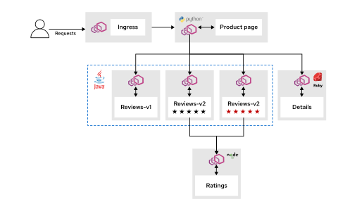

# 모듈 1.2: 서비스 메시 쇼룸 애플리케이션 (Service Mesh Showroom Application)

## 학습 목표 (Objectives)
* Bookinfo 애플리케이션이 트래픽 라우팅, 관찰 가능성(Observability), 보안을 포함한 OpenShift Service Mesh 기능들을 실증하고 탐구하는 데 어떻게 현실적인 실습 시나리오를 제공하는지 설명할 수 있습니다.

---

## 1. Bookinfo 애플리케이션 개요 (About the Bookinfo Application)

Bookinfo 애플리케이션은 다국어(Polyglot) 구조로 개발되었습니다. 서로 다른 프로그래밍 언어로 작성된 4개의 개별 마이크로서비스로 구성되어 있습니다. 이 애플리케이션은 Red Hat OpenShift Service Mesh의 강력한 기능들을 학습하고 탐구할 수 있도록 지원하는 매우 사실적인 실습용 샘플입니다. 이 애플리케이션은 온라인 서점의 단일 도서 카탈로그 항목과 유사하게 특정 도서에 대한 상세 정보를 화면에 표시합니다.

### Bookinfo 아키텍처 (Bookinfo Architecture)
Bookinfo 애플리케이션은 서비스 메시 내부에서 서비스 형태로 배포되는 4개의 독립된 마이크로서비스로 구성됩니다. 이 서비스들은 본질적으로 OpenShift Service Mesh와 완전히 독립적으로 작동하도록 작성되었습니다. 하지만, 마이크로서비스들의 결합 아키텍처는 트래픽 관리, 관찰 가능성, 그리고 보안과 같은 서비스 메시 핵심 기능들을 실증하여 보여주기에 매우 훌륭한 모범 사례가 됩니다.

애플리케이션이 배포될 때, 각 마이크로서비스는 **Envoy 사이드카 프록시(Sidecar Proxy)**와 함께 패키징되어 가동됩니다. 이 프록시는 서비스로 유입되는 모든 인커밍(Incoming) 호출과 서비스 외부로 나가는 모든 아웃고잉(Outgoing) 호출을 완전히 가로챕니다(Intercept). 이러한 트래픽 가로채기 방식은 서비스 메시의 제어 평면(Control Plane)을 통해 외부에서 서비스를 지능적으로 제어할 수 있는 필수적인 연동 매커니즘(Hooks)을 제공합니다.



*그림 1.9: Bookinfo 애플리케이션 아키텍처(Bookinfo Application Architecture)*

이 애플리케이션은 최종 웹 페이지를 생성하고 사용자에게 전달하기 위해 서로 긴밀하게 연계 및 통신하는 4개의 주요 마이크로서비스로 구성됩니다.

##### 표 1.1. Bookinfo 마이크로서비스 세부 정보 (Bookinfo Microservice Details)

| 서비스명 (Service Name) | 개발 언어 (Language) | 설명 (Description) |
| :--- | :--- | :--- |
| **productpage** | Python | 사용자가 직접 접속하는 웹 페이지 인터페이스입니다. 화면을 다채로운 콘텐츠로 구성하기 위해 `details` 서비스와 `reviews` 서비스를 내부적으로 호출합니다. |
| **details** | Ruby | ISBN, 총 페이지 수, 출판사 정보 등을 포함한 책의 메타데이터 정보를 제공합니다. |
| **reviews** | Java | 도서에 대한 리뷰 평점 및 리뷰 문장 정보를 제공합니다. 이 서비스는 여러 버전이 동시에 기동되며, 내부적으로 `ratings` 서비스를 추가로 호출합니다. |
| **ratings** | Node.js | 도서 리뷰와 함께 표시되는 별점(Star Rating)과 같은 평점 수치를 제공합니다. |

### reviews 마이크로서비스 버전 구조 (The reviews Microservice Versions)
`reviews` 마이크로서비스는 기능상으로 구분되는 **3개의 고유한 버전**이 배포되어 구동됩니다. 이와 같은 다중 버전 배포 환경은 카나리 배포(Canary Deployments) 및 A/B 테스트와 같은 서비스 메시의 고도화된 트래픽 관리 기술들을 실습하는 데 핵심적인 역할을 담당합니다. 사용자는 OpenShift Service Mesh 트래픽 규칙(Routing Rules)을 명시적으로 선언 및 적용하여, 특정 사용자가 어떠한 `reviews` 서비스 버전을 바라보게 할지 지능적으로 제어할 수 있습니다.

##### 표 1.2. reviews 서비스 버전별 동작 및 출력 형태 (The reviews Service Versions)

| 버전 (Version) | 핵심 동작 방식 (Behavior) | 리뷰 별점 표시 형태 (Rating Display) |
| :--- | :--- | :--- |
| **v1** | 후속 서비스인 `ratings` 서비스를 호출하지 않습니다. | 도서 리뷰 문장만 출력되고 별점이 표시되지 않습니다. |
| **v2** | 후속 서비스인 `ratings` 서비스를 직접 호출합니다. | 도서 리뷰 문장과 함께 **1점부터 5점까지의 검은색 별점(★)**을 화면에 출력합니다. |
| **v3** | 후속 서비스인 `ratings` 서비스를 직접 호출합니다. | 도서 리뷰 문장과 함께 **1점부터 5점까지의 빨간색 별점(★)**을 화면에 출력합니다. |

---

## 2. 서비스 메시 기능 및 Bookinfo 연계 (Service Mesh Features and Bookinfo)

Bookinfo 애플리케이션의 정교한 상호 연계 구조는 서비스 메시가 실무적으로 제공하는 탁월한 가치를 완벽하게 이해하는 데 최적의 도구입니다. 복잡한 다중 마이크로서비스, 다국어 이기종 컴포넌트, 그리고 실시간 다중 버전 기동 상태가 결합됨에 따라, 전통적인 방식으로는 마이크로서비스 간의 상호 작용을 추적하고 통제하는 것이 극도로 어렵고 복잡해집니다. 본 교육 과정에서는 Bookinfo 애플리케이션을 적극 활용하여 다음과 같은 OpenShift Service Mesh 고유 기능들을 실증하여 시연하고 실습합니다.

### 트래픽 관리 (Traffic Management)
OpenShift Service Mesh는 이스티오 고유의 맞춤형 리소스(Custom Resource)인 **VirtualService** 및 **DestinationRule**을 활용하여 마이크로서비스 메시 내부의 모든 트래픽 흐름을 손쉽게 제어합니다. 이 리소스들을 선언적으로 정의함으로써, Bookinfo 애플리케이션에 대한 고도의 정교한 라우팅 시나리오를 가볍게 구성할 수 있습니다. 예를 들어, 점진적 카나리 배포(Canary Release)를 위해 전체 웹 트래픽의 특정 백분율(예: 10%)만큼만 새로운 버전인 `reviews:v3` 서비스로 분산 라우팅하도록 규칙을 제어할 수 있습니다. 또한, 특정 HTTP 요청 헤더 정보(예: 특정 사용자 계정 로그인)를 인지 및 필터링하여 일치하는 태그가 지정된 트래픽을 특정 서비스 버전으로 전용 연결하여 기동하도록 지정할 수도 있습니다.

### 관찰 가능성 (Observability)
관찰 가능성은 마이크로서비스를 안정적으로 운영하는 데 필요한 서비스 메시의 가장 중요한 핵심 기능입니다. 애플리케이션과 함께 주입 구동되는 **Envoy 사이드카 프록시**들은 서비스 간에 전달되는 모든 네트워크 트래픽 통신에서 실시간 원격 분석 데이터(Telemetry Data)를 자율 수집합니다.

* **Kiali 관리 콘솔 (Kiali Console):** 서비스 메시 내부의 기동 상태를 완벽하게 시각화하는 고성능 플러그인 인터페이스를 제공합니다. Kiali는 수집된 분석 메트릭을 기반으로 서비스들의 동적인 연결 상태와 실시간 트래픽 가중치 흐름을 도식화하여 정밀한 **토폴로지 그래프(Topology Graph)**로 자율 렌더링해 줍니다. 사용자는 이 그래프를 마우스로 간단히 탐색 및 클릭하여 개별 서비스들의 성능 지표, 응답률 헬스 체크, 그리고 작성하여 적용한 트래픽 라우팅 규칙들이 실시간 네트워크에 미치는 세부 영향도를 손쉽게 직접 판독할 수 있습니다.
* **분산 추적 (Distributed Tracing):** 본 과정에서는 **Grafana Tempo** 추적 백엔드 스택을 사용자 인터페이스로 활용하여 서비스 메시를 관통하는 각각의 트래픽 요청 라이프사이클을 완벽하게 모니터링하고 추적(Trace)합니다. 이를 통해 사용자가 웹 브라우저로 `productpage` 서비스를 한 번 클릭하여 요청을 생성했을 때, 이 요청이 `reviews` 서비스를 거쳐 최종 `ratings` 서비스로 흘러 들어가는 종단간 전파 단계를 마이크로초 단위로 추적할 수 있습니다. 이 정밀 추적 뷰는 분산 환경에서 응답 지연(Latency)의 병목 노드를 기민하게 검출하고 네트워크 통신에 수반된 에러 예외의 발생 원인을 정교하게 진단해 줍니다.

학습자는 Bookinfo 실습에서 다음과 같은 관찰 가능성 강점들을 중점적으로 경험하고 학습할 수 있습니다:
* **다중 서비스 종단간 추적 (Multi-service Tracing):** 트래픽 요청이 다수의 마이크로서비스들을 차례대로 통과하면서 풍부하고 정교한 트레이스(Trace) 정보 조각을 생성합니다. 이를 통해 마이크로서비스 간의 상관관계와 서비스 호출 경로 패턴을 일목요연하게 파악할 수 있습니다.
* **버전 기반 정밀 모니터링 (Version-based Monitoring):** 여러 버전이 동시에 기동되는 `reviews` 서비스의 응답 통계를 버전별로 명확히 나누어 수집하고, 각 버전별 부하 분산율과 성능 편차를 정밀 비교 및 모니터링할 수 있습니다.
* **현실적인 마이크로서비스 프로덕션 시나리오 (Real-world Scenarios):** 실제 상용 환경을 정교하게 모사한 복합적인 마이크로서비스 통신 패턴을 기반으로, 관찰 가능성 모니터링 도구들이 동적인 트래픽과 이상 현상을 어떻게 시각화하고 대처할 수 있도록 돕는지 체감할 수 있습니다.

### 보안 (Security)
OpenShift Service Mesh는 마이크로서비스 애플리케이션 내부 소스 코드를 단 한 줄도 수정하거나 건드리지 않고도 Bookinfo 마이크로서비스 간의 통신 구간을 안전하게 일괄 보호 및 암호화할 수 있습니다. 서비스 메시 내에 **PeerAuthentication** 정책을 가볍게 작성 및 적용해 주는 것만으로, 메시 영역 내에서 흐르는 모든 네트워크 트래픽에 대해 **상호 TLS (mTLS, mutual TLS)** 통신 방식을 강력하게 활성화 및 강제할 수 있습니다. mTLS가 활성화되고 트래픽이 전달될 때, Kiali 위상도 그래프 상의 각 노드를 잇는 실시간 트래픽 엣지(Edge) 선로 위에 **안전한 자물쇠 아이콘(Lock Icon)**이 실시간으로 렌더링되어 표시되므로, 트래픽 통신 보안 전송 및 암호화 상태를 직관적으로 판별할 수 있습니다.

> [!IMPORTANT]
> **중요 (IMPORTANT)**
> 상호 TLS(mTLS)를 활성화 및 강제하는 것은 현대 엔터프라이즈의 보안 표준 모델인 **제로 트러스트 네트워크 아키텍처(Zero-trust Network Model)**를 수립하기 위한 가장 필수적이고 중대한 첫걸음입니다. mTLS를 통과하는 모든 트래픽 통신은 서비스 간에 자격 증명을 상호 검증(Authentication)하고 데이터를 완벽히 암호화(Encryption) 전송하므로, 중간자 공격(Man-in-the-middle Attacks)과 내부 기밀 도청 위험성을 원천 차단해 줍니다.

---

## 3. 서비스 메시 실습 트래픽 생성 가이드 (Generate Traffic to the Service Mesh)

적용하는 서비스 메시 아키텍처 기능들을 효과적으로 검증하고 원격 분석 정보를 육안으로 관찰하기 위해서는, 서비스 메시 환경 내에 지속적인 네트워크 트래픽 부하를 정교하게 주입해 주어야 합니다. 본 과정에서는 이를 자동화하기 위해 설계된 전용의 파이썬 기반 트래픽 부하 생성 자동화 도구인 **`traffic_gen.py`** 스크립트를 기본 활용하여, 메시 내 서비스 노드들로 향하는 대량의 HTTP 요청 전송을 안정적으로 수행합니다.

### 트래픽 제너레이터 핵심 용도 (Purpose of the Traffic Generator)
트래픽 제너레이터 도구는 실습 과정 전반에 걸쳐 다음과 같은 유용한 시뮬레이션 기능들을 안전하게 보장해 줍니다:
* **관찰 데이터 및 원격 데이터 생성 (Observability Data):** 트래픽 요청을 지속적으로 끊임없이 생성 및 전송해 줌으로써, 서비스 메시가 풍부한 통계용 원격 원격 원격 메트릭을 수집하도록 돕습니다. 이를 바탕으로 Kiali 토폴로지 그래프가 실시간으로 매핑되고 Grafana Tempo 상에 선명한 정밀 추적 데이터가 정상 활성화됩니다.
* **라우팅 트래픽 패턴 동작 테스트 (Traffic Pattern Testing):** 특정 마이크로서비스 응답 버전을 강제하거나, 카나리 라우팅 비율을 균등하게 실증하기 위해 설계된 정교한 전송 패턴을 선언하고 시뮬레이션함으로써 작성한 라우팅 규칙들의 올바른 기동 여부를 직접 확인해 볼 수 있습니다.
* **워크로드 성능 상세 분석 (Performance Analysis):** HTTP 요청 전송 완료 시, 트래픽 제너레이터는 요청 성공률, 버전별 응답 속도 편차, 백분위수 성능 값(Average, P50, P95) 등 실시간 종합 성능 통계표를 깔끔하게 산출하여 보여줍니다. 이를 활용해 특정 마이크로서비스에 부하가 걸리거나 타임아웃, 재시도, 유실 등 비정상 네트워크 오류가 가동 중인 환경을 쉽게 검증할 수 있습니다.

### 트래픽 제너레이터 실행 방법 (Running the Traffic Generator Tool)
트래픽 제너레이터 스크립트는 매 실습별로 개별 최적화되도록 구성한 전용의 **YAML 설정 파일**을 읽어 기동 시나리오를 정의합니다. 각 설정 파일은 트래픽 타깃이 될 인그레스 게이트웨이 엔드포인트(URL), 트래픽 전송 규칙 패턴, 그리고 라우팅 테스트에 필요한 특정 HTTP 사용자 정의 헤더 값들을 지정해 둡니다.

트래픽 제너레이터 도구가 공식적으로 제공하는 핵심 전송 규칙 패턴들은 다음과 같습니다:
* **지속성 전송 패턴 (Continuous):** 설정한 특정 운영 제한 시간 범위 동안 쉬지 않고 부하 요청을 연속으로 균등 주입 전송합니다. Kiali 토폴로지 분석과 Grafana Tempo 간의 유의미한 옵저버빌리티 통계 수집에 매우 최적화되어 있습니다.
* **유한성 전송 패턴 (Finite):** 사전에 고정으로 세팅해 둔 횟수만큼의 유한한 HTTP 요청 수량만을 정확하게 전송하고 정지합니다. 특정 버전으로 트래픽이 예상 범위 비율대로 고르게 분산 처리되는지 신속히 횟수로 검증하기 위해 구성되는 카나리 검증 실습에 적격입니다.
* **다중 시나리오 전송 패턴 (Multi-scenario):** 여러 기동 부하 패턴 조합을 연속 시퀀스 형태로 정의하여 한꺼번에 동작시키는 기능으로, 심층적이고 광범위한 트래픽 라우팅 테스트에 요긴합니다.
* **혼합 전송 패턴 (Mix):** 라운드 로빈(Round-robin), 무작위 전송(Random), 혹은 가중치 할당 전산 패턴을 조합하여 서로 다른 다중 서비스 엔드포인트 영역으로 트래픽 호출을 복합적으로 병렬 교차 주입합니다.

트래픽 제너레이터 스크립트를 기동하여 사용하려면 터미널에서 다음 형식을 준수하여 명령어를 직접 실행해야 합니다:

```execute
traffic_gen.py config-file.yaml
```

*위 명령어에서 `config-file.yaml` 부분을 학습하고자 하는 각 실습 모듈별 지침 가이드북에서 지시하는 실제 YAML 시나리오 파일명으로 변환하여 기동하십시오.*

> [!NOTE]
> **참고 (NOTE)**
> 본 교육 과정이 진행되는 동안, 학습자는 각 실습 과정마다 맞춤형으로 이미 프리셋 설계된 YAML 파일 자원들을 기본 활용하게 됩니다. 따라서 이 설정 파일들을 사용자가 수동으로 직접 작성하거나 수정할 필요가 전혀 없습니다. 실습 가이드라인의 설명에 명시된 특정 설정 파일의 이름을 전달하여 트래픽 제너레이터 도구를 편리하게 가동하시기 바랍니다.

트래픽 제너레이터 도구는 실행 즉시 클러스터에 배포된 서비스 메시의 인그레스 게이트웨이 엔드포인트 URL 주소를 자동 감지하고 즉시 트래픽 주입을 기동하기 시작합니다. 기동되는 동안 화면상에 실시간으로 전송 진행 상황과 처리 속도, 응답 Preview 결과를 세련되게 보여주고, 테스트 종료 시점에 성공률, 응답 유형 편차 분석, 네트워크 레이턴시 등 세분화된 종합 성능 분석 통계 수치 보고서를 종합 산출하여 터미널에 프린트해 줍니다.

### 트래픽 생성 출력 결과 해석하기 (Understanding the Output)
트래픽 제너레이터를 가동하게 되면, 터미널 상에 다음과 같은 유익한 진행 결과 로그 및 실시간 보고 데이터를 조회할 수 있습니다:

```bash
[user@host ~]$ traffic_gen.py continuous.yaml
Continuous mode: 600s to http://istio-ingressgateway-istio-ingress.apps.ocp4.example.com/reviews/1
curl -s http://istio-ingressgateway-istio-ingress.apps.ocp4.example.com/reviews/1
[1]    HTTP 200 -- red (0.0s)              ✅
[2]    HTTP 200 -- No stars (0.1s)         ✅
[3]    HTTP 200 -- black (0.4s)            ✅
[4]    HTTP 200 -- black (0.5s)            ✅
[5]    HTTP 200 -- black (0.6s)            ✅
[6]    HTTP 200 -- No stars (0.8s)         ✅
[7]    HTTP 200 -- No stars (0.9s)         ✅
[8]    HTTP 200 -- red (1.0s)              ✅
[9]    HTTP 200 -- black (1.1s)            ✅
...output omitted...
Interrupted by user (Ctrl+C). Stopping continuous mode...

⏸️
📊 Traffic Statistics
================================================================================
┌───────────────┬────────────────┬─────────────┬─────────────┬─────────────┐
│ Total Request │ Success Rate   │   Average   │     P50     │     P95     │
├───────────────┼────────────────┼─────────────┼─────────────┼─────────────┤
│ 39            │ 100.0% (39/39) │      23.1ms │      16.0ms │      79.8ms │
└───────────────┴────────────────┴─────────────┴─────────────┴─────────────┘

📈 Response Distribution
================================================================================
┌─────────────────────────────┬───────────┬─────────────────┐
│ Response                    │ Count     │ Percentage      │
├─────────────────────────────┼───────────┼─────────────────┤
│ No stars                    │ 15        │           38.5% │
│ black                       │ 14        │           35.9% │
│ red                         │ 10        │           25.6% │
└─────────────────────────────┴───────────┴─────────────────┘
```

* **수행 커맨드 예시 표시:** 도구는 각 요청 시마다 동일한 결과를 얻을 수 있도록 매칭되는 `curl` 커맨드를 화면에 직접 보여주어, 필요할 시 해당 요청을 터미널에서 수동으로 완벽히 재현(Reproduce)해 볼 수 있도록 설계되었습니다.
* **실시간 전송 응답 모니터링:** 각 개별 호출 라인마다 전송 상태 지시자(체크마크 등), 응답 HTTP 상태 코드(예: `HTTP 200`), 호출 대상 서비스의 실제 처리 결과 내용 미리보기(예: `red`, `No stars`, `black`), 그리고 밀리초 단위의 소요 시간을 깔끔히 표출합니다.
* **최종 종합 성적표 제공:** 테스트가 중지되거나 완료되면 터미널 하단에 다음과 같은 매우 유익한 요약 결과를 출력해 줍니다:
  * **전체 요청 횟수 (Total requests sent):** 기간 동안 전송 처리 완료된 누적 트래픽 요청 갯수
  * **요청 성공 비율 (Success rate percentage):** 처리된 요청 중 오류 없이 성공 응답 처리된 성공률 및 분수식 형태의 구체적 카운트
  * **평균 및 백분위수 지연율 (Average, P50, and P95 response times):** 메시 네트워크 전송 응답 시간 분포의 대표 지연 속도 값
  * **응답 결과 버전별 분포 비율 (Response distribution):** 실제 어떤 마이크로서비스 버전(v1, v2, v3)이 얼마만큼의 점유율 비중으로 응답 처리를 전담했는지 분석 보고서 형태로 요약
  * **예외 오류 요약 (Error summary):** 전송에 실패하거나 지연 예외 등의 이상 동작 발생 시 원인에 맞춰 일목요연하게 실패 이력 요약 (성공률 100% 미만 시)
* **결과 판독 편의성 확보:** 도구는 시각적인 컬러 텍스트(Colored Text) 출력과 정교하고 깔끔한 그리드 표 레이아웃 형식을 적용하여, 학습자가 터미널 화면만으로도 결과를 매우 쉽고 빠르게 해독하고 인지할 수 있도록 유도합니다. 이 보고 데이터들을 잘 비교해 봄으로써 자신이 작성한 서비스 메시 트래픽 규칙 및 보안 정책들이 의도대로 네트워크에 가동되어 반영되고 있는지 확정하고, 실무 관점에서 서비스 동작 헬스를 평가 분석해 볼 수 있습니다.
* **트래픽 수동 중단 지원:** 트래픽 생성을 수동으로 종료하려면 언제든지 터미널 화면 상에서 **`Ctrl+C`** 키를 눌러주면 즉시 기동이 안전하게 중지됩니다.

---

## 4. 참고 자료 (References)

Bookinfo 마이크로서비스 및 서비스 메시 설정 사양에 대한 자세한 정보나 연계 문서는 아래 공식 가이드 페이지들을 방문하여 정독해 주시기 바랍니다:

* **Red Hat 공식 설치 문서:** [About the Bookinfo Application in Installing OpenShift Service Mesh 3.1](https://docs.redhat.com/en/documentation/red_hat_openshift_service_mesh/3.1/htmlsingle/installing/index#ossm-about-bookinfo-application_ossm-installing-openshift-service-mesh)
* **Istio 공식 도큐먼트:** [Istio.io: Bookinfo Application](https://istio.io/v1.26/docs/examples/bookinfo/)
* **공식 소스 코드 저장소:** [GitHub: Bookinfo Application Source Code (Istio v1.26)](https://github.com/istio/istio/tree/1.26.5/samples/bookinfo)
