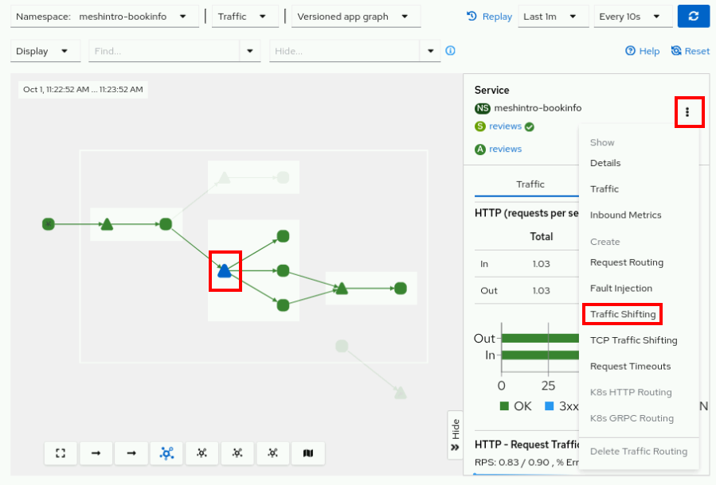
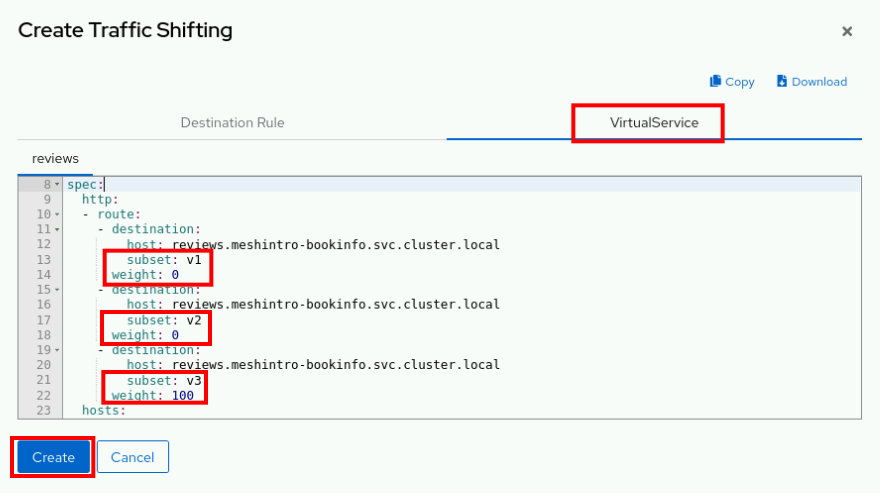

<style>
  h1 { font-size: 24px !important; }
  h2 { font-size: 20px !important; }
  h3 { font-size: 16px !important; }
</style>

# 모듈 1.3: 서비스 메시 쇼룸 애플리케이션 (Service Mesh Showroom Application)

Bookinfo 애플리케이션이 트래픽 라우팅, 관찰 가능성, 보안을 포함하여 OpenShift Service Mesh 기능을 실증하기 위한 현실적인 시나리오를 어떻게 제공하는지 설명합니다.

## 실습 결과 (Outcomes)
* Bookinfo 애플리케이션을 사용하여 OpenShift Service Mesh(OSSM) 기능을 탐색합니다.
* OSSM 인그레스 게이트웨이를 통해 Bookinfo 애플리케이션에 접속합니다.
* OpenShift 웹 콘솔을 탐색하여 서비스 메시 토폴로지를 조회합니다.
* 서비스 버전 간의 로드 밸런싱을 관찰하기 위한 트래픽을 생성합니다.
* 서비스 메시 트래픽 그래프를 사용하여 마이크로서비스 간의 통신을 시각화합니다.
* 특정 서비스 버전으로 트래픽을 100% 라우팅하도록 트래픽 시프팅을 구성합니다.
* 애플리케이션 인터페이스에서 트래픽 라우팅 변경 사항을 검증합니다.

---

워크스테이션 머신의 사용자 터미널에서 아래의 `lab` 명령어를 실행하여 본 실습을 위한 환경을 준비하고, 모든 필요한 연계 리소스들이 가용하게 전개되었는지 검증 및 보장합니다:

```execute
lab start meshintro-bookinfo
```

또한, 다음 명령어를 실행하여 $PATH 변수를 업데이트하고 `traffic_gen.py` 명령어를 즉시 사용할 수 있도록 설정합니다. 새 환경을 생성한 후 한 번만 실행하면 됩니다.

```execute
source ~/.bashrc
```

`lab start` 명령어는 실습 환경의 OpenShift 클러스터에 OpenShift Service Mesh 3.0 인프라가 완전히 배포 및 구성되었는지 보장하고, Bookinfo 애플리케이션의 모든 마이크로서비스를 배포합니다.

---

## 지침 (Instructions)

### 1. 서비스 메시의 초기 상태를 검증합니다.

1.1. 브라우저에서 OpenShift 웹 콘솔을 엽니다.
`https://console-openshift-console.%cluster_subdomain%` 주소로 접속하여 로그인 단계를 진행합니다.
*(참고: 대시보드 인터페이스 상단 메뉴에 장착되어 있는 **Web Console** 탭을 클릭하시면, 새 브라우저 창을 띄우거나 별도 주소를 입력하지 않고도 가이드북 내부에서 원스톱으로 오픈시프트 웹 콘솔에 즉시 원격 접속하여 더욱 쾌적하고 간편하게 실습을 즐기실 수 있습니다. 본 교육 과정에서는 이 탭 클릭 접속 방식을 매우 권장합니다!)*

`htpasswd_provider`를 클릭하고 사용자 이름은 `%username%`을, 비밀번호는 `openshift`를 입력해 관리자 권한으로 로그인합니다. 가이드 투어(Guided Tour)가 표시되면 **Skip tour**를 클릭해 건너뜁니다.

1.2. 왼쪽 측면 메뉴에서 **Developer**를 클릭하여 개발자 관점(Developer perspective) 상태를 적용하고 유지 중인지 확인합니다.


1.3. **Topology** 메뉴 항목을 클릭하여 토폴로지 위상도 뷰를 열고 배포 상태를 검사합니다. 프로젝트 목록 드롭다운 목록에서 `%username%-meshintro-bookinfo` 프로젝트가 정상 선택되어 구동 중인지 확인합니다.


프로젝트 내부에 총 7개의 마이크로서비스 배포가 존재하지만, 오른쪽 상단 모서리에 Route(외부 노출 주소) 아이콘이 있는 배포는 하나도 없음을 확인하십시오. 이는 모든 애플리케이션이 외부의 공격 및 임의 접속으로부터 안전하게 격리되어 있으며, 오직 OSSM 인그레스 게이트웨이(Ingress Gateway)를 통해서만 통합 진입 및 제어가 가능하기 때문입니다.

---

### 2. Bookinfo 애플리케이션을 탐색합니다.

2.1. 브라우저의 새 탭에서 Bookinfo `productpage` 웹 페이지를 엽니다.
`http://istio-ingressgateway-istio-ingress.%cluster_subdomain%/productpage` 주소로 이동합니다.


화면 하단의 **Book Reviews** 섹션 아래에 표시되는 별점(Star Ratings) 형태를 주의 깊게 관찰하십시오. 웹 페이지를 새로고침(F5)할 때마다 별점이 대략적으로 균등한 비율(약 33.3% 확률)로 빨간색 별, 검은색 별, 혹은 별점이 아예 표시되지 않는 세 가지 상태 사이에서 동적으로 변경되는 것을 관찰하십시오. 이러한 변화는 호출되는 `reviews` 마이크로서비스가 아래와 같이 세 가지 버전으로 동시에 구동되며 부하가 균등히 분산되고 있기 때문입니다:
* **reviews v1:** 별표 없음 (No stars)
* **reviews v2:** 검은색 별 (Black stars)
* **reviews v3:** 빨간색 별 (Red stars)

2.2. 제공된 웹 터미널 창을 활성화하고, `%username%` 사용자명과 `openshift` 비밀번호를 사용해 클러스터에 원격 로그인한 다음 `%username%-meshintro-bookinfo` 프로젝트로 안전하게 이동합니다:

```execute
oc login -u %username% -p openshift https://api.%cluster_subdomain%:6443
```
* **로그인 수행 완료 로그:**
```bash
The server uses a certificate signed by an unknown authority.
Use insecure connections? (y/n): y

WARNING: Using insecure TLS client config. Setting this option is not supported!

Logged into "https://api.%cluster_subdomain%:6443" as "%username%" using the password provided.

You have access to 78 projects.
Using project "default".
```

```execute
oc project %username%-meshintro-bookinfo
```
* **프로젝트 이동 결과 로그:**
```bash
Now using project "%username%-meshintro-bookinfo" on server "https://api.%cluster_subdomain%:6443".
```

2.3. 실습 가이드 디렉토리로 이동한 후, `traffic_gen.py` 스크립트를 즉시 실행시켜 reviews Bookinfo 마이크로서비스에 대해 균등한 트래픽 부하 주입을 수행합니다. 부하가 전송되는 중간에 이를 수동 정지시키려면 터미널 포커스를 두고 **Ctrl+C**를 누르면 중단됩니다.

```execute
cd ~/labs/meshintro-bookinfo
```
```execute
traffic_gen.py continuous.yaml
```


세 가지 버전의 reviews 서비스 모두가 균형 있게 트래픽을 처리하며 골고루 분사되어 기동 응답을 전송하고 있는지 확인하십시오. (본인의 출력되는 응답 건수 및 응답 시간 percentiles 수치는 환경 상태에 따라 다르게 나타날 수 있습니다.)

```bash
# 참고 구문 (실행 환경에 맞게 PATH 및 path 변수 갱신 상태 검증)
source ~/.bashrc
```

2.4. `traffic_gen.py` 스크립트를 재실행하여 reviews 서비스에 대한 트래픽을 지속해서 주입하도록 설정합니다. 이 터미널은 멈추지 말고 그대로 가동한 상태로 놔둡니다.

```execute
traffic_gen.py continuous.yaml
```

---

### 3. 마이크로서비스 간의 트래픽 흐름을 탐색합니다.

3.1. OpenShift 웹 콘솔 화면으로 이동합니다.
*(참고: 가이드북 상단의 **Web Console** 탭을 클릭해 열어둔 화면에서 손쉽게 계속 진행하실 수 있습니다.)*
관리자(Administrator) 관점으로 뷰를 전환합니다. 콘솔 상단 좌측 모서리의 **Developer** 전환 콤보박스를 클릭하고 **Administrator**를 선택합니다.

3.2. 왼쪽의 통합 메뉴 중에서 **Service Mesh > Overview** 메뉴를 클릭하여 서비스 메시 관리 개요 섹션으로 진입합니다.


`%username%-meshintro-bookinfo` 프로젝트 영역의 분당 평균 요청 수가 약 200건(혹은 200 requests per minute) 전후로 원만하게 트래픽이 측정 기동 중인 상태인지 검증하십시오. (수치는 다를 수 있습니다.)

> [!NOTE]
> **참고 (NOTE)**
> 실시간 요청 성능 그래프 수치나 통계 그래프 레이아웃은 본인의 기동 주기 및 브라우저 확대비에 따라 조금씩 가변적으로 나타날 수 있습니다.

3.3. 왼쪽 서브메뉴에서 **Traffic Graph** 항목을 클릭하고, 화면 중앙 상단의 **Select Namespaces** 콤보박스를 열어 오직 `%username%-meshintro-bookinfo` 프로젝트 단 하나만 선택하도록 지정합니다.

> [!IMPORTANT]
> **중요 (IMPORTANT)**
> 네임스페이스 체크박스를 선택한 후에는 반드시 드롭다운 선택 필터 영역 바깥의 빈 웹 콘솔 배경을 한 번 클릭해 주어야 필터 옵션이 실시간 화면에 정상 적용되어 매핑됩니다.


지정 필터링된 네임스페이스의 입체적인 서비스 간 트래픽 흐름 토폴로지 그래프를 관찰합니다.

3.4. 마우스 포인터 커서를 그래프 내부에 배포되어 있는 삼각형 아이콘(Bookinfo 서비스들을 표시) 위로 올려서 상세 수치를 판독합니다. 예를 들어, 맨 왼쪽의 첫 번째 삼각형 위로 커서를 올리면 `productpage` 서비스 기동 사양이 화면에 표시됩니다.


3.5. `productpage` 삼각형에서 외부로 뻗어나가는 경로 화살표를 마우스로 추적하여, 상단의 삼각형 노드 위로 커서를 올립니다. 이는 책의 원천 데이터를 제공하는 `details` 서비스 노드 정보입니다.


3.6. 그 바로 아래편에 입체적인 `reviews` 서비스 노드 정보가 존재합니다. `reviews` 삼각형 노드로부터 오른쪽 편으로 향하는 3개의 라우팅 분기선 화살표가 나가는 것에 특히 주목해 주십시오. 이것이 병렬 가동 중인 reviews 마이크로서비스의 3가지 다른 실행 버전들을 나타냅니다.


3.7. 둥근 사각형들 위로 마우스 포인터를 차례대로 올리면, `reviews` 서비스의 `v1`, `v2`, `v3` 버전을 직접 식별하여 조회할 수 있습니다. `reviews:v1` 노드는 우측의 `ratings` 서비스를 전혀 호출하지 않는 형태로 고립 전송되는 반면, `reviews:v2` 및 `reviews:v3` 노드만 `ratings` 서비스를 직접 호출하여 평점 별점 데이터를 받아오고 있는 차이점을 정교하게 판별하십시오.

---

### 4. 트래픽 흐름을 reviews 마이크로서비스의 특정 고정 버전으로 변경합니다.

4.1. 트래픽 그래프에서 `reviews` 서비스 노드를 마우스로 클릭하여 선택합니다. 우측 화면에 세부 정보 패널 창이 열리면, 우상단의 삼점(⋮) 단추를 눌러 드롭다운 목록을 연 후, **Traffic Shifting** 메뉴를 정식 선택 및 클릭합니다.




4.2. Create Traffic Shifting 설정 입력 화면에서, 빨간색 별점을 출력하는 새로운 버전인 `reviews-v3` 서비스의 Traffic Weight(트래픽 가중치 비율)를 **100**으로 정의하고, 나머지 `reviews-v1` 및 `reviews-v2` 서비스의 가중치 비율은 전부 **0**으로 입력해 정비합니다. 설정이 끝나면 하단의 **Preview** 버튼을 클릭하여 생성될 OSSM 리소스 명세를 시각적으로 검증합니다.

4.3. **VirtualService** 탭을 선택하고 화면을 아래로 스크롤하여, 트래픽의 100%가 서비스 서브셋 `v3`으로 전량 강제 할당되고 `v1` 및 `v2`로는 0% 할당되는 이스티오 설정이 맞게 구성되었는지 최종 검증 및 검사합니다. 확인이 완료되면 **Create** 버튼을 클릭합니다.



4.4. 리소스 생성 확인 대화 상자에서 **Create**를 클릭하여 OSSM 리소스 생성을 최종 확인합니다.

4.5. `traffic_gen.py` 스크립트가 실행 중인 터미널 창을 엽니다. 이제 오직 빨간색 별표 평점(`red`)이 표출되는 `reviews v3` 서비스 버전만 응답하고 있는지 관찰하고 확인해 보십시오.

```bash
[4245]    HTTP 200 -- red (483.1s)            ✅
[4246]    HTTP 200 -- red (483.2s)            ✅
[4247]    HTTP 200 -- red (483.3s)            ✅
[4248]    HTTP 200 -- red (483.4s)            ✅
[4249]    HTTP 200 -- red (483.5s)            ✅
[4250]    HTTP 200 -- red (483.6s)            ✅
[4251]    HTTP 200 -- red (483.7s)            ✅
[4252]    HTTP 200 -- red (483.8s)            ✅
[4253]    HTTP 200 -- red (484.0s)            ✅
[4254]    HTTP 200 -- red (484.1s)            ✅
[4255]    HTTP 200 -- red (484.2s)            ✅
[4256]    HTTP 200 -- red (484.3s)            ✅
[4257]    HTTP 200 -- red (484.4s)            ✅
[4258]    HTTP 200 -- red (484.5s)            ✅
[4259]    HTTP 200 -- red (484.6s)            ✅
[4260]    HTTP 200 -- red (484.7s)            ✅
[4261]    HTTP 200 -- red (484.8s)            ✅
[4262]    HTTP 200 -- red (485.0s)            ✅
[4263]    HTTP 200 -- red (485.1s)            ✅
```

OpenShift Service Mesh 3.0 인프라가 실시간 트래픽 시프팅 설정을 강력하게 적용하자마자 응답이 v3로 완전히 고정 전송되는 것을 확인할 수 있습니다.

> [!NOTE]
> **참고 (NOTE)**
> 만약 실행 중이던 `traffic_gen.py`가 중간에 전송 완료되어 자동 종료되었다면, 다음 명령어를 실행하여 다시 구동해 주시기 바랍니다:
> ```execute
> cd ~/labs/meshintro-bookinfo
> ```
> ```execute
> traffic_gen.py continuous.yaml
> ```

4.6. 새 브라우저 탭에서 이스티오 인그레스 게이트웨이 주소인 `http://istio-ingressgateway-istio-ingress.%cluster_subdomain%/productpage`로 다시 접속하여 Bookinfo `productpage` 애플리케이션을 엽니다.


페이지를 여러 번 새로고침하더라도 도서 리뷰의 별점이 항상 빨간색 별로 유지되며, 해당 리뷰를 처리하는 파드가 `reviews-v3` 버전임이 표시되는 것을 직접 관찰하십시오. 화면이 계속 동일하게 유지되는지 확실히 확인합니다.

4.7. `traffic_gen.py` 스크립트가 실행 중인 터미널 창으로 돌아가 **Ctrl+C**를 입력해 스크립트의 트래픽 주입을 안전하게 중단합니다.

---

## 실습 완료 (Finish)

워크스테이션 머신에서 다음 명령어를 실행하여 실습을 완전히 정돈하고 종료합니다. 이 정돈 단계는 이전 실습에서 남은 리소스들이 다음 단원에 진행될 실습 환경 구성에 지장을 주거나 간섭하는 일을 미연에 방지하기 위해 매우 중요합니다.

```execute
lab finish meshintro-bookinfo
```
