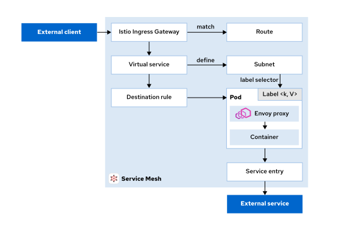

<style>
  h1 { font-size: 24px !important; }
  h2 { font-size: 20px !important; }
  h3 { font-size: 16px !important; }
</style>

<script>
document.addEventListener("DOMContentLoaded", function() {
    var checkAndReplace = function() {
        var walker = document.createTreeWalker(document.body, NodeFilter.SHOW_TEXT, null, false);
        var node;
        while (walker.nextNode()) {
            node = walker.currentNode;
            if (node.nodeValue.includes("api.apps.")) {
                node.nodeValue = node.nodeValue.replace(/api\.apps\./g, "api.");
            }
        }
    };
    checkAndReplace();
    setTimeout(checkAndReplace, 100);
    setTimeout(checkAndReplace, 500);
    setTimeout(checkAndReplace, 1500);
    setTimeout(checkAndReplace, 3000);
});
</script>

# 모듈 2.1: OpenShift Service Mesh 트래픽 관리 개요 (Managing Traffic with OpenShift Service Mesh)

오픈시프트 서비스 메시가 제공하는 다양한 트래픽 제어 기술의 핵심 아키텍처와 라우팅 메커니즘을 학습합니다. 서비스 메시가 어떻게 비즈니스 애플리케이션 코드와 트래픽 논리를 정교하게 분리해 내는지 그 혜택을 다각도로 이해하고, 게이트웨이, 가상 서비스, 대상 규칙 등 핵심 라우팅 리소스의 역할과 구조를 파악합니다.


## OpenShift Service Mesh 트래픽 관리 소개

### 학습 목표 (Objectives)
* OpenShift Service Mesh가 어떻게 애플리케이션 코드에서 트래픽 논리를 분리하는지, 그리고 이 분리가 제공하는 혜택을 명확히 이해하고 설명합니다.
* OpenShift Service Mesh 구성 요소를 통해 트래픽이 흐르는 물리적 과정을 도해합니다.
* 핵심 OpenShift Service Mesh 트래픽 관리 리소스들의 용도와 실제 활용 사례(Use Cases)를 식별합니다.

### 1. 트래픽 관리의 핵심 혜택 (Key Benefits)
Red Hat OpenShift Service Mesh는 서비스 간의 트래픽 흐름과 API 호출을 제어하는 강력한 트래픽 관리 기능을 선사합니다. 애플리케이션 소스 코드 수정 없이 트래픽 정책을 완전히 분리해 냄으로써 마이크로서비스 아키텍처 상에서 매우 미세한 수준(Fine-grained)의 요청 라우팅 제어력을 확보할 수 있습니다.

쿠버네티스의 전통적인 서비스 간 통신은 파드 엔드포인트 간의 기본적인 로드 밸런싱(L4)에만 의존합니다. 이는 단순한 시나리오에서는 원활히 작동하지만, 현대적인 마이크로서비스 아키텍처에서는 더욱 고도화된 지능형 트래픽 제어(L7)가 요구됩니다.

오픈시프트 서비스 메시 트래픽 관리는 다음과 같은 핵심 혜택을 제공합니다:

* **애플리케이션 코드에서 트래픽 정책 분리:**
  애플리케이션 소스 코드를 단 한 줄도 수정하지 않고 라우팅, 재시도, 타임아웃 및 기타 트래픽 동작을 자유롭게 구성할 수 있습니다. 이 분리 덕분에 개발 팀과 운영 팀이 서로 간섭받지 않고 독립적으로 트래픽 정책을 관리할 수 있습니다.
* **트래픽 흐름에 대한 미세한 제어력 확보:**
  HTTP 헤더, URI 경로, 호출 소스 레이벨 또는 기타 요청 속성을 기반으로 트래픽을 라우팅합니다. 예를 들어 내부 임직원의 모든 요청은 특정 마이크로서비스의 카나리(Canary) 버전으로 유입시키거나, 모바일 트래픽만 웹 트래픽과 완전히 다른 선로로 분기 처리하는 것이 가능해집니다.
* **점진적 배포(Progressive Delivery) 가능:**
  새로운 소프트웨어 버전으로 트래픽 가중치를 점진적으로 이동시킴으로써 카나리 배포 및 A/B 테스트 같은 지능형 배포 전략을 실현합니다. 신규 버전의 상태를 모니터링하면서 트래픽을 안전하게 조금씩 늘려나감으로써 광범위한 장애 전파 위험을 최소화합니다.
* **애플리케이션 회복력(Resilience) 즉각 개선:**
  자동화된 재시도(Retries), 서킷 브레이커(Circuit Breakers) 및 타임아웃(Timeouts) 설정을 클릭 몇 번만으로 배포하여 일시적인 네트워크 장애 및 가부하 상황으로부터 소중한 백엔드 서비스를 철저하게 엄호합니다.
  
---

### 2. OpenShift Service Mesh 트래픽 관리 작동 아키텍처

오픈시프트 서비스 메시 트래픽 관리는 크게 세 가지 핵심 기둥 컴포넌트를 기반으로 동작합니다:

#### ① Envoy 사이드카 프록시 (Envoy Sidecar Proxy)
애플리케이션 파드로 수·발신되는 모든 인바운드 및 아웃바운드 트래픽 패킷은 파드 내부에 사이드카 컨테이너 양식으로 장착되어 함께 가동 중인 Envoy 프록시 노드를 무조건 관통하게 됩니다. Envoy 프록시는 모든 네트워크 통신을 중간에서 하이재킹(Intercept) 하여 서비스 메시가 다음 작업을 완벽하게 수행할 수 있도록 조율합니다:
* 지능형 트래픽 라우팅 규칙 적용
* 옵저버빌리티를 위한 원격 가동 성능 데이터 수집
* 보안 및 인가 정책 강제 수립
* 탄력적인 서비스 회복력(Resilience) 패턴 주입

모든 물리 통신 패킷이 Envoy를 무조건 거쳐 흐르기 때문에, 애플리케이션 코드를 수정하거나 파드를 무단 리스타트할 필요 없이 가동 중에도 실시간으로 트래픽 가중 비율과 라우팅 정책을 변경 적용할 수 있습니다.

#### ② OpenShift Service Mesh 제어 평면 (Istiod)
제어 평면인 **`Istiod`**는 서비스 메시 환경 하에 흩어져 구동 중인 수많은 Envoy 사이드카 프록시들의 중앙 사령탑 역할을 주관합니다. 우리가 가상 서비스(VirtualService(가상 서비스))나 대상 규칙(DestinationRule(대상 규칙)) 같은 트래픽 통제 API 자산들을 생성해 던지면, Istiod 제어부는 다음과 같이 동작합니다:
1. 선언된 API 설정 명세의 구문 정합성을 정밀 검증합니다.
2. 검증된 설정을 Envoy 전용 규격 제어 프로토콜 설정 명세로 변환합니다.
3. 이 설정을 각 파드의 Envoy 프록시들로 실시간 분산 배포 동기화합니다.

이 중앙 집중형 제어 메커니즘 덕분에, 흩어져 구동 중인 모든 수많은 Envoy 프록시들이 한치의 왜곡도 없이 완벽하게 단일화된 트래픽 관리 규칙 정책 뷰를 동기화하여 고수할 수 있습니다.

#### ③ 데이터 평면 (Data Plane)
데이터 평면은 비즈니스 애플리케이션 워크로드 파드 옆에 동반 매립되어 실제로 구동 중인 모든 Envoy 사이드카 프록시 인스턴스들의 물리 집합체 그 자체를 대변합니다. 데이터 평면 프록시들은 제어 평면으로부터 인계받은 설정 규칙 필터를 실제 네트워크 패킷 위에 무자비하게 강제 적용하는 임무를 띱니다. 데이터 평면은 제어부와 독립적으로 가동되므로, 제어 평면 장비가 잠시 패치나 리스타트 등으로 일시 차단되어 있어도 트래픽 암호화 및 인그레스 흐름은 한치의 끊김 현상 유발 없이 중단 없이 안전하게 지속 가동됩니다.

---

### 3. 트래픽 관리 흐름 구성 아키텍처

아래 설계 도해는 외부 클라이언트가 인그레스 게이트웨이(Ingress(인그레스) Gateway(게이트웨이))를 통해 진입하여 메시 내부에서 안전하게 통신하고, 최종적으로 메시 영역 바깥(Egress)의 외부 연동 API 서버 노드로 패킷이 송출되어 순환 처리되는 전반적인 전사적 흐름 아키텍처를 투명하게 증명해 줍니다:



* **인그레스 트래픽 흐름 (Ingress(인그레스) Traffic Flow):**
  외부의 호출 트래픽은 특정 인입 포트 및 개방 프로토콜 통로를 셋업해 주는 이스티오 게이트웨이(Gateway(게이트웨이)) 리소스를 노크하며 메시 영역 내에 진입합니다. 진입 완료된 트래픽은 가상 서비스(VirtualService(가상 서비스)) 규칙을 바탕으로 HTTP 헤더나 URI 프리픽스 경로 조건에 부합하는 실제 백엔드 마이크로서비스 노드로 동적으로 선로 분기되어 라우팅됩니다.
* **메시 내부 트래픽 흐름 (Internal Mesh Traffic Flow):**
  메시 내부 영역에 소속된 마이크로서비스 노드들은 Envoy 사이드카 프록시들 간의 보안 협상 mTLS 채널을 수립하여 서로 통신합니다. 가상 서비스 및 대상 규칙(DestinationRule(대상 규칙)) 자산을 배치하여 서비스 간의 트래픽 라우팅을 세밀하게 제어할 수 있습니다:
  - 트래픽의 버전을 가중치 비율별(%)로 찢어 배포하는 트래픽 분배 스프리팅 제어
  - 실패 극복을 위한 자동화 타임아웃 및 재시도 정책 주입
  - 로드 밸런싱(Round-robin, Random 등) 전략 적용
* **에그레스 트래픽 흐름 (Egress Traffic Flow):**
  기본적으로 서비스 메시는 내부 마이크로서비스가 메시 외부 영역의 도메인 주소로 탈출해 연동하는 아웃바운드 통신을 관대하게 허용합니다. 보안 유실 방지를 위해 전역 차단을 셋업한 상태에서도, 서비스 엔트리(ServiceEntry) API 자산을 배포하면 검증 완료된 특정 외부 화이트리스트 API 도메인 경로만을 지능적으로 선택 개방할 수 있어 극치의 아웃바운드 보안 가시성을 확보해 줍니다.

---

### 4. 핵심 OpenShift Service Mesh 트래픽 관리 컴포넌트

오픈시프트 서비스 메시 내부에서 지능형 L7 트래픽 흐름을 통제하기 위해 조율 및 활용하는 **5대 핵심 자산 명세**를 정밀하게 분석합니다.

#### ① 이스티오 게이트웨이 (Istio Gateway(게이트웨이))
게이트웨이는 메시 외곽 경계선 최전방에 위치하여 외부로부터의 통신 인입을 수락하거나 외부로 송출하는 로드 밸런서(L4-L6) 물리 포트를 구성하고 HTTPS/TLS 인증서 종단(Termination) 처리를 주관합니다.
* **주요 제어 속성 명세:**
  - 포트 설정: 포트 번호, 이름, 프로토콜 규칙 정의
  - 수용 호스트명: 와일드카드(`*`) 지표 지원
  - TLS 암호화 구성: HTTPS 보안 인증서 매핑
  - 셀렉터: 게이트웨이 설정을 이식받아 가동할 특정 게이트웨이 파드 지정
* 게이트웨이 자산 자체는 트래픽을 백그라운드로 안전하게 라우팅하는 실무 능력이 없습니다. 반드시 가상 서비스(VirtualService(가상 서비스)) 리소스를 게이트웨이에 바인딩 처리해야만 비로소 지능형 비즈니스 라우팅 경로가 개설됩니다.
* 일반적으로 게이트웨이 파드는 `istio-ingress` 네임스페이스 하위에서 `istio: ingressgateway` 레이벨을 단 채 구동됩니다.

다음 예제 명세는 포트 80번을 개방하여 모든 호스트명(`*`)의 HTTP 요청을 안전하게 인입시키는 게이지 게이트웨이 생성 명세를 투명하게 증명합니다:

```yaml
apiVersion: networking.istio.io/v1
kind: Gateway
metadata:
  name: my-gateway
spec:
  selector:
    istio: ingressgateway ❶
  servers:
  - port:
      number: 80 ❷
      name: http
      protocol: HTTP
    hosts:
    - "*" ❸
```

❶ 가동할 게이트웨이 타깃 파드 레이벨 명세를 지정합니다.
❷ 수용 청취할 L4 포트 주소를 80번으로 정격 선언합니다.
❸ 모든 클라이언트 도메인의 진입 요청을 차단 없이 수락합니다.

#### ② 가상 서비스 (Virtual Service(서비스))
가상 서비스는 유입 트래픽을 어떤 규칙(L7) 하에 실제 백엔드 마이크로서비스 노드로 꺾어 흘려보낼 것인지에 대한 핵심 지능형 비즈니스 라우팅 룰을 전담 정의합니다. 클라이언트가 부른 겉면 목적지 주소와, 실제 처리를 담당할 백엔드 물리 서비스 노드 주소를 완전히 단절 분리시켜 줍니다.
* **주요 탑재 제어 기능:**
  - 라우팅 규칙을 대입 적용할 호스트 도메인 명세 지정
  - 인그레스/에그레스 게이트웨이와의 영리한 결합 바인딩
  - 정교한 HTTP 라우팅 조건절 지정:
    - URI 경로 매칭 (정확히 일치 Exact, 앞머리 일치 Prefix, 정규식 Regex)
    - 요청 HTTP 헤더 매칭 (특정 유저 식별값 등)
    - 쿼리 매개변수 파라미터 및 HTTP 메소드(GET, POST 등) 매칭
  - 버전별 가중 분배 스프리팅 통제
  - URL 경로 재작성(Rewrite) 및 리다이렉트(Redirect) 처리
  - 카오스 테스트를 위한 인위적 장애 주입(Fault Injection)

다음 예제 명세는 특정 유저 헤더 정보(`end-user: premium`)가 검출되었을 때에만 트래픽 선로를 reviews 마이크로서비스의 `v2` 카나리 버전으로 유입시키고, 나머지 일반 유입은 전부 `v1` 안정화 버전으로 안전하게 우회 통제하는 지능형 라우팅 명세를 도해합니다:

```yaml
apiVersion: networking.istio.io/v1
kind: VirtualService
metadata:
  name: my-service
spec:
  hosts:
  - "*" ❶
  gateways:
  - my-gateway ❷
  http:
  - match: ❸
    - uri:
        prefix: /api
      headers:
        end-user:
          exact: premium
    route:
    - destination:
        host: my-service
        subset: v2 ❹
  - match: ❺
    - uri:
        prefix: /api
    route:
    - destination:
        host: my-service
        subset: v1
```

❶ 모든 호스트명의 호출에 대해 본 규칙을 매핑합니다.
❷ 앞서 수립한 `my-gateway` 인바운드 게이트웨이에 본 가상 서비스를 전격 체인 결합시킵니다.
❸ **1차 우선순위 라우팅 조건절:** URI가 `/api`로 출발하면서 동시에 HTTP 헤더 상에 `end-user: premium` 정보가 포착되었을 때에만 매칭을 작동시킵니다.
❹ 위 1차 조건 통과 시, 목적지 서비스 서브셋(Subset) 규격을 `v2` 버전으로 선로 격상하여 송출합니다.
❺ **2차 예외 통제 조건절:** 위 1차 조건에 걸러지지 않은 모든 일반 `/api` 인입 요청들은 예외 없이 reviews 안정화 서브셋인 `v1` 버전으로 안전 우회 분류 처리합니다.

#### ③ 대상 규칙 (Destination Rule)
대상 규칙은 가상 서비스에 의해 목적지가 최종 결정된 이후(즉, 라우팅 처리가 완료되어 선로가 결정된 직후), 해당 목적지 백엔드 서비스 파드들로 실제 네트워크 패킷을 던질 때 적용할 세부 물리 통신 규칙들을 전담 제어합니다.
* **주요 탑재 제어 기능:**
  - 파드 레이벨 기반의 세부 서비스 버전 서브셋(Subset) 목록 정의 수립
  - 로드 밸런싱(Load balancing) 세부 알고리즘 지정 (Round-robin, Least-connection, Random 등)
  - 가부하 방어막 수립을 위한 커넥션 풀(Connection Pool) 통제 명세 주입
  - 비정상 노드를 실시간 추방 격리하는 서킷 브레이커(Outlier Detection) 장벽 가동

다음 예제 명세는 `my-service`로 유입되는 최종 종착 노드 파드들의 레이벨 지표를 대조하여, 물리적으로 격리 전개되어 구동 중인 파드 복제본 버전을 `v1` 및 `v2` 라는 이름의 서브셋 가용 규격으로 정의 분류해 주는 명세서입니다:

```yaml
apiVersion: networking.istio.io/v1
kind: DestinationRule
metadata:
  name: my-service
spec:
  host: my-service ❶
  subsets: ❷
  - name: v1
    labels:
      version: v1
  - name: v2
    labels:
      version: v2
```

❶ 본 대상 규칙을 매핑하여 바인딩 처리할 대상 서비스 호스트명을 선언합니다.
❷ 물리 파드들이 품고 있는 쿠버네티스 기동 레이벨(`version: v1` 및 `v2`) 명세를 대조하여, 가상 서비스가 호출할 수 있는 정식 서브셋 가용 규격을 최종 분할 셋업 정의합니다.

#### ④ 서비스 엔트리 (Service(서비스) Entry)
서비스 엔트리는 서비스 메시 외부에 격리 구동 중인 서드파티 시스템이나 외부 클라우드 SaaS API 서버 노드의 도메인 주소 정보를 이스티오 제어부의 내부 서비스 검색 레지스트리(Service(서비스) Registry) 장부 상에 정식 멤버로 신규 등록 등록해 주는 화이트리스트 개방 리소스입니다.
* **주요 탑재 제어 기능:**
  - 외부 연동 타깃 주소(DNS 호스트명 혹은 특정 IP 대역) 등록
  - 외부 통신 포트 규격 및 보안 프로토콜 정의
  - 외부로 나갈 때의 로컬 해석 모드(DNS lookup, Static IP 등) 지정

다음 예제 명세는 메시 내부 파드들이 안전하게 외부의 연동 망 주소인 `out.example.com` 도메인 80 포트로 아웃바운드 접속해 나갈 수 있도록 통신 활로를 개설해 주는 화이트리스트 등록 명세서입니다:

```yaml
apiVersion: networking.istio.io/v1
kind: ServiceEntry
metadata:
  name: my-external-se
spec:
  hosts: ❶
  - out.example.com
  ports: ❷
  - number: 80
    name: http-port
    protocol: HTTP
  location: MESH_EXTERNAL ❸
  resolution: DNS ❹
```

❶ 아웃바운드 탈출을 허용하여 개방할 외부 전용 도메인 주소를 정격 등록합니다.
❷ 개방할 통신 포트 번호와 HTTP 프로토콜 규격을 엄격히 선언합니다.
❸ 본 타깃 목적지가 메시 외곽 영역 바깥(`MESH_EXTERNAL`)에 존재하는 격리 시스템임을 명시합니다.
❹ 프록시가 해당 도메인에 대한 실제 물리 IP 해석을 수행할 때 표준 시스템 로컬 DNS 해석 메커니즘을 동원하도록 지정합니다.

#### ⑤ 사이드카 (Sidecar)
사이드카 리소스는 파드 내부에서 가동되는 Envoy 프록시가 메시 내부에서 검색하고 접속할 수 있는 탐색 경로의 물리적 가용 범위를 극도로 억제 및 억제하여, 프록시가 소모하는 메모리 낭비를 줄이고 엔터프라이즈 멀티 테넌트 망 분리 보안 경계를 수립해 주는 고급 최적화 리소스입니다.
* **주요 탑재 제어 기능:**
  - Envoy 프록시가 포트를 열고 감시할 포트 명세 튜닝 제어
  - Envoy가 탐색 및 통신할 수 있는 메시 내부의 네임스페이스 범위를 원천 분리 억제
  - 대규모 메시 환경 하에서 불필요한 전체 이스티오 동기화 패킷 오버헤드를 물리 차단

다음 예제 명세는 특정 프로젝트 영역 하위의 파드 프록시들이 오직 본인 네임스페이스(`./`) 내부의 동료 파드들과 제어 평면이 위치한 `istio-system` 하위의 제어 장비들하고만 통신을 수립할 수 있도록 통로를 원천 억제하여 격리화하는 명세서입니다:

```yaml
apiVersion: networking.istio.io/v1
kind: Sidecar
metadata:
  name: default
  namespace: my-namespace
spec:
  egress: ❶
  - hosts:
    - "./*" ❷
    - "istio-system/*" ❸
```

❶ Envoy 사이드카 프록시가 발신(Egress) 해 나갈 수 있는 탐색 활로 장부를 정의합니다.
❷ 오직 현재 본인 프로젝트(`my-namespace`)에 소속된 동료 서비스들하고만 통신 경로를 동기화 장부에 수립하도록 억제 제어합니다.
❸ 제어 평면과의 통신 동기화 수립에 필요한 필수 경로인 `istio-system` 전역 네임스페이스 정보만을 예외적으로 개방 장부 상에 상속 결합합니다.

---

### 5. 핵심 트래픽 리소스 요약 및 비교 분석

아래 수렴 요약 테이블은 우리가 살펴본 이스티오 L7 트래픽 제어 핵심 5대 장비들의 기동 본질과 실무 주요 수립 사용처(Key Use Cases)를 명쾌하게 대조 증명해 줍니다:

| **리소스 종류 (Resource)** | **주요 기동 본질 (Primary Purpose)** | **실무 주요 수립 사용처 (Key Use Cases)** |
| :--- | :--- | :--- |
| **Gateway(게이트웨이) (게이트웨이)** | 메시 외곽 경계선 최전방 입입구 L4-L6 로드 밸런서 포트 개방 | 외부 트래픽 수용, HTTPS 보안 인증서 종단(TLS Termination) 처리 |
| **Virtual service (가상 서비스)** | 유입 트래픽에 대한 미세 지능형 L7 라우팅 비즈니스 분기 룰 통제 | HTTP 헤더/URI 경로 기반 분기, 카나리/A-B 배포 가중 분배, URL 재작성 |
| **Destination rule (대상 규칙)** | 라우팅 결정 완료 직후 백엔드 파드로 패킷을 던질 때의 물리 정책 제어 | 파드 레이벨 기반 버전 subsets 정의, 로드밸런싱 알고리즘 지정, 서킷 브레이커 적용 |
| **Service(서비스) entry (서비스 엔트리)** | 외부 서드파티 시스템 도메인을 메시 검색 장부에 정식 멤버로 이식 | 외부 아웃바운드 API 화이트리스트 개방 연동, 레거시 VM 망 결합 통합 |
| **Sidecar (사이드카)** | Envoy 사이드카의 도메인 검색 가용 범위를 극단적으로 억제 분리 | 대규모 메시 환경 하의 프록시 메모리 소모 극치 절감, 테넌트 보안 망분리 |

---

## Kubernetes Gateway API 소개

이스티오 고유의 API(Gateway(게이트웨이), VirtualService(가상 서비스) 등) 명세 외에, 최근 오픈시프트 서비스 메시 3.1 규격은 쿠버네티스 커뮤니티 표준인 차세대 공용 규격 **`Kubernetes Gateway API`**의 정식 배포 지원을 수립하여 가동합니다.
* **Kubernetes Gateway API의 특징:**
  - 레이어 4 및 L7 라우팅 흐름 제어를 쿠버네티스 표준 표준 명세 안으로 내재화하여 다루는 차세대 인프라 명세입니다.
  - 개발자, 서비스 소유자, 클러스터 어드민 등 각 역할(Role-oriented)에 철저히 격리 부합되도록 보안과 이식성을 강화하여 설계되었습니다.
  - 오픈시프트의 차세대 아키텍처인 **Ambient mode(사이드카 없는 메시 아키텍처)** 기동을 수립하기 위해서는 반드시 이 Kubernetes Gateway API 사양이 기본 통신 장비로 장착되어야만 합니다.

> [!IMPORTANT]
> **중요 (IMPORTANT)**
> Kubernetes Gateway API 표준 명세가 도입되었더라도, 기성 널리 쓰이던 이스티오 고유의 안정한 L7 API들(VirtualService(가상 서비스), DestinationRule(대상 규칙) 등)을 소거하거나 단절할 계획은 전혀 없으므로, 안심하고 두 사양을 혼합 및 가치 있게 사용할 수 있습니다.

