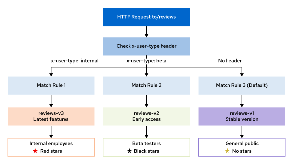

<style>
  h1 { font-size: 24px !important; }
  h2 { font-size: 20px !important; }
  h3 { font-size: 16px !important; }
</style>

<script>
document.addEventListener("DOMContentLoaded", function() {
    var checkAndReplace = function() {
        var walker = document.createTreeWalker(document.body, NodeFilter.SHOW_TEXT, null, false);
        var node;
        while (walker.nextNode()) {
            node = walker.currentNode;
            if (node.nodeValue.includes("api.apps.")) {
                node.nodeValue = node.nodeValue.replace(/api\.apps\./g, "api.");
            }
        }
    };
    checkAndReplace();
    setTimeout(checkAndReplace, 100);
    setTimeout(checkAndReplace, 500);
    setTimeout(checkAndReplace, 1500);
    setTimeout(checkAndReplace, 3000);
});
</script>

# 모듈 2.1: 트래픽 라우팅 및 스프리팅 개념 (Traffic Routing and Splitting with OpenShift Service Mesh)

오픈시프트 서비스 메시 환경 하에서 호스트 파드들의 subsets를 활용하여 트래픽의 가중 분배 배분(Weighted Routing), 특정 헤더 매칭 기반의 조건부 라우팅(Header-based Routing), 그리고 호출 경로에 근거한 분기(Path-based Routing)를 통제하는 구체적인 L7 네트워크 설계 요령을 체득합니다.

## 학습 목표 (Objectives)
* 대상 규칙(DestinationRule(대상 규칙))의 서브셋(subset)이 어떻게 특정 서비스 버전으로의 정교한 라우팅을 실현해 주는지 그 연동 원리를 완벽히 파악합니다.
* 가중치 기반(Weighted), 헤더 기반(Header-based), 경로 기반(Path-based) 라우팅 기술들의 물리적 작동 특성과 실제 활용 사례를 심층 분석합니다.
* 새로운 배포본 전개 시 장애 범위를 극단적으로 제한해 주는 점진적 카나리 배포(Progressive Canary Deployment(배포)) 설계 전략을 체득합니다.

---

## 1. 대상 규칙(Destination Rule)과 서비스 서브셋(Subsets)

실제 이스티오 트래픽 흐름을 버전에 맞추어 물리 제어하기 전에, 대상 규칙(`DestinationRule(대상 규칙)`)이 배후의 개별 파드 인스턴스 레이벨들과 어떤 식으로 교차 수렴하여 고유한 "서브셋(Subset)"들을 정의하는지 그 매핑 장부를 정밀하게 이해해야만 합니다.

* **서브셋(Subset)의 본질:**
  서브셋은 서비스 파드 복제본 그룹 중에서도 쿠버네티스 레이벨 지표가 완전히 동일하여 논리적으로 격리 분류되는 특정 버전을 대변합니다. 대상 규칙이 이 서브셋을 정의해 주면, 가상 서비스(`VirtualService(가상 서비스)`)가 라우팅 조건 필터를 걸어 최종적으로 이 서브셋으로 호출 패킷을 유입시킬 수 있게 됩니다.
* 대상 규칙 리소스 내부의 `spec.subsets` 목록 하위에 각 서브셋의 고유 식별 명칭(name)과 매핑할 타깃 레이벨 명세를 수립합니다.

가령, 다음과 같이 3개의 버전을 동반한 reviews 마이크로서비스가 실무 환경에 전개되어 구동 중이라고 전제해 보겠습니다:
* `reviews-v1`: 쿠버네티스 기동 파드 레이벨이 `version: v1` 로 각인된 인스턴스 그룹
* `reviews-v2`: 쿠버네티스 기동 파드 레이벨이 `version: v2` 로 각인된 인스턴스 그룹
* `reviews-v3`: 쿠버네티스 기동 파드 레이벨이 `version: v3` 로 각인된 인스턴스 그룹

다음 대상 규칙 명세서는 위의 레이벨 규칙들을 바탕으로 reviews 서비스를 통과할 정식 서브셋 3종 목록을 안전하게 분류 구축해 줍니다:

```yaml
apiVersion: networking.istio.io/v1
kind: DestinationRule
metadata:
  name: reviews
spec:
  host: reviews ❶
  subsets: ❷
  - name: v1 ❸
    labels: ❹
      version: v1
  - name: v2
    labels:
      version: v2
  - name: v3
    labels:
      version: v3
```

❶ 본 대상 규칙을 매핑할 타깃 쿠버네티스 서비스 리소스 명칭을 선언합니다.
❷ 이 서비스 배후에서 가용한 모든 정식 서브셋 명세를 테이블 장부화합니다.
❸ 가상 서비스가 최종 참조하여 타깃으로 삼을 고유 서브셋 키 이름을 지정합니다.
❹ 물리 파드가 소지하고 있어야 할 정격 이스티오 가용 기동 레이벨 명세입니다.

> [!IMPORTANT]
> **중요 (IMPORTANT)**
> 가상 서비스(VirtualService(가상 서비스))를 배포하여 서브셋을 지목하기 전에, **반드시 해당 서브셋을 실제로 정의하고 보장해 주는 대상 규칙(DestinationRule(대상 규칙)) 자산을 먼저 생성 및 정위치 배포 완료**시켜야만 합니다! 만일 가상 서비스가 물리 장부상 존재하지 않는 유령 서브셋을 가리키는 설계 실수를 범할 경우, 이스티오 프록시 통신은 즉시 라우팅 실패 및 접속 장애를 유발하게 됩니다.

---

## 2. 가중치 기반 트래픽 라우팅 (Weighted Routing)

가중치 기반 라우팅은 백엔드 마이크로서비스의 각 가용 버전들에 가중 비율 수치(%)를 임의 부여하여 트래픽의 유입 비율을 수학적으로 미세 통제합니다. 이는 신구 버전 교체 시 구버전의 영향력을 보존한 채 신버전의 안정성을 미세 유량 테스트로 점진 조율하는 전형적인 무중단 업그레이드 전선에 광범위하게 배포 수립됩니다.

쿠버네티스의 단순 라운드 로빈 로드 밸런싱과 달리, 서비스 메시의 가중치 배포는 **백그라운드에서 백분율 수치에 부합하도록 아주 정확하고 명시적으로 트래픽의 총량 비율을 통제 분리**해 냅니다.

가상 서비스 명세 내부의 `route.destination` 선언 블록 안에 **`weight`** 필드 수치를 대입 장착하여 동작을 구현합니다. 모든 서브셋 가중치의 총합은 백분율 기준인 **`100`**이 되도록 설계하는 것이 가장 안정적인 표준 규칙입니다.

아래 설계 도해는 인그레스 관문을 통과한 유입 트래픽이 `80:15:5` 라는 구체적인 가중치 비율 분기 규칙에 맞춰 백엔드 reviews 파드 장비군(`v1`, `v2`, `v3`)으로 동적으로 정확히 조절되어 갈라져 흐르는 장엄한 광경을 명쾌하게 증명해 줍니다:


다음 가상 서비스 예제는 reviews 유입 호출 트래픽 명세를 `80:15:5` 비율로reviews 백엔드 subsets 선로들에 수학적 분산 이식하는 완벽 설계 원안을 수립 정의합니다:

```yaml
apiVersion: networking.istio.io/v1
kind: VirtualService
metadata:
  name: reviews
spec:
  hosts:
  - "*"
  gateways:
  - reviews-gateway
  http:
  - match:
    - uri:
        prefix: /reviews
    route: ❶
    - destination: ❷
        host: reviews
        subset: v1
      weight: 80 ❸
    - destination:
        host: reviews
        subset: v2
      weight: 15
    - destination:
        host: reviews
        subset: v3
      weight: 5
```

❶ 본 라우팅 선로를 통해 유량 분할을 수행할 대상 목적지 리스트를 감쌉니다.
❷ 실제 목적지가 될 reviews 서비스 및 `v1` 안정 버전을 지목 바인딩합니다.
❸ 해당 목적지로 인입시킬 총 누적 유량 유입 가중치를 정확히 **80%**로 이식 통제합니다.

#### 가중치 라우팅의 전형적인 실무 주요 적용 시나리오:
* **카나리 배포 (Canary Deployments(배포)):** 신규 배포본에 극소량(5~10%)의 트래픽만 기습 노출시켜 실시간 에러 발생 여부를 밀착 모니터링하다가 신뢰가 쌓이면 비중을 점진 상향 이식합니다.
* **A/B 테스트 (A/B Testing):** 서로 다른 UI 기능이 매립된 두 버전의 성능 효율 및 비즈니스 전환 성과 지표를 실시간 가동 유량 분기를 동원해 투명하게 교차 프로파일링합니다.
* **블루-그린 배포 (Blue-green Deployments(배포)):** 기 완비된 두 독립 운영 환경 하에서 가중치 노출 슬라이더를 0에서 100으로 완전 스위칭하여 안전하게 구버전을 전량 밀어내기 처리합니다.
* **부하 테스트 (Load Testing):** 실제 인입되는 가동 트래픽의 임의 비율 수치만큼을 신규 패치 적용 환경으로만 우회 유도하여 한계 부하 리포트를 실착 렌더링합니다.

---

## 3. HTTP 헤더 기반 라우팅 (Header-based Routing)

헤더 기반 라우팅은 클라이언트 웹 브라우저나 API 콜백 모듈이 HTTP 요청 헤더 패킷 하위에 매립하여 전송해 주는 고유 식별 명세값들을 이스티오 프록시가 발굴 해석하여, 해당 속성 지표와 정합하는 격리된 특정 파드 장비 버전으로 우회 통제합니다. 소스 코드 변경 부담 없이 오직 인프라 장벽에서 완벽한 가시성 테넌트 망 분할을 보장해 냅니다.

사이드카 프록시는 인입 요청 패킷의 HTTP 헤더 영역을 투명하게 스캐닝하여 가상 서비스에 기재된 조건부 라우팅 규칙들과 교차 비교합니다. 매칭 조건이 포착되는 즉시 지정 목적지로 요청을 워프 처리해 버립니다.

가상 서비스 내부의 **`match.headers`** 필드를 정의 장착하여 동작을 구현하며, 표준 조건 수단으로 다음과 같은 문자열 정합 전략 3종을 정격 가용합니다:
* **Exact match (정확히 일치):** 지목한 헤더 키의 값이 지정 단어와 100% 한 자도 틀림없이 완벽 부합할 때에만 매칭 성공 처리합니다.
* **Prefix match (앞머리 일치):** 헤더 정보값의 시작 접두 어구가 일치할 때 가동합니다 (예: `User-Agent`가 `Mozilla`로 시작할 때).
* **Regex match (정규식 일치):** 극도로 복잡한 와일드카드 세션 쿠키 문자열 흐름을 정규 표현식으로 정밀 필터링 스캐닝하여 잡아낼 때 활용합니다.

아래 도식은 인입 요청 패킷의 HTTP 헤더 내부에 매립 장착되어 전착된 `x-user-type` 정보 필터링 규칙에 맞춰, 사내 임직원(`internal`)은 `v3` 신버전으로, 테스터(`beta`)는 `v2` 버전으로, 일반 대중 퍼블릭 유저는 `v1` 표준선으로 투명하게 실시간 분류 우회 송출하는 정밀 통제 아키텍처를 대변합니다:



다음 가상 서비스 예제는 `x-user-type` 헤더의 exact 정합 결과에 의거하여 백엔드 reviews subsets 선로를 정밀 우회 이륙시키는 완수 설계안을 이식하고 있습니다:

```yaml
apiVersion: networking.istio.io/v1
kind: VirtualService
metadata:
  name: reviews
spec:
  hosts:
  - "*"
  gateways:
  - reviews-gateway
  http:
  - match: ❶
    - uri:
        prefix: /reviews
      headers: ❷
        x-user-type: ❸
          exact: internal ❹
    route:
    - destination:
        host: reviews
        subset: v3 ❺
  - match: ❻
    - uri:
        prefix: /reviews
      headers:
        x-user-type:
          exact: beta
    route:
    - destination:
        host: reviews
        subset: v2
  - match: ❼
    - uri:
        prefix: /reviews
    route:
    - destination:
        host: reviews
        subset: v1
```

❶ **1순위 라우팅 매칭 규칙:** 아래 조건들을 교차 필터링 검출합니다.
❷ 요청 패킷에서 가로채 스캐닝할 HTTP 헤더 필터를 활성화합니다.
❸ 추적 검수할 헤더 키 이름인 `x-user-type`을 정격 선언합니다.
❹ 문자열 정확히 일치(exact) 기법을 장착하여 값이 `internal` 단어와 완전히 일치할 때 가동합니다.
❺ 위 조건 만족 시, 목적지 선로를 reviews 마이크로서비스 신규 버전인 `v3` 서브셋으로 기습 이륙시킵니다.
❻ **2순위 라우팅 매칭 규칙:** x-user-type 헤더 정보가 `beta` 지표를 띠는 베타 테스터 군을reviews `v2` 버전으로 분기합니다.
❼ **최종 기본형 라우팅 규칙:** 헤더 상에 아무 조건도 검출되지 않은 일반 대중 유입들은 reviews 안전선인 `v1` 서브셋으로 안전 회군 처리시킵니다.

> [!IMPORTANT]
> **라우팅 규칙 판독 순서 제어 핵심 주의점 (IMPORTANT)**
> 서비스 메시는 **가상 서비스(VirtualService(가상 서비스)) 명세서 상에 기술되어 있는 라우팅 매칭 규칙 블록들을 오직 위에서 아래 방향(Top-to-Bottom)의 탑다운 선형 순서로만 순차 판독**합니다! 
> 
> 일단 요청 패킷 조건과 부합하는 단 하나의 최초 매칭 규칙이 포착되는 즉시, 서비스 메시는 그 즉시 라우팅 결정을 내리고 하위 평가 규칙들을 완전히 무시(First-Match-Wins)해 버립니다. 그러므로 가상 서비스 명세 설계 시에는 **반드시 범위가 좁고 구체적인 정합 규칙(헤더 및 디테일한 세부 매칭 경로)을 무조건 파일 상단에 먼저 배치**하고, 조건이 없는 포괄적이고 넓은 기본 백업 라우팅 규칙을 무조건 최하단에 배치해야만 필터 무시 및 우회 유실 오작동 오류를 철저히 방어할 수 있습니다!

---

## 4. 경로 기반 트래픽 라우팅 및 URI 재작성 (Path-based Routing & URI Rewriting)

경로 기반 라우팅은 호출 URI 경로 문자열을 스캐닝하여, 단일 도메인 최전방 게이트웨이를 노크하더라도 호출 프리픽스 정보값에 매핑 정합하는 메시 내부의 서로 완전히 분리 전개된 이기종 마이크로서비스 노드(예: 쇼핑몰의 `/catalog` 호출은 카탈로그 서비스로, `/cart` 호출은 장바구니 서비스로)로 통신을 영리하게 분기 운반시킵니다.

경로 기반 통제 시 최후방 마이크로서비스들이 자신들을 장벽에 맞춰 가공해 준 복잡한 앞머리 도메인 프리픽스 경로 정보(예: `/api/v3/reviews/1`)를 인식하지 못하고 표준 리스너 엔드포인트 경로인 `/reviews/1` 규격만을 대기 기대하는 물리 인터페이스 불일치 오류가 무수히 발생합니다.

이를 위해 서비스 메시는 요청 패킷을 뒷단으로 쏘아보내기 직전, 내부 통신 구조에 부합하도록 경로 주소를 정교하게 도려내고 보정해 주는 **`rewrite`** (URI 재작성) 보조 가이드 필터 장치를 장착 가용합니다.

다음 가상 서비스 예제는 외부에서 들어오는 `/api/v3/reviews` 및 `/api/v2/reviews` 호출 경로 주소를 reviews 서비스 subsets에 매핑함과 동시에, 백엔드로 운반 전송하기 직전에 프리픽스를 내부 표준 주소인 **`/reviews`** 양식으로 기습 가공 보정(rewrite) 처리해 이송하는 전형적인 무결 배포 명세를 도해합니다:

```yaml
apiVersion: networking.istio.io/v1
kind: VirtualService
metadata:
  name: reviews
spec:
  hosts:
  - "*"
  gateways:
  - reviews-gateway
  http:
  - match: ❶
    - uri:
        prefix: /api/v3/reviews ❷
    rewrite: ❸
      uri: /reviews
    route:
    - destination:
        host: reviews
        subset: v3 ❹
  - match:
    - uri:
        prefix: /api/v2/reviews
    rewrite:
      uri: /reviews
    route:
    - destination:
        host: reviews
        subset: v2
  - match: ❺
    - uri:
        prefix: /reviews
    route:
    - destination:
        host: reviews
        subset: v1
```

❶ **1순위 경로 매칭 규칙:** 인입 요청 주소 앞머리가 `/api/v3/reviews`로 시작하는지 감지합니다.
❷ 외부의 정식 노출 경로인 프리픽스 지표를 셋업합니다.
❸ 백엔드 마이크로서비스가 안전하게 수용 처리할 수 있는 오리지널 처리 경로 주소인 `/reviews` 규격으로 패킷 헤더 경로를 변경 재작성(rewrite) 처리합니다.
❹ 변환 처리가 완료된 요청 패킷을 reviews의 카나리 신버전인 `v3` 서브셋으로 운반 도달시킵니다.
❺ 아무 변환 가공이 불필요한 표준 `/reviews` 경로의 기본 요청들은 reviews의 기본형 `v1` 규격으로 안전 우회 수송합니다.

---

## 5. 단계별 점진적 카나리 배포 설계 전략 (Progressive Canary Deployments(배포))

인프라의 대형 장애 유실과 서비스 중단을 수식 제로로 묶는 가장 선진화된 배포 수단인 점진적 카나리 롤아웃 모델의 전형적인 수립 단계를 정독 수립합니다.

가장 대표적인 4단계 기동 가중 전개 이송 맵은 다음과 같습니다:

| **카나리 전개 단계 (Phase)** | **안정 버전(Stable) 유입 분배량** | **신규 버전(Canary) 유입 분배량** | **실무 도달 가동 본질 (Purpose)** |
| :--- | :--- | :--- | :--- |
| **1단계: Initial Deployment(배포)** | 95% 유량 분배 배정 | 5% 초미세 카나리 주입 | 실사용 유저 유입 충격과 부작용을 극최소화한 채 치명적 크래시 사전 진단 |
| **2단계: Increased Exposure** | 75% 유량 분배 배정 | 25% 카나리 주입 격상 | 중간 정도의 무난한 라이브 실부하 상황 하에서 메모리 누수 및 안정성 정밀 관측 |
| **3단계: Balanced Rollout** | 50% 유량 분배 배정 | 50% 카나리 배정 균등화 | 한계점 스케일 부하를 극복하고 고가용성 퍼포먼스 전산화 능력 최적 대조 |
| **4단계: Full Deployment(배포)** | 0% (완전 구버전 추방 정리) | 100% 전량 전착 이송 완수 | 신버전으로의 마이그레이션 및 파드 다운그레이드 교체 정리 성료 |

아래 예제 명세서는 최초의 5% 미세 유량 카나리 배포 전개 통제 명세를 서비스 메시 장비 위에 실착 전개한 실제 양식입니다:

```yaml
apiVersion: networking.istio.io/v1
kind: VirtualService
metadata:
  name: reviews
spec:
  hosts:
  - "*"
  gateways:
  - reviews-gateway
  http:
  - match:
    - uri:
        prefix: /reviews
    route:
    - destination:
        host: reviews
        subset: v1 ❶
      weight: 95
    - destination:
        host: reviews
        subset: v3 ❷
      weight: 5
```

❶ 안정성이 정량 검증 확보된 구버전 파드 서브셋 `v1`에 전체 유량의 절대다수인 **95%**를 잔류 수용시킵니다.
❷ 안전성 검사가 수행될 타깃 신버전 파드 서브셋 `v3`에 단 **5%**의 극소 유량 유입만을 가입 통제하여 롤백 장벽을 철저히 방어합니다.

---

### 6. 정밀 조건부 카나리 배포 결합 기법 (Combining Canary with Header-based)

가장 지능적이고 완벽한 엔터프라이즈 카나리 모델은 **가중치 슬라이딩 방식과 HTTP 헤더 기반 정합 라우팅 기법을 정교하게 결합하여 교차 수립**하는 고도의 설계 구조를 지향합니다.

```yaml
apiVersion: networking.istio.io/v1
kind: VirtualService
metadata:
  name: reviews
spec:
  hosts:
  - "*"
  gateways:
  - reviews-gateway
  http:
  - match: ❶
    - uri:
        prefix: /reviews
      headers:
        x-user-type:
          exact: internal
    route:
    - destination:
        host: reviews
        subset: v3 ❷
  - match: ❸
    - uri:
        prefix: /reviews
    route:
    - destination:
        host: reviews
        subset: v1
      weight: 90
    - destination:
        host: reviews
        subset: v3
      weight: 10 ❹
```

❶ **1순위 결합 라우팅:** 가중치 비율과 전혀 상관없이, HTTP 헤더 상의 계정 식별자 정보가 사내 임직원(`internal`)으로 확인되었을 때에는 무조건 100% reviews 신버전(`v3`)으로 기습 배정 전송합니다. 이로써 사내 정밀 QC 및 임직원 내부 도그푸딩(Dogfooding) 검증을 실제 운영 망 위에서 안전하고 정교하게 선행할 수 있습니다.
❷ 임직원 요청 패킷은 예외 없이 신버전 서브셋인 `v3` 규격으로 즉각 꺾어 회송합니다.
❸ **2순위 결합 라우팅:** 위의 임직원 조건에 부합하지 않은 순수 일반 퍼블릭 인입 대중 유량들은 `90:10` 이라는 가중 비례에 의거하여 카나리 노출 수준을 미세 통제합니다.
❹ 일반 대중에게는 극히 일부분인 단 **10%**만 신버전에 안전 노출시켜 부작용 전파를 정밀 방어합니다.

---

## 7. 가중 라우팅 도입 시 자칫 범하기 쉬운 5대 통신 기동 오류 예방 가이드

서비스 메시 트래픽 규칙 수립 시 흔히 발생하는 인프라 실수 명세를 기습 정독하여 오류를 미연에 원천 봉쇄합니다:

1. **상하 규칙 기입 순서 전도 에러 (Overlapping Routing Rules):** 
   - 탑다운 평가 방향인 이스티오 프록시의 성질을 망각하고 범위가 넓고 보편적인 기본 라우팅 룰을 파일 위쪽에 적는 실수입니다. 아래에 기입해 둔 미세 조건부 라우팅 헤더 규칙들이 완전히 무시(First-Match-Wins)되므로 반드시 범위가 구체적일수록 무조건 파일 위쪽에 설계 배정하십시오.
2. **배후 대상 규칙 누설 에러 (Missing Destination Rule Subset):**
   - 가상 서비스에서 지명 호출한 subset 규격(예: `subset: v3`) 명세를 실제로 대상 규칙(`DestinationRule(대상 규칙)`) 장부 상에 subsets로 정의하지 않고 배포하는 전형적인 설계 누설 오류입니다. 라우팅 즉시 프록시가 갈 곳을 잃어 503 에러 크래시를 동반하게 됩니다.
3. **가중 수치 합산 불일치 오류 (Incorrect Weight Calculations):**
   - 가중치의 비율 합이 100이 되지 않는 기괴한 가중치(예: 80 + 30 = 110)를 기입하는 경우입니다. 비록 이스티오가 임의 가중 백분율 처리를 어떻게든 수행하기는 하나, 트래픽 유동 흐름이 예측 불가능한 변형 노선으로 흐르는 부작용이 크므로 무조건 100% 수렴 합이 완성되도록 보정하십시오.
4. **아웃바운드 포트 경로 재작성 망각 오류 (Forgetting URI Rewrites):**
   - 외부 정식 노출용 프리픽스 경로와 실제 마이크로서비스 내부 엔드포인트의 통신 형식이 맞지 않음에도 `rewrite` 보정 필터를 생략해 버려 404 경로 유실 에러를 남용시키는 오류입니다.
5. **무 모니터링 맹목 배포 오류 (Testing Without Observability):**
   - 가중 라우팅을 가동시켰음에도 `Kiali` 대시보드나 `Prometheus` 지표 그래프를 직접 확인해 보지 않고 카나리가 잘 배정되고 있을 것이라 맹신하는 배포 무단 방치 오류입니다. 반드시 눈으로 미세 트래픽 노출 수치가 80:15:5 가량으로 곱게 찢어져 가동되고 있는지 실착 옵저버빌리티 검증을 동반해야 합니다.
