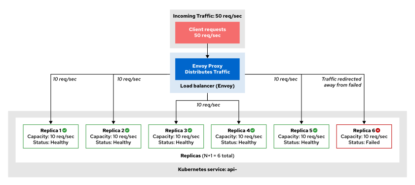
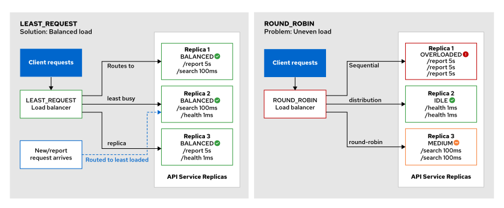
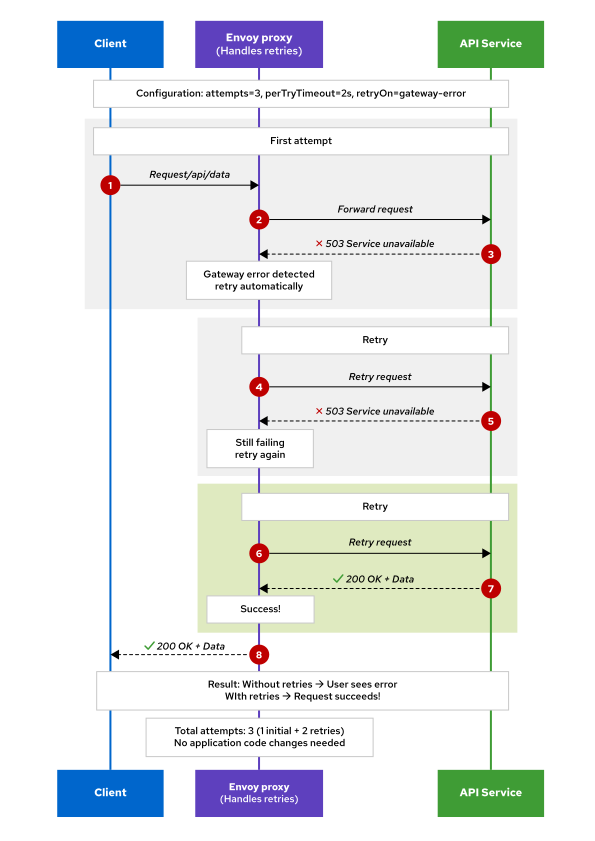
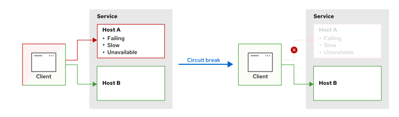

<style>
  h1 { font-size: 24px !important; }
  h2 { font-size: 20px !important; }
  h3 { font-size: 16px !important; }
</style>

<script>
document.addEventListener("DOMContentLoaded", function() {
    var checkAndReplace = function() {
        var walker = document.createTreeWalker(document.body, NodeFilter.SHOW_TEXT, null, false);
        var node;
        while (walker.nextNode()) {
            node = walker.currentNode;
            if (node.nodeValue.includes("api.apps.")) {
                node.nodeValue = node.nodeValue.replace(/api\.apps\./g, "api.");
            }
        }
    };
    checkAndReplace();
    setTimeout(checkAndReplace, 100);
    setTimeout(checkAndReplace, 500);
    setTimeout(checkAndReplace, 1500);
    setTimeout(checkAndReplace, 3000);
});
</script>

# 모듈 2.3: 서비스 회복력(Resilience) 개념 (Resilience with OpenShift Service Mesh)

오픈시프트 서비스 메시가 지원하는 지능형 L7 부하 분산(Load Balancing), 즉각적인 재시도(Retries), 정밀한 시간 제한(Timeouts), 그리고 시스템의 전체 파국적 연쇄 몰락을 방어해 주는 서킷 브레이킹(Circuit Breakers) 기법의 핵심 아키텍처와 통합 설계 방식을 완수합니다.

## 학습 목표 (Objectives)
* 로드 밸런싱, 타임아웃, 재시도, 서킷 브레이커 등을 포함한 서비스 회복력(Resilience) 핵심 전략들을 심층 규명합니다.
* 마이크로서비스 과부하 예방을 위한 커넥션 풀링(Connection Pooling)과 장애 복제본을 감지해 자동 추방 격리하는 아웃라이어 감지(Outlier Detection)를 구성합니다.
* 다층 방어막 모델을 수립하기 위해 다중 회복력 정책들을 유기적으로 결합할 때 발생하는 트레이드 오프(Trade-offs) 관계를 정밀 비교 평가합니다.

---

## 1. 서비스 회복력과 분산 아키텍처의 당면 과제

* **회복력 (Resilience):**
  돌발 장애 및 연쇄 실패로부터 배후의 소중한 마이크로서비스 인프라를 철저히 호위하고 보호하는 서비스 메시의 자가 수복 능력을 뜻합니다. Red Hat OpenShift Service Mesh가 선사하는 회복력 규칙을 배포하면 특정 파드 노드가 고사하더라도, 메시 차원에서 패킷을 안전하게 우회 처리하여 인근 노드로의 연속적 에러 파급(Cascading Failures)을 완전히 물리 억제해 줍니다.
* 마이크로서비스 아키텍처는 분산 컴퓨팅 환경의 특성상 다음과 같은 3대 고질적인 신뢰성 저하 당면 과제에 노출되어 있습니다:
  - **Latency spikes (레이턴시 급증):** 망 혼잡이나 백엔드 처리 속도 소모 지체로 인한 응답 지연 현상이 상위 서비스로 연쇄 파급되며 전체 사용자 경험을 심각하게 갉아먹습니다.
  - **Backend failures (백엔드 물리 장애):** 크래시, 하드웨어 장비 기습 리스타트, 설정 미스 등으로 특정 서비스가 일시적으로 기동 불가(Unavailable) 상태에 도달합니다.
  - **Network flakiness (네트워크 불안정성):** 인프라 망은 본질적으로 불안정하여 수시로 요청 유실, 패킷 드롭, 지연 전송 등을 동반 수반합니다.

> [!NOTE]
> **용어 사전 (Terminology)**
> * **Application (애플리케이션):** 우리가 정격 배포하는 독립 소프트웨어 워크로드 자체를 뜻합니다 (예: 웹 서버, API 등).
> * **Service(서비스) (서비스):** 파드 인스턴스 장비군에 대해 고정 도메인 엔드포인트를 열어주는 쿠버네티스 서비스(`Service(서비스)`) 리소스를 대변합니다.
> * **Replica or Pod(파드) (복제본 혹은 파드):** 서비스 도메인 배후에서 실제로 처리를 감당하고 연동 가동 중인 개별 컨테이너 파드를 지칭합니다.
> * **Host (호스트):** 이스티오의 회복력 정책 문서 상에서 "호스트"는 쿠버네티스 서비스가 아닌, **개별 물리 복제본 파드 인스턴스 단위**를 뜻합니다. 즉, 이스티오의 모든 회복력 정책은 파드 단위(Replica level)로 미세 개입 적용됩니다.

---

## 2. 부하 분산 로드 밸런싱 (Load Balancing) 및 N+1 예비 규칙

로드 밸런싱은 들어오는 요청 패킷을 분산 엔드포인트 파드 그룹 위로 고르게 안착 분배시킵니다.
* **N+1 이중화 생존 법칙 (N+1 Redundancy Rule):**
  진정으로 장애를 견뎌낼 수 있으려면, 전체 인입 부하 처리에 필요한 정격 복제본 파드 수(N개) 외에 **최소한 1개 이상의 유휴 예비 복제본 파드(+1)를 상시 초과 구동하는 이중화 설계**를 견지해야 합니다.
  - **예시:** 초당 50건의 요청이 인입되고 개별 파드가 초당 최대 10건씩만 소화할 수 있다면, 실제 가동에 필요한 파드 5개(N) 외에 예비 파드 1개(+1)를 더해 **총 6개의 파드**를 상시 셋업합니다. 만일 이 중 1개의 복제본 파드가 기습 크래시로 소멸하더라도, 나머지 5개 파드가 즉석에서 초당 50건의 유량을 100% 한 치의 성능 손실 없이 무결하게 커버해 냅니다!



오픈시프트 서비스 메시는 대상 규칙(`DestinationRule(대상 규칙)`)의 `spec.trafficPolicy.loadBalancer.simple` 필드 설정을 동원하여 다음과 같은 대표적 L7 로드 밸런싱 정합 수단을 배포 수립합니다:

### ① LEAST_REQUEST
현재 물려있는 미처리 요청 건수(Outstanding Requests)가 **가장 적은 한가한 파드 복제본 노드로 요청을 우선 우회 배정**합니다.
* 엔드포인트 파드마다 통신 처리 비용 편차가 심하거나(가령 `/health` 처리는 1ms, `/report` 처리는 5s 등), 개별 하드웨어 파워가 불균형할 때 `ROUND_ROBIN` 방식보다 수십 배 안전하게 파드 편향적 병목 가부하 현상을 방지해 줍니다.



### ② ROUND_ROBIN
특별한 가중치 없이 순서대로 돌려가며 모든 파드로 패킷을 1/N 배분합니다. 모든 파드의 성능 명세가 완전히 동일하고 일정한 지연 처리 속도를 가질 때 주로 사용합니다.

### ③ RANDOM
무작위 확률에 근거해 임의 파드로 요청을 쏩니다. 대량 부하가 쏟아지는 시점에 불필요한 동기화 처리 대기 오버헤드를 줄여 단순하고 빠르게 패킷을 뿌려주기 좋습니다.

### ④ CONSISTENT_HASH
요청 HTTP 헤더 정보, 쿠키, 클라이언트 IP 지표를 해시 키로 대입하여, **동일 유저의 요청은 무조건 이전에 통신했던 특정 파드 복제본 노드로만 연속 유입**시키는 소프트 세션 친화성(Soft Session Affinity)을 제공합니다.

다음 예제 명세서는 전역 서비스 레벨에는 `LEAST_REQUEST`를 수립하고, 특정 `v2` 서브셋 노드 그룹에 대해서는 개별적으로 `RANDOM` 알고리즘이 가동되도록 설정을 정밀 오버라이드 튜닝하는 설계서입니다:

```yaml
apiVersion: networking.istio.io/v1
kind: DestinationRule
metadata:
  name: my-destination-rule
spec:
  host: my-svc
  trafficPolicy: ❶
    loadBalancer:
      simple: LEAST_REQUEST
  subsets:
  - name: v1
    labels:
      version: v1
  - name: v2
    labels:
      version: v2
    trafficPolicy: ❷
      loadBalancer:
        simple: RANDOM
```

❶ my-svc 서비스 전역에 적용할 L7 로드 밸런싱 명세를 `LEAST_REQUEST`로 장착 선언합니다.
❷ `v2` 서브셋 버전 파드로 전송할 때에는 상위 전역 룰을 완전히 덮어쓰고(Override) `RANDOM` 필터가 개입 가동되도록 셋업합니다.

다음은 session_id 쿠키값을 기준으로 동일 유저의 세션 접속 일치성을 유지시키는 해시 밸런싱 구성 안입니다:

```yaml
apiVersion: networking.istio.io/v1
kind: DestinationRule
metadata:
  name: my-destination-rule
spec:
  host: my-svc
  trafficPolicy:
    loadBalancer:
      consistentHash: ❶
        httpCookie:
          name: session_id ❷
          ttl: 0s ❸
```

❶ 해시 일관성 밸런싱 정책을 활성화합니다.
❷ 해시 생성 및 사용자 매핑 키로 사용할 HTTP 쿠키 명칭을 `session_id`로 기입 각인합니다.
❸ 쿠키 수명을 0s로 선언하여 임시 세션 쿠키 규칙으로 수립 가동합니다.

---

## 3. 재시도 패턴 (Retries)

재시도 패턴은 일시적 망 결락 및 마이크로서비스 파드 순간 과부하 에러가 포착되었을 때, **소스 코드 수정 없이 프록시 선에서 동일 요청을 최대 N회 자동으로 재송출(Retry)**하여 트랜잭션 에러 유실을 사전에 소멸시킵니다.

클라우드 네이티브 환경에서 요청이 분실되거나, 디펜던시 마이크로서비스가 DB 결락으로 순간적 회신 마비를 뿜어내더라도 재송출을 시도하면 즉석에서 성공할 가능성이 대단히 높습니다.

가상 서비스 내부의 **`retries`** 설정 블록을 수립 정의하여 동작을 구현하며, 다음과 같은 매개변수 필터를 정밀 매칭 가용합니다:
* **attempts:** 재송출을 감행할 최대 임계 횟수 규정 (최대 통신 횟수는 초기 시도 1회 + attempts 횟수합이 됨).
* **perTryTimeout:** 개별 재송출 1건당 가해질 타임아웃 제한 시간 설정 (예: `2s`).
* **retryOn:** 어떤 특정 통신 실패 요인이 검출되었을 때에만 재시도를 트리거 할 것인지 그 화이트리스트 에러 목록을 반쉼표(,) 구분자로 열거 기입합니다.
  - `gateway-error`: 502, 503, 504 응답 코드 감지 시 가동
  - `connect-failure`: 백엔드 포트로 TCP 커넥션 개설 자체가 무산되었을 때 가동
  - `refused-stream`: 백엔드가 가부하로 인해 TCP 채널 스트림 접속을 거부했을 때 작동
  - `unavailable`: 백엔드 파드가 503 및 gRPC UNAVAILABLE 코드를 뿜어냈을 때 기동



다음 예제 명세서는 reviews 서비스 실패 감지 시 최대 **`3회`** 자동으로 재시도를 셋업하되, 개별 재시도당 **`2초`**만 대기 소요 제한을 걸며 오직 게이트웨이 오류 및 접속 차단 시에만 개입하는 명세서입니다:

```yaml
apiVersion: networking.istio.io/v1
kind: VirtualService
metadata:
  name: api-vs
spec:
  hosts:
  - api-service
  http:
  - route:
    - destination:
        host: api-service
      retries: ❶
        attempts: 3 ❷
        perTryTimeout: 2s ❸
        retryOn: gateway-error,connect-failure,refused-stream ❹
```

❶ 가상 서비스 라우팅 규칙 배후에 재시도 자율 구제 제어 장부를 적용합니다.
❷ 최대 수용 재시도 회수를 **3회**로 제한 각인합니다 (총 누적 4회 시도 가능).
❸ 개별 트라이 단위 재시도에 할당할 제한 임계 타임아웃을 **2초(2s)**로 규정 셋업합니다.
❹ 오직 이스티오가 지정 에러들만 잡아내었을 때에만 안전하게 재시도를 감행시킵니다.

> [!NOTE]
> **참고 (NOTE)**
> 이스티오는 기본적으로 가상 서비스 내부에 아무런 재시도 정책을 구성해 주지 않아도, 자체 통신 보호를 위해 **`connect-failure,refused-stream,unavailable,cancelled` 조건 발생 시 최대 2회 자동으로 재시도를 감행하도록 사전 설정**되어 가동됩니다. 재시도 가동을 완전히 차단 정지시키고 싶다면 `attempts: 0` 설정을 명시 기입해 넣어야 합니다.

---

## 4. 타임아웃 패턴 (Time-outs)

타임아웃은 백엔드 서비스의 지체 장애가 발생했을 때 하염없이 무한 대기하며 스레드와 리소스를 고사시키는 현상을 원천 방지하기 위해, **사전 정의된 특정 제한 임계 시간 초과 즉시 요청을 강제 에러 파기 반사 회신**하여 시스템 전역의 연쇄 리소스 소모 및 마비 현상(Cascading Hang)을 원천 전단 격리합니다.
* **핵심 아키텍처적 가치:**
  - **연쇄 실패 예방:** 하위 노드가 마비되더라도 빠르게 포기(Fail-fast)함으로써, 전체 상위 컴포넌트까지 대기 스레드 동이 나서 동반 소멸하는 참극을 예방합니다.
  - **응답 예측 가능성 보장:** 사용자에게 언제 끝날지 모르는 무한 로딩 창 대신, 2초 만에 예측 가능한 오류창을 안전 팝업 렌더링해 줍니다.
  - **차단된 시스템 하드웨어 리소스 조기 회수:** 프록시 포트 홀딩 시간을 줄여 동시 인입 처리 한계를 격상시킵니다.

가상 서비스 내부의 **`timeout`** 필드에 소요 제한 시간 규격을 주입 매립하여 동작을 수립하며, 단위 명세로 `s`(초), `ms`(밀리초) 등을 지원합니다.

```yaml
apiVersion: networking.istio.io/v1
kind: VirtualService
metadata:
  name: api-service-vs
spec:
  hosts:
  - api-service
  http:
  - route:
    - destination:
        host: api-service
      timeout: 2s ❶
```

❶ api-service로 인입 배송 통과하는 모든 L7 요청들의 절대 시간 제한 벽을 **2초(2s)**로 정격 선언 수립합니다. 2초가 경과하면 즉시 통신을 중단하고 클라이언트에게 L7 시간 만료 패킷을 반사해 버립니다.

---

## 5. 서킷 브레이커 (Circuit Breakers) 및 가부하 방어 장벽

서킷 브레이커는 특정 파드 복제본 노드가 비정상적으로 에러를 뿜어내거나 과도하게 접속 스레드가 폭증하여 고사 직전에 도달했음을 감지하는 즉시, **해당 파드 복제본 노드로 유입되던 통신 선로를 즉각 물리 차단(Eject) 격리**시키고 건강하게 연동 가동 중인 다른 동료 파드 복제본 노드로만 요청을 수송 처리하는 지능형 인프라 안전장치입니다.



오픈시프트 서비스 메시는 서킷 브레이커 작동을 구현하기 위해 대상 규칙(`DestinationRule(대상 규칙)`)의 `trafficPolicy` 하위에 두 가지 핵심 백그라운드 구동 메커니즘을 상호 연계 보완적으로 투입 가동합니다:

### ① 정적 방어: 커넥션 풀링 (Connection Pooling)
동시 인입 접속수 및 대기 큐 크기 한계를 정적으로 물리 제한 셋업하여 복제본 노드가 파워 한계를 넘어 크래시 되는 현상을 예방합니다.
* **`maxConnections`**: 해당 복제본 노드로 동시 개설할 수 있는 최대 TCP 연결 한도 개수 규정.
* **`http1MaxPendingRequests`**: 꽉 차 있을 때 줄을 세워 대기시킬 수 있는 HTTP 최대 보관 큐 개수 한정.

### ② 동적 추방: 아웃라이어 감지 (Outlier Detection)
에러 반응 덤프 빈도를 실시간 파싱 추적하여 비정상 파드를 로드 밸런싱 그룹에서 일시 추방 격리시킵니다.
* **`consecutive5xxErrors`**: 지정 시간 동안 연속해서 몇 번의 5xx 에러가 포착되었을 때 추방 절차를 밟을 것인지 그 한계 횟수 규정.
* **`interval`**: 비정상 상태 에러 카운트를 검수 체크하기 위해 스캐닝을 작동시킬 주기 간격 명세 (예: `10s` 마다 검수).
* **`baseEjectionTime`**: 최소한 몇 초 동안 격리실에 감금 추방시킬 것인지 그 기본 격리 시간 정의 (예: `30s`). 에러를 계속 반복해서 내뿜는 악성 파드의 경우 감금 시간이 기하급수 곱절로 상향 가중됩니다 (30s ➡️ 60s ➡️ 90s).
* **`maxEjectionPercent`**: 한꺼번에 최대 몇 % 비율의 파드 장비군까지 추방 격리할 수 있게 허용할 것인지 그 맥시멈 방어 비중을 선언합니다 (예: `50` 기입 시 아무리 파드들이 망가지고 있어도 최소 50%의 파드들은 무조건 운영 선로 상에 강제 잔류시켜 전면 다운 타임 장애를 예방합니다).

다음 대상 규칙 명세서는 커넥션 풀 강제 한도 수립 및 아웃라이어 실시간 추방 감금 필터를 한데 묶어 완벽한 물리 서킷 브레이커 방어막 명세를 도해합니다:

```yaml
apiVersion: networking.istio.io/v1
kind: DestinationRule
metadata:
  name: backend-circuit-breaker
spec:
  host: backend-service
  trafficPolicy:
    connectionPool: ❶
      tcp:
        maxConnections: 50 ❷
      http:
        http1MaxPendingRequests: 10 ❸
        maxRequestsPerConnection: 2 ❹
    outlierDetection: ❺
      consecutive5xxErrors: 3 ❻
      interval: 5s ❼
      baseEjectionTime: 30s ❽
      maxEjectionPercent: 50 ❾
```

❶ 정적 최대 부하 과부하 진입 차단선 커넥션 풀을 장착합니다.
❷ 동시 가용 TCP 개설 한계를 파드 복제본 단위당 **50개**로 제한 튜닝합니다.
❸ 풀이 찼을 때 대기 줄을 세울 최대 보관 HTTP 대기 큐 크기를 **10개**로 묶어 파드 폭사를 예방합니다.
❹ 단일 커넥션 하나당 소화시킬 누적 최대 처리 요청수를 **2개**로 억제 선언합니다.
❺ 동적 에러 파드 일시 자동 추방 시스템 아웃라이어 감지 필터를 기동합니다.
❻ 가동 중 연속해서 **3회**의 HTTP 5xx 에러 통신 실패가 파드로부터 유출 감지되면 즉각 격리 추방 절차를 개시합니다.
❼ 매 **5초(5s)** 주기로 전역 파드들의 오작동 에러 횟수 장부를 밀착 스캐닝 점검합니다.
❽ 최초 적발되어 추방당한 에러 파드는 최소 **30초(30s)** 동안 격리실에 가두어 복구 치유할 대기 소요 임계치를 부여합니다.
❾ 서비스 전면 중단을 수직 방어하기 위해, 아무리 상황이 처참해도 동시 감금 격리할 수 있는 최대 파드 비중을 전체 가용 파드 수량의 **50%** 이내로 철저히 잠정 제한 제어합니다.

---

## 6. 회복력 정책 다중 결합 시 주의 및 예방 규칙 (Combining Resilience Policies)

가상 서비스와 대상 규칙을 결합하여 복합 다층 회복력 방어선(Retries + Timeouts + Circuit Breakers)을 설계 수립할 때는 고도의 수학적 부작용 및 상호 충돌 요소를 철저히 설계 계산해야 합니다.

* **재시도 스톰 유발 예방 (Avoid Retry Storms):**
  서킷 브레이커 장치가 배후에 수립되어 있지 않은 상태에서, 일시 혼잡 상태에 있는 백엔드를 구제하겠다고 무분별하게 큰 attempts 재시도 수치(예: attempts 5 이상)를 부여하면, 가뜩이나 숨넘어가기 직전인 백엔드 파드로 수많은 재송출 패킷 폭풍(Retry Storms)이 추가 쏟아부어져 완벽히 백엔드 장비를 침몰시키는 인재를 낳게 됩니다. **반드시 서킷 브레이커와 재시도 룰을 유기적으로 연대 배포**하여, 건강한 파드로만 안전하고 짧게 재시도가 전달되도록 조율하십시오.
* **타임아웃과 재시도 가중치 계산 일치화:**
  - 가상 서비스 전역의 `timeout` 시간은 반드시 **(개별 시도 타임아웃 `perTryTimeout` ×attempts 횟수) 총량보다 넉넉하게 크게** 잡아야만 합니다!
  - **예시:** 개별 재시도 timeout이 2초이고attempts가 2회(총 3회 시도 가능)인데, 가상 서비스 전역 timeout을 성급하게 3초로 설계해 버리면, 이스티오는 2번째 재송출을 시도해 보기도 전에 전역 3초 타임아웃 룰이 먼저 격발 차단해 버리므로 재시도 기능이 완전히 무력화됩니다.
* **sticky_session과의 서킷 충돌 방어:**
  - 유저 세션을 한 파드로 고정하는 sticky 세션이 켜진 상태에서 해당 파드가 서킷 브레이커로 추방될 경우, 해당 유저는 즉시 접속이 터미네이션 되는 단절 충격을 직격으로 겪게 되므로 세션 공유 캐시 설계를 필수 병행해야 합니다.
