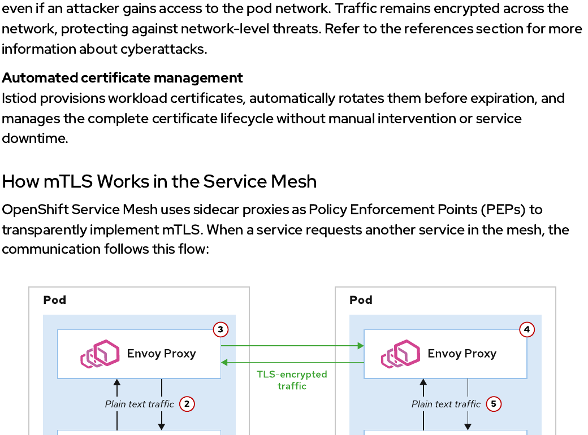
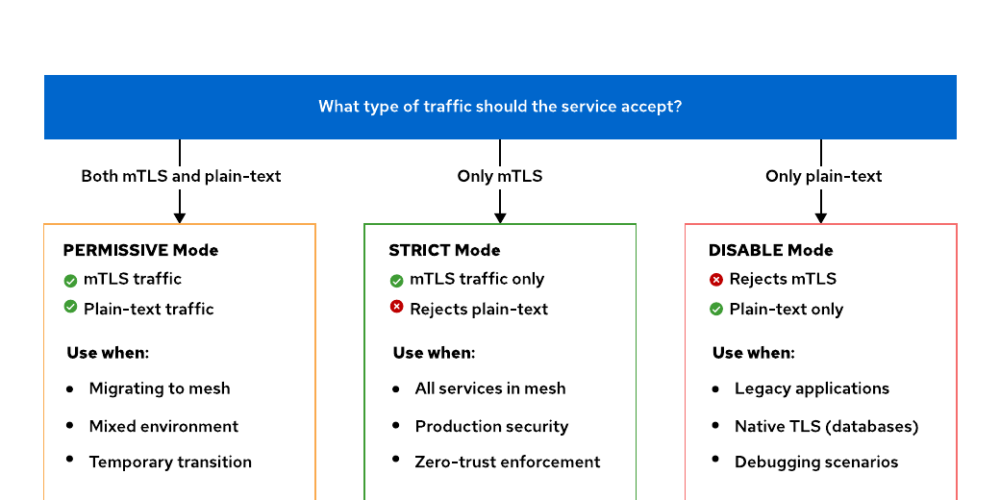
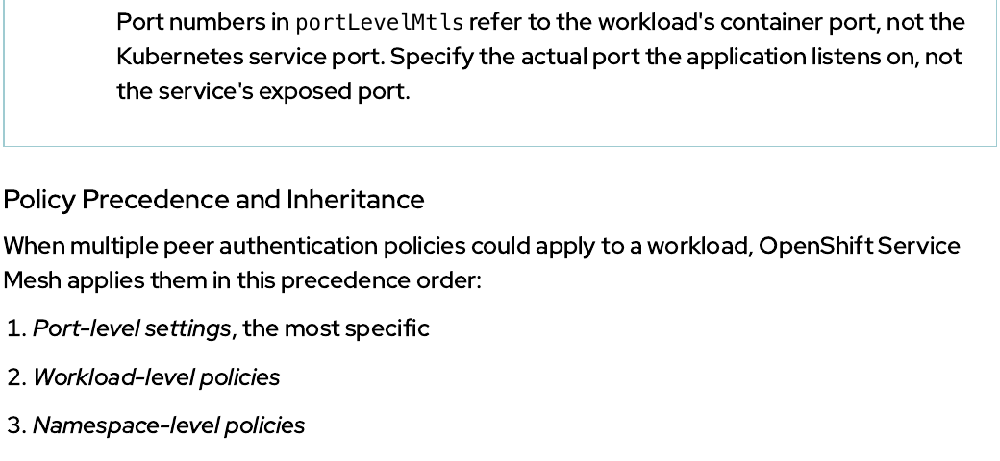
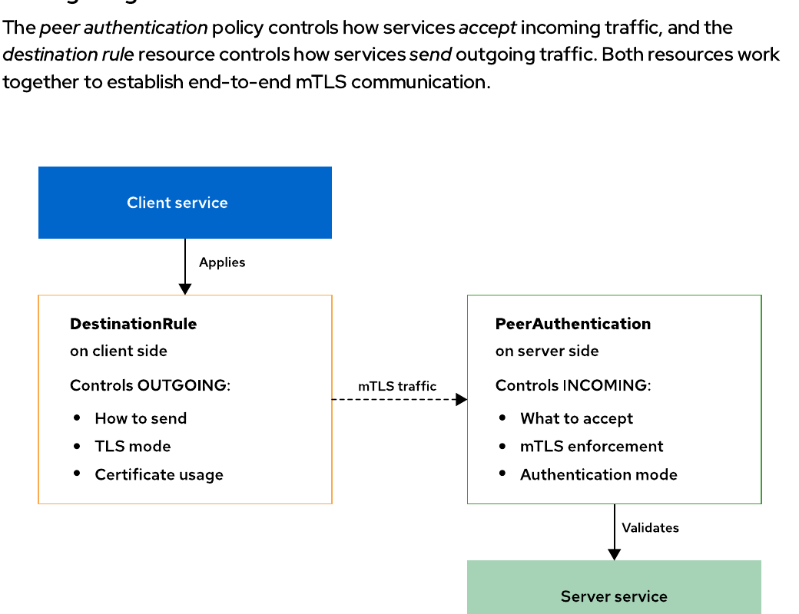
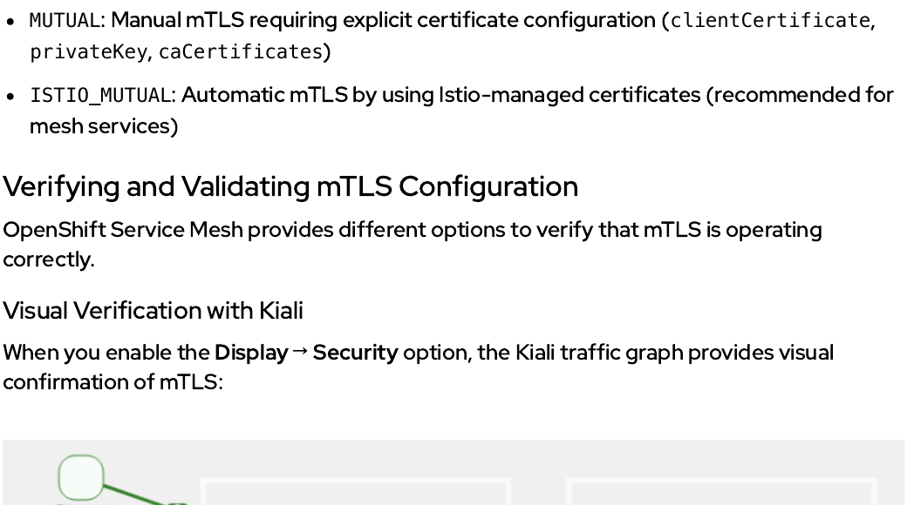

<style>
  h1 { font-size: 24px !important; }
  h2 { font-size: 20px !important; }
  h3 { font-size: 16px !important; }
</style>

<script>
document.addEventListener("DOMContentLoaded", function() {
    var checkAndReplace = function() {
        var walker = document.createTreeWalker(document.body, NodeFilter.SHOW_TEXT, null, false);
        var node;
        while (walker.nextNode()) {
            node = walker.currentNode;
            if (node.nodeValue.includes("api.apps.")) {
                node.nodeValue = node.nodeValue.replace(/api\.apps\./g, "api.");
            }
        }
    };
    checkAndReplace();
    setTimeout(checkAndReplace, 100);
    setTimeout(checkAndReplace, 500);
    setTimeout(checkAndReplace, 1500);
    setTimeout(checkAndReplace, 3000);
});
</script>

# 모듈 3.1: 상호 TLS (mTLS) 보안 개념 (Mutual TLS with OpenShift Service Mesh)

오픈시프트 서비스 메시가 제공하는 기본 보안 통신 기술인 상호 TLS(mTLS) 암호화 동작 아키텍처와 SPIFFE 기반의 서비스 신원(Identity) 검증 체계를 깊이 있게 고찰합니다. 이를 통해 소스 코드 수정 없이 메시 전역, 프로젝트, 혹은 워크로드 및 포트 단위로 엄격한 보안 장벽을 단계별로 전개 수립하는 전산 기법을 수득합니다.

## 학습 목표 (Objectives)
* SPIFFE 고유 식별자 인증 모델과 Envoy 사이드카 프록시를 통해 상호 TLS가 어떻게 투명하게 트래픽을 암호화하고 상호 검증하는지 그 기저 메커니즘을 심층 설명합니다.
* 피어 인증(PeerAuthentication) 정책을 활용하여 Permissive, Strict, Disable 모드 조합으로 메시, 네임스페이스, 워크로드, 포트 레벨별 격리 보안선을 정밀 구성합니다.
* Kiali 토폴로지 락(Lock) 지표 모니터링, 인증서 정보 조회 검수, 그리고 `istioctl` 진단 도구를 가동해 mTLS 설정 오류를 예방 해결하는 실무 노하우를 체득합니다.

---

## 1. 상호 TLS (mTLS)의 가치와 서비스 신원 검증

Red Hat OpenShift Service Mesh는 상호 TLS(mTLS) 기능을 동원해 마이크로서비스 배포본을 다양한 사이버 공격과 스니핑(Eavesdropping) 위험으로부터 완벽하게 보호하는 엔터프라이즈급 투명 보안 인프라를 기본 선사합니다.

* **상호 TLS (mTLS)의 본질:**
  서버 측만 신원을 입증하는 전통적인 단방향 TLS 암호화 방식과 달리, mTLS는 통신하는 **클라이언트와 서버 양측이 모두 서로의 X.509 보안 인증서를 제출하여 상호 간에 철저하게 신원을 대조 입증**하는 완전한 제로 트러스트(Zero-Trust) 네트워크 보안 아키텍처를 구현해 줍니다.
* **PKI 복잡성 원천 해결:**
  전통적인 쿠버네티스 통신 암호화(동서 트래픽)를 달성하려면 사내 전역 사설 PKI(공공 키 인프라)와 인증 기관(CA)을 손수 조율 배포하고 애플리케이션 코드를 TLS 인증 라이브러리 규격에 맞춰 튜닝하는 지독한 운영 오버헤드를 동반해야 했습니다. OpenShift Service Mesh는 **자체 내장된 자동화 PKI 관리 체계**를 통해, 개발자가 소스 코드를 단 한 글자도 수정하지 않고도 암호화 Provisioning, 인증서 만료 자동 로테이션, Envoy 단에서의 암호화 종단(Termination) 처리를 default 보안 상태로 원스톱 완전 자동 소화해 냅니다.

mTLS 투명 암호화 처리가 선사하는 **4대 전사적 보안 혜택**은 다음과 같습니다:

1. **강력하고 불변하는 신원 기둥 (Strong Identity Foundation):**
   - 메시 내의 모든 구동 워크로드는 쿠버네티스 서비스 어카운트(`ServiceAccount`) 지표를 영리하게 상속 결합하여, **`SPIFFE`** 규격의 암호화 신원 지표를 X.509 보안 인증서 안에 실시간 인앱 각인받아 활용합니다. 이 강력한 신원 고유 식별값은 파드가 기습 재배치되거나 물리 IP 노선 주소가 동적으로 완전히 바뀌더라도 한치의 변동 없이 안정적으로 보안 상태를 유지 보장해 줍니다.
2. **완전 무결한 제로 트러스트 네트워크 실현 (Zero-Trust Networking):**
   - 망 내부의 네트워크 스위치 통신망 위치나 IP 도메인 주소에 근거한 암묵적 신뢰 방식을 원천 배제하고, 메시 내에서 일어나는 모든 L7 통신 트랜잭션의 입입 단계마다 양측 신원 암호화를 상시 강제 대조 확인합니다.
3. **네트워크 가로채기 차단 (Defense Against Network Attacks):**
   - 해커가 내부 클러스터 망 스위치 가상 포트나 네트워크 세그먼트에 우회 침투하더라도, mTLS 채널 암호화 장벽 덕분에 패킷 스니핑, 중간자 공격(MITM), 서비스 사칭(Impersonation) 시도가 완벽하게 무력화 폭사 정리됩니다.
4. **완전무결 수명 로테이션 자동화 (Automated Certificate Management):**
   - `Istiod` 사령탑 제어 평면이 워크로드 인증서의 발행, 배포는 물론, **유효 만료 시간 전에 수동 개입 및 무단 서비스 다운타임 정지 시간 유발 없이 기습적으로 24시간 전에 백그라운드로 안전하게 인증서를 완전 무점검 로테이션**해 줍니다.

---

## 2. 상호 TLS (mTLS)의 실제 구동 흐름

오픈시프트 서비스 메시는 각 워크로드 파드 배후에 동반 가동되는 Envoy 사이드카 프록시들을 **`정책 강제 적용점 (PEP: Policy Enforcement Points)`**으로 삼아 투명하게 mTLS 핸드셰이크 채널을 개설합니다.

서비스 A가 메시 내부의 서비스 B를 정격 호출할 때, 물리 패킷 선로는 다음과 같은 수순으로 안전하게 하이재킹 제어됩니다:



1. 서비스 A 비즈니스 코드가 평문 HTTP 양식의 통신 요청 패킷을 로컬 파드 내부의 동반 Envoy 프록시로 송출합니다. ❶
2. 송신측 Envoy 프록시가 이를 전폭 가로채어(Intercept), 수신측 reviews 서비스 Envoy 프록시와 직접 비밀리에 mTLS 채널 협상 연결을 시도 기동합니다. ❷
3. 이 mTLS TLS 핸드셰이크 단계에서 **양측 Envoy 프록시들이 각자가 보관 중이던 전용 X.509 보안 인증서를 실시간 상호 제출하여 상대방 신원 장부의 진위를 대조 입증**합니다. ❸
4. 수신측 reviews 서비스 Envoy 프록시가 송신측의 인증서 신원 진위를 완전 검증해 패스하면, 비로소 암호화된 트래픽 패킷 장벽을 안전하게 수신 해독(Decrypt) 합니다. ❹
5. 수신측 Envoy 프록시는 해독이 완료된 깨끗한 평문 HTTP 데이터 패킷만을Reviews 실제 서비스 B 비즈니스 컨테이너 포트로 안전하게 흘려보내 연동 완수합니다. ❺
6. 회신 피드백 통신 역시 정확히 위 시퀀스의 역방향 순서대로 암호화되어 안전하게 회송됩니다. ❻

이 일련의 모든 과정은 Envoy 프록시 단에서 실시간 고속 처리되므로, 비즈니스 소스 코드 측에서는 본인의 호출이 암호화 mTLS 장막을 통과해 안전히 소화 중인지조차 인지할 필요 없이 완벽히 투명하게 기동 가동됩니다!

---

## 3. SPIFFE 식별자 신원 장부의 이해 (Understanding SPIFFE Identities)

서비스 메시 내부의 모든 개별 워크로드는 글로벌 표준 규격인 **`SPIFFE (Secure Production Identity Framework for Everyone)`** 가이드에 수렴하는 유일무이한 암호화 신원 주소값을 부여받아 X.509 보안 인증서 속에 영구 각인됩니다.

SPIFFE 식별값 포맷은 다음과 같은 표준 문자열 수식 형식을 철저히 준수합니다:

```bash
spiffe://cluster.local/ns/NAMESPACE/sa/SERVICE_ACCOUNT
```

* **실제 실무 적용 매핑 예시:**
  - `bookinfo` 프로젝트(Namespace) 하위에서 `bookinfo-reviews` 전용 서비스계정(ServiceAccount) 레이벨을 달고 구동되는 파드 인스턴스는 다음과 같은 유일한 SPIFFE 신원 ID를 부여받게 됩니다:
    ```bash
    spiffe://cluster.local/ns/bookinfo/sa/bookinfo-reviews
    ```
* 이 지표는 X.509 인증서 내부에 상시 기입 매립되어, 쿠버네티스의 RBAC 인가 필터 통제 조건 및 Kiali 관제 지표 식별선과 무결 동기화 기동됩니다.

---

## 4. 상호 TLS (mTLS)의 3가지 가용 모드 대조 분석

오픈시프트 서비스 메시는 실 운영 망의 점진적 암호화 전착 이송을 원활히 지원하기 위해, 서비스가 인입 패킷을 수용하는 보안 감도 수준에 따라 다음과 같은 **3대 가용 피어인증(mTLS) 모드**를 지원 배포합니다:



### ① PERMISSIVE Mode (허용 모드) - 기본 가동값
* **작동 본질:** 암호화된 mTLS 트래픽과 일반 평문(Plain-text) HTTP 트래픽을 **양측 모두 관대하게 수락**하여 연동 완수합니다.
* **실무 수립 사용처:** 메시 내부로 워크로드를 새로 인입 결합하는 마이그레이션 과도기적 전선에 셋업합니다. 
* 메시 외부의 일반 파드들은 평문으로 노크하고, 메시 하위의 동료 파드들은 mTLS 협상 암호 채널로 노크하여 통신 단절 리스크 없이 순차적이고 무결한 mTLS 도입 점진 경로를 열어 줍니다.

### ② STRICT Mode (엄격 모드)
* **작동 본질:** **오직 정상적인 X.509 인증서를 상호 검증 통과해 낸 완벽한 mTLS 암호화 패킷 요청 통신만을 허용**하며, 일반 평문 HTTP 요청은 프록시 장벽 단에서 무조건 거부(Reject) 차단합니다.
* **실무 수립 사용처:** 완벽한 엔터프라이즈 제로 트러스트 모델 수립 및 규제 준수 프로덕션 운영 망.
* 허용되지 않은 외부 평문 호출 진입 시 즉각 프록시 단에서 접속 연결을 강제 폭파 단절(`connection reset by peer` 에러 반사) 시킵니다.

### ③ DISABLE Mode (비활성 모드)
* **작동 본질:** mTLS 암호화 제어를 완전히 비활성화하며, **오직 일반 평문(Plain-text) 통신 요청만을 수용 가동**합니다.
* **실무 수립 사용처:** 데이터베이스 연동과 같이 서비스 자체적으로 고유의 독립 암호화 TLS 터널을 이미 탄탄하게 고수하고 있거나, 통신 패킷 전체를 와이어샤크 등의 스니핑 관제 도구로 실시간 직접 원본 모니터링 분석해야만 하는 특수 진단 시나리오 환경에 극히 제한 적용합니다.

> [!IMPORTANT]
> **보안 설계 중요 사항 (IMPORTANT)**
> mTLS 채널 암호화 기법은 오직 요청자의 신원이 진짜인지 위장인지만을 가려주는 **`인증(Authentication)`** 기능만을 담보할 뿐, 인증 통과된 해당 서비스가 특정 DB나 민감 리소스에 접속할 권리를 가졌는지 가려내는 **`인가(Authorization)`** 능력은 보유하고 있지 않습니다!
> 
> 그러므로 진정한 강력 제로트러스트 보안을 달성하려면 **STRICT 모드의 mTLS 장막 구성과 더불어, 세부 리소스 노선 접근 권한을 최종 차단 통제해 주는 이스티오 인가 정책(AuthorizationPolicy) 자산을 무조건 함께 체인 매립 결합 가동**시켜야만 완벽한 다층 방어막 수립이 완성됩니다!

---

## 5. 피어 인증(PeerAuthentication) 리소스를 통한 스코프 제어

피어 인증(`PeerAuthentication`) API 자산을 생성하면, 가용 감도 모드(STRICT, PERMISSIVE 등)를 적용할 물리 범위를 다음과 같은 **4단계 세부 precedence 스코프** 하위로 정교하게 한정 통제할 수 있습니다:



### ① Port-level (포트 단위 제어) - 최우선 순위
동일 파드 내에서도 특정 포트 번호(예: L7 API 통신용 9080)는 STRICT mTLS를 적용하고, 헬스 체크용 특정 포트(예: 9443)에 대해서는 PERMISSIVE나 DISABLE 모드로 유연하게 벌려두는 초정밀 최우선 보안 필터링 규칙입니다.

### ② Workload-level (특정 파드 단위 제어)
셀렉터(`matchLabels.app`) 지표를 삽입 매립하여, 특정 레이벨 정보가 일치하는 가용 파드 장비군들에게만 한정 격리하여 모드 정책을 강제 이식합니다.

### ③ Namespace-level (프로젝트 단위 제어)
셀렉터를 기입하지 않고 생성하여, 해당 네임스페이스(프로젝트 Space) 영역 하위에서 구동 중인 모든 파드 노드들에 일괄적으로 mTLS 검수 강도를 강제 지정합니다.

### ④ Mesh-wide (메시 전역 제어) - 최하위 순위
가장 안전한 루트 네임스페이스인 **`istio-system`** 하위에 피어 인증 자산을 배포하면, 서비스 메시를 관통하여 구동 중인 수많은 네임스페이스 하위의 모든 파드 인스턴스 전역에 STRICT 등급의 암호화 의무를 강제 부여합니다.

---

## 6. 클라이언트 수신용 대상 규칙(Destination Rule) 연동 흐름

* 피어 인증(`PeerAuthentication`) 정책이 서버 측 프록시에서 트래픽을 어떻게 **수신하여 받을지(Incoming)** 통제하는 도구라면,
* 대상 규칙(`DestinationRule`)의 `tls` 설정 블록은 클라이언트 측 프록시가 서버로 패킷을 **송출하여 내보낼 때(Outgoing)** 어떤 인증서 사양을 사용해 노크할 것인지를 조율합니다. 양측 설정 장부가 아귀가 맞물려 돌아가야만 end-to-end 완전 무결 암호 통신망이 결합 개설됩니다:



오픈시프트 서비스 메시는 기본적으로 **`Auto mTLS` (자동화 이중 암호 조율 기능)** 속성이 내장 활성화되어 가동되므로, 우리가 번거롭게 대상 규칙에 Outgoing용 암호화 설정을 매번 한 땀 한 땀 기입해 배포하지 않아도 이스티오가 알아서 상대방 서버 프록시가 STRICT mTLS를 요구하는 기조임을 확인하고 클라이언트의 인증서를 품은 채 정격 mTLS 채널을 자율 수립해 줍니다. 

단, 외부 클라우드 외부 도메인 망과 같은 사설 TLS 인증 교차 통제를 특수 주입해야 할 때에만 명시적으로 다음과 같이 대상 규칙의 `tls` 모드 명세를 수립 선언합니다:

```yaml
apiVersion: networking.istio.io/v1
kind: DestinationRule
metadata:
  name: api-service-dr
spec:
  host: api-service
  trafficPolicy:
    tls:
      mode: ISTIO_MUTUAL ❶
```

❶ 이스티오에서 자체 수명 관리해 주는 자동화 암호 X.509 인증서 가용 규격인 **`ISTIO_MUTUAL`** 방식을 송출 규격으로 강제 각인 정의합니다.

---

## 7. 실시간 mTLS 상태 옵저버빌리티 감상 및 트러블슈팅 가이드

설정된 상호 TLS가 실 운영 장막 하에서 완벽하게 파드 간에 연쇄 가동 중인지 눈으로 정합 대조 확인하고 긴급 상황에 대응하기 위한 엔지니어링 진단 방안입니다.

### ① Kiali 대시보드를 통한 실시간 비주얼 락(Lock) 관제
* Kiali 웹 콘솔의 트래픽 토폴로지 맵 상에서 **`Display ➔ Security`** 활성화 토글을 체크해 기동합니다.
* **정상 가동 포인트:** mTLS STRICT 또는 성공적 permissive 암호 통로가 결합 개설된 파드 간 통신 선로 에지(Edge) 선 정중앙마다 영롱한 **자물쇠 열쇠 아이콘(Padlock Icon)**이 눈부시게 생성 각인되어 실시간 표출되는 광경을 목격할 수 있습니다! 자물쇠가 보이지 않는 선로는 일반 평문 HTTP 유실 위험 선로임을 즉각 진단해 낼 수 있습니다.



### ② 인증서 세부 명세 원격 조회 검수
* 특정 파드 배후에 수립 배포된 Envoy X.509 인증서의 실제 만료 잔여 기간과 체인 신원 및 일련 시리얼 번호 원장 파일을 터미널 상에서 직접 명령조회할 수 있습니다:
  ```bash
  istioctl proxy-config secret <파드명>
  ```

### ③ 전역 peer_authentication 정책 충돌 진단 분석
* 복잡하게 뒤엉켜 배포된 이스티오 리소스들 간의 구문 정책 충돌 여부를 컴파일 전에 선제 검출 진증합니다:
  ```bash
  istioctl analyze
  ```
* **대표 해결 시나리오:** 만일 STRICT 모드를 선언했음에도 쿠버네티스의 필수 동작 기능인 `Liveness/Readiness` 헬스 프로브(Health Probes) 패킷이 엄격한 mTLS 자물쇠 통제를 통과하지 못해 파드가 기습 크래시 재부팅되는 참극을 겪는다면, **헬스 체크 포트 단위(`portLevelMtls`) 규칙만을 한정 개방하여 `PERMISSIVE` 모드로 정밀 우회 벌려두는 셋업**을 이식함으로써 단번에 해결할 수 있습니다!
