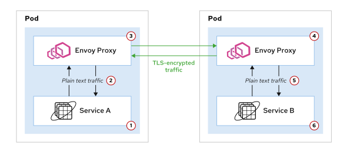
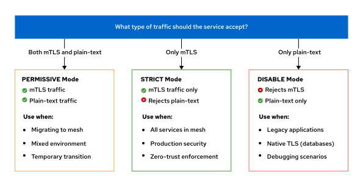
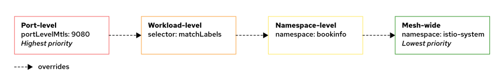
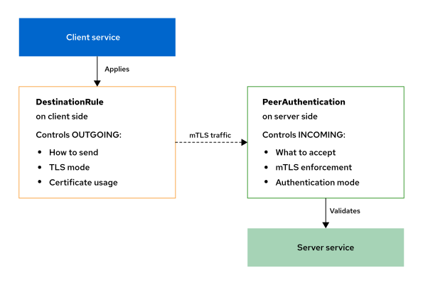

<style>
  h1 { font-size: 24px !important; }
  h2 { font-size: 20px !important; }
  h3 { font-size: 16px !important; }
</style>

<script>
document.addEventListener("DOMContentLoaded", function() {
    var checkAndReplace = function() {
        var walker = document.createTreeWalker(document.body, NodeFilter.SHOW_TEXT, null, false);
        var node;
        while (walker.nextNode()) {
            node = walker.currentNode;
            if (node.nodeValue.includes("api.apps.")) {
                node.nodeValue = node.nodeValue.replace(/api\.apps\./g, "api.");
            }
        }
    };
    checkAndReplace();
    setTimeout(checkAndReplace, 100);
    setTimeout(checkAndReplace, 500);
    setTimeout(checkAndReplace, 1500);
    setTimeout(checkAndReplace, 3000);
});
</script>

# 오픈시프트 서비스 메시 보안 개요 (Securing the OpenShift Service Mesh)

오픈시프트 서비스 메시 환경 하에서 제공하는 엔터프라이즈 보안 솔루션인 상호 TLS(mTLS) 기술과 피어 인증(PeerAuthentication), 그리고 인증서 관리 및 로테이션 작동 아키텍처를 학습합니다.

---

## Mutual TLS (mTLS) with OpenShift Service Mesh

### 학습 목표 (Objectives)
* SPIFFE 신원(Identities)과 Envoy 사이드카 프록시를 활용하여 상호 TLS(mTLS)가 어떻게 투명한 암호화 및 인증을 제공하는지 설명합니다.
* permissive, strict, 또는 disable 모드를 사용하여 메시(mesh), 네임스페이스(namespace), 워크로드(workload), 포트(port) 수준별 피어 인증 정책을 구성합니다.
* Kiali, 인증서 세부 검사, 그리고 `istioctl` 검증 도구를 사용해 mTLS 설정을 검증하고 일반적인 통신 연결 이슈를 해결합니다.

---

### Mutual TLS (mTLS) with OpenShift Service Mesh 개요
Red Hat OpenShift Service Mesh는 상호 TLS(mTLS)를 통해 마이크로서비스 배포본을 강력하게 보호하는 포괄적인 보안 솔루션을 제공합니다. 서버만 자신의 신원을 증명하는 기존의 단방향 TLS와 달리, mTLS는 통신하는 양측 모두가 X.509 디지털 인증서를 사용해 서로를 인증하도록 강제함으로써 진정한 제로 트러스트(Zero-Trust) 네트워크 모델을 실현합니다.

쿠버네티스 내부 통신(East-West)의 보안을 수립하기 위한 전통적인 접근 방식은 기업이 사설 키 인프라(PKI: Public Key Infrastructure)를 직접 수동으로 구축하고 유지 보수해야 했습니다. 이 수동 관리 방식 하에서 클라우드 관리자는 매번 인증 기관(CA)을 손수 조율하고 인증서를 일일이 배포해야 했으며, 애플리케이션 개발자 또한 소스 코드를 수정하여 TLS 프로토콜 통신 기능을 주입해야만 했습니다.

OpenShift Service Mesh는 관리형 PKI 인프라를 기본 탑재함으로써 이러한 복잡한 운영 오버헤드를 완전히 소거해 줍니다. 서비스 메시는 애플리케이션 코드를 단 한 글자도 수정하지 않고도 **기본적인 보안 상태(Security by Default)**를 달성합니다. 메시는 인증서의 생성(Provisioning), 만료 전 자동 로테이션, 그리고 사이드카 프록시 수준에서의 TLS 종단(Termination) 처리를 무중단 완전 자동으로 처리합니다. 

애플리케이션은 파드 내부의 로컬 Envoy 프록시와 평문(Plain HTTP)으로 안전하게 대화하고, 파드 경계선 밖의 원격 실제 통신망에서는 이 Envoy 프록시들이 서로 연대하여 강력하게 암호화된 mTLS 세션을 구성해 통신합니다.

이 투명한 암호화 접근 방식은 다음과 같은 강력한 핵심 보안 혜택을 제공합니다:

* **강력하고 유일무이한 신원 기둥 (Strong identity foundation):**
  메시 내의 모든 서비스들은 쿠버네티스 서비스 어카운트(`ServiceAccount`)를 기반으로 수립된 고유 신원을 부여받으며, 이는 X.509 인증서 내부에 **SPIFFE(Secure Production Identity Framework for Everyone) ID** 양식으로 각인됩니다. 이 강력한 암호화 신원은 파드가 기습적으로 재스케줄링되거나 물리 IP 주소가 수시로 바뀌더라도 흔들림 없이 불변 상태로 결합 유지됩니다.
* **제로 트러스트 네트워킹 (Zero-trust networking):**
  모든 서비스 간의 통신은 기본적으로(By default) 상호 인증 및 암호화 상태를 강제 준수합니다. 이를 통해 단순히 내부 가상 망(Network Location)이나 특정 IP 대역 주소에 속해 있다는 이유만으로 암묵적으로 통신을 허용하는 보안 유실 현상을 완벽히 차단합니다.
* **네트워크 레이어 공격 완전 차단 (Defense against network attacks):**
  mTLS는 해커가 클러스터 가상 스위치나 파드 네트워크망 영역에 침입하더라도 중간자 공격(MITM: Man-In-The-Middle), 패킷 도청(Eavesdropping), 그리고 비정상적인 서비스 사칭(Service(서비스) Impersonation) 위장을 프록시 레벨에서 철저히 격파 방어합니다. 망을 흐르는 모든 데이터 패킷은 항상 엄격하게 암호화 상태를 유지합니다.
* **인증서 라이프사이클 자동화 (Automated certificate management):**
  `Istiod` 제어 평면이 워크로드 인증서의 발급을 주관하고, 만료 전에 무점검으로 자동 롤링 로테이션을 실행해 줍니다. 수동 개입이 전혀 불필요하며 보안 관리 패치에 따른 서비스 정지 정황(Downtime) 또한 수식 제로로 수렴합니다.

---

### 서비스 메시 내부의 mTLS 작동 원리

오픈시프트 서비스 메시는 각 파드 하단에 장착된 사이드카 프록시들을 **`정책 강제 적용점 (PEPs: Policy Enforcement Points)`**으로 삼아 투명하게 mTLS 채널을 개설합니다. 메시 내부의 한 서비스가 다른 서비스를 노크하며 호출할 때, 물리 패킷 선로는 다음과 같은 수순으로 흘러갑니다:



1. 소스 애플리케이션 서비스 A는 평문 HTTP 요청 패킷을 로컬 파드 내부에서 함께 기동 중인 Envoy 사이드카 프록시로 전송합니다.  
❶
2. 송신측 Envoy 프록시가 이 요청을 가로채어, 수신지 reviews 서비스 배후의 Envoy 프록시와 전용 mTLS 연결 채널 협상을 기동합니다.  
❷
3. 이 암호화 TLS 핸드셰이크 과정에서, 양측 Envoy 프록시들은 각자가 보관 중이던 전용 X.509 보안 인증서를 실시간 상호 교환 대조하여 서로의 신원을 엄격히 증명합니다.  
❸
4. 수신측 Envoy 프록시가 송신측의 신원 진위를 완전 검증해 패스하면, 비로소 암호화 트래픽을 안전하게 수신 해독(Decrypt) 처리합니다.  
❹
5. 해독 처리가 무결 완료된 평문 HTTP 요청은 reviews 백엔드 애플리케이션 서비스 B 노선 포트로 무사히 배송 통과됩니다.  
❺
6. 회신 피드백 통신 역시 정확히 위 프로세스의 역방향 순서대로 암호화 전송됩니다.  
❻

이 일련의 모든 과정은 애플리케이션 소스 코드 변경 부담 없이 백그라운드 프록시 단에서 실시간 통제 처리되므로, 비즈니스 컨테이너 측에서는 보안 작동 여부를 인지하지 못한 채 아주 안전하게 통신을 완수할 수 있습니다.

---

### SPIFFE 신원 식별자의 이해 (Understanding SPIFFE Identities)

서비스 메시 하위의 모든 개별 워크로드는 글로벌 표준 규격인 **`SPIFFE (Secure Production Identity Framework for Everyone)`** 에 입각하여 유일무이한 암호화 신원 주소값을 발급받아 X.509 인증서 내부에 각인 매립합니다.

정식 SPIFFE ID 규격 포맷 양식은 다음과 같습니다:

```bash
spiffe://cluster.local/ns/NAMESPACE/sa/SERVICE_ACCOUNT
```

* **실제 실무 적용 매핑 예시:**
  - `bookinfo` 프로젝트(Namespace(네임스페이스)) 하위에서 `bookinfo-reviews` 전용 서비스계정(ServiceAccount) 사양을 상속받아 구동되는 파드 인스턴스는 다음과 같은 유일무이한 SPIFFE ID를 부여받게 됩니다:
    ```bash
    spiffe://cluster.local/ns/bookinfo/sa/bookinfo-reviews
    ```
* 이 식별자값은 X.509 인증서 내부에 고이 안착되어 mTLS 양방향 신원 대조 시 수렴 활용됩니다. IP 대역이나 단순 물리 정보와 달리, 파드가 기습적으로 재배치되거나 물리 노드가 이탈하더라도 SPIFFE ID는 변함없이 동일하게 보존됩니다.

---

### Mutual TLS (mTLS)의 3가지 가용 모드

오픈시프트 서비스 메시는 점진적이고 조화로운 mTLS 보안 전착 이송을 원활히 지원하기 위해, 서비스가 인입 요청 패킷을 받아들이는 수용 감도 수준에 따라 다음과 같은 **3대 가용 피어인증 모드**를 지원 배포합니다:



#### ① PERMISSIVE Mode (허용 모드)
* **동작 본질:** mTLS 암호화된 트래픽과 일반 평문(Plain-text) HTTP 트래픽을 **양측 모두 관대하게 수용**하여 기동시킵니다.
* **실무 수립 사용처:** 피어 인증 정책이 아예 구성되어 있지 않을 때 가동되는 기본값(Default)입니다. 기존 운영 통신 연결을 깨뜨리지 않고 점진적으로 서비스들을 메시 내부로 마이그레이션하는 과도기 단계에 안착시킵니다.
* Envoy 사이드카 프록시가 장착된 동료 노드들과는 자동으로 mTLS를 협상 수립하고, 아직 준비가 안 된 메시 바깥 영역의 레거시 파드들과는 일반 평문으로 단절 없이 무결 소화합니다. 단, 영구 프로덕션 셋업 모드로 방치하는 것은 권장되지 않으며 임시 전이 상태로 활용해야 합니다.

#### ② STRICT Mode (엄격 모드)
* **동작 본질:** **오직 검증 완료된 X.509 인증서를 제출하여 상호 mTLS 인증에 무결 통과한 엄격한 암호화 패킷 요청 통신만을 허용**하며, 일반 평문 HTTP 요청은 프록시 장벽 단에서 무조건 차단 거절(Reject) 처리합니다.
* **실무 수립 사용처:** 메시 내부 장비가 100% Envoy 사이드카 주입 완료된 완벽한 프로덕션 영구 운영 전선.
* 허용되지 않은 평문 호출이 진입을 시도할 경우 즉각 프록시 단에서 접속 연결을 강제 폭파(`connection reset by peer` 통신 거부)시킵니다.

#### ③ DISABLE Mode (비활성 모드)
* **작동 본질:** mTLS 보안 통제를 완전히 비활성화하며, **오직 일반 평문(Plain-text) 통신 요청만을 수용 가동**합니다.
* **실무 수립 사용처:** 자체적인 고유의 독립 TLS 암호화 장치(예: 네이티브 SSL 통신이 내장 구성된 격리 데이터베이스)를 이미 굳건히 소지하고 있거나, 임시 트러블슈팅이나 패킷 분석을 위해 평문 가시성이 엄격하게 강제되는 특수 검수 디버깅 시나리오에 한해 극히 아껴서 적용합니다.

> [!IMPORTANT]
> **보안 설계 중요 사항 (IMPORTANT)**
> 상호 TLS(mTLS) 암호화 채널 수립은 오직 상대방의 신원이 위장된 상태가 아닌 진짜인지 식별하는 **`인증(Authentication)`** 수단만을 제공할 뿐, 해당 서비스가 특정 DB나 중요 관리자 API에 접속해 탈취해 갈 수 있는 세부 권한을 검수하는 **`인가(Authorization)`** 제어력은 탑재하고 있지 않습니다!
> 
> 그러므로 진정한 완전 보안 제로트러스트를 구축하려면, **STRICT 등급의 mTLS 피어인증 정책과 더불어 서비스 간 노선 접근 허용 여부를 픽셀 단위로 통제해 주는 이스티오 인가 정책(AuthorizationPolicy) 자산을 무조건 연대 매립 결합 가동**해야만 합니다!

---

### 피어 인증(PeerAuthentication)을 통한 mTLS 제어 및 범위 수립

피어 인증(`PeerAuthentication`) API 자산을 생성하면, 가용 감도 모드(STRICT, PERMISSIVE 등)를 적용할 물리 범위를 다음과 같은 **4단계 세부 precedence 계층** 하위로 정교하게 한정 통제할 수 있습니다.

#### ① Mesh-wide mTLS (메시 전역 제어) - 가장 보편적이고 넓은 범위
가장 안전한 메시 루트 네임스페이스인 **`istio-system`** 하위에 피어 인증 자산을 배포하면, 서비스 메시를 관통하여 구동 중인 수많은 네임스페이스 하위의 모든 파드 인스턴스 전역에 STRICT 등급의 암호화 의무를 강제 부여합니다.

```yaml
apiVersion: security.istio.io/v1
kind: PeerAuthentication
metadata:
  name: default
  namespace: istio-system ❶
spec:
  mtls:
    mode: STRICT ❷
```

❶ 이스티오 제어 평면이 위치한 루트 네임스페이스 하위에 정격 배치합니다.
❷ 메시 전역의 모든 파드 상호 호출은 오직 엄격한 mTLS STRICT 모드만 개방 수용하도록 수립 선언합니다.

#### ② Namespace(네임스페이스)-wide mTLS (특정 프로젝트 단위 제어)
셀렉터를 기입하지 않은 채, 특정 프로젝트 네임스페이스 하위에 직접 생성하여 해당 영역에 기동되는 전체 파드 노드들을 일괄 mTLS 규격화합니다.

```yaml
apiVersion: security.istio.io/v1
kind: PeerAuthentication
metadata:
  name: default
  namespace: bookinfo ❶
spec:
  mtls:
    mode: STRICT ❷
```

❶ 본 피어 인증 정책을 일괄 전개 적용할 타깃 네임스페이스 명칭을 선언합니다.
❷ bookinfo 프로젝트 공간에 속한 모든 워크로드는 mTLS STRICT로 엄격히 결착 규격화합니다.

#### ③ Workload-specific mTLS (특정 특정 파드 단위 제어)
셀렉터(`matchLabels.app`) 지표를 삽입 매립하여, 특정 레이벨 정보가 일치하는 가용 파드 장비군들에게만 한정 격리하여 모드 정책을 강제 이식합니다.

```yaml
apiVersion: security.istio.io/v1
kind: PeerAuthentication
metadata:
  name: reviews-strict
  namespace: bookinfo
spec:
  selector:
    matchLabels:
      app: reviews ❶
  mtls:
    mode: STRICT
```

❶ 오직 `app: reviews` 레이벨 딱지를 소지하고 구동 중인 reviews 파드 장비 복제본들에 대해서만 격리 적용시킵니다.

#### ④ Port-level mTLS (포트 단위 제어) - 가장 좁고 구체적이며 최우선 순위
동일 파드 내에서도 특정 비즈니스 포트 번호와 헬스 체크용 보조 포트의 수용 모드를 정밀 스플릿 셋업 합니다.

```yaml
apiVersion: security.istio.io/v1
kind: PeerAuthentication
metadata:
  name: mixed-mode
  namespace: bookinfo
spec:
  mtls:
    mode: STRICT ❶
  portLevelMtls:
    9080:
      mode: PERMISSIVE ❷
    9443:
      mode: DISABLE ❸
```

❶ 별도 포트 지정이 없는 모든 일반 통신 포트는 기본 STRICT mTLS 암호화를 따르도록 수립합니다.
❷ 9080 포트의 경우에는 외부와의 임시 통신 병합을 위해 예외적으로 PERMISSIVE 모드 진입을 허가합니다.
❸ 9443 포트는 암호화 결착이 완전히 불가능한 시스템 헬스 체크 전용 통로이므로 mTLS 감도를 완전히 비활성(DISABLE) 개방해 둡니다.

> [!NOTE]
> **포트 단위 수립 시 필수 기입 주의점 (NOTE)**
> `portLevelMtls` 지표 하단에 기입해 넣는 포트 번호 명세는, 쿠버네티스의 가상 서비스 포트가 아닌 **실제 파드 내 애플리케이션 컨테이너가 직접 리스닝(listening)하여 귀를 열어두고 구동 중인 실 물리 컨테이너 포트 번호**를 기입해야만 에러 없이 정상 작동합니다!

#### 피어 인증 정책 상속 및 우선순위 법칙 (Policy Precedence)
여러 피어 인증 자산들이 단일 파드 노드 위에 중첩 대입될 때, 서비스 메시는 다음과 같은 **엄격한 우선순위 계층(Precedence Order)**에 수렴하여 정책을 하향 상속 덮어쓰기 처리합니다:
1. **Port-level settings (포트 레벨) ➔ 가장 구체적이고 최우선 적용**
2. **Workload-level policies (특정 워크로드 레벨)**
3. **Namespace(네임스페이스)-level policies (프로젝트 레벨)**
4. **Mesh-wide policies (메시 전역 레벨) ➔ 가장 포괄적이고 최하위 순위**



만일 특정 파드에 명시적인 모드 설정이 없을 때에는, 이 계층 사슬망을 타고 상위 프로젝트나 메시 전역 설정에 기재된 값을 고스란히 상속받아 유연히 대응 가동됩니다.

---

### 대상 규칙(Destination Rule)을 통한 클라이언트 송출 mTLS 설정

* 피어 인증(`PeerAuthentication`)이 서버 단에서 들어오는 트래픽을 어떻게 **받을지(Incoming)** 결정한다면,
* 대상 규칙(`DestinationRule(대상 규칙)`)의 `tls` 설정 블록은 클라이언트 단 프록시가 서버 노드를 향해 패킷을 **내보낼 때(Outgoing)** 어떤 암호 규격 인증서를 꺼내어 노크할 것인지 정의합니다. 양측 자산 장부가 아귀가 맞물려 돌아가야만 end-to-end mTLS 세션이 이륙 성공합니다:



오픈시프트 서비스 메시는 기본적으로 **`Auto mTLS`** 속성이 자율 활성화되어 가동되므로, 우리가 번거롭게 대상 규칙에 Outgoing용 암호화 설정을 매번 기입해 배포하지 않아도 이스티오가 알아서 상대방 서버 프록시가 STRICT mTLS를 요구하는 기조임을 확인하고 클라이언트의 인증서를 품은 채 정격 mTLS 채널을 자율 수립해 줍니다. 

단, 외부 클라우드 외부 도메인 망과 같은 사설 TLS 인증 교차 통제를 특수 주입해야 할 때에만 명시적으로 다음과 같이 대상 규칙의 `tls` 모드 명세를 수립 선언합니다:

```yaml
apiVersion: networking.istio.io/v1
kind: DestinationRule
metadata:
  name: default
  namespace: bookinfo
spec:
  host: "*.bookinfo.svc.cluster.local" ❶
  trafficPolicy:
    tls:
      mode: ISTIO_MUTUAL ❷
```

❶ bookinfo 프로젝트 하위의 모든 가상 도메인 호스트들을 대상으로 지정 매핑합니다.
❷ 이스티오에서 자체 수명 관리해 주는 자동화 암호 X.509 인증서 가용 규격인 **`ISTIO_MUTUAL`** 방식을 송출 규격으로 강제 각인 정의합니다.

대상 규칙이 공식 지원하는 4가지 대표적 `mode` 지표 정보는 다음과 같습니다:
* **DISABLE:** 업스트림으로의 통신에 대해 TLS 암호화 장막을 적용하지 않고 평문 송출합니다.
* **SIMPLE:** 외부의 타깃 HTTPS 서비스 등과 접속 시 활용하며, 표준 단방향 일반 TLS 보안 노크를 단행합니다.
* **MUTUAL:** 수동으로 직접 로컬에 업로드 장착한 사용자 커스텀 외부 클라이언트 인증서와 비공개 키(`clientCertificate`, `privateKey` 등)를 강제 체인 결합하여 노크합니다.
* **ISTIO_MUTUAL:** 메시 환경의 이스티오 공인 CA 가 발행한 자체 관리 인증서를 품고 자동으로 mTLS 노크를 단행합니다 (권장값).

---

### 상호 TLS(mTLS) 설정의 비주얼 검증 및 트러블슈팅

mTLS 설정 전개 시, 실제 운영 환경 하에서 보안 자막이 안전하게 활성화되어 흐르고 있는지 검증하는 실무 전산 기법과 자주 맞닥뜨리는 통신 크래시 대응 매뉴얼입니다.

#### ① Kiali 실시간 비주얼 락(Lock) 아이콘 관제
오픈시프트 전용 서비스 메시 대시보드 플러그인(OSSMC) 및 Kiali 독립 웹 콘솔의 토폴로지 맵 상에서 **`Display ➔ Security`** 표시 옵션을 가볍게 기동 활성화시킵니다.
* **정상 가동 감상 포인트:** mTLS STRICT 또는 성공적 permissive 암호 통로가 결합 개설된 파드 간 통신 선로 에지(Edge) 선 정중앙마다 영롱한 **자물쇠 아이콘(Padlock Icon)**이 선명하게 나타납니다! 자물쇠가 나타나지 않는 실선은 암호화가 누설 적용되어 있는 일반 HTTP 평문 유실 위험 선로임을 즉각 식별해 내어 예방 대조할 수 있습니다.


#### ② 실 물리 발급 인증서 원본 세부 정보 조회
* 특정 파드 배후에 수립 배포된 Envoy X.509 인증서의 실제 만료 잔여 기간과 체인 신원 및 일련 시리얼 번호 원장 파일을 터미널 상에서 직접 명령조회할 수 있습니다:
```bash
[user@host ~]$ istioctl proxy-config secret POD_NAME
RESOURCE NAME TYPE STATUS VALID CERT SERIAL NUMBER NOT AFTER NOT BE
FORE
default Cert Chain ACTIVE true abc123... ... ...
ROOTCA CA ACTIVE true def456... ... ...
```

#### ③ 정책 구문 정합 진단 분석
* 복잡하게 뒤엉켜 배포된 이스티오 리소스들 간의 구문 정책 충돌이나 오동작 가용 셀렉터 유무를 컴파일 전에 선제 검출 진증합니다:
```bash
[user@host ~]$ istioctl analyze
Warn [IST0102] (Namespace default) The namespace is not enabled for Istio
```

#### ④ mTLS 도입 시 자주 범하는 대표 4대 기동 요인 해결 매뉴얼:
1. **STRICT 선언 이후 즉각 터지는 Connection reset by peer 크래시:**
   - **원인:** 송신측 파드에 Envoy 사이드카 프록시 주입이 누설되었거나 아예 메시 외부에서 mTLS가 불가능한 평문으로 노크하여 STRICT 서버 프록시가 가차 없이 패킷을 즉석에서 강제 단절 폭사시킬 때 나타납니다.
   - **해결책:** 송신 파드의 네임스페이스 레이벨 주입(`istio-injection=enabled`) 후 롤아웃 리스타트하여 `2/2` 가용 상태로 수복하거나, 마이그레이션이 끝날 때까지 임시 `PERMISSIVE` 모드로 피어 인증 감도를 완화하여 탈출구를 확보해 줍니다.
2. **`istioctl analyze` 시 보고되는 다중 정책 셀렉터 중첩 에러:**
   - **원인:** 동일 프로젝트 하위에서 가상 서비스나 피어 인증 셀렉터가 동일 파드 레이벨을 중복 지명 대립하여 설정 꼬임이 유발된 경우입니다.
   - **해결책:** 과도하게 쪼개진 Workload 레벨 정책의 범위 스코프를 검수하여, 범위가 넓은 네임스페이스 광범위 정책으로 통일해 줍니다.
3. **Envoy 로그 상에 누적 적체되는 TLS Handshake Failure 에러:**
   - **원인:** 인증서 신뢰 체인(Trust Chain) 훼손이나 클러스터 노드 간의 하드웨어 시간 불일치(Clock Skew)로 인해 암호 키 해석 수렴이 거부당한 상태입니다.
   - **해결책:** 클러스터 NTP 타임 시스템을 정렬 동기화하고, `Istiod` 파드 노드를 안전하게 리부팅시켜 신규 CA 신뢰 체인을 전착 프록시들에 실시간 재하달 해 줍니다.
4. **STRICT 전개 직후 노드들이 비정상 사망 리부팅되는 헬스 프로브 실패 장애:**
   - **원인:** 쿠버네티스의 필수 동작 기능인 `Liveness/Readiness` 헬스 프로브 패킷이 STRICT mTLS를 통과하지 못해 파드가 기습 크래시 재부팅되는 참극입니다.
   - **해결책:** 헬스 체크 포트 단위(`portLevelMtls`) 규칙만을 한정 개방하여 `PERMISSIVE` 또는 `DISABLE` 모드로 정밀 우회 벌려두는 셋업을 이식함으로써 단번에 해결할 수 있습니다!

---

### 인그레스 게이트웨이(Ingress(인그레스) Gateway(게이트웨이)) mTLS 보안 구성

외부 퍼블릭 망의 불특정 다수 클라이언트 역시, 이스티오 인그레스 게이트웨이 단에 정교한 SSL/TLS 포트 개방 및 클라이언트 인증 자산 명세를 배포함으로써 철저한 보안 진입로를 수립할 수 있습니다.
* **Simple Mode (일반 단방향 HTTPS 암호화):**
  - 게이트웨이가 자신의 웹 서버 인증서만을 클라이언트 브라우저로 제시하여, 일반적인 HTTPS 자물쇠 통신을 개설합니다. 클라이언트는 별도의 인증서를 소지할 필요가 없는 가장 대중적인 퍼블릭 노선입니다.
* **Mutual Mode (양방향 클라이언트 인증 mTLS):**
  - 게이트웨이와 외부 클라이언트 브라우저가 서로 인증서를 맞교환하여 mTLS를 협상 수립합니다. 신뢰할 수 있는 기관이 발급한 기성 디지털 서명 인증서를 소지한 검증된 기업 파트너 장비들 간의 M2M 통신이나 차단 보안 API 망 구축 시 전격 배포합니다.
* 게이트웨이 자산은 인증서를 쿠버네티스 기성 `Secret(비밀)` 명세 하위에 보관하며, `credentialName` 지표를 걸어 이 시크릿 장부명을 참조 매핑합니다. 게이트웨이 단에서 성공적으로 TLS 종단(Termination) 처리가 완수되면, 패킷은 메시 내부 전역 mTLS STRICT 설정 노선을 안전하게 상속받아 백엔드reviews 파드까지 부드럽게 운반 수송됩니다.

다음 예제는 외부 파트너 클라이언트들에 대해 양방향 mTLS 상호 인증서를 요구하도록 인그레스 게이트웨이의 443 HTTPS 포트를 삼엄하게 개방 구성하는 실제 명세입니다:

```yaml
apiVersion: networking.istio.io/v1
kind: Gateway
metadata:
  name: bookinfo-gateway
spec:
  selector:
    istio: ingressgateway
  servers:
  - port:
      number: 443
      name: https
      protocol: HTTPS
    tls:
      mode: MUTUAL ❶
      credentialName: bookinfo-credential ❷
    hosts:
    - "bookinfo.example.com" ❸
```

❶ 외부 진입로 장벽 모드를 양방향 클라이언트 mTLS 상호 검증 방식인 **`MUTUAL`** 규격으로 강력 지정 선언합니다.
❷ 외부 보안 인증서와 비공개 키, 신뢰할 수 있는 CA 인증 지표가 보관되어 있는 쿠버네티스 시크릿(`Secret(비밀)`) 리소스 명칭을 바인딩합니다.
❸ 본 게이트웨이 443 암호화 보안 규칙을 매핑 적용할 정식 외부 퍼블릭 수신 FQDN 도메인 주소를 기입 각인합니다.

> [!NOTE]
> **인그레스 게이트웨이와 피어 인증 정책의 명확한 차이점 (NOTE)**
> 외부 클라이언트를 노크 수용하는 **인그레스 게이트웨이의 TLS 튜닝 구성**은, 메시 내부의 순수 동서 트래픽(East-West) 간의 파드 대 파드 상호 mTLS 통제를 주관하는 **피어 인증(PeerAuthentication) 정책과 아키텍처적으로 완전히 독립 구동**됩니다! 게이트웨이는 메시 외곽 최전방 진입로 수문장이고, 피어인증은 내부 전산망의 세부 감도를 감시하는 파수꾼 역할임을 철저히 구분하여 인지하십시오.

---

### 안전한 프로덕션 mTLS 마이그레이션 4단계 전략

운영 가동 중인 엔터프라이즈 마이크로서비스 무대 위에, 통신 단절 없이 안전하게 STRICT mTLS 철옹성 장벽을 무결 가동하기 위한 레드햇의 **4단계 점진적 마이그레이션 모범 참조 매뉴얼**입니다.

* **사전 필수 검수 지침 (IMPORTANT):**
  - 암호화 장벽을 기동하기에 앞서, **그 어떤 피어인증 정책도 없는 평문 가동 상태에서 모든 하위 서비스들 간의 동료 통신이 100% 한치의 오류 없이 무결하게 성공 기동 중인지 그 최저 성능 기준 한계값(Baseline Connectivity)을 완벽히 모니터링 확보**해 두는 것이 인재를 차단하는 최우선 첫걸음입니다.

#### 1단계: 정책 변경 없는 메시 인입 수용 (Phase 1)
* 타깃 프로젝트 네임스페이스 영역 하위에 이스티오 인젝션 레이벨(`istio-injection=enabled`)을 수립하고 롤아웃 리스타트를 단행합니다. 
* 모든 파드가 `2/2` 가용 상태(애플리케이션 + Envoy 프록시)로 이착륙 성공했는지 수치를 전사 대조합니다. 이 시점에서 노드들은 프록시 단의 기성 Auto mTLS 기질(Opportunistic mTLS)에 의거하여, mTLS 통신과 일반 평문 통신을 양측 유연하게 둘 다 차단 없이 흘려보내며 워밍업 준비 단계를 거칩니다.

#### 2단계: 자동 mTLS 전이 정착 집중 관제 (Phase 2)
* Kiali 웹 콘솔의 실시간 토폴로지 맵을 활성화하여, 파드 노드 간의 실선 상에 영롱한 자물쇠 아이콘(Padlock)이 무결하게 정착 분포되기 시작했는지 전사 스캐닝 집중 모니터링을 전개합니다. 아직 메시 장벽 안으로 들어오지 못한 아웃라이어 파드가 없는지 밀착 관제합니다.

#### 3단계: 프로젝트(Namespace(네임스페이스)) 단위 STRICT 1차 수립 (Phase 3)
* 서비스 중요도가 가장 낮고 복구 범위가 가벼운 비핵심 테스트 프로젝트부터 순차적으로 `mode: STRICT` 등급의 피어 인증 정책을 하나씩 배포 가동시킵니다. 
* 배포 완료 후 `istioctl analyze` 진단을 가동해 통신 차단 노선이 없는지, 혹은 프로브 헬스체크 사망 장애가 포착되는지 밀착 스캐닝하여 통과하면 다음 프로젝트로 순차 확대합니다.

#### 4단계: 메시 전역 STRICT 완전 전착 및 인가 장벽 매립 (Phase 4)
* 모든 개별 프로젝트 격리 검수가 무결 통과되면, 마침내 최상위 `istio-system` 하위에 메시 전역 mTLS STRICT 선언서를 투입하여 클러스터 내부를 완벽한 무결 제로 트러스트 기동 상태로 정착 완수합니다! 
* 암호화가 완수되면 추가 보조 자산으로 이스티오 **인가 정책(AuthorizationPolicy)** 자산을 연대 배포하여, 각 서비스 계정별 실제 리소스 접근 권한을 픽셀 단위로 거부 격리함으로써 보안 전사화를 최종 종결 완수해 냅니다!


