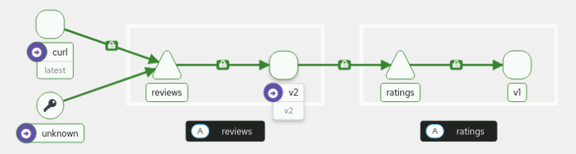
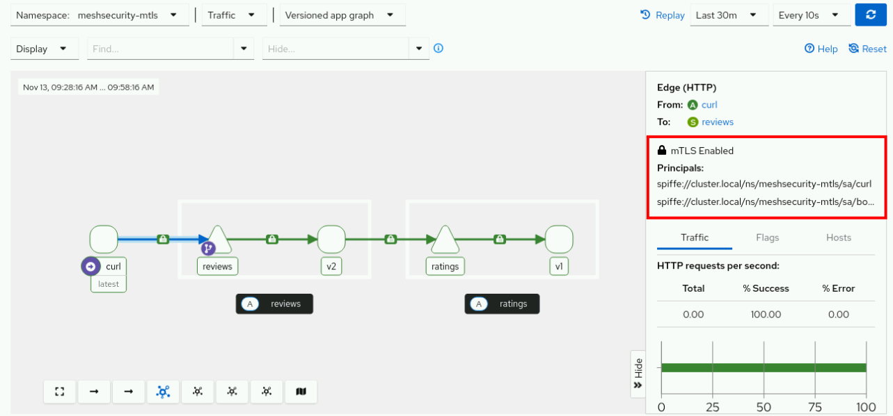

<style>
  h1 { font-size: 24px !important; }
  h2 { font-size: 20px !important; }
  h3 { font-size: 16px !important; }
</style>

<script>
document.addEventListener("DOMContentLoaded", function() {
    var checkAndReplace = function() {
        var walker = document.createTreeWalker(document.body, NodeFilter.SHOW_TEXT, null, false);
        var node;
        while (walker.nextNode()) {
            node = walker.currentNode;
            if (node.nodeValue.includes("api.apps.")) {
                node.nodeValue = node.nodeValue.replace(/api\.apps\./g, "api.");
            }
        }
    };
    checkAndReplace();
    setTimeout(checkAndReplace, 100);
    setTimeout(checkAndReplace, 500);
    setTimeout(checkAndReplace, 1500);
    setTimeout(checkAndReplace, 3000);
});
</script>

# 모듈 3.1: 상호 TLS (mTLS) 보안 (Mutual TLS with OpenShift Service Mesh)

오픈시프트 서비스 메시 환경에서 네임스페이스 수준의 상호 TLS (mTLS) 강제 규칙을 배포하고 이를 철저하게 검증합니다. Kiali 트래픽 그래프 시각화 및 실제 서비스 트래픽 유입 테스트를 통해 서비스 간 인증 메커니즘을 점검합니다.

## 결과 (Outcomes)
* OpenShift Service Mesh (OSSM)가 기본적으로 허용(permissive) mTLS 모드를 규칙으로 선언하고 있는지 검증합니다.
* 피어 인증(PeerAuthentication) 정책을 배포하여 네임스페이스 수준에서 엄격(strict) mTLS 모드를 강제 수립합니다.
* 암호화된 트래픽과 일반 텍스트(Plain-text) 트래픽을 상호 대조 테스트하여 mTLS 강제 동작을 완벽 검증합니다.
* Kiali에서 mTLS 구동 상태 및 SPIFFE 자격 아이덴티티 정보를 시각적으로 확인합니다.
* 이스티오가 배후에서 수행하는 자동 인증서 순환(Certificate Rotation) 과정을 추적하고 무중단 전이를 검증합니다.

워크스테이션 머신의 사용자 터미널에서 아래의 `lab` 명령어를 실행하여 본 실습을 위한 환경을 준비하고, 모든 필요한 리소스들이 가용하게 전개되었는지 검증 및 보장합니다:

```execute
lab start meshsecurity-mtls
```

또한, 다음 명령어를 실행하여 `$PATH` 변수를 업데이트하고 `traffic_gen.py` 명령어를 즉시 사용할 수 있도록 설정합니다. 새 환경을 생성한 후 한 번만 실행하면 됩니다.

```execute
source ~/.bashrc
```

`lab start` 명령어는 다음과 같은 작업을 수행합니다:
* `%username%-mesh-outside` 및 `%username%-meshsecurity-mtls` 네임스페이스를 생성합니다.
* 오직 `%username%-meshsecurity-mtls` 네임스페이스만을 서비스 메시에 통합 결합합니다.
* 메시 내부 영역인 `%username%-meshsecurity-mtls` 네임스페이스에 `curl`, `ratings`, 및 `reviews-v2` 애플리케이션을 배포합니다.
* 메시 외부 영역인 `%username%-mesh-outside` 네임스페이스에 별도로 `curl` 애플리케이션을 배포합니다.

---

## 지침 (Instructions)

### 1. 서비스 메시의 초기 상태 및 기본 mTLS 구성을 확인합니다.

1.1. 새로운 터미널 창에서 `%username%` 사용자와 `openshift` 비밀번호를 사용하여 OpenShift 클러스터에 로그인한 다음, `%username%-meshsecurity-mtls` 프로젝트로 전환합니다:

```execute
oc login -u %username% -p openshift https://api.%cluster_subdomain%:6443
```

* **로그인 수행 완료 로그:**

```bash
The server uses a certificate signed by an unknown authority.
Use insecure connections? (y/n): y

WARNING: Using insecure TLS client config. Setting this option is not supported!

Logged into "https://api.%cluster_subdomain%:6443" as "%username%" using the password provided.

You have access to 78 projects.
Using project "default".
```

```execute
oc project %username%-meshsecurity-mtls
```

* **프로젝트 이동 결과 로그:**

```bash
Now using project "%username%-meshsecurity-mtls" on server "https://api.%cluster_subdomain%:6443".
```

1.2. `%username%-meshsecurity-mtls` 네임스페이스에서 애플리케이션이 실행 중인지 확인합니다.

```execute
oc get pods
```

```bash
NAME                               READY   STATUS    RESTARTS   AGE
curl-7db5bd458-75tg4               2/2     Running   0          1m
ratings-v1-7fbfd9458-958xb         2/2     Running   0          1m
reviews-v2-5bcb6d7dd-m8wdq         2/2     Running   0          1m
```

모든 파드는 `2/2` 컨테이너가 준비된 것으로 표시되어야 하며, 이는 Istio가 Envoy 사이드카 프록시를 성공적으로 주입했음을 나타냅니다.

1.3. 서비스 메시 영역 외부인 `%username%-mesh-outside` 네임스페이스에 전개된 curl 파드가 사이드카 없이 구동 중인지 확인합니다.

```execute
oc get pods -n %username%-mesh-outside
```

```bash
NAME                               READY   STATUS    RESTARTS   AGE
curl-5bcb6d7dd-m8wdq               1/1     Running   0          2m
```

이 curl 파드는 사이드카 주입이 차단되어 있으므로 `1/1` 컨테이너 가동 상태(Envoy 프록시 전무)를 유지해야 합니다.

1.4. 연습 디렉토리로 이동합니다.

```execute
cd ~/labs/meshsecurity-mtls
```

---

### 2. 기본 허용(permissive) mTLS 설정을 검증합니다.

기본적으로 오픈시프트 서비스 메시는 특정 피어 인증 정책이 정의되어 있지 않을 때 허용(permissive) 모드로 작동합니다. 이 모드에서 백엔드 서비스는 암호화된 mTLS 트래픽과 암호화되지 않은 일반 텍스트(Plain-text) 트래픽을 모두 수용하며, 서비스 메시 점진적 이관 단계에서 대단히 유연한 무중단 가동 환경을 지원해 줍니다.

2.1. `%username%-meshsecurity-mtls` 네임스페이스에 어떠한 피어 인증 정책도 존재하지 않음을 확인합니다.

```execute
oc get peerauthentication
```

```bash
No resources found in %username%-meshsecurity-mtls namespace.
```

이처럼 피어 인증 정책이 존재하지 않을 때, OpenShift Service Mesh는 기본적으로 허용(permissive) 모드로 통신을 조율하게 됩니다.

2.2. 메시 내부에 안전하게 전개된 curl 파드의 이름을 `CURL_INSIDE_POD` 환경 변수에 담아 저장합니다.

```execute
CURL_INSIDE_POD=$(oc get pods -l app=curl -o jsonpath='{.items[*].metadata.name}')
```

2.3. 메시 내부에서의 트래픽 통신이 원활히 성립되는지 검증합니다. 메시 내부에 소속된 curl 파드를 기동하여 `reviews` 서비스의 API 명세를 호출해 봅니다.

```execute
oc exec $CURL_INSIDE_POD -- curl -s reviews.%username%-meshsecurity-mtls.svc.cluster.local:9080/reviews/1 | jq
```

```json
{
  "id": "1",
  "podname": "reviews-v2-64df7bdcbf-542gt",
  "clustername": "null",
  "reviews": [
    {
      "reviewer": "Reviewer1",
      "text": "An extremely entertaining play by Shakespeare. The slapstick humour is refreshing!",
      "rating": {
        "stars": 5,
        "color": "black"
      }
    },
    {
      "reviewer": "Reviewer2",
      "text": "Absolutely fun and entertaining. The play lacks thematic depth when compared to other plays by Shakespeare.",
      "rating": {
        "stars": 4,
        "color": "black"
      }
    }
  ]
}
```

이 요청은 정상적으로 성공합니다. 메시 내부의 curl 파드와 reviews 서비스는 모두 Envoy 사이드카 프록시를 동반하고 있으므로, 기본 permissive 모드 상태에서도 자동으로 안전한 상호 TLS(mTLS) 암호화 채널을 수립하여 통신하기 때문입니다. Kiali 시각화 상의 트래픽을 관측하기 위해 본 명령어를 5회에서 10회 가량 반복 수립하여 트래픽을 계속 인입시킵니다.

2.4. 서비스 메시 외부에 배치되어 있는 curl 파드의 고유 이름을 `CURL_OUTSIDE_POD` 환경 변수에 저장합니다.

```execute
CURL_OUTSIDE_POD=$(oc get pods -l app=curl -n %username%-mesh-outside -o jsonpath='{.items[*].metadata.name}')
```

2.5. 메시 외부(사이드카 프록시가 전혀 없는 영역)로부터 인입되는 일반 평문(Plain-text) 트래픽 역시 permissive 모드에 의해 성공적으로 허용되는지 교차 확인합니다.

```execute
oc exec -n %username%-mesh-outside $CURL_OUTSIDE_POD -- curl -s reviews.%username%-meshsecurity-mtls.svc.cluster.local:9080/reviews/1 | jq
```

```json
{
  "id": "1",
  "podname": "reviews-v2-64df7bdcbf-542gt",
  "clustername": "null",
  "reviews": [
    {
      "reviewer": "Reviewer1",
      "text": "An extremely entertaining play by Shakespeare. The slapstick humour is refreshing!",
      "rating": {
        "stars": 5,
        "color": "black"
      }
    },
    {
      "reviewer": "Reviewer2",
      "text": "Absolutely fun and entertaining. The play lacks thematic depth when compared to other plays by Shakespeare.",
      "rating": {
        "stars": 4,
        "color": "black"
      }
    }
  ]
}
```

메시 외부 영역으로부터 유입된 비암호화 통신도 정상 수립 완료되는 것을 관찰하십시오. 이는 기본 permissive 모드가 암호화 트래픽과 일반 텍스트 트래픽을 모두 관대하게 허용하고 있음을 물리적으로 증명합니다. Kiali 시각화 대조를 위해 본 명령어도 5회에서 10회 가량 동일하게 반복 호출합니다.

2.6. 오픈시프트 웹 콘솔 상에서 서비스 메시의 토폴로지 변화를 관찰합니다.
*(참고: 플러그인 메뉴가 완전히 작동하려면 본 주소 링크 <a href="https://console-openshift-console.%cluster_subdomain%" target="_blank">https://console-openshift-console.%cluster_subdomain%</a> 를 클릭해 브라우저 새 탭으로 접속해 활용하시는 것을 적극 권장합니다.)*

2.7. 콘솔의 관리자 관점(Administrator(관리자) perspective)에서 **Service Mesh > Traffic Graph** 메뉴로 이동합니다.

2.8. **Select Namespaces(네임스페이스)**에서 `%username%-meshsecurity-mtls` 프로젝트를 정식 추가 필터링합니다.

2.9. 왼쪽 하단의 **Display** 옵션 메뉴에서 **Security** 점검 항목을 체크하여 전격 활성화합니다.

2.10. 가용한 메트릭 추출 범위를 확보하기 위해, 우측 상단 갱신 기준을 **Last 1h** 등으로 변경 지정합니다.

트래픽 그래프 상에 투영되는 허용(permissive) mTLS 동작의 전개 양상을 직접 관찰하십시오:
* **메시 내부 통신 구간 (curl ➡️ reviews ➡️ ratings):** 연결 가닥 화살표 위에 **자물쇠(Padlock) 형태의 아이콘**이 표시되며, 이는 두 지점 간에 안전한 상호 TLS(mTLS) 암호화 연결이 원활히 수립되어 작동 중임을 대변합니다.
* **메시 외부 통신 구간 (unknown ➡️ reviews):** 연결 구간에 자물쇠 아이콘이 표시되지 않으며 일반 일반 화살표선만 표시됩니다. 이는 메시 외부의 사이드카 전무 curl 파드가 암호화되지 않은 일반 텍스트(Plain-text)를 직결 인입시키고 있음을 명확하게 보여줍니다.



이 브라우저 콘솔 화면을 그대로 열어 두십시오. 실습 단계를 진행하면서 암호화 차단 수립 유무를 해당 그래프로 돌아와 수시 대조할 것입니다.

> [!NOTE]
> **참고 (NOTE)**
> 사용자 환경의 실시간 트래픽 양에 따라 그래프 세부 디테일은 조금씩 다르게 나타날 수 있습니다. 필요시 주기적인 `traffic_gen.py` 구동이나 curl 호출 반복을 수립하여 차트를 역동적으로 활성화해 보십시오.

---

### 3. `%username%-meshsecurity-mtls` 네임스페이스에 STRICT mTLS 보안 규칙을 강제합니다.

이 단계에서는 피어 인증(PeerAuthentication) 리소스를 정식으로 전개하여, 네임스페이스 영역 하위의 모든 마이크로서비스 워크로드가 오직 엄격(STRICT)한 암호화 mTLS 호출만을 수락하도록 완벽 강제 차단막을 형성합니다. 이를 통해 비암호화 통신을 원천 봉쇄할 수 있습니다.

3.1. 네임스페이스 단위의 strict mTLS 정책 설정을 담은 `ns-mtls.yaml` 파일을 검토합니다.

```execute
cat ns-mtls.yaml
```

```bash
apiVersion: security.istio.io/v1
kind: PeerAuthentication
metadata:
  name: default
spec:
  mtls:
    mode: STRICT ❶
```

❶ 전반적인 보안 신뢰를 엄격화하기 위해 mTLS 작동 규격을 STRICT(엄격한 암호화 강제) 모드로 설정 선언합니다.<br/>

3.2. 피어 인증 정책 OSSM 리소스를 클러스터에 정식 배포합니다.

```execute
oc create -f ns-mtls.yaml
```

```bash
peerauthentication.security.istio.io/default created
```

---

### 4. 엄격(strict) mTLS 강제 구동 상태 및 외부 비암호화 접근 제한 장벽을 검증합니다.

STRICT 엄격 모드 적용 완료 이후, 보안 장벽이 정상 가동되는지 대조 테스트를 단행합니다. Envoy 사이드카를 소속한 노드 간의 암호화 트래픽은 온전히 유지되는 반면, 메시 외부 평문 트래픽은 차단되어야 합니다.

4.1. 메시 내부에 소속된 curl 파드(사이드카 구비 상태)는 reviews 서비스로 정상 통신을 수립 완료하는지 확인합니다.

```execute
oc exec $CURL_INSIDE_POD -- curl -s reviews.%username%-meshsecurity-mtls.svc.cluster.local:9080/reviews/1 | jq
```

```json
{
  "id": "1",
  "podname": "reviews-v2-64df7bdcbf-zrr5q",
  "clustername": "null",
  "reviews": [
    {
      "reviewer": "Reviewer1",
      "text": "An extremely entertaining play by Shakespeare. The slapstick humour is refreshing!",
      "rating": {
        "stars": 5,
        "color": "black"
      }
    },
    {
      "reviewer": "Reviewer2",
      "text": "Absolutely fun and entertaining. The play lacks thematic depth when compared to other plays by Shakespeare.",
      "rating": {
        "stars": 4,
        "color": "black"
      }
    }
  ]
}
```

이 요청은 정상적으로 무결히 대성공합니다! 양측 노드가 모두 Envoy 프록시를 달고 있으므로 strict 암호화 장벽 아래서도 보안 협상(mTLS Handshake)을 아름답게 성료하기 때문입니다. Kiali 차트 실시간 메트릭 유입을 위해 본 호출을 5회에서 10회 가량 반복 수립합니다.

4.2. 메시 외부의 비암호화 curl 파드(사이드카 전무 영역)로부터 인입되는 비암호화 호출이 완전히 거부되는지 전격 대조 검증합니다.

```execute
oc exec -n %username%-mesh-outside $CURL_OUTSIDE_POD -- curl -s reviews.%username%-meshsecurity-mtls.svc.cluster.local:9080/reviews/1
```

```bash
command terminated with exit code 56
```

이 요청은 완벽하게 거부 차단되며 즉시 **종료 코드 56 (Recv failure: Connection reset by peer)** 에러를 발생시킵니다! STRICT 장벽이 정상 가동되어 비암호화 유입 평문 트래픽을 정격 감지 차단했음을 의미합니다.

4.3. Kiali 트래픽 그래프 상의 SPIFFE 규격 아이덴티티 신원 정보를 정밀 분석합니다.

브라우저의 Kiali 웹 콘솔 화면으로 돌아옵니다. 실시간 메트릭 갱신 상태를 최신화하기 위해 메트릭 범위를 **Last 5m** 수준으로 짧게 조율합니다.

트래픽 그래프 상에서 `curl` 서비스 노드와 `reviews` 서비스 노드를 연결해 주는 화살표 링크 선을 마우스로 부드럽게 클릭합니다. 

콘솔 우측 사이드바가 팝업되며, 해당 연결의 세부 통신 프로토콜 정보 하단에 보안 상호 인증용 **SPIFFE 고유 식별 명세(SPIFFE Identities)**가 기입되어 있는 것을 똑똑히 관측할 수 있습니다:
* **발신처 고유 신원 (Source identity):** `spiffe://cluster.local/ns/%username%-meshsecurity-mtls/sa/curl`
* **수신처 고유 신원 (Destination identity):** `spiffe://cluster.local/ns/%username%-meshsecurity-mtls/sa/bookinfo-reviews`



이 식별 아이덴티티는 쿠버네티스 서비스 어카운트(ServiceAccount) 정보를 근예로 삼아 이스티오가 자동으로 자격을 직결 부여하며, mTLS 상호 통신 시 완벽한 상호 신원 신뢰 보증을 주관하는 핵심 자격증명으로 쓰이게 됩니다.

> [!NOTE]
> **참고 (NOTE)**
> 메트릭 그래프 세부 사항은 사용자 실습 이력에 따라 다르게 나타날 수 있습니다. Kiali 상의 자물쇠 도해와 SPIFFE 신원 지표가 정상 팝업되는지 확인하신 후 다음 단원으로 전진하십시오.

---

### 5. 이스티오의 자동 인증서 순환(Certificate Rotation) 과정을 깊이 분석합니다.

오픈시프트 서비스 메시는 Istiod 제어 평면을 통해 서비스 망 내부에서 작동 중인 모든 Envoy 사이드카 프록시들의 인증서 라이프사이클을 영리하게 자동 관리해 줍니다. 
이 단계에서는 임의로 애플리케이션 파드를 소거하여 Envoy가 Istiod 제어부로부터 완전히 새로운 암호화 인증서 자격을 안전하게 자동 발급(순환)받아 인계하는 일관 과정을 투명하게 점검하고 무중단 전이를 검증합니다.

자동 인증서 순환 메커니즘은 다음과 같은 고신뢰 특징을 지닙니다:
* **무중단(Zero-downtime) 인증서 교체:** 인증서 교체 및 갱신 주기 도중에도 서비스 중단이 전혀 유발되지 않습니다.
* **Istiod 보안 관리에 의한 자동 발급:** 수동 조작 비용 없이 자동으로 인증서가 발급 조율됩니다.
* **파드 단위의 고유 격리 보안 자격 보유:** 각 개개 파드들은 격리된 별도의 고유 자격을 부여받습니다.
* **순환 완료 이후 매끄러운 암호화 통신 지속:** 갱신 직후에도 mTLS 연결 가용성이 한치의 꼬임 없이 원활히 고수됩니다.

5.1. `%username%-meshsecurity-mtls` 내부에서 구동 중인 reviews 파드의 최신 고유 이름을 추출하여 `REVIEWS_POD` 환경 변수에 할당합니다.

```execute
REVIEWS_POD=$(oc get pods -l app=reviews -o jsonpath='{.items[*].metadata.name}')
```

5.2. `istioctl` 프록시 디버그 도구를 활용하여, 해당 reviews 파드의 Envoy 프록시가 장착하고 있는 현재 기동 인증서의 정식 고유 일련번호(Serial Number)를 스냅샷으로 가로채어 기록합니다.

```execute
istioctl proxy-config secret $REVIEWS_POD | grep -B 1 default
```

```bash
RESOURCE NAME     TYPE           STATUS     VALID CERT     SERIAL NUMBER                               ...
default           Cert Chain     ACTIVE     true           6756ffa088efaba437bd7b2602f743f3            ...
```

*출력되는 고유 일련번호(`SERIAL NUMBER`) 값을 임의 메모장 등에 안전하게 임시 기록해 두십시오. 이 번호는 인증서 자격의 현재 고유 신분증 역할을 담당합니다.*

5.3. 실행 중인 reviews 파드를 정격 삭제 소거하여, 디플로이먼트 컨트롤러가 새 파드를 이륙시킴과 동시에 Istiod가 새 암호화 자격 인증서를 자동 강제 발급하도록 트리거합니다.

```execute
oc delete pod $REVIEWS_POD
```

```bash
pod "reviews-v2-..." deleted
```

5.4. 새 파드가 성공적으로 완전 이륙 상태(`Ready`)에 진입 완료할 때까지 대기한 다음, `REVIEWS_POD` 환경 변수 값을 새롭게 활성화된 파드의 이름 정보로 신속 갱신 적용합니다.

```execute
oc wait --for=condition=Ready pod -l app=reviews --timeout=60s
```

```bash
pod/reviews-v2-... condition met
```

```execute
REVIEWS_POD=$(oc get pods -l app=reviews -o jsonpath='{.items[*].metadata.name}')
```

5.5. 새롭게 가동을 개시한 reviews 파드의 Envoy 프록시 내부 기동 인증서 일련번호를 재차 탈취 및 대조하여, 완전히 새로운 시리얼 번호로 안전하게 자격 갱신 순환이 성료되었는지 정밀 대조합니다.

```execute
istioctl proxy-config secret $REVIEWS_POD | grep -B 1 default
```

```bash
RESOURCE NAME     TYPE           STATUS     VALID CERT     SERIAL NUMBER                               ...
default           Cert Chain     ACTIVE     true           4fa5fe7e69559b5840e2bcad9e8e9597            ...
```

* **대성공 감상 포인트:** 일련번호가 이전 값(`6756ffa088efaba437bd7b2602f743f3`)에서 완전히 새로운 고유 값(`4fa5fe7e69559b5840e2bcad9e8e9597`)으로 **완벽히 안전하게 동적 자동 순환 및 재발급**되었음을 확실히 목격할 수 있습니다!

5.6. 인증서 시리얼이 완전 정정되었음에도 불구하고, 영리한 상호 통신 보안 가용성이 한치의 행이나 끊김 현상 유발 없이 안전하게 mTLS 통신 상태를 무중단 지속해 내는지 최종 검증합니다.

```execute
oc exec $CURL_INSIDE_POD -- curl -s reviews.%username%-meshsecurity-mtls.svc.cluster.local:9080/reviews/1 | jq
```

```json
{
  "id": "1",
  "podname": "reviews-v2-64df7bdcbf-rqkn9",
  "clustername": "null",
  "reviews": [
    {
      "reviewer": "Reviewer1",
      "text": "An extremely entertaining play by Shakespeare. The slapstick humour is refreshing!",
      "rating": {
        "stars": 5,
        "color": "black"
      }
    },
    {
      "reviewer": "Reviewer2",
      "text": "Absolutely fun and entertaining. The play lacks thematic depth when compared to other plays by Shakespeare.",
      "rating": {
        "stars": 4,
        "color": "black"
      }
    }
  ]
}
```

*인증서 자격 증명이 실시간 교체 및 자동 순환되었음에도 불구하고, **그 어떤 통신 유실이나 끊김 패킷 장애 없이 극치 무중단으로 mTLS 보안 암호화 통신을 원활히 지속해 나감**을 완벽하게 확인할 수 있습니다!

---

## 실습 완료 (Finish)

워크스테이션 머신에서 다음 명령어를 실행하여 실습을 완전히 정돈하고 종료합니다. 이 정돈 단계는 이전 실습에서 남은 리소스들이 다음 단원에 진행될 실습 환경 구성에 지장을 주거나 간섭하는 일을 미연에 방지하기 위해 매우 중요합니다.

```execute
lab finish meshsecurity-mtls
```
