<style>
  h1 { font-size: 24px !important; }
  h2 { font-size: 20px !important; }
  h3 { font-size: 16px !important; }
</style>

<script>
document.addEventListener("DOMContentLoaded", function() {
    var checkAndReplace = function() {
        var walker = document.createTreeWalker(document.body, NodeFilter.SHOW_TEXT, null, false);
        var node;
        while (walker.nextNode()) {
            node = walker.currentNode;
            if (node.nodeValue.includes("api.apps.")) {
                node.nodeValue = node.nodeValue.replace(/api\.apps\./g, "api.");
            }
        }
    };
    checkAndReplace();
    setTimeout(checkAndReplace, 100);
    setTimeout(checkAndReplace, 500);
    setTimeout(checkAndReplace, 1500);
    setTimeout(checkAndReplace, 3000);
});
</script>

# 모듈 4.1: 옵저버빌리티 및 서비스 메트릭 (Introduction to Red Hat OpenShift Observability and OpenShift Service Mesh)

오픈시프트 서비스 메시의 핵심 요소인 옵저버빌리티(Observability) 및 모니터링 가시성을 확보하기 위해 Kiali 트래픽 그래프를 다각도로 정밀 조율하고 탐구합니다. 또한 서비스 메시 콘솔 플러그인(OSSMC) 및 Kiali 단독 콘솔의 차이점과 실시간 메트릭 분석 기법을 실증합니다.

## 결과 (Outcomes)
* 트래픽 그래프(Traffic Graph)를 사용하여 서비스 메시 토폴로지 및 실시간 트래픽 연쇄 상호 작용을 시각화합니다.
* 다양한 그래프 유형(Service(서비스) graph, Workload graph 등)을 통해 마이크로서비스들의 가동 성능 데이터를 입체적으로 분석합니다.
* 서비스 상태 정보 및 트래픽 유입 양상을 실시간으로 완벽히 모니터링합니다.
* OpenShift Service Mesh 콘솔 플러그인(OSSMC)과 외부 Kiali 콘솔의 고유 기능 범주 및 메트릭 시각화 기법을 직접 비교하고 검증합니다.

워크스테이션 머신의 사용자 터미널에서 아래의 `lab` 명령어를 실행하여 본 실습을 위한 환경을 준비하고, 모든 필요한 리소스들이 가용하게 전개되었는지 검증 및 보장합니다:

```execute
lab start meshobservability-intro
```

또한, 다음 명령어를 실행하여 `$PATH` 변수를 업데이트하고 `traffic_gen.py` 명령어를 즉시 사용할 수 있도록 설정합니다. 새 환경을 생성한 후 한 번만 실행하면 됩니다.

```execute
source ~/.bashrc
```

`lab start` 명령어는 다음과 같은 작업을 수행합니다:
* `%username%-meshobservability-intro` 네임스페이스를 생성합니다.
* `%username%-meshobservability-intro` 네임스페이스를 서비스 메시에 추가합니다.
* `%username%-meshobservability-intro` 네임스페이스에 Bookinfo 마이크로서비스 전 사양을 전개합니다.
* 백그라운드에서 지속적인 모니터링 메트릭을 유입시킬 수 있는 동적 트래픽 제너레이터(Traffic Generator)를 가동합니다.

---

## 지침 (Instructions)

### 1. OpenShift 웹 콘솔에 접속하여 작동 중인 서비스 메시의 토폴로지를 검사합니다.

1.1. 새로운 터미널 창에서 `%username%` 사용자와 `openshift` 비밀번호를 사용하여 OpenShift 클러스터에 로그인한 다음, `%username%-meshobservability-intro` 프로젝트로 전환합니다:

```execute
oc login -u %username% -p openshift https://api.%cluster_subdomain%:6443
```

* **로그인 수행 완료 로그:**

```bash
The server uses a certificate signed by an unknown authority.
Use insecure connections? (y/n): y

WARNING: Using insecure TLS client config. Setting this option is not supported!

Logged into "https://api.%cluster_subdomain%:6443" as "%username%" using the password provided.

You have access to 78 projects.
Using project "default".
```

```execute
oc project %username%-meshobservability-intro
```

* **프로젝트 이동 결과 로그:**

```bash
Now using project "%username%-meshobservability-intro" on server "https://api.%cluster_subdomain%:6443".
```

1.2. 오픈시프트 웹 콘솔 상에서 로그인 단계를 완료한 뒤, 관리자 관점(Administrator(관리자) perspective) 메뉴의 왼쪽 탐색 창에서 **Service Mesh > Traffic Graph**를 클릭합니다.
*(참고: 플러그인 메뉴가 완전히 작동하려면 본 주소 링크 <a href="https://console-openshift-console.%cluster_subdomain%" target="_blank">https://console-openshift-console.%cluster_subdomain%</a> 를 클릭해 브라우저 새 탭으로 접속해 활용하시는 것을 적극 권장합니다.)*

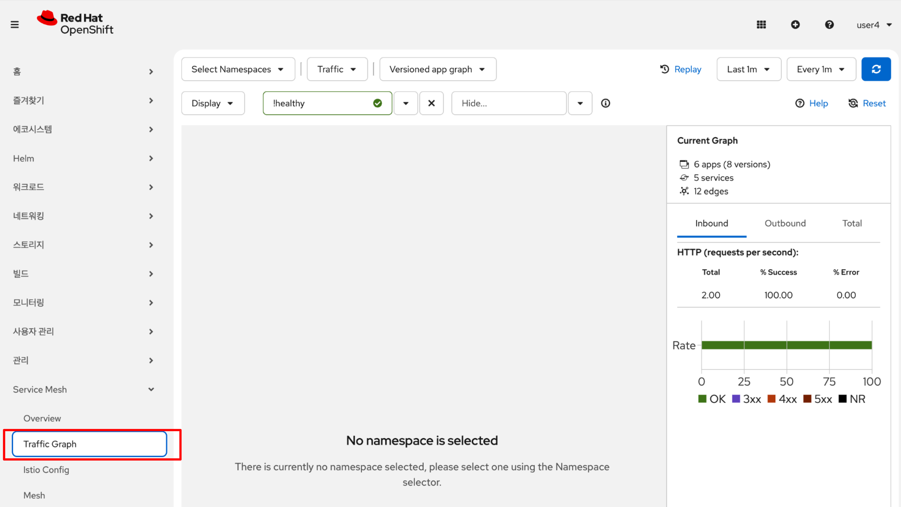

1.3. 그래프 상단의 **Select Namespaces(네임스페이스)** 드롭다운 메뉴를 클릭하고, `%username%-meshobservability-intro` 네임스페이스를 선택하여 그래프에 추가합니다. 그런 다음 텍스트 상자 바깥의 임의의 영역을 클릭하여 필터링 설정을 정격 적용합니다.

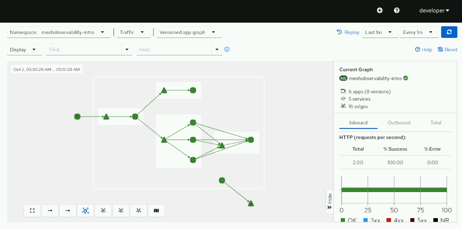

1.4. 상단 그래프 옵션 드롭다운 메뉴에서 그래프 유형을 **Versioned app graph**에서 **Service(서비스) graph**로 변경하고, 범례(Legend) 명세를 점검합니다.

* **Service(서비스) graph의 특성:** 서비스 그래프 유형은 메시에서 가장 간결하고 직관적인 도해를 제공합니다. 해당 토폴로지 상에서 이 애플리케이션의 최상위 주 진입로가 `productpage` 마이크로서비스임을 확인할 수 있습니다.
* `productpage` 서비스는 내부의 다른 두 서비스인 `details` 및 `reviews` 서비스에 동기식으로 의존하고 있습니다. 또한 `reviews` 서비스는 최종적으로 `ratings` 서비스에 전폭 의존하고 있습니다.

토폴로지 그래프 화면 왼쪽 하단에 위치한 **범례 표시 아이콘(Legend display icon)**을 클릭하여 서비스 메시 토폴로지의 범례 사이드 패널을 띄웁니다.

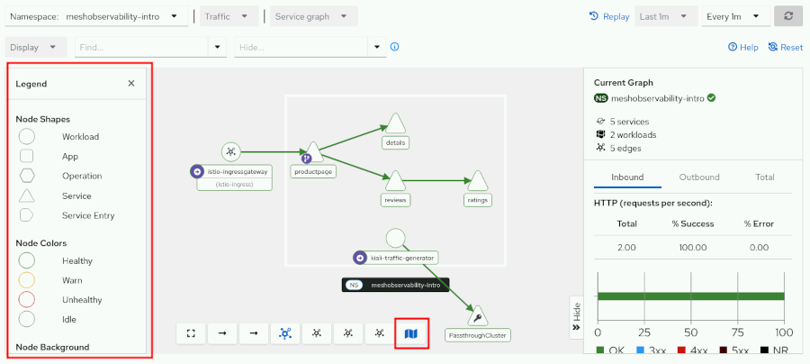

범례 정보를 기반으로 서비스 메시 내에서 사용되는 각 노드의 모형 유형(둥근 사각형, 원형, 삼각형, 평행사변형 등)의 물리 의미와 노드, 간선(Edge), 트래픽 애니메이션 화살표 색상(초록색, 노란색, 빨간색 등)의 기술적 조율 상태를 점검합니다. 현재 기동 중인 Bookinfo 애플리케이션은 모든 노드와 연결선이 온전하고 건강한 청색/초록색(`Healthy`) 상태를 유지하고 있음을 관찰할 수 있습니다.

---

### 2. Bookinfo 애플리케이션에 고의로 오류를 주입하여 상태 전파 과정을 관찰합니다.

2.1. `ratings-v1` 파드의 복제본 수를 0으로 축소 중단(Stop)시켜 Bookinfo 연쇄 서비스 체인망에 인위적 실패 장애를 적용합니다.

오픈시프트 콘솔 왼쪽 메뉴에서 **Workloads > Deployments(배포)** 메뉴로 이동한 뒤, `%username%-meshobservability-intro` 프로젝트가 상단 콤보 박스에 정상 선택되어 있는지 확인합니다. 이후 목록에서 **`ratings-v1`** 디플로이먼트를 클릭합니다.

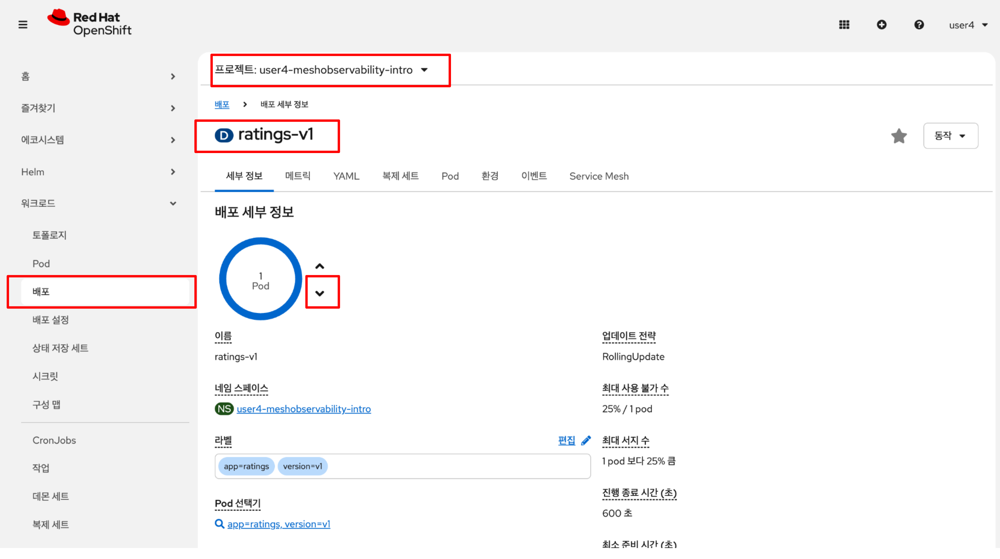

세부 정보 화면의 파드 조율 서클 오른쪽에 위치한 **아래 화살표(down arrow) 버튼**을 눌러 기동 중인 `ratings-v1` 파드의 인스턴스 수(Replicas)를 0개로 강제 축소 정지시킵니다.

2.2. 오픈시프트 콘솔 메뉴의 **Service Mesh > Traffic Graph**로 다시 부드럽게 돌아옵니다. 약 2~3분가량 대기한 다음, 실패 장애가 발생한 특정 노드 및 연쇄 간선들이 빨간색 오류 형태 지표로 전사 전파되는 토폴로지 전경을 정밀 점검합니다.

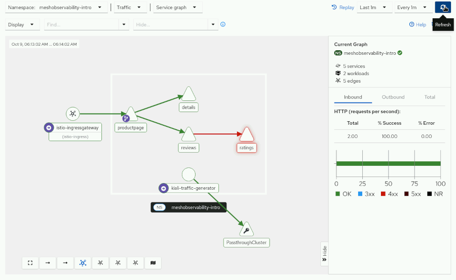

2.3. 서비스 정지 상태가 수 분가량 누적 유지된 것을 확인한 뒤, 상단 갱신 범위 콤보 박스를 **Last 5m** 수준으로 타이트하게 변경합니다. 

선택한 시간 범위 및 단계별 대기 시간에 따라, 서비스 메시의 누적된 메트릭 손실 및 점진적 가동 상태 변화가 어떻게 점진적으로 다른 색상(노란색 및 연한 주황색 Degrading 상태)으로 차트에 누적 표현되는지 실시간 대조해 봅니다.

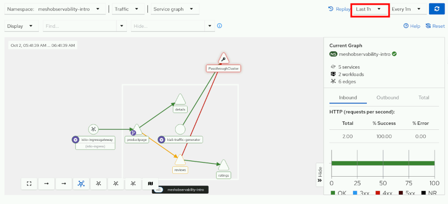

다양한 수집 시간 간격(Last 30m, Last 1h 등)을 자유롭게 변경 대조해 보며 차트 통계 수치의 시각 변화 추이를 체득합니다.

2.4. 비정상 파드 중단 실습을 성료했으므로, 다시 **Workloads > Deployments(배포)** 메뉴의 `ratings-v1` 디플로이먼트로 이동하여 **위 화살표(up arrow) 버튼**을 눌러 파드 복제본 수를 다시 1개로 복구 이륙시킵니다.

---

### 3. 메시 내부의 세부 트래픽 분배 상태 및 상세 성능 메트릭 데이터를 점검합니다.

3.1. **Service Mesh > Traffic Graph** 메뉴로 돌아옵니다.

좌측 상단의 **Display** 콤보 박스 설정 메뉴를 활성화하여, **Traffic Distribution** 및 **Traffic Animation**의 체크 박스를 모두 선택하여 전격 활성화합니다.

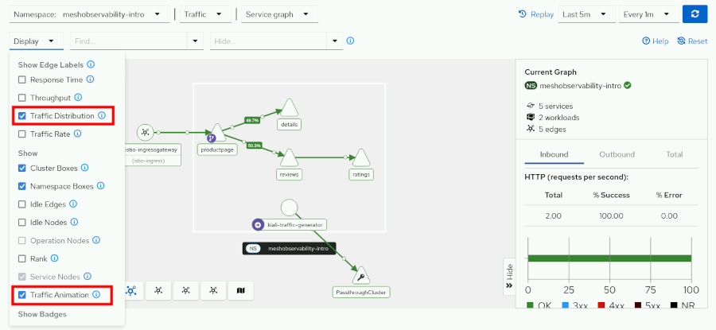

마우스 스크롤 휠을 부드럽게 굴려 토폴로지 줌 레벨을 확대 조율합니다. 화면이 확대됨에 따라 각 간선(Edge) 가닥 위에 흐르는 **실시간 HTTP 트래픽 분배 비율(%)**이 수치 지표로 팝업되는 것을 똑똑히 확인할 수 있습니다.

3.2. 상단의 그래프 유형 종류를 **Service(서비스) graph**에서 **Workload graph**로 격상 정정하고, 세 가지 버전으로 분할 구동 중인 `reviews` 마이크로서비스 워크로드 간의 실시간 트래픽 가중 비율 전사 상태를 점검합니다.

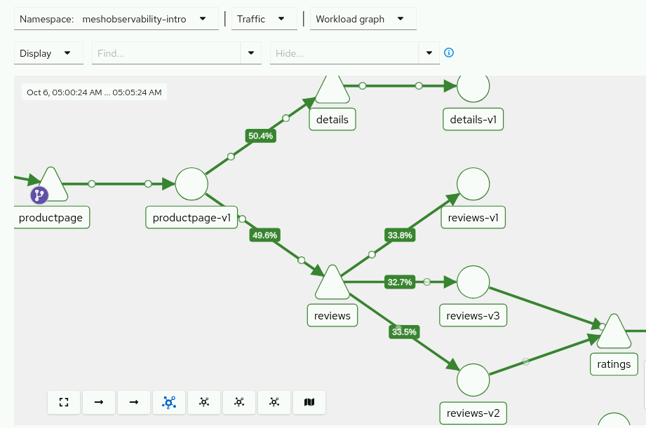

3.3. CPU 자원 소모량이 많은 애니메이션 효과를 정돈하기 위해, **Display** 옵션 메뉴에서 **Traffic Animation**의 체크 박스를 잠시 해제해 둡니다. 이후 메트릭 표시 옵션을 **Response Time > 95th Percentile**로 정격 변경합니다. 이 수치는 전체 유입 요청 중 95% 범위에 속하는 상위 요청들의 실제 대기 반응 지체 시간(SLA 기준 응답 대기 시간)을 직관적으로 증명해 줍니다.

* **Workload graph 분석 포인트:**
  - 워크로드 그래프를 동원하면 메시 내부의 세부 노드들에 직접 유입 접속해 보지 않고도, 각 워크로드 버전별 연결 종속 관계와 성능 격차 원인을 고도로 추론해 낼 수 있습니다.
  - **예시 분석:** 왜 세 가지 `reviews` 워크로드 버전 중 오직 **`reviews-v1`** 노드만이 단연 독보적인 속도로 번개처럼 빠르게 통신을 소화해 낼까요?
  - 그래프 연결 가닥을 면밀히 관찰해 보면, `reviews-v1` 노드는 우측의 `ratings` 서비스 노드와 연결선 가닥이 전혀 수립되어 있지 않음을 알 수 있습니다. 즉, 동기식 백엔드 호출을 가동하지 않는 자급자족 구조이므로 가장 빠른 성능을 고수하는 원리임을 토폴로지가 단번에 입증해 줍니다!
  - 이처럼 그래프 종류에 따라 표현 가능한 메트릭 범위가 다르며, 일반 Service(서비스) graph 유형에서는 버전에 따른 연쇄 레이턴시 지연 수치가 차트 상에 세분화되어 노출되지 않습니다.

3.4. 개별 워크로드 노드가 보유한 세부 성능 데이터를 즉석에서 추출해 봅니다.

토폴로지 맵 상에서 원형으로 표현된 **`productpage-v1`** 워크로드 노드 위에 마우스 커서를 올리고 우클릭(Right-click)을 실행합니다.

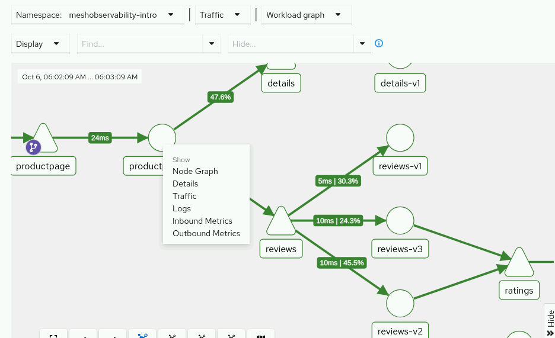

팝업되는 퀵 액션 컨텍스트 메뉴에서 **Details** 버튼을 가볍게 클릭합니다. 클릭 즉시 해당 워크로드 파드가 보유한 쿠버네티스 기동 명세 및 이스티오 전용 **Service Mesh 하위 탭** 상세 대시보드로 브라우저 화면이 즉시 리다이렉트되어 포워딩됩니다. 해당 화면에서 컨테이너 시스템 로그는 물론 수·발신 인바운드/아웃바운드 정밀 통계 수치를 수 마이크로초 단위로 추적 관측할 수 있습니다.

3.5. 개별 서비스 단위의 메트릭 데이터를 점검합니다.

토폴로지 그래프 화면으로 다시 부드럽게 전환한 다음, 이번에는 삼각형 모형으로 시각화된 **`reviews`** 서비스 노드 위에 마우스 커서를 조심스럽게 올리고 우클릭을 감행합니다.

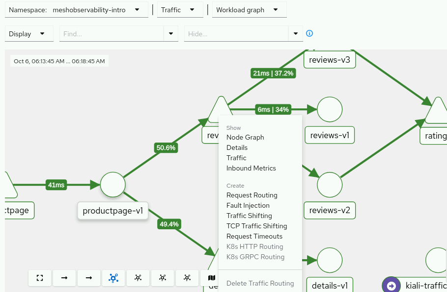

삼각형 서비스 액션 메뉴에는 워크로드 메뉴와 달리, 서비스 가동 정책을 동적 통제 및 주입(Fault Injection 주입, Timeout 주입, Dynamic Routing 분기 주입 등)할 수 있는 이스티오 관리자용 고급 퀵 체인 가동 메뉴가 대거 팝업됩니다. 

이 중에서 **Inbound Metrics(메트릭)** 메뉴 버튼을 가볍게 클릭하여, `reviews` 마이크로서비스로 인입되는 실시간 트래픽 볼륨, 응답 레이턴시 변화 추이, 수·발신 GRPC 패킷량 등의 입체적인 전사 차트 메인 통계 대시보드를 직접 감상 및 확인합니다.

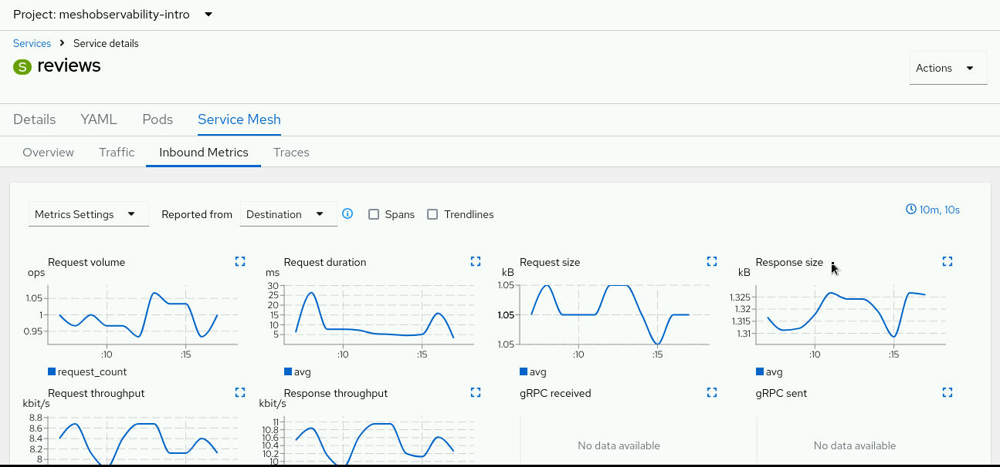

> [!NOTE]
> **참고 (NOTE)**
> 오픈시프트 서비스 메시 통합 콘솔 내부 대시보드들 역시 우측 상단에 시간 범위 선택 및 실시간 주기적 자동 새로고침(Refresh interval) 통제 콤보 필터링 박스를 전격 제공하므로, 실무 관제 시 이를 적절히 셋업하여 사용하십시오.

---

### 4. 외부 독립형 Kiali 콘솔을 통해 서비스 메시 상태를 관제합니다.

오픈시프트 콘솔에 인베딩된 플러그인(OSSMC) 뷰 외에, 외부 가동 중인 단독형 Kiali 대시보드를 전격 기동하여 보다 전문적이고 깊이 있는 옵저버빌리티 기능을 점검해 봅니다.

4.1. 워크스테이션 브라우저 상에서 새로운 임의의 탭을 열고, 아래의 주소 링크로 진입하여 외부 단독형 Kiali 콘솔로 접속합니다:
* **독립 Kiali 접속 주소 URL:** <a href="https://kiali-istio-system.%cluster_subdomain%" target="_blank">https://kiali-istio-system.apps.%cluster_subdomain%</a>

4.2. 로그인 화면이 팝업되면, 클러스터에 지정된 `%username%` 계정명과 `openshift` 비밀번호 정보를 입력하여 정식 접속을 완료합니다.

4.3. 외부 Kiali 콘솔 내부의 메뉴 구성 요소들이 앞서 다룬 오픈시프트 인베딩 콘솔(OSSMC)과 어떻게 완벽한 일란성 쌍둥이처럼 일치하여 상호 연동되고 있는지 직접 탐색 및 보증합니다:
* Kiali의 **Overview** 메뉴 항목은 오픈시프트 콘솔의 **Service Mesh > Overview** 화면과 완벽히 동일합니다.
* Kiali의 **Traffic Graph** 메뉴 항목은 앞서 오랜 시간 탐색한 오픈시프트 **Service Mesh > Traffic Graph** 콘솔과 한치의 어긋남 없이 정합 호환됩니다.
* Kiali의 **Workloads** 및 **Services(서비스)** 항목 역시 오픈시프트 워크로드 디플로이먼트 가동 목록들과 백그라운드로 온전히 실시간 동기화되어 상호 작용합니다.

4.4. 왼쪽 탐색 메뉴 바에서, 오직 독립형 Kiali 단독 콘솔에서만 전문적 분석 도구로 기습 제공하고 오픈시프트 인베딩 플러그인 뷰에서는 보이지 않는 **Applications** 메뉴 버튼을 정격 클릭합니다.

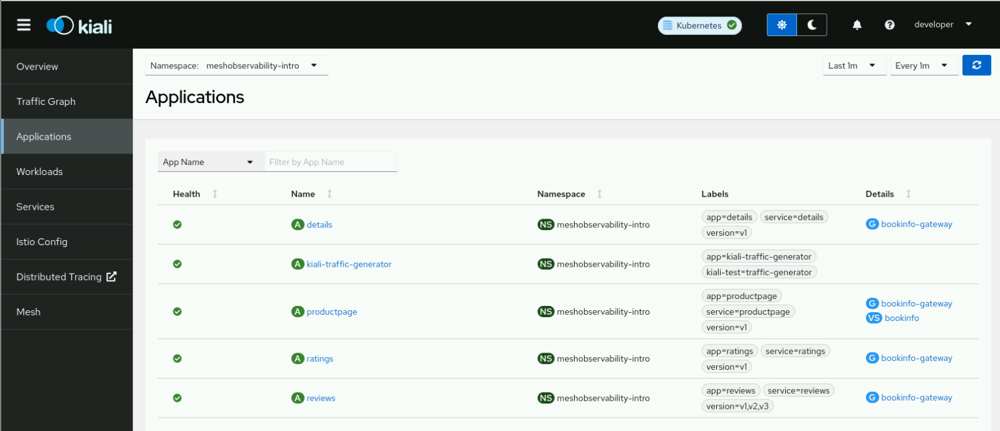

* **Applications 메뉴의 차별적 혜택:**
  - 이 화면에서는 현재 활성화된 가상 서비스(VirtualService(가상 서비스)), 목적지 정책(DestinationRule(대상 규칙)), 게이트웨이(Gateway(게이트웨이)) 등 이스티오 통제 보안 API 리소스들의 전체 선언 상태와 결합 세부 목록들을 한눈에 지도처럼 종합 조망하고, 각 API 리소스 명세의 정합성 유무를 원스톱으로 깊이 있게 디버깅할 수 있습니다.

---

## 실습 완료 (Finish)

워크스테이션 머신에서 다음 명령어를 실행하여 실습을 완전히 정돈하고 종료합니다. 이 정돈 단계는 이전 실습에서 남은 리소스들이 다음 단원에 진행될 실습 환경 구성에 지장을 주거나 간섭하는 일을 미연에 방지하기 위해 매우 중요합니다.

```execute
lab finish meshobservability-intro
```
