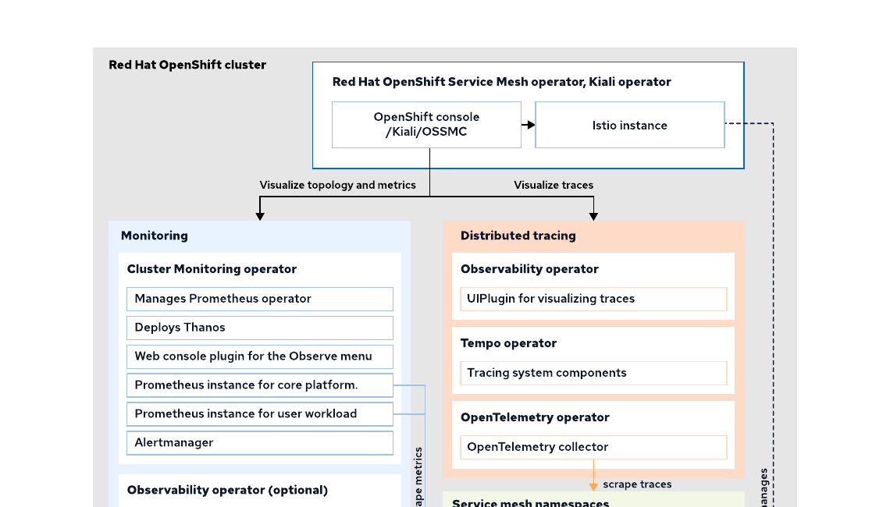
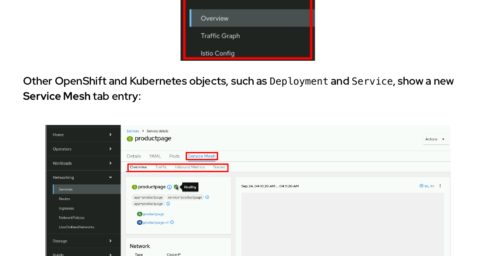
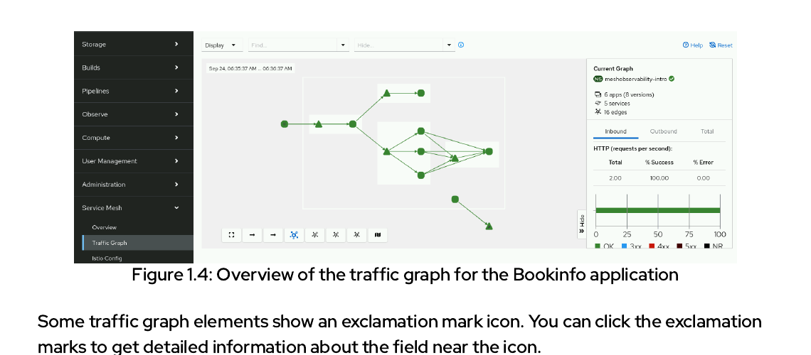
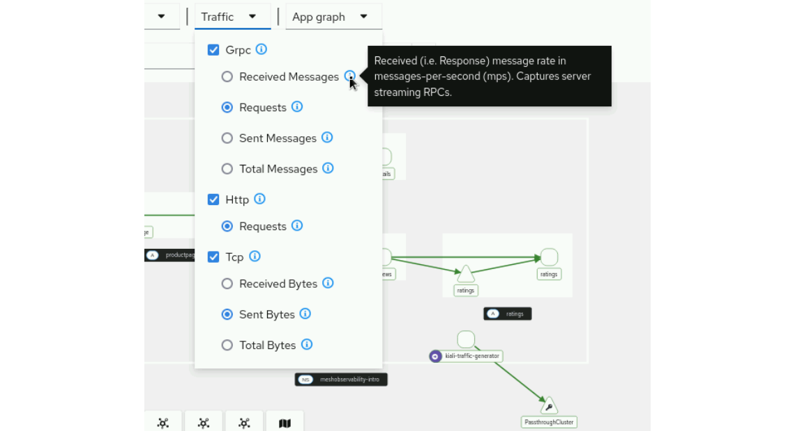
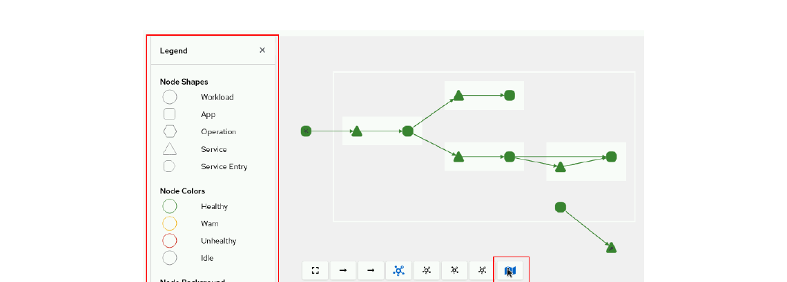
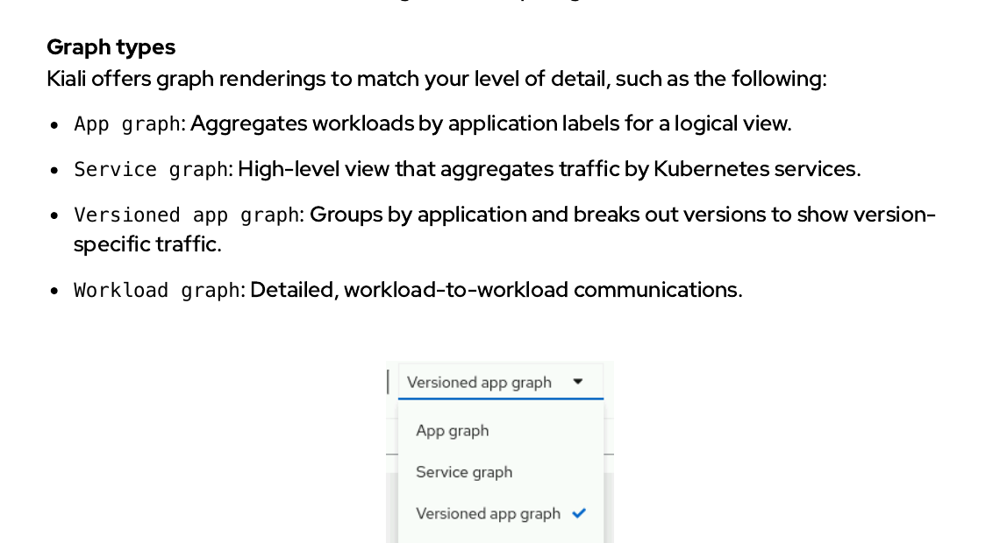
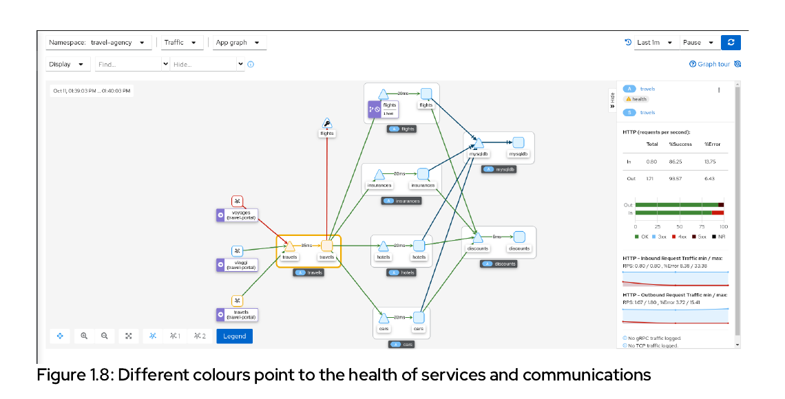
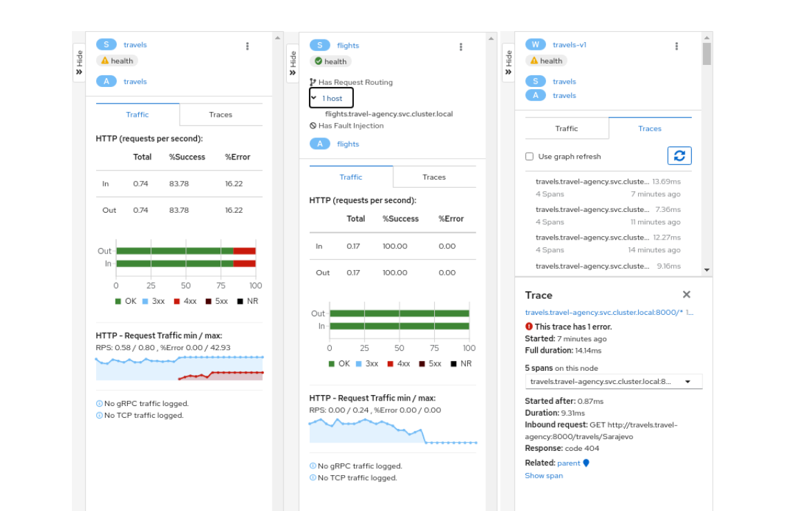
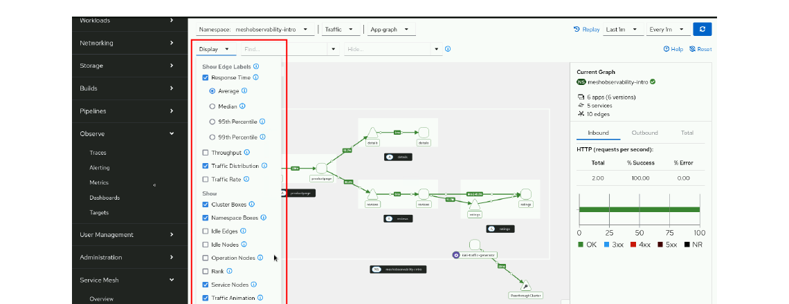
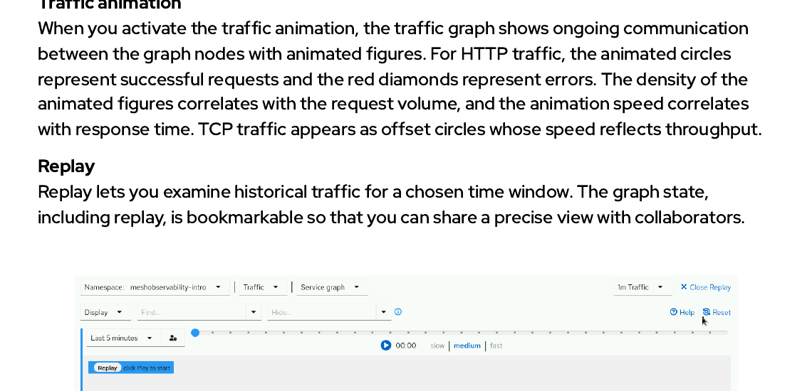

<style>
  h1 { font-size: 24px !important; }
  h2 { font-size: 20px !important; }
  h3 { font-size: 16px !important; }
</style>

<script>
document.addEventListener("DOMContentLoaded", function() {
    var checkAndReplace = function() {
        var walker = document.createTreeWalker(document.body, NodeFilter.SHOW_TEXT, null, false);
        var node;
        while (walker.nextNode()) {
            node = walker.currentNode;
            if (node.nodeValue.includes("api.apps.")) {
                node.nodeValue = node.nodeValue.replace(/api\.apps\./g, "api.");
            }
        }
    };
    checkAndReplace();
    setTimeout(checkAndReplace, 100);
    setTimeout(checkAndReplace, 500);
    setTimeout(checkAndReplace, 1500);
    setTimeout(checkAndReplace, 3000);
});
</script>

# Chapter 1. Observing OpenShift Service Mesh

오픈시프트 서비스 메시 환경 하에서 제공하는 핵심 모니터링 체계와 실시간 서비스 트래픽 가시성 시각화 수립 사상을 학습합니다.

* Introduction to Red Hat OpenShift observability and OpenShift Service Mesh ([/rol/app/courses/ad0007l-3.1/pages/ch01](https://api.cluster-pgx9x.pgx9x.sandbox3385.opentlc.com:6443) <i class="fas fa-external-link-alt"></i>)
* Guided Exercise: Introduction to Red Hat OpenShift observability and OpenShift Service Mesh ([/rol/app/courses/ad0007l-3.1/pages/ch01s02](https://api.cluster-pgx9x.pgx9x.sandbox3385.opentlc.com:6443) <i class="fas fa-external-link-alt"></i>)
* Collecting Service Metrics ([/rol/app/courses/ad0007l-3.1/pages/ch01s03](https://api.cluster-pgx9x.pgx9x.sandbox3385.opentlc.com:6443) <i class="fas fa-external-link-alt"></i>)
* Guided Exercise: Collecting Service Metrics ([/rol/app/courses/ad0007l-3.1/pages/ch01s04](https://api.cluster-pgx9x.pgx9x.sandbox3385.opentlc.com:6443) <i class="fas fa-external-link-alt"></i>)
* Tracing Services With Kiali, Tempo and OpenTelemetry ([/rol/app/courses/ad0007l-3.1/pages/ch01s05](https://api.cluster-pgx9x.pgx9x.sandbox3385.opentlc.com:6443) <i class="fas fa-external-link-alt"></i>)
* Guided Exercise: Tracing Services With Kiali, Tempo and OpenTelemetry ([/rol/app/courses/ad0007l-3.1/pages/ch01s06](https://api.cluster-pgx9x.pgx9x.sandbox3385.opentlc.com:6443) <i class="fas fa-external-link-alt"></i>)
* Lab: Observing OpenShift Service Mesh ([/rol/app/courses/ad0007l-3.1/pages/ch01s07](https://api.cluster-pgx9x.pgx9x.sandbox3385.opentlc.com:6443) <i class="fas fa-external-link-alt"></i>)
* Summary ([/rol/app/courses/ad0007l-3.1/pages/ch01s08](https://api.cluster-pgx9x.pgx9x.sandbox3385.opentlc.com:6443) <i class="fas fa-external-link-alt"></i>)

### 개요 (Abstract)

* **Goal (목표):** Red Hat OpenShift observability를 사용하여 OpenShift Service Mesh를 추적하고 시각화합니다.
* **Sections (섹션):**
  - Introduction to Red Hat OpenShift observability and OpenShift Service Mesh (and Guided Exercise)
  - Collecting Service Metrics (and Guided Exercise)
  - Tracing Services With Kiali, Tempo and OpenTelemetry (and Guided Exercise)
* **Lab (실습):** Observing OpenShift Service Mesh

---

## Introduction to Red Hat OpenShift observability and OpenShift Service Mesh

### 학습 목표 (Objectives)
* 모니터링과 분산 추적에 중점을 두어 옵저버빌리티의 기본 개념을 파악합니다.
* 옵저버빌리티를 위한 OpenShift Service Mesh의 구성 요소와 핵심 기능을 파악합니다.
* 서비스 메시 옵저버빌리티를 위해 OpenShift Service Mesh 콘솔 플러그인과 Kiali 콘솔의 기능을 비교합니다.

---

### Red Hat OpenShift Observability and OpenShift Service Mesh

옵저버빌리티(Observability)는 시스템의 출력(output)과 로그(logs)를 수집 및 분석함으로써 시스템의 상태를 이해하는 능력입니다. Red Hat OpenShift Service Mesh는 Red Hat OpenShift 위에서 구동되며, 오픈시프트에는 항상 옵저버빌리티를 위한 Red Hat OpenShift 기본 도구가 포함되어 있습니다.

Red Hat OpenShift 옵저버빌리티는 실시간 모니터링을 제공하기 위해 로그, 추적(traces), 이벤트 및 시스템 메트릭을 수집합니다.

Red Hat OpenShift 옵저버빌리티 포트폴리오의 주요 기능은 다음과 같습니다:

* **OpenShift Logging:** Red Hat OpenShift Logging은 OpenShift 클러스터의 파드와 노드에서 발생하는 모든 로그를 중앙 위치로 수집 통합합니다. 중앙 집중식 로깅은 데이터의 검색, 시각화 및 리포팅을 개선합니다.
* **Network Observability:** Network observability는 네트워크 트래픽을 모니터링하고 분석하여 연결성 문제를 해결하는 데 도움을 줍니다.

OpenShift Service Mesh에서는 두 가지 OpenShift 옵저버빌리티 기능을 집중적으로 활용합니다:

* **OpenShift Monitoring:** Red Hat OpenShift Monitoring은 플랫폼 핵심 구성 요소와 사용자 프로젝트에 대한 모니터링을 제공합니다. 모니터링을 위한 주요 OpenShift 오퍼레이터는 **`cluster monitoring operator`** 입니다. 이 오퍼레이터는 기본 모니터링 스택의 배포를 관리합니다.

기본 OpenShift 모니터링 스택은 다음 세 가지 구성 요소를 포함하고 있습니다:
* **Prometheus:** 시계열 데이터(time series data) 형태로 메트릭을 수집하고 저장하는 시스템 모니터링 및 경보 툴킷의 구현체입니다. cluster monitoring operator는 Red Hat에서 제공하는 Prometheus 오퍼레이터에 의존합니다.
* **Thanos:** 메트릭 데이터를 집계하고, 메트릭 데이터의 보존 기간을 관리하며, 경보 규칙을 평가하거나 메트릭 조회를 위한 API를 노출하기 위해 Prometheus와 협력하여 작동하는 다양한 구성 요소들의 구현체입니다.
* **Alertmanager:** Prometheus 서버가 발송한 경보를 처리하여 알림 시스템으로 전송하는 역할을 담당합니다.

이 기본 모니터링 스택은 OpenShift 플랫폼 코어 구성 요소들에 대한 옵저버빌리티를 제공합니다. OpenShift 관리자가 사용자 워크로드용 모니터링(user workload monitoring)을 활성화하면, cluster monitoring operator는 Prometheus, Thanos 및 Alertmanager 인스턴스를 포함하는 별도의 사용자 워크로드 전용 모니터링 스택을 생성합니다.

또 다른 옵션으로 **`cluster observability operator`**를 사용하는 방법도 존재합니다. cluster observability operator는 관리자가 여러 서비스와 사용자가 독립적으로 개별 구성하여 사용할 수 있는 독립형 모니터링 스택을 생성할 수 있도록 지원하는 선택적 OpenShift 오퍼레이터입니다. 예를 들어, 메트릭을 기반으로 커스텀 대시보드를 드로잉하기 위해 독립된 그라파나(Grafana) 콘솔이 필요한 경우 반드시 cluster observability operator를 사용해야 합니다. cluster observability operator는 동일한 Kubernetes 커스텀 리소스를 제공하지만 다른 API 버전 주소로 제공합니다. 예를 들어, ServiceMonitor 또는 PodMonitor 리소스에 대해 다음과 같이 서로 다른 두 가지 API 버전 정의가 존재합니다:
* `monitoring.coreos.com/v1`: cluster monitoring operator 가 수송 제어하는 API 버전
* `monitoring.rhobs/v1alpha1`: cluster observability operator 가 통제 수립하는 API 버전

> [!NOTE]
> 본 학습 과정은 기본 모니터링 스택 및 이와 연동되는 사용자 워크로드 모니터링 스택에 초점을 맞추어 진행됩니다. cluster observability operator 활용에 대한 자세한 정보는 참고 자료 섹션을 참조하십시오.

OpenShift Service Mesh는 OpenShift 모니터링 스택을 활용하여 메시 토폴로지를 시각화하고, 트래픽 흐름을 표시하며, 사용자 네임스페이스에서 구동 중인 애플리케이션의 메트릭 정보를 수확하여 서비스의 건전성 상태를 리포팅합니다.

---

### 분산 추적 (Distributed Tracing)

분산 추적(Distributed Tracing)을 사용하면 시스템에 진입한 최초 요청이 소멸할 때까지 통과해 지나가는 모든 다단형 마이크로서비스 노선의 흐름을 실시간 단일 경로로 추적할 수 있습니다. 요청이 처리될 때, 각 서비스는 추적 트레이스에 컨텍스트 정보를 추가로 기록해 매립합니다. 분산 추적 시스템에서는 이 개별 노선 기록 단위를 **스팬(span)**이라고 칭합니다. 단일 요청에 대해 수집 수렴된 스팬 조각들의 총합체가 완전한 하나의 **트레이스(trace)**를 형성하게 됩니다.

분산 추적 시스템은 다음 두 가지 컴포넌트를 사용합니다:
* **OpenTelemetry 프로젝트:** 분산 시스템의 옵저버빌리티 데이터를 수집합니다. OpenTelemetry는 코드 계측을 위한 벤더 중립적 API를 제공하며, 소스 코드 계측을 수행하고 데이터를 백엔드로 안전하게 전송합니다.
* **Grafana Tempo 프로젝트:** 추적 백엔드(tracing back-end) 역할을 주관합니다. Grafana Tempo는 최신 버전의 OpenShift Service Mesh에서 기존의 Jaeger 백엔드를 정식으로 완전히 대체합니다.

분산 추적을 구동하려면 비즈니스 애플리케이션에 수집 코드를 매립 계측(Instrumentation)해야 하지만, OpenShift Service Mesh 데이터 평면은 소스 코드가 완벽히 계측되지 않은 서비스에 대해서도 Envoy 사이드카 프록시 단에서 최초의 추적 스팬 정보를 자동 생성하여 OTel 수집기로 안전 배달해 줍니다. 프록시들은 수집된 추적 정보를 컬렉터로 전달하며, Kiali는 분산 추적 웹 UI로 연결되는 링크 단추와 함께 추적 통계 지표를 대시보드에 투영 전시합니다.

---

## Integrating OpenShift Service Mesh Projects in Default OpenShift Observability

모니터링을 위해 서비스 메시 영역 내부에 사용자 프로젝트 네임스페이스를 통합 편입시키려면, 오픈시프트 클러스터 관리자는 다음 **두 가지 핵심 액션**을 반드시 수행해야 합니다:

### 1. OpenShift 클러스터 상에서 사용자 워크로드 모니터링 활성화
오픈시프트 관리자가 사용자 워크로드 모니터링을 기동하면, cluster monitoring operator가 또 다른 모니터링 스택을 생성합니다. 이 스택은 기존 `openshift-monitoring` 네임스페이스와 완전히 구별되는 전용 공간에서 실행되며, 새로운 Prometheus, Thanos 및 Alertmanager 인스턴스 인스턴스들로 구성됩니다. 이 모니터링 스택을 활용하여 여러분의 서비스들을 위한 관제 모니터를 수립할 수 있습니다.

사용자 워크로드 모니터링을 활성화하기 위해, OpenShift 관리자는 다음과 같은 설정 명세를 가진 `cluster-monitoring-config` 설정 맵을 `openshift-monitoring` 네임스페이스 하위에 새로 생성하거나 수정해야 합니다:

```yaml
apiVersion: v1
kind: ConfigMap
metadata:
  name: cluster-monitoring-config
  namespace: openshift-monitoring
data:
  config.yaml: |
    enableUserWorkload: true
```

이 매개변수가 정상 가동 수립되면, 새로운 사용자 워크로드 전용 모니터링 스택이 **`openshift-user-workload-monitoring`** 네임스페이스 하위에서 자동 기동됩니다.

### 2. 서비스를 포함하고 있는 사용자 프로젝트에 istio-injection=enabled 레이벨 주입
이 레이벨 지표는 이스티오 제어 평면이 해당 네임스페이스 하위의 모든 서비스 파드 배후에 Envoy 프록시가 동반 구동되는 사이드카 컨테이너를 안전하게 자동 삽입하도록 트리거 제어합니다.

클러스터 어드민 계정 토큰을 활용하여 다음 명령을 실행함으로써 네임스페이스 상에 `istio-injection=enabled` 레이벨을 주입할 수 있습니다:

```bash
oc label namespace namespace_name istio-injection=enabled
```

이 일련의 수립 과정 완수를 통해, 사용자 워크로드 전용 프로메테우스 인스턴스가 여러분의 애플리케이션 서비스와 사이드카 주입 완료된 Envoy 프록시 양쪽 경로 모두로부터 메트릭 지표들을 차질 없이 주기 스캐닝 긁어갈 수 있는 활로가 완벽 개설됩니다.

---

## Kiali and the OpenShift Service Mesh Console Plug-in

Kiali는 OpenShift Service Mesh를 위한 모든 옵저버빌리티 서비스와 도구들을 일괄 중앙 집중 제어하며 메시 토폴로지 환경을 미려하게 시각화 전시해 줍니다. Kiali는 오픈소스 Kiali 커뮤니티 프로젝트 성과를 근간으로 삼아 동작하며, Red Hat은 Kiali 서버와 Kiali 콘솔을 배포하기 위한 Kiali 오퍼레이터를 패키지 제공합니다. 아울러 오픈시프트 전용 서비스 메시 콘솔 플러그인(**`OSSMC`**) 기술을 통해 Kiali 웹 관제창 전체를 별도의 도메인 이탈 없이 오픈시프트 전역 통합 관리 콘솔 하부로 직접 무결 마운트 융합 배포해 줍니다.

### 주요 핵심 기능 (Key Capabilities)

Kiali 오퍼레이터는 서비스 메시의 투명 관제를 지원하기 위해 다음과 같은 전사적인 핵심 기능들을 선사합니다:

* **서비스 토폴로지 라이브 가시화 (Service Topology Visualization):**
  Kiali는 분산된 마이크로서비스 간에 트래픽이 교차 소화되는 과정을 실시간 입체 그래프(Topology Graph) 차트로 동적 그려냅니다. 이 그래프 선상을 통해 다음 성능 정보들을 직관 스캐닝할 수 있습니다:
  - 서비스 간의 상호 호출 종속성 및 구조
  - 실시간 트래픽 가중 통계 유량 분배 비율 및 패턴
  - 가상 서비스, 대상 규칙 및 게이트웨이 등의 L7 라우팅 매핑 적용 현황
  - 서킷 브레이커 격발 상태 및 해당 비정상 노드 일시 감금 추방 추이
  - 실시간 L7 요청 속도(RPS) 및 소요 응답 레이턴시 지표
* **L7 설정 자산 통제 관리 (Configuration Management):**
  현재 가동 중인 다음 필수 트래픽 규칙 배포 명세들의 구문 문법 정합성과 셀렉터 충돌 유무를 상시 원격 감사 관리합니다:
  - VirtualService 및 DestinationRule 자산 명세
  - Gateway 인프라 포트 연동 명세
  - 전역 PeerAuthentication 보안 정책
  - 세부 경로 지능형 라우팅 통제 규칙
* **전체 건전성 보증 모니터링 (Observability and Monitoring):**
  - 실시간 가동 메트릭 그래프 및 수치 리포트 제공
  - OpenTelemetry 및 Grafana Tempo 분산 추적 타임라인 차트 연동 표출
  - 각 파드 복제본 단위의 L7 건전성 자동 계산
  - 비정상 병목 지표 감지 및 경보 통제

---

### OpenShift Service Mesh 옵저버빌리티 작동 아키텍처

Kiali 관제 서버와 오픈시프트 전용 웹 콘솔 플러그인(OSSMC)이 배후의 옵저버빌리티 수집기, 시계열 저장소 백엔드 연합과 어떠한 전사 설계 구도로 교차 가동 연대하는지 그 내부 작동 흐름 장부를 정교하게 도해 점검합니다:



#### Kiali 데이터 수집 및 4단계 렌더링 파이프라인 작동 원리:
1. **메트릭 수집 및 덤프 (Data collection):** 오픈시프트 사용자 전용 프로메테우스가 각 파드 옆의 Envoy 프록시와 비즈니스 컨테이너 엔드포인트로부터 주기적으로 L7 성능 메트릭 데이터를 스크래핑해 옵니다. ❶
2. **설정 명세 스캐닝 (Configuration retrieval):** Kiali 관제 서버가 오픈시프트 API 및 이스티오 제어 평면 API를 노크하여, 가상 서비스와 대상 규칙 등의 최신 L7 설정 가용 명세 현형을 수시로 쿼리 수거합니다. ❷
3. **상호 교차 계산 정합 (Data processing):** Kiali 코어 처리 엔진이 수확해 온 원격 프로메테우스 시계열 메트릭 값들과 이스티오 설정 룰들 간의 실제 유동 정합성을 상호 교차 대조 계산하여 단일 종합 데이터로 프로세싱합니다. ❸
4. **대시보드 실시간 렌더링 (Visualization):** 분석 프로세싱이 완료된 무결 관제 데이터를 오픈시프트 전용 서비스 메시 콘솔 플러그인(OSSMC) 인터페이스 단으로 수송 하달하여, 오픈시프트 전역 웹 콘솔 내부 화면 상에 가장 미려하게 라이브 전사 렌더링 팝업시킵니다. ❹

---

### Kiali 커스텀 리소스 (The Kiali Custom Resource)

Red Hat이 공식 배포하는 Kiali 오퍼레이터는 `kiali.io/v1alpha1` 그룹 규격의 **`Kiali`** 커스텀 리소스 설정을 기반으로 웹 관제판의 거동을 셋업 제어합니다. Kiali 인스턴스는 반드시 이스티오 제어 평면이 구동 중인 동일 네임스페이스 하위에 위치해야만 합니다. 만일 단일 클러스터 내에 복수의 독립 서비스 메시 영역이 구동되는 토폴로지 구조 환경이라면, 각 메시 영역마다 Kiali 관제 인스턴스를 하나씩 독립적으로 장착하여 개별 관제할 수 있습니다.

다음 예제 스니핏은 그라파나 및 프로메테우스, 분산 추적 템포 백엔드 정보망을 Kiali 관제 콘솔과 결합 체인화하는 정격 Kiali 커스텀 리소스 명세를 증명합니다:

```yaml
apiVersion: kiali.io/v1alpha1
kind: Kiali
metadata:
  name: kiali
spec:
  istio_namespace: istio-system ❶
  auth:
    strategy: openshift ❷
  deployment:
...output omitted...
  external_services: ❸
    grafana:
...output omitted...
    prometheus:
...output omitted...
    tracing:
...output omitted...
```

❶ Kiali 서버를 설치 구동하고 감시할 이스티오 제어 평면 타깃 네임스페이스를 선언합니다.
❷ Kiali 로그인 인증 단계를 오픈시프트 전역 Oauth 표준 SSO 인증망과 결합하도록 셋업 합니다.
❸ Kiali 관제판이 배후에서 실시간 조회 수렴할 그라파나, 프로메테우스, 템포 등의 원격 시계열 API 주소 정보들을 연대 매핑 기입해 넣습니다.

독립형 Kiali 웹 콘솔의 정식 다이렉트 로그인 주소를 터미널 상에서 즉시 확인하고자 할 때는 다음 `oc` 명세를 실행할 수 있습니다:

```bash
echo "https://$(oc get routes -n project_for_istio_and_kiali kiali -o jsonpath='{.spec.host}')"
```

Kiali 오퍼레이터는 전용 Kiali 콘솔 외에도, 오픈시프트 통합 플러그인인 **OSSMC** 모듈을 기본 내장 제공합니다. 플러그인이 성공적으로 마운트되는 순간, 오픈시프트 웹 관리자 메뉴 최전방 네비게이션 명세 상에 **"Service Mesh"** 라는 고유의 정식 통합 메뉴 카탈로그 입구가 신설 개설됩니다!



---

### Kiali 실시간 트래픽 그래프 뷰의 특징과 세부 활용 방안

오픈시프트 전용 플러그인(OSSMC) 및 Kiali 독립 콘솔이 선사하는 라이브 트래픽 토폴로지 그래프 관제판의 핵심 사용 요령과 세부 정보들을 정독 마스터합니다.

* **최강점:** 복잡하게 뒤엉킨 마이크로서비스 동서 트래픽 간의 호출 디펜던시 관계를 거미줄 실선 토폴로지 양식으로 드로잉하며, 호출 가중치 분배 및 mTLS 상호 보안 열쇠 락(Padlock) 활성화 여부, 병목 임계 지점을 현미경 추적 관제할 수 있습니다.
* **유일한 OSSMC 플러그인의 한계 (IMPORTANT):**
  독립형 Kiali 웹 콘솔과 달리, 오픈시프트 전용 플러그인은 **하나의 웹 브라우저 화면 상에서 동시 단 하나의 서비스 메시(Single Mesh) 영역만을 관제 렌더링**할 수 있는 명확한 스코프 물리 한계를 지닙니다. 여러 메시를 복합 다단으로 구동 중인 대형 클러스터 환경 하에서 전역 연쇄 모니터링을 실현하고자 할 때에는 독립형 Kiali 서버 웹 콘솔 화면으로 우회하여 활용해야만 합니다.



* **콘텍스트 지능형 조조 알람 (Contextual Help):**
  - 토폴로지 상의 특정 통신 에지 실선을 마우스 오버하거나 기입된 느낌표 마크를 클릭하는 순간, 해당 통신 채널에 연동 가동 중인 프로토콜 규격(gRPC, HTTP, TCP 등)과 수발신 트래픽 패킷 크기 정보들이 팝업전시되는 미려한 **콘텍스트 헬프(Contextual Help)** 정보 주머니를 개설해 줍니다.



* **도형 및 선로 레전드표 (Graph Legend):**
  - Kiali는 노드가 감당하는 비즈니스 성질에 따라, 노드 도형의 기하학적 형태(Workload, App, Operation, Service, Service Entry 등)와 테두리 컬러 감도(Green: 정상, Yellow/Orange: 지체 경고, Red: 에러 임계 초과 위험 등)를 다르게 렌더링하여 관제사에게 즉각적인 직관 지표를 하사합니다.



* **그래프 렌더링 세분화 4대 등급 (Graph Types):**
  - **App graph:** 파드들을 단일 논리 앱 지표로 수렴 집계하여, 서비스 간의 비즈니스 논리 구조만을 고도로 심플하게 도해합니다.
  - **Service graph:** 오직 쿠버네티스 서비스(`Service`) 가상 도메인 엔드포인트 노선 간의 패킷 유입 정황만을 단순화해 표출합니다.
  - **Versioned app graph:** 동일 앱에 여러 subset 버전들(예: `reviews v1`, `v2`, `v3`)이 전개되어 있다면, 노드 박스를 여러 개로 분할 전개하여 카나리 가중 배정 상태를 미세 대조할 수 있도록 배려해 줍니다.
  - **Workload graph:** 실제 처리 파드 인스턴스 장비들 간의 워크로드 대 워크로드 물리 다이렉트 통신 정황을 가장 세밀하게 디테일 현미경 렌더링해 줍니다.



* **입체 컬러 매칭 경보 (Different Colours):**
  - 노드와 에지 선로의 색상 등급은 실시간 갱신되어, 에러 덤프 유출선은 선명한 주황색이나 위험 천만한 적색 실선으로 동적 드로잉됩니다. 데이터 갱신은 수초 단위로 자동 새로고침 기동 되며, 특정 과거 시점을 정지(Pause) 하여 정지 분석할 수도 있습니다.



* **사이드 패널 및 세부 정보 드릴 다운 (Node Detail Drill-down):**
  - 토폴로지 상의 특정 마이크로서비스 노드 상자를 **마우스 더블클릭** 하는 순간, 해당 노드의 순수 소관 통신 통계만 현미경 렌더링하는 전용 **디테일 드릴 다운(Node Detail Graph) 관제판**으로 즉각 탐크 탐험 우회 이동할 수 있습니다.
  - 노드를 원클릭하면 우측에 개설 팝업되는 **사이드 패널(Side panel)** 하단에 L7 동시 처리량 그래프, 응답 상태 비율 코드표, 연동 OTel 분산 추적 링크 목록 정보들이 정밀 수렴 전시됩니다.



* **디스플레이 메뉴 오버레이 (Menu Display):**
  - 상단 **Display** 드롭다운 옵션을 조정하면 비즈니스 본질에 영향을 주지 않는 무슨 시각 보조 필터(통신 애니메이션 기포 렌더링, mTLS 자물쇠 락 표출, 인위적 장애 카오스 마커 오버레이 등)들을 유연하게 활성/차단할 수 있습니다.



* **타임 리플레이 (Replay):**
  - **Replay** 기동 단추를 누르는 순간, 화면 하단에 가상의 미디어 비디오 재생 바(Play/Pause) 인터페이스가 탑재되며, 이미 흘러간 과거 기 특정 혼잡 장애 시점의 트래픽 유동 패킷 흐름을 실제 영화 필름을 재생해 보듯이 똑같이 백그라운드로 동적 재실행(Replay) 분석해 볼 수 있는 최고의 포렌식 분석력을 선사합니다!



---

### 연관 기술 참고 자료 (REFERENCES)

* [OpenShift Container Platform: Monitoring documentation](https://docs.redhat.com/en/documentation/openshift_container_platform/4.18/html-single/monitoring/index) <i class="fas fa-external-link-alt"></i>
* [OpenShift Container Platform: Granting users permissions for monitoring for user-defined projects](https://docs.redhat.com/en/documentation/openshift_container_platform/4.18/html-single/monitoring/index#granting-users-permission-to-monitor-user-defined-projects_preparing-to-configure-the-monitoring-stack-uwm) <i class="fas fa-external-link-alt"></i>
* [OpenShift Service Mesh: Metrics and Service Mesh chapter](https://docs.redhat.com/en/documentation/red_hat_openshift_service_mesh/3.1/html-single/observability/index#metrics-and-service-mesh) <i class="fas fa-external-link-alt"></i>
* [prom-client: Prometheus client for Node.js](https://github.com/siimon/prom-client) <i class="fas fa-external-link-alt"></i>
* [Micrometer Metrics: Quarkus Guide](https://quarkus.io/guides/micrometer) <i class="fas fa-external-link-alt"></i>
* [OpenTelemetry: Quarkus Guide](https://quarkus.io/guides/opentelemetry) <i class="fas fa-external-link-alt"></i>
* [Red Hat Developers: How Quarkus works with OpenTelemetry on OpenShift](https://developers.redhat.com/articles/2025/07/07/how-quarkus-works-opentelemetry-openshift) <i class="fas fa-external-link-alt"></i>
* [Red Hat Customer Portal: How to use Prometheus Query Language (PromQL) in OpenShift](https://access.redhat.com/articles/7067755) <i class="fas fa-external-link-alt"></i>
