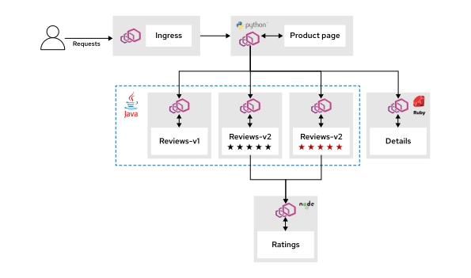

<style>
  h1 { font-size: 24px !important; }
  h2 { font-size: 20px !important; }
  h3 { font-size: 16px !important; }
</style>

<script>
document.addEventListener("DOMContentLoaded", function() {
    var checkAndReplace = function() {
        var walker = document.createTreeWalker(document.body, NodeFilter.SHOW_TEXT, null, false);
        var node;
        while (walker.nextNode()) {
            node = walker.currentNode;
            if (node.nodeValue.includes("api.apps.")) {
                node.nodeValue = node.nodeValue.replace(/api\.apps\./g, "api.");
            }
        }
    };
    checkAndReplace();
    setTimeout(checkAndReplace, 100);
    setTimeout(checkAndReplace, 500);
    setTimeout(checkAndReplace, 1500);
    setTimeout(checkAndReplace, 3000);
});
</script>

# 모듈 4.2: Tempo & OpenTelemetry 분산 추적 (Tracing Services(서비스) With Kiali, Tempo and OpenTelemetry)

오픈시프트 서비스 메시의 고급 옵저버빌리티 요소인 분산 추적(Distributed Tracing) 기능을 학습합니다. Kiali 트래픽 그래프를 통해 전체 트래픽 흐름을 분석하고, Red Hat OpenShift 웹 콘솔 내부의 모니터링 메뉴와 Tempo Stack, OpenTelemetry 수집기를 완벽하게 결합하여 분산되어 구동 중인 마이크로서비스 간의 연쇄 지연 및 통신 병목 현상을 깊이 추적하고 검증합니다.

## 결과 (Outcomes)
* Red Hat OpenShift 콘솔을 활용하여 서비스 메시 트래픽 토폴로지를 실시간으로 시각화합니다.
* 애플리케이션 수집 메트릭을 분석하고 이를 분산 추적(Distributed Traces(추적)) 데이터와 유기적으로 대조 연동합니다.
* 다수의 마이크로서비스 간의 세부 분산 트레이스 명세를 해독하여 트래픽 상호 작용 지표 및 전사적 가동 성능을 파악합니다.

워크스테이션 머신의 사용자 터미널에서 아래의 `lab` 명령어를 실행하여 본 실습을 위한 환경을 준비하고, 모든 필요한 리소스들이 가용하게 전개되었는지 검증 및 보장합니다:

```execute
lab start meshobservability-tracing
```

또한, 다음 명령어를 실행하여 `$PATH` 변수를 업데이트하고 `traffic_gen.py` 명령어를 즉시 사용할 수 있도록 설정합니다. 새 환경을 생성한 후 한 번만 실행하면 됩니다.

```execute
source ~/.bashrc
```

이 실습에서는 OpenShift Service Mesh 콘솔 플러그인(OSSMC)이 탑재된 오픈시프트 웹 콘솔을 활용하여 분산 추적 옵저버빌리티 기능을 정밀 탐구합니다. 본 실습에 사용되는 Bookinfo 애플리케이션은 다음 마이크로서비스들로 구성되어 있습니다:
* **productpage:** 내부의 `details` 및 `reviews` 서비스를 호출하여 화면을 구성합니다.
* **details:** 책의 세부 정보를 보존하고 있습니다.
* **reviews:** 책의 리뷰 정보를 보존하고 있습니다. 내부적으로 `ratings` 서비스를 동기식으로 다시 호출하며, 다음 세 버전이 분할 전개됩니다:
  - `reviews-v1`: 내부 `ratings` 서비스를 호출하지 않습니다.
  - `reviews-v2`: 내부 `ratings` 서비스를 동기식으로 호출하며, 1~5점짜리 검은색 별점으로 레이팅을 표출합니다.
  - `reviews-v3`: 내부 `ratings` 서비스를 동기식으로 호출하며, 1~5점짜리 빨간색 별점으로 레이팅을 표출합니다.
* **ratings:** 책 리뷰에 수반될 평점 점수 정보를 보존하고 있습니다.



Bookinfo 애플리케이션은 Envoy 사이드카 프록시가 완벽히 주입된 상태로 `%username%-meshobservability-tracing` 네임스페이스 하위에 기동을 개시합니다. 동적 트래픽 제너레이터가 백그라운드에서 실시간 원격 메트릭과 원격 수집(Telemetry) 추적용 가중 트래픽 데이터를 지속 인입시킬 것입니다.

---

## 지침 (Instructions)

### 1. OpenShift 클러스터에 접속하여 Bookinfo 애플리케이션의 배포 상태를 검증합니다.

1.1. 새로운 터미널 창에서 `%username%` 사용자와 `openshift` 비밀번호를 사용하여 OpenShift 클러스터에 로그인한 다음, `%username%-meshobservability-tracing` 프로젝트로 전환합니다:

```execute
oc login -u %username% -p openshift https://api.%cluster_subdomain%:6443
```

* **로그인 수행 완료 로그:**

```bash
The server uses a certificate signed by an unknown authority.
Use insecure connections? (y/n): y

WARNING: Using insecure TLS client config. Setting this option is not supported!

Logged into "https://api.%cluster_subdomain%:6443" as "%username%" using the password provided.

You have access to 78 projects.
Using project "default".
```

```execute
oc project %username%-meshobservability-tracing
```

* **프로젝트 이동 결과 로그:**

```bash
Now using project "%username%-meshobservability-tracing" on server "https://api.%cluster_subdomain%:6443".
```

1.2. `%username%-meshobservability-tracing` 네임스페이스 하위에 파드들이 정상 Running 중인지 검증합니다.

```execute
oc get pods
```

```bash
NAME                                            READY   STATUS    RESTARTS   AGE
details-v1-5c4b4b459f-rs9fv                     2/2     Running   0          15m
kiali-traffic-generator-r56xm                   2/2     Running   0          15m
productpage-v1-6b7fcb56b-dk8f6                  2/2     Running   0          15m
ratings-v1-7b76484f47-th2nk                     2/2     Running   0          15m
reviews-v1-f8bd69dff-s9lxj                      2/2     Running   0          15m
reviews-v2-64df7bdcbf-k2dfl                     2/2     Running   0          15m
reviews-v3-5bf99fd74c-b2z26                     2/2     Running   0          15m
```

모든 파드는 `READY` 열에 `2/2` 가용 상태를 보장해야 하며, 이는 애플리케이션 컨테이너 본체와 이스티오 Envoy 사이드카 프록시가 모두 완벽하고 기민하게 작동하고 있음을 나타냅니다. `kiali-traffic-generator` 파드는 메트릭 및 트레이스 데이터를 축적하기 위해 `productpage` 서비스를 향해 고가용 트래픽을 지속 주입하는 역할을 주관합니다.

---

### 2. OpenShift 웹 콘솔에 액세스합니다.

2.1. 브라우저에서 아래 제공해 드리는 정식 웹 콘솔 접속 주소 링크를 전격 클릭합니다:
* **웹 콘솔 진입 URL:** <a href="https://console-openshift-console.%cluster_subdomain%" target="_blank">https://console-openshift-console.%cluster_subdomain%</a>
* 진입 후 `htpasswd_provider`를 클릭하고, `%username%` 계정명과 `openshift` 비밀번호를 입력하여 접속을 성료합니다.

---

### 3. Traffic Graph를 통해 서비스 메시 토폴로지를 관제하고 세부 분산 트레이스 명세를 추적합니다.

3.1. 관리자 뷰의 탐색 창 왼쪽 메뉴바에서, **Service Mesh > Traffic Graph** 메뉴를 클릭합니다.

3.2. 화면 최상단 네임스페이스 선택 콤보 박스에서, 반드시 `%username%-meshobservability-tracing` 프로젝트만 단독 기입하여 적용합니다. 우측 상단의 수집 메트릭 갱신 기간 드롭다운 메뉴는 기본 1분에서 한층 정교한 데이터 수집 이력을 표출하기 위해 **Last 5m**으로 정정해 줍니다.


일부 서비스 노드나 간선 연결 구간이 초반에 노란색 경고 색상으로 팝업될 수 있으며, 이는 각 마이크로서비스가 최초 구동될 때 짧은 레이턴시 유실 혹은 미열림 구간이 존재했음을 의미하는 전개 현상입니다.

3.3. 서비스 메시 토폴로지 전경을 부드럽게 감상하십시오. 차트에는 Bookinfo 마이크로서비스들을 지탱하는 고유의 원형/삼각형 노드들이 유입 트래픽 화살표 방향과 함께 매우 입체적으로 자동 전개되어 작동합니다.

> [!NOTE]
> **참고 (NOTE)**
> 실제 클러스터 상태에 따라 그래프 전경은 조금씩 다르게 나타날 수 있습니다. 실시간 트래픽 양을 늘리기 위해 `traffic_gen.py`를 가동하거나 브라우저 주소를 연속 타격해 메트릭 밀도를 증강하셔도 무방합니다.

3.4. 트래픽 분배 상태를 정밀 관측하기 위해, 왼쪽 아래 **Display** 설정 콤보 박스에서 아래 3가지 옵션을 모두 전격 체크 활성화합니다:
* **Response Time** (응답 반응 속도)
* **Traffic Distribution** (트래픽 분배 비율 %)
* **Traffic Animation** (트래픽 화살표 애니메이션)

마우스 스크롤 휠을 부드럽게 줌인 확대해 봅니다. 확대에 따라 각 연결선 가닥 위에 세부 응답 밀도 및 세 가지 reviews 버전(`v1`, `v2`, `v3`)으로 트래픽 부하가 균등 배포되고 있는 기하학적 균형 상태를 직접 감수할 수 있습니다.


3.5. 토폴로지 한가운데에 위치한 `productpage` 삼각형 서비스 노드를 마우스 왼쪽 클릭합니다. 클릭 즉시 우측에 해당 서비스의 요약 관제 대시보드 사이드 패널이 팝업됩니다. 해당 우측 사이드 패널 내에서 **Traces(추적)** 탭 메뉴를 클릭합니다.


표출되는 분산 트레이스 목록들을 상세히 살펴보십시오. 이 중에서 어떤 트레이스는 수발신 통신 깊이가 7개 단계(**7 spans**)로 이루어져 있는 반면, 어떤 트레이스들은 9개 단계(**9 spans**)로 길게 연쇄 작동하고 있음을 관찰할 수 있습니다.

3.6. 9개 미만(예: 7 spans)의 단계로 소화 완료된 비교적 짧은 트레이스 데이터 중 임의의 항목 하나를 선택해 마우스 클릭합니다.


클릭하는 즉시, Kiali 토폴로지 차트 전경이 이 7 spans 요청이 실제 흘러간 마이크로서비스 경로들(예: productpage ➡️ reviews-v1 ➡️ ratings 패스는 타지 않음!)에만 **초록색 하이라이트 발광 라인**을 입히고 나머지 노드들은 어둡게 음영(Blur) 처리하는 환상적인 특정 요청 전용 시각화 관제를 전개해 줍니다!

또한, 우측 패널에는 이 7 spans 트레이스의 정확한 마이크로초 단위 반응 기수 정보와 응답 200 OK 코드, 부모-자식 의존 분산 트리 전경이 직관적으로 팝업됩니다. 확인 후 요약 패널 하단의 닫기(X) 버튼을 부드럽게 닫아 줍니다.


> [!NOTE]
> **참고 (NOTE)**
> 사용자 실습 타이밍에 따라 트레이스 명세 수치들은 다르게 나타날 수 있습니다. Kiali 상의 자물쇠 및 추적 지표가 원활히 연동되는지 체크하십시오.

3.7. 이번에는 가장 연쇄 호출 깊이가 깊은 **9 spans**짜리 분산 트레이스 항목 중 하나를 전격 선택해 봅니다.


---

### 4. 고의 지연 장애를 동반한 분산 추적 시나리오를 심층 검수합니다.

이 단계에서는 `ratings` 마이크로서비스 진입 구간에 고의로 인위적 지연을 적용하여, 분산 추적 시스템이 시스템 내부의 지체 지점을 어떻게 감지하고 입체적으로 리포팅해 내는지 실전 트러블슈팅 과정을 점검합니다.

4.1. 워크스테이션 터미널 상에서 `ratings-fault-injection.yaml` 파일 명세를 검토합니다.

```execute
cd ~/labs/meshobservability-tracing
```

```execute
cat rating-fault-injection.yaml
```

```bash
apiVersion: networking.istio.io/v1
kind: VirtualService
metadata:
  name: ratings-faults-vs
  namespace: meshobservability-tracing
spec:
  hosts:
  - ratings.meshobservability-tracing.svc.cluster.local ❷
  http:
  - fault: ❸
      delay:
        fixedDelay: 3s ❹
        percentage:
          value: 50 ❺
    route:
    - destination:
        host: ratings.meshobservability-tracing.svc.cluster.local
        weight: 100
```

❶ 지연 장애 적용을 위한 가상 서비스 리소스 생성을 선언합니다.<br/>
❷ 가상 서비스를 적용받을 타깃 ratings 도메인 식별 주소를 기입합니다.<br/>
❸ 장애 주입(fault) 속성을 선언합니다.<br/>
❹ 고정 지연 시간 임계치를 무려 3초(3s)로 고의 연장 주입합니다.<br/>
❺ 지연을 주입받을 유입 요청 비율을 동적으로 50%로 통제합니다.<br/>

4.2. 장애가 포함된 가상 서비스 규칙을 클러스터에 정식 배포합니다.

```execute
oc apply -f rating-fault-injection.yaml
```

```bash
virtualservice.networking.istio.io/ratings-faults-vs created
```

*적용 완료 후, 3초 지연에 따른 슬로우 다운(Slowdown) 경고 메트릭이 클러스터에 원활히 퍼지고 누적 반영될 수 있도록 **약 5분에서 6분가량** 차분히 터미널 뒤에서 대기해 줍니다.*


4.3. 트래픽 애니메이션이 노란색으로 누적 지체 응답을 표출하고, 에러 유입 구간은 빨간색으로 표출되는 고유 전경을 관찰합니다.

실시간 통계 수치 변화 추이를 더욱 긴 주기로 확장 관제하기 위해 상단 필터에서 **Last 30m** 혹은 **Last 1h**를 지정하고, 삼각형 모양의 **`reviews`** 서비스 노드를 마우스 클릭한 뒤 우측 패널의 **Traces(추적)** 탭 버튼을 클릭합니다.


사이드바 대시보드가 `reviews` 서비스 노드에 유기적으로 기여한 요청 트레이스 명세들을 수집해 정밀 요약해 줍니다. 이 트레이스 리스트는 오직 `reviews` 마이크로서비스가 직·간접적으로 참여한 트레이스들만을 깔끔히 교차 수집하여 제공해 주는 혁신적인 서비스 중심 뷰(Service(서비스)-centric view) 역할을 선사합니다.

4.4. 이 중에서 가동 시간이 **2.0s를 훨씬 초과(예: 2.53s)하여 심각한 성능 저하**를 일으킨 특정 비정상 트레이스 중 하나를 클릭해 봅니다. 우측의 요약 패널에 해당 트레이스의 디테일 정보가 다음과 같이 정밀 팝업됩니다:


4.5. 지체 원인을 파악하기 위해, 우측 패널 세부 정보 카드 창에서 화면을 아래로 부드럽게 스크롤 하여 맨 아래 파란색 앵커 글씨인 **`Show span`** 링크를 가볍게 클릭합니다.

오픈시프트 콘솔 대시보드가 이 분산 트레이스의 진짜 마이크로 트리 상세 정보를 파싱 해내며, 해당 `reviews` 서비스 세부 정보의 **Traces(추적)** 메인 분산 탭 화면으로 우리를 리다이렉트 포워딩 시켜 줍니다.


4.6. 에러가 감지되거나 지연이 유발된 특정 상세 슬롯(Span)을 정밀 관독해 봅니다.

트레이스 챠트 정보 하단의 **Span Details** 데이터 테이블 목록으로 마우스를 스크롤 다운 합니다. 목록에 수 밀리초만에 응답을 소화한 건강한 스팬들이 나타나는 반면, 구동 지연 및 에러 기호가 우측에 새겨진 비정상 스팬 하나가 시선을 잡게 됩니다. 이 비정상 스팬의 오른쪽에 기입된 **컨텍스트 오버플로우 메뉴 버튼(세로 삼점 버튼 ➿)**을 부드럽게 누르고 **`Logs`** 메뉴를 클릭합니다.


만약 선택한 트레이스 내부 상에 실패가 발생한 스팬이 여러 개 누적 매립되어 있다면, 리스트 최하위에 위치한 최종 단추 스팬(가장 깊숙한 백엔드 측 ratings 에러 단추)을 클릭하여 점검합니다.

클릭 시 `reviews` 마이크로서비스 파드 내부 컨테이너 로그가 새 창으로 정밀 팝업되며, reviews가 ratings에 연결하려다 동기식 지연 대기를 이기지 못하고 타임아웃 종료를 뿜어낸 소스 코드 줄 예외 명세인 **`java.net.SocketTimeoutException`** 연쇄 에러의 근원적 단서를 속 시원히 파악해 낼 수 있게 됩니다.

---


## 실습 완료 (Finish)

워크스테이션 머신에서 다음 명령어를 실행하여 실습을 완전히 정돈하고 종료합니다. 이 정돈 단계는 이전 실습에서 남은 리소스들이 다음 단원에 진행될 실습 환경 구성에 지장을 주거나 간섭하는 일을 미연에 방지하기 위해 매우 중요합니다.

```execute
lab finish meshobservability-tracing
```
