<style>
  h1 { font-size: 24px !important; }
  h2 { font-size: 20px !important; }
  h3 { font-size: 16px !important; }
</style>

<script>
document.addEventListener("DOMContentLoaded", function() {
    var checkAndReplace = function() {
        var walker = document.createTreeWalker(document.body, NodeFilter.SHOW_TEXT, null, false);
        var node;
        while (walker.nextNode()) {
            node = walker.currentNode;
            if (node.nodeValue.includes("api.apps.")) {
                node.nodeValue = node.nodeValue.replace(/api\.apps\./g, "api.");
            }
        }
    };
    checkAndReplace();
    setTimeout(checkAndReplace, 100);
    setTimeout(checkAndReplace, 500);
    setTimeout(checkAndReplace, 1500);
    setTimeout(checkAndReplace, 3000);
});
</script>

# 모듈 4.2: Tempo & OpenTelemetry 분산 추적 (Tracing Services With Kiali, Tempo and OpenTelemetry)

오픈시프트 서비스 메시의 고급 옵저버빌리티 요소인 분산 추적(Distributed Tracing) 기능을 학습합니다. Kiali 트래픽 그래프를 통해 전체 트래픽 흐름을 분석하고, Red Hat OpenShift 웹 콘솔 내부의 모니터링 메뉴와 Tempo Stack, OpenTelemetry 수집기를 완벽하게 결합하여 분산되어 구동 중인 마이크로서비스 간의 연쇄 지연 및 통신 병목 현상을 깊이 추적하고 검증합니다.

## 결과 (Outcomes)
* Red Hat OpenShift 콘솔을 활용하여 서비스 메시 트래픽 토폴로지를 실시간으로 시각화합니다.
* 애플리케이션 수집 메트릭을 분석하고 이를 분산 추적(Distributed Traces) 데이터와 유기적으로 대조 연동합니다.
* 다수의 마이크로서비스 간의 세부 분산 트레이스 명세를 해독하여 트래픽 상호 작용 지표 및 전사적 가동 성능을 파악합니다.

워크스테이션 머신의 사용자 터미널에서 아래의 `lab` 명령어를 실행하여 본 실습을 위한 환경을 준비하고, 모든 필요한 리소스들이 가용하게 전개되었는지 검증 및 보장합니다:

```execute
lab start meshobservability-tracing
```

또한, 다음 명령어를 실행하여 `$PATH` 변수를 업데이트하고 `traffic_gen.py` 명령어를 즉시 사용할 수 있도록 설정합니다. 새 환경을 생성한 후 한 번만 실행하면 됩니다.

```execute
source ~/.bashrc
```

이 실습에서는 OpenShift Service Mesh 콘솔 플러그인(OSSMC)이 탑재된 오픈시프트 웹 콘솔을 활용하여 분산 추적 옵저버빌리티 기능을 정밀 탐구합니다. 본 실습에 사용되는 Bookinfo 애플리케이션은 다음 마이크로서비스들로 구성되어 있습니다:
* **productpage:** 내부의 `details` 및 `reviews` 서비스를 호출하여 화면을 구성합니다.
* **details:** 책의 세부 정보를 보존하고 있습니다.
* **reviews:** 책의 리뷰 정보를 보존하고 있습니다. 내부적으로 `ratings` 서비스를 동기식으로 다시 호출하며, 다음 세 버전이 분할 전개됩니다:
  - `reviews-v1`: 내부 `ratings` 서비스를 호출하지 않습니다.
  - `reviews-v2`: 내부 `ratings` 서비스를 동기식으로 호출하며, 1~5점짜리 검은색 별점으로 레이팅을 표출합니다.
  - `reviews-v3`: 내부 `ratings` 서비스를 동기식으로 호출하며, 1~5점짜리 빨간색 별점으로 레이팅을 표출합니다.
* **ratings:** 책 리뷰에 수반될 평점 점수 정보를 보존하고 있습니다.

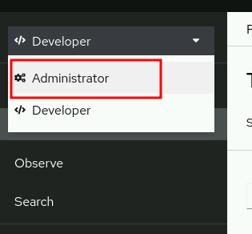

Bookinfo 애플리케이션은 Envoy 사이드카 프록시가 완벽히 주입된 상태로 `%username%-meshobservability-tracing` 네임스페이스 하위에 기동을 개시합니다. 동적 트래픽 제너레이터가 백그라운드에서 실시간 원격 메트릭과 원격 수집(Telemetry) 추적용 가중 트래픽 데이터를 지속 인입시킬 것입니다.

---

## 지침 (Instructions)

### 1. OpenShift 클러스터에 접속하여 Bookinfo 애플리케이션의 배포 상태를 검증합니다.

1.1. 새로운 터미널 창에서 `%username%` 사용자와 `openshift` 비밀번호를 사용하여 OpenShift 클러스터에 로그인한 다음, `%username%-meshobservability-tracing` 프로젝트로 전환합니다:

```execute
oc login -u %username% -p openshift https://api.%cluster_subdomain%:6443
```

* **로그인 수행 완료 로그:**
```bash
The server uses a certificate signed by an unknown authority.
Use insecure connections? (y/n): y

WARNING: Using insecure TLS client config. Setting this option is not supported!

Logged into "https://api.%cluster_subdomain%:6443" as "%username%" using the password provided.

You have access to 78 projects.
Using project "default".
```

```execute
oc project %username%-meshobservability-tracing
```

* **프로젝트 이동 결과 로그:**
```bash
Now using project "%username%-meshobservability-tracing" on server "https://api.%cluster_subdomain%:6443".
```

1.2. `%username%-meshobservability-tracing` 네임스페이스 하위에 파드들이 정상 Running 중인지 검증합니다.

```execute
oc get pods
```

```bash
NAME                                            READY   STATUS    RESTARTS   AGE
details-v1-5c4b4b459f-rs9fv                     2/2     Running   0          15m
kiali-traffic-generator-r56xm                   2/2     Running   0          15m
productpage-v1-6b7fcb56b-dk8f6                  2/2     Running   0          15m
ratings-v1-7b76484f47-th2nk                     2/2     Running   0          15m
reviews-v1-f8bd69dff-s9lxj                      2/2     Running   0          15m
reviews-v2-64df7bdcbf-k2dfl                     2/2     Running   0          15m
reviews-v3-5bf99fd74c-b2z26                     2/2     Running   0          15m
```

모든 파드는 `READY` 열에 `2/2` 가용 상태를 보장해야 하며, 이는 애플리케이션 컨테이너 본체와 이스티오 Envoy 사이드카 프록시가 모두 완벽하고 기민하게 작동하고 있음을 나타냅니다. `kiali-traffic-generator` 파드는 메트릭 및 트레이스 데이터를 축적하기 위해 `productpage` 서비스를 향해 고가용 트래픽을 지속 주입하는 역할을 주관합니다.

---

### 2. Access the OpenShift web console.

2.1. In the workstation machine, open the OpenShift web console in your browser.
Go to https://console-openshift-console.apps.ocp4.example.com, click htpasswd_provider. Use developer as the user and the password.

2.2. Change to the Administrator perspective.
The first time your developer user accesses the OpenShift console you see the Developer perspective. If prompted about the guided tour, then click Skip tour and change to the Administrator perspective.

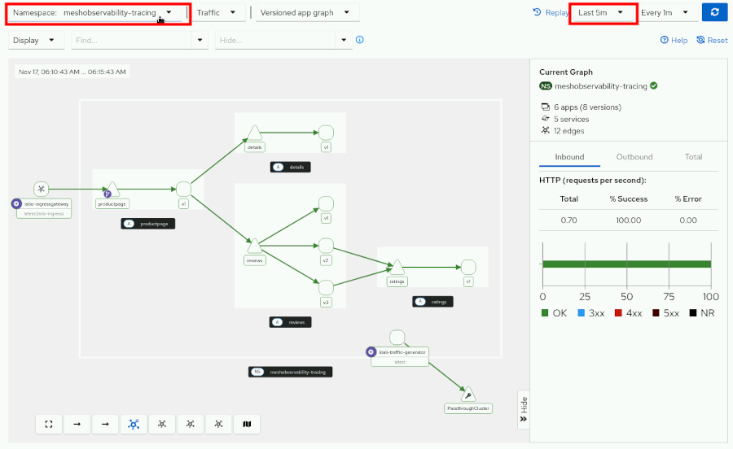

---

### 3. Explore the service mesh topology with the traffic graph, and inspect specific traces.

3.1. In the OpenShift web console, go to the Service Mesh → Traffic Graph.

3.2. Configure the Graph view to show the meshobservability-tracing namespace:
In the namespace selector at the top of the page, ensure that you select meshobservability-tracing.
The time range selector usually shows Last 1m. Ensure that you select a sufficient time range to see traffic data. Select Last 5m.

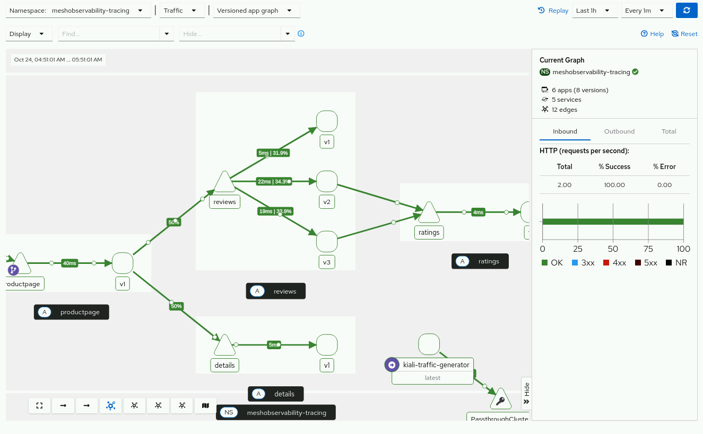

The graph can show yellow edges and nodes because during the start of the different services there were moments when they were unavailable.

3.3. Observe the service mesh topology:
The graph shows nodes representing the services in the BookInfo application and edges representing the traffic flow between them.

3.4. Enable display options to visualize traffic distribution:
In the Display settings, enable the following display options:
* Response Time
* Traffic Distribution
* Traffic Animation

Use the scroll wheel on your mouse to increase the zoom level. When you increase the zoom level, the percentage of HTTP traffic on each edge is shown. The traffic distribution shows approximately equal distribution across the three versions of the reviews service.

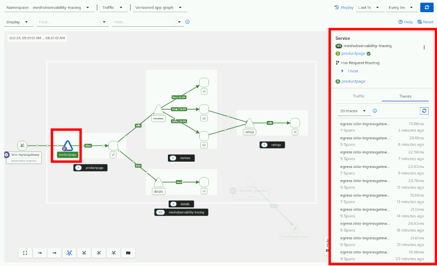

3.5. Click the productpage triangle that represents the service.
Then, in the right side panel, click the Traces tab.

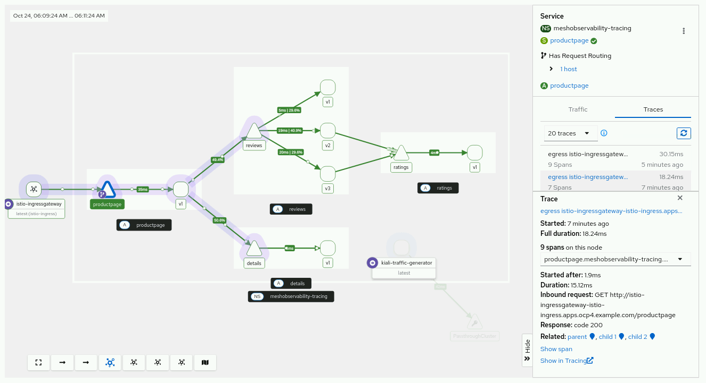

Note that there are some traces with seven spans and others with nine spans.

3.6. Click one of the traces with less than nine spans.

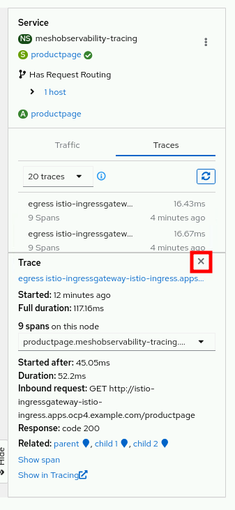

The traffic graph shows the flow of the traffic in that specific trace. Furthermore, a panel with all the information of that specific trace shows in the right side panel. Click the close button of that panel.

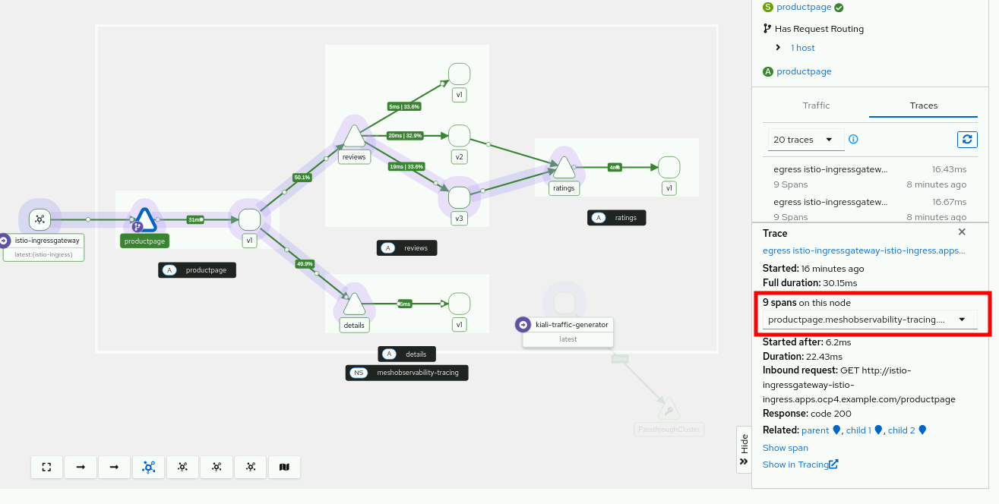

3.7. Click one of the nine spans traces.
The traffic graph shows the traffic flow that reaches the ratings service. Note that the panel with the trace information enables you to select each of the spans composing the trace, to see all the details.

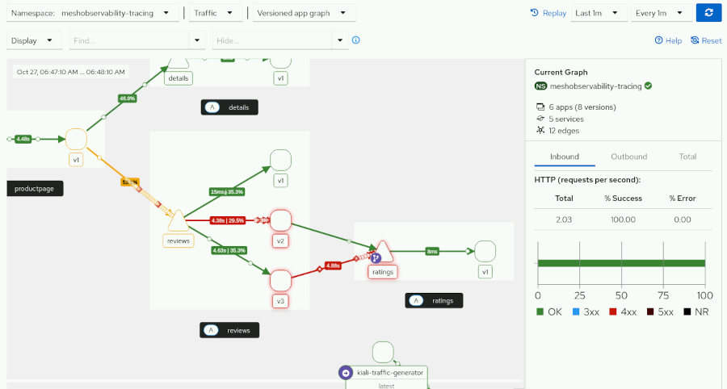

---

### 4. Inspect distributed traces from the traffic graph.

4.1. In the workstation terminal, inspect the rating-fault-injection.yaml file to generate errors in the mesh.
Change to the ~/course/labs/meshobservability-tracing directory, and read the file:

[student@workstation ~]$ cd ~/course/labs/meshobservability-tracing
[student@workstation meshobservability-tracing]$ cat rating-fault-injection.yaml
```yaml
apiVersion: networking.istio.io/v1
kind: VirtualService ❶
metadata:
 name: ratings-faults-vs
 namespace: meshobservability-tracing
spec:
 hosts:
 - ratings.meshobservability-tracing.svc.cluster.local ❷
 http:
 - fault: ❸
     delay:
       fixedDelay: 3s ❹
       percentage:
         value: 50 ❺
   route:
   - destination:
       host: ratings.meshobservability-tracing.svc.cluster.local
     weight: 100
```

❶ Creation of a virtual service to inject faults.
❷ Host that applies the virtual service.
❸ Type of HTTP traffic modification.
❹ Delay applied to requests.
❺ Percentage of requests that have the delay.

4.2. Apply the virtual service with the fault injection.

[student@workstation meshobservability-tracing]$ oc apply -f rating-fault-injection.yaml
virtualservice.networking.istio.io/ratings-faults-vs created

Wait for five or six minutes to see the traffic graph showing degraded services and edges.

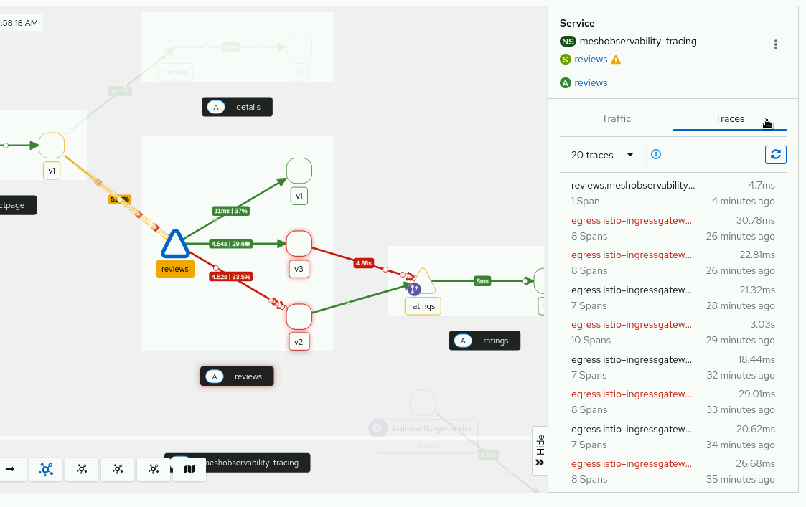

4.3. Locate spans with degradation, or errors.
The traffic animation shows degraded time responses in yellow, and errors in red.
Change the time range to ten or thirty minutes to get a larger list of spans, and then click the reviews triangle that represents the reviews service.
Then, click the Traces tab in the right side panel.

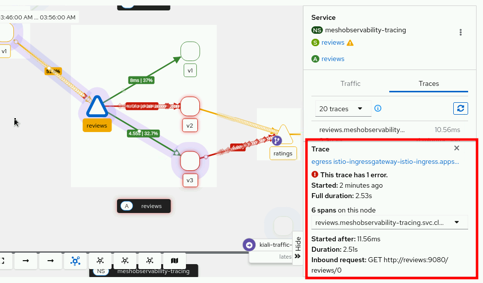

The Traces shows a list of traces that involve the reviews service, filtered from the overall trace data.

4.4. Click one of the traces that spends more than two seconds to inspect its details.
The right side panel shows another panel with the details of the trace:

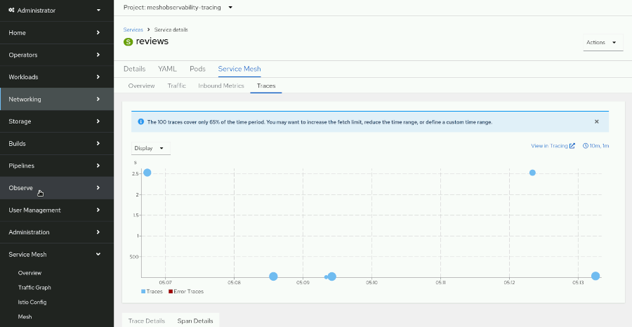

4.5. In the details of the trace in the right side panel scroll down and click Show span.
The Traces tab within the Service Mesh tab, which is present in the OpenShift services view, opens.

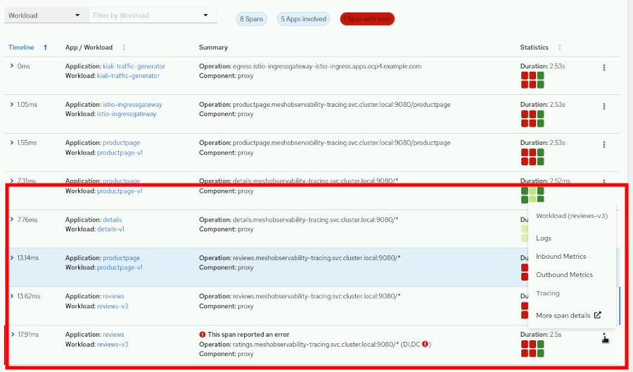

4.6. Inspect the failing span to find the errors in the logs.
Scroll down to see the Span Details table. There is one span with errors. Click the overflow menu of the span, and click Logs.

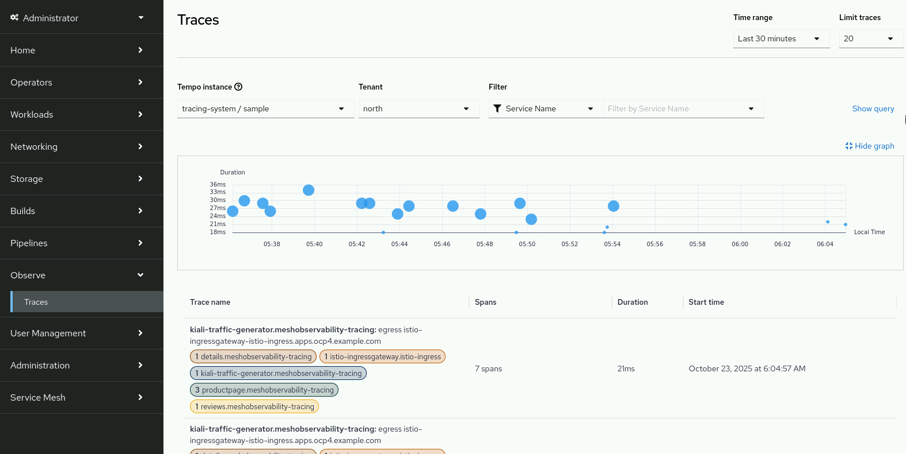

If your selected trace has more than one failing span, then choose the one at the bottom of the list.
The logs view for the reviews service pod opens showing the container log that emitted the error. In this case you see java.net.SocketTimeoutException exceptions when trying to connect to the ratings service.

---

### 5. Inspect distributed traces in the OpenShift console observe section.

5.1. Access the Observe menu:
Ensure that you are in the Administrator perspective. From the left navigation menu, click Observe → Traces.
In the Tempo instance dropdown at the top, select tracing-system/sample. Leave the north tenant selected.

5.2. Review the Traces view:
The traces view shows a list of distributed traces collected from the BookInfo application.

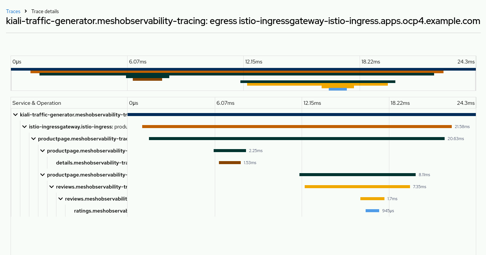

5.3. Examine the trace list:
All the traces start on the traffic generator component. Review the information shown for each trace:
* Trace name: Includes services involved in the trace
* Spans: Number of spans in the trace
* Duration: Total time for the request to complete
* Start Time: When the request was initiated

Look for traces with longer durations.

5.4. Select and analyze a trace:
Click the name of one of the traces in the list to view its details. The trace detail view opens, showing a timeline visualization of the trace spans.

 (참고: 교재 원장 상에서 본 Figure 1.56은 이전 차트의 이미지가 중복 출력되어 인쇄되어 있는 사양입니다.)

5.5. Analyze the trace structure:
Observe the flow of the request through the BookInfo application:
The trace starts with a span for the incoming request from the traffic generator to productpage. You should see child spans showing calls from productpage to:
* details service
* reviews service: one of v1, v2, or v3.

If the trace hit reviews-v2 or reviews-v3, then you should see an additional span showing the call from reviews to the ratings service. Note whether these calls happen in parallel or sequentially, and which services contribute most to the total response time.
Note that the span hierarchy shows the parent-child relationship. For example, the productpage span is the parent, and the details and reviews spans are children of the productpage span.

---

## 실습 완료 (Finish)

On the workstation machine, use the lab command to complete this exercise. This step is important to ensure that resources from previous exercises do not impact upcoming exercises.

```execute
lab finish meshobservability-tracing
```
