

# 모듈 4.2: 분산 추적(Distributed Tracing) 개념 (Tracing Services with Kiali, Tempo and OpenTelemetry)

오픈시프트 서비스 메시 환경 하에서 분산 추적(Distributed Tracing)의 정수 아키텍처와 트레이스(Traces), 스팬(Spans), 그리고 분산 트랜잭션 전파(Context Propagation) 체계를 면밀히 조명합니다. 이를 통해 이기종 분산 시스템에서 발생하는 레이턴시 병목 현상과 심층적 트래픽 병목 지점을 추적 색출하는 설계 기법을 체득합니다.

## 학습 목표 (Objectives)
* 트레이스(Traces), 스팬(Spans), 트레이스 컨텍스트 전파(Trace Context Propagation)를 포함한 분산 추적의 동작 개념을 명쾌하게 설명합니다.
* 오픈시프트 서비스 메시 내부에 구동 중인 분산 추적 핵심 자산 3인방인 OpenTelemetry, Grafana Tempo, Kiali 간의 상호 작용 구조를 정합 규명합니다.
* 자동화된 수집(Automatic Instrumentation) 방식과 코드 단에서의 수동 계측(Manual Instrumentation) 옵션 간의 설계적 트레이드 오프를 식별합니다.
* 오픈시프트 웹 콘솔 상에서 제공하는 트래픽 토폴로지 그래프, 전역 Observe 메뉴, 그리고 워크로드 상세 내의 Service Mesh 탭 등 3대 관제 인터페이스의 장단점을 정밀 비교 분석합니다.

---

## 1. 분산 추적(Distributed Tracing)의 개념과 필요성

분산 추적은 하나의 사용자 동작(Request)이 배후의 무수히 많은 마이크로서비스 노드들을 통과해 나갈 때, 해당 **분산 트랜잭션의 실시간 실행 경로와 성능 수치를 정밀 기록하고 추적**하는 고도의 옵저버빌리티 엔지니어링 프로세스입니다.

* **비분산 환경의 한계:**
  대형 분산 시스템에서 성능 지체 병목이 터졌을 때, 개별 마이크로서비스 파드의 단순 디버깅 디버그 로그 장부만을 낱개 검수하는 고전적 방식으로는 어느 특정 노드 간의 통신 구간에서 지체가 시작되었는지, 연쇄 실패가 어디서 격발되었는지 물리 규명하는 것이 완전히 불가능합니다.
* **분산 추적의 기여:**
  개발자로 하여금 다단형 마이크로서비스 호출 시퀀스 흐름도를 시각적 타임라인 선상 위에 투명 렌더링해 줌으로써, 레이턴시 병목 지점(Latency Bottlenecks)과 오류 발생 근원지를 픽셀 단위로 정확하게 파악해 낼 수 있게 해줍니다.

아래 도해는 분산 추적 장치가 장착되지 않았을 때의 암흑 상태 통신 맵과, 분산 추적이 활성화되어 모든 호출 선로가 투명한 실선 연결로 복원된 영롱한 관제 뷰포트 상태를 극적으로 대조 증명해 줍니다:

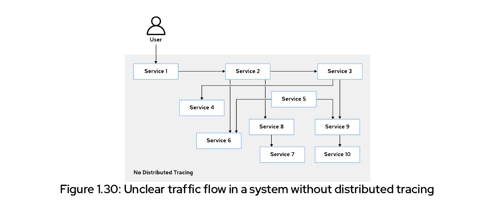

---

## 2. 분산 추적을 지탱하는 핵심 개념: Spans와 Traces

분산 추적을 완전히 장악하기 위해 반드시 마스터해야 할 핵심 개념 2종을 정독 학습합니다.

### ① Span (스팬) - 기본 작업 단위
스팬은 호출 처리 흐름에서 분할되는 **논리적인 최소 단발성 작업 단위(Logical Unit of Work)**를 대변합니다.
* 고유의 식별 명칭(name), 작업 시작 시간(Start Time), 소요 지속 시간(Duration) 지표를 소지합니다.
* 서비스 메시 하위에서 일어나는 서비스 간 호출 흐름들은 정교하게 중첩 수립된 이 스팬(Nested Spans)들의 계층 결합 형태로 모사됩니다.

### ② Trace (트레이스) - 호출 실행 경로의 총합
트레이스는 사용자 진입 요청 1건을 무사히 소화하기 위해 유기적으로 연쇄 트리거 된 **모든 개별 스팬(Span) 복합 자산들의 완전한 물리 실행 경로 총합 장부**입니다.

가령 다음과 같이 여러 다단 컴포넌트들(`A` ➔ `B` ➔ `C, D`, `A` ➔ `E`)로 결합 설계된 애플리케이션의 호출 경로 구조가 전개되어 구동 중이라고 가정해 보겠습니다:

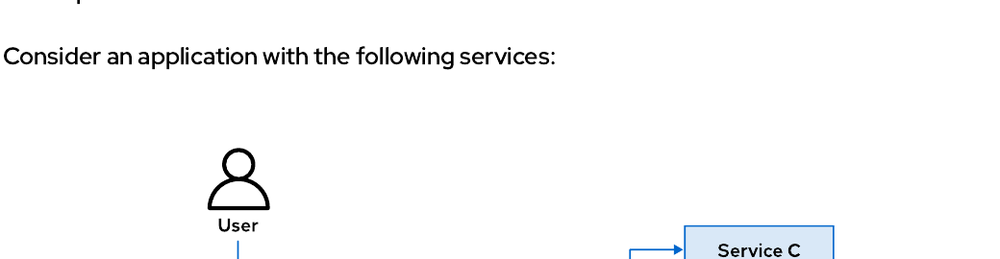

* **호출 계층 분할 예시:**
  - `Service A`가 요청 최전방 진입 통로이므로, 전체의 우두머리 기둥이 되는 **`부모 스팬 (Parent Span / Span A)`** 역할을 맡습니다.
  - `Service A`가 하위의 `Service B`와 `Service E`를 동적 노크하므로, 이 두 작업 단위는 `Span A` 지배 하위의 **`자식 스팬 (Child Spans / Span B, Span E)`** 격으로 분류 매핑됩니다.
  - 뒤이어 `Service B` 역시 응답을 회신받기 전에 하위의 `Service C`와 `Service D`를 정격 호출하므로, 이 두 단발 작업 역시 `Span B` 배후 하위의 **`자식 스팬`**으로 계층 각인됩니다.

아래의 실선 스택 차트는 위 다단형 호출 명세를 타임라인 축 상에 스팬들의 중첩 계층 바(Horizontal Bars) 그래픽 양식으로 입체 렌더링한 실제 추적 관제 뷰포트 형상입니다:

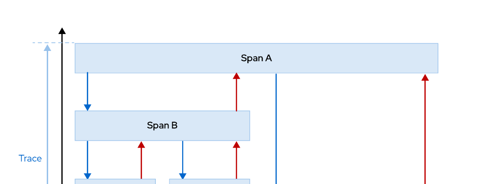

---

## 3. Red Hat OpenShift 분산 추적 삼각 편대 아키텍처

오픈시프트 서비스 메시 3.0은 전역 클러스터 관제와 분산 추적 수립을 달성하기 위해, 업계 표준이자 최선진 오픈소스 옵저버빌리티 포트폴리오 3종 세트를 지능적으로 상호 결합 연대 가동합니다:

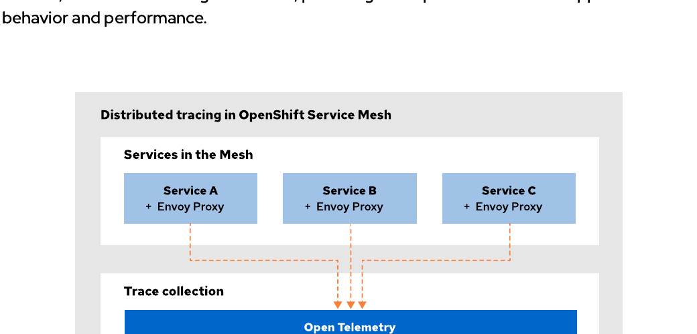

### ① OpenTelemetry (OTel) - 수집 및 전송 사령탑
각 파드 옆의 Envoy 프록시들로부터 흘러나오는 미세 스팬 텔레메트리 데이터를 정밀 수집하고, W3C 표준 규격에 부합하도록 정렬 가공하여 배후 분산 추적 저장소로 패킷을 수송 전송합니다.

### ② Grafana Tempo - 분산 추적 메인 데이터베이스 (Jaeger 완전 대체)
오픈시프트 서비스 메시 3.0 전역 분산 추적 데이터 저장을 전담하는 클라우드 네이티브 초고속 시계열 저장 서버 장비입니다. OTel 수집기들로부터 전송받은 원격 트레이스 정보를 인덱싱 축적 보관하며, Kiali가 쿼리를 던졌을 때 즉각 밀리초 단위로 결과 패킷을 뽑아내 주는 든든한 백엔드 창고 역할을 수행합니다.

### ③ Kiali (OSSMC 플러그인) - 시각화 전사 제어 UI
수집 및 저장 완료된 배후의 템포 시계열 원장들을 쿼리 조회하여, 사용자가 보기 좋게 대시보드 토폴로지 맵 선상 위에 영롱한 추적 실선 그래프로 그려내고, 스팬 타임라인 계층 바 양식으로 시각 렌더링해 주는 메인 사용자 뷰포트 인터페이스 장치입니다.

---

## 4. 분산 추적 계측 가이드: 자동 계측 vs 수동 계측

애플리케이션에 분산 추적 수집 필터를 이식하는 전산 공학 기법은 크게 2가지 수단으로 대조 셋업됩니다:

### ① 자동 계측 (Automatic Instrumentation / Zero-code)
* **기동 본질:** 비즈니스 소스 코드를 단 한 글자도 수정하지 않고, 런타임 에이전트나 프레임워크 확장 플러그인(Java Quarkus의 `quarkus-opentelemetry` 라이브러리, Node.js의 `@opentelemetry/auto-instrumentations-node` 패키지 등)을 주입 장착하여 default 가동하는 초정밀 자동 수집 방식입니다.
* **장점:** 매우 손쉽고 빠른 전사 도입 속도를 보장하며, HTTP 통신 수준의 표준 L7 인아웃 바운드 트랜잭션 수치 전체를 오차 없이 자동 덤프 획득합니다.
* **한계:** 오직 프록시와 프레임워크 겉면 네트워크 경계선 정보만 수집하므로, 마이크로서비스 내부 비즈니스 로직(가령 내부 DB 쿼리 소요 지연, 특정 연산 루프 속도 등) 세부 정보까지 파고들지는 못합니다.

### ② 수동 계측 (Manual Instrumentation)
* **기동 본질:** OpenTelemetry API를 애플리케이션 소스 코드 속에 수동 기입 매립하여, 커스텀 스팬(`tracer.startActiveSpan(...)`)을 임의 개설하고 개발자가 보고자 하는 전용 비즈니스 컨텍스트 속성 키들을 한 땀 한 땀 주입하는 심층 계측 방식입니다.
* **장점:** 마이크로서비스 백엔드 내부의 순수 알고리즘 영역 및 커스텀 트랜잭션 성능을 깊숙이 현미경 모니터링할 수 있어 극치의 병목 원인 포렌식이 가능해집니다.
* **한계:** 코드 오타 및 수정 비용 소모가 크며, 반드시 스팬 생성 직후 수동 클로즈(`span.end()`) 구문을 누락 없이 보장해 주어야만 통신 패킷 메모리 유실 폭사를 막을 수 있습니다.

---

## 5. 트레이스 컨텍스트 전파 (Trace Context Propagation)의 중요성

분산 추적 수립 시 가장 빈번히 유발되는 치명적 실수가 바로 **`컨텍스트 전파(Context Propagation)`** 누설 누락 필터 오류입니다.

* **전파 메커니즘의 정의:**
  - 메시 내부의 서비스 A가 서비스 B를 호출할 때, 이스티오 프록시 단에서 발급해 준 고유의 추적 ID 정보들을 HTTP 요청 헤더 패킷(W3C 표준 헤더인 **`traceparent`** 및 **`tracestate`** 지표!) 하위에 곱게 실어 전달 전파해야 합니다.
  - 이 헤더들이 무사히 다음 단계로 배달 이송되어야만, 수신측 마이크로서비스 프록시가 해당 ID를 상속받아 동일 트레이스 계층 바의 자식 스팬 격으로 예쁘게 결합해 줍니다.
* **개발자 주의점 (헤더 전달 의무):**
  - **Envoy 사이드카 프록시는 네트워크 경계선 외부 전파는 자동 처리해 주지만, 마이크로서비스 "내부 비즈니스 코드 단"에서 다른 하위 마이크로서비스로 아웃바운드 HTTP 요청을 전송해 내보낼 때 기존에 인입받았던 헤더 값들을 다음 요청 헤더에 직접 복사 바인딩 이송시켜 주는 처리는 자동화해주지 못합니다!**
  - 그러므로 개발자는 수동 기입 처리를 동원해서라도 인입 수신된 `traceparent` 쿠키 헤더값들을 하위 아웃바운드 REST 클라이언트 헤더 주머니 명세 상에 반드시 실어 내보내는 **헤더 포워딩(Header Forwarding) 로직을 소스 코드 내에 무조건 탑재 보장**해 주어야만 파국적 추적 단절(Disconnected Traces) 현상을 미연에 완벽 방어할 수 있습니다!

현재 우리 메시 환경이 Zipkin 호환용 B3 포맷 헤더(`x-b3-traceid` 등)를 사용하는 중인지, 아니면 최신 표준 OpenTelemetry 규격인 W3C 포맷 헤더(`traceparent` 등)를 추종하는 중인지는 이스티오 전역 설정 맵의 `extensionProviders` 명세를 스캐닝함으로써 즉시 명령검증할 수 있습니다:

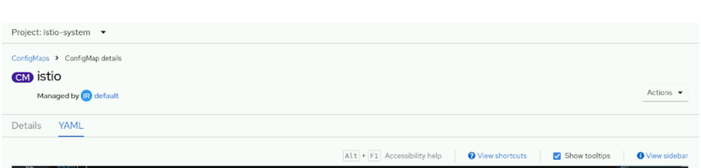

---

## 6. 오픈시프트 3대 분산 추적 관제 인터페이스 입체 분석

관제사가 상황별로 골라 가동할 수 있는 오픈시프트 웹 UI 상의 **3대 분산 추적 관제 필터 채널**의 장단점과 primary use cases를 정밀 비교 도해합니다.

### ① 채널 A: Kiali 트래픽 토폴로지 연동 채널 (Topology-based)
* **진입로:** `Service Mesh` ➔ `Traffic Graph` 메뉴 접속 후 특정 타깃 서비스 노드를 윈클릭하고 우측 돌출 패널의 **`Traces`** 탭을 정격 활성화합니다.
* **관제 비주얼:** 특정 트레이스를 지목하는 순간, 해당 트래픽이 통과해 나간 메시 내부의 파드 노선 에지 실선들이 영롱한 **하늘색 굵은 실선으로 라이브 가시화**되어 흐르는 장관을 감상할 수 있습니다!
* **실무 수립 사용처:** 메시 내부의 물리적 통신 우회 가중 노선 경로와 mTLS 차단 지점의 범위를 공간 거시적 관점에서 한눈에 스캐닝하고자 할 때 최고 조도의 가치를 선사합니다.

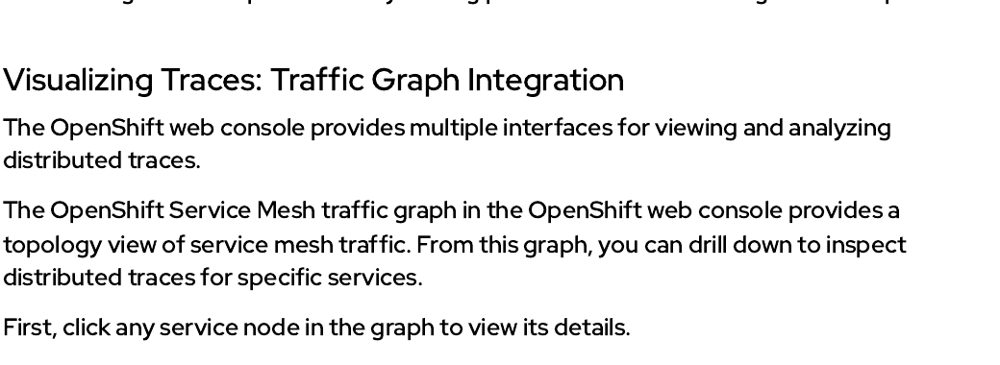
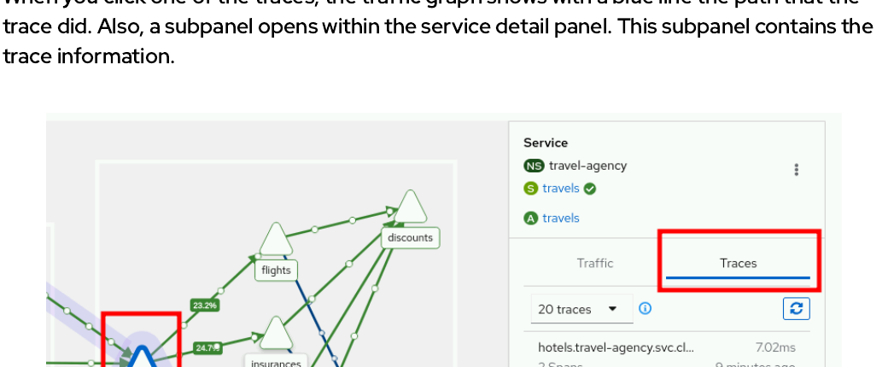

### ② 채널 B: 전역 Observe ➔ Traces 대시보드 채널 (Cluster-wide)
* **진입로:** 오픈시프트 개발자 관점 왼쪽의 **`Observe`** 메뉴 ➔ **`Traces`** 메뉴를 전격 노크합니다.
* **관제 비주얼:** 클러스터 전역에서 모아들이는 Tempo 백엔드의 전체 시계열 덤프 차트와 에러 분포 산포도(Scatter Plot) 차트를 실시간 표출합니다.
* **실무 수립 사용처:** 특정 네임스페이스와 상관없이, 현재 전역 클러스터 내에서 에러를 뿜고 있거나 레이턴시 기준 한계점을 심각히 돌파 이탈 중인 아웃라이어 트레이스 표본만을 고속 필터링 검색 발굴해 내고자 할 때 가장 효과적입니다.

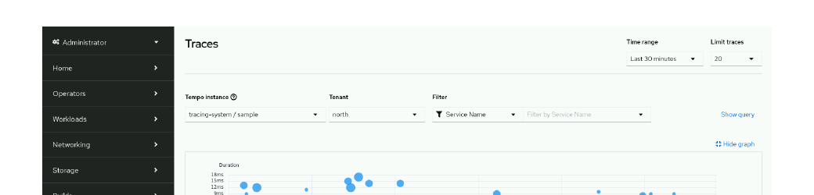
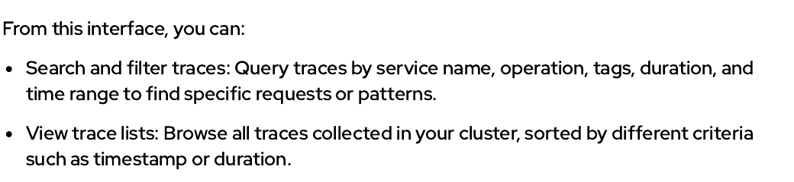

### ③ 채널 C: 워크로드 상세 Service Mesh 탭 채널 (Workload-centric)
* **진입로:** 오픈시프트 `Workloads` ➔ `Deployments` 진입 후 특정 배포본 상세 창 우측 최상단의 **`Service Mesh`** 전용 서브 탭을 전격 클릭합니다.
* **관제 비주얼:** 해당 특정 마이크로서비스 파드가 직접 수·발신 처리했던 L7 동시 유량 트래픽 통계와 분산 추적 타임라인 차트를 한 브라우저 화면 상에 정밀 매칭 결합 전시합니다.
* **실무 수립 사용처:** 특정 마이크로서비스 개발팀 소관 장비 전용으로 격리 튜닝 분석 및 서킷 브레이커 감금 파드의 레이턴시 복구 시점을 밀착 포착하고자 할 때 최고의 정합 밀착 관제력을 보여줍니다.

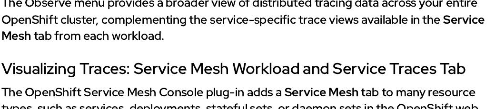
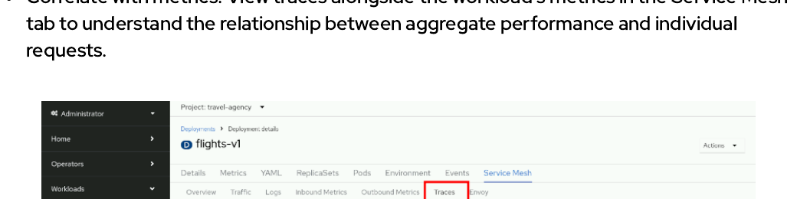

---

### 7. 3대 분산 추적 관제 인터페이스 비교 요약 테이블

| **시각 인터페이스 (Visualization)** | **최고 조도 관제 스코프 (Best For)** | **실무 핵심 기동 사례 (Primary Use Cases)** |
| :--- | :--- | :--- |
| **Traffic Graph (Kiali 토폴로지)** | 메시 전역 트래픽 우회 공간 기하 관제 | mTLS 보안 유실 지점 색출, 라우팅 룰 이탈 검출, 병목 컴포넌트 거시 스캐닝 |
| **Observe Menu (오픈시프트 전역)** | 클러스터 단위 대량 트레이스 산포 집계 | 전역 에러 필터링 검색, 장기 시계열 히스토그램 대조, 성능 이상 아웃라이어 발굴 |
| **Workload Tab (상세 Service Mesh)** | 특정 마이크로서비스 한정 심층 미세 관제 | 특정 파드 단위 미세 레이턴시 소모 계산, 수·발신 통신 비율과 트레이스의 실시간 교차 대조 |
