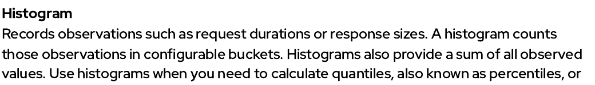
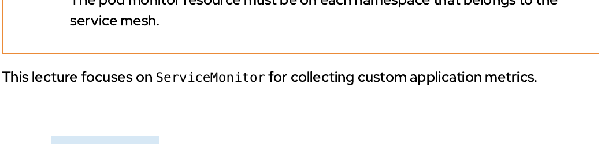
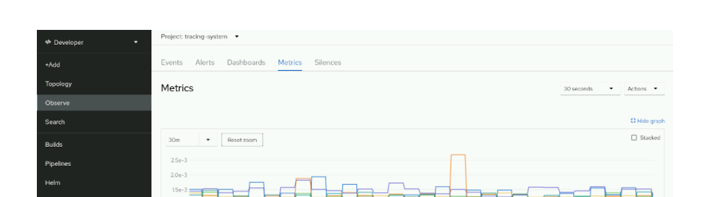

<style>
  h1 { font-size: 24px !important; }
  h2 { font-size: 20px !important; }
  h3 { font-size: 16px !important; }
</style>

<script>
document.addEventListener("DOMContentLoaded", function() {
    var checkAndReplace = function() {
        var walker = document.createTreeWalker(document.body, NodeFilter.SHOW_TEXT, null, false);
        var node;
        while (walker.nextNode()) {
            node = walker.currentNode;
            if (node.nodeValue.includes("api.apps.")) {
                node.nodeValue = node.nodeValue.replace(/api\.apps\./g, "api.");
            }
        }
    };
    checkAndReplace();
    setTimeout(checkAndReplace, 100);
    setTimeout(checkAndReplace, 500);
    setTimeout(checkAndReplace, 1500);
    setTimeout(checkAndReplace, 3000);
});
</script>

# 모듈 4.3: 사용자 지정 애플리케이션 메트릭 수집 및 모니터링 개념 (Collecting Service Metrics)

오픈시프트 서비스 메시 환경 하에서 프로메테우스 규격의 사용자 지정 메트릭 수집(Metrics Instrumentation) 핵심 사상과 프로메테우스의 4대 메트릭 유형(Counter, Gauge, Histogram, Summary)의 수립 용도를 심층 분석합니다. 이를 통해 Node.js(JavaScript) 및 Quarkus Java 애플리케이션 소스 코드 속에 Micrometer 및 prom-client 기술을 연동하여 커스텀 원격 메트릭을 유출하고, 서비스 모니터(ServiceMonitor) 자산을 배포해 전역 오픈시프트 사용자 워크로드 모니터링(User Workload Monitoring) 시스템에 통합 동기화하는 공학 기법을 학습합니다.

## 학습 목표 (Objectives)
* 애플리케이션 코드에 프로메테우스 계측 필터를 주입할 때 활용하는 프로메테우스 메트릭 유형 4가지의 본질과 용도를 이해 및 식별합니다.
* Node.js(JavaScript) 및 Java Quarkus 애플리케이션 소스 코드에 커스텀 메트릭 수집 코드를 수립 및 삽입하는 공학 요령을 설명합니다.
* 오픈시프트 서비스 모니터(ServiceMonitor) 자산이 어떻게 애플리케이션 커스텀 엔드포인트를 오픈시프트 전역 사용자 워크로드 모니터링 스택과 통합하는지 그 정합 구조를 분석합니다.
* Prometheus Query Language(PromQL) 구문과 오픈시프트 개발자 콘솔의 관제창을 활용하여 실시간 수집 지표를 다단형 그래프 차트로 분석 및 대조 렌더링하는 기법을 습득합니다.

---

## 1. 서비스 메트릭의 가치와 수집 통합 아키텍처

메트릭은 시스템의 수발신 트래픽 부하, 레이턴시, 통신 성공/에러율 등의 가동 성능 정보를 수집하여 시간에 따른 연속성 수치 변동 추이(Time Series Data)로 축적 보관해 주는 고마운 계측 지표 장부입니다.

* **메트릭의 본질:**
  분산 마이크로서비스 아키텍처 상에서 시스템 내부의 가동 건전성 상태(Health, Behavior, Performance)를 **가장 정량적이고 객관적인 정밀 통계 수치 지표**로 파악할 수 있게 보장해 줍니다.
* Red Hat OpenShift Service Mesh는 배후의 **`OpenShift Monitoring Stack`**(Prometheus 및 Thanos 컴포넌트)과 긴밀히 통합 가동되며 다음 2가지 고유 모니터링 세그먼트를 개설 지원합니다:
  - **Platform monitoring (플랫폼 물리 인프라 관제):** 쿠버네티스 노드 하드웨어 상태, 제어 평면 컨트롤러, 클러스터 오퍼레이터들의 리소스 소모 상태를 전담 관제합니다 (어드민 전용).
  - **User workload monitoring (사용자 프로젝트 관제):** 개발자가 개설한 일반 프로젝트(Namespace) 영역 하위의 파드 가동률과 소스 코드가 송출하는 커스텀 메트릭 지표들을 전착 수집해 옵니다.

사용자 프로젝트 모니터링이 개방되면 개발자는 다음과 같은 쿠버네티스 기성 지표들을 PromQL 쿼리를 통해 웹 콘솔 상에서 동적 조회할 수 있습니다:
* CPU 사용량: `container_cpu_usage_seconds_total`
* 메모리 소모량: `container_memory_working_set_bytes`
* 컨테이너 파드 기습 재부팅 횟수: `kube_pod_container_status_restarts_total`
* 디플로이먼트 가용 파드 복제본 한도: `kube_deployment_status_replicas`

### ① 이스티오 기본 텔레메트리 메트릭 (Service Mesh Metrics)
네임스페이스를 서비스 메시에 등록 연동(istio-injection) 시키는 순간, 파드 옆에 결합된 Envoy 프록시들이 통신 패킷을 하이재킹하면서 다음과 같은 L7 메시 텔레메트리 지표를 아무런 코드 수정 없이 자동으로 프로메테우스로 유출 송출합니다:
* `istio_requests_total`: 누적 총 요청 송수신 횟수.
* `istio_request_duration_seconds`: 요청을 백엔드가 인계받아 완전히 처리 회신하기까지 걸린 순수 소요 레이턴시.
* `istio_request_bytes`: 클라이언트가 송출한 HTTP Request Body 크기.
* `istio_response_bytes`: 서버가 회신한 HTTP Response Body 크기.
* 이 지표들은 소스/목적지 파드명, HTTP 응답 상태 코드, 통신 프로토콜, 타깃 subsets 버전 레이벨 정보들을 주머니 라벨로 항상 품고 있기 때문에, 매우 입체적인 PromQL 필터링 검색을 보장해 줍니다.

---

## 2. 프로메테우스 4대 핵심 메트릭 유형

우리가 비즈니스 코드 속에 커스텀 계측 필터를 매립하고자 할 때, 해결 시나리오에 부합하도록 골라 장착해야 할 **4가지 프로메테우스 핵심 메트릭 규격**의 용도를 도해 학습합니다:



### ① Counter (카운터) - 누적 증가 전용 지표
* **작동 본질:** 시스템 기동 이후 숫자가 **오직 위 방향으로 우상향 증가만 하며, 결코 감소하지 않는 누적 집계값**을 뜻합니다. (단, 파드가 기습 재부팅되면 수치는 즉석에서 0으로 초기 리셋됩니다.)
* **실무 수립 사용처:** 누적 접속 사용자 뷰 카운트, 처리 완료된 누적 주문 수량, 발생된 누적 에러 횟수 등.
* 카운터 지표는 누적 수치 자체가 아닌, **`rate()`** 등의 PromQL 시간 범위 변동량 필터 함수를 걸어 초당 평균 처리 증가량(예: 초당 인입 요청수 RPS)을 측정할 때 그 진정한 가치가 격상됩니다.

### ② Gauge (게이지) - 실시간 변동 수치 지표
* **작동 본질:** 주위 여건에 따라 **실시간으로 오르락내리락하며 진동하는 변동값**을 대변합니다.
* **실무 수립 사용처:** 현재 메모리 잔여량, 실시간 활성 동시 동시 접속자 수(Concurrent Connections), 스레드 큐 적체 깊이, 온도 데이터 등.

### ③ Histogram (히스토그램) - 구간별 빈도 분석 지표
* **작동 본질:** 지연 처리 속도 및 응답 패킷 크기 관측값들을 **사전 정의된 특정 경계 범위 주머니(Buckets)에 담아 분류 집계**하고 누적 관측 횟수와 수치 합산값을 함께 유출합니다.
* **실무 수립 사용처:** 95% 분위수(95th Percentile) 레이턴시 속도 계산 및 레이턴시의 고정 비율 통계 프로파일링.

### ④ Summary (요약 지표)
* 히스토그램과 마찬가지로 관측 응답 분산을 집계 처리하나, 클라이언트 라이브러리 단에서 지표 분위수(Quantiles) 계산을 미리 수행해서 서버로 전송하는 특성을 띱니다. 현대 프로메테우스 인프라에서는 쿼리 타임의 부하가 크지 않고 결합 집계 연산이 훨씬 유연한 **`Histogram`** 장비 배포를 대다수 압도적 권장 지향합니다.

---

## 3. 언어 런타임별 사용자 지정 메트릭 계측(Instrumentation) 기법

서로 다른 언어 및 개발 프레임워크 환경 하에서 커스텀 메트릭을 유출하는 구체적인 소스코드 설계 규격을 정독합니다.

### ① Node.js (JavaScript) - `prom-client` 패키지 매립 방식
노드제이에스 환경에서는 프로메테우스 공식 자바스크립트 SDK 패키지 라이브러리인 **`prom-client`**를 NPM 디펜던시에 등록 이식하여 사용합니다.

* **Default 메트릭 활성화:**
  - `collectDefaultMetrics({ prefix })`를 호출 선언하면, 노드 런타임이 동작하는 V8 가비지 컬렉터 수치, 프로세스 CPU 사용량, 이벤트 루프 지연 주기(Event Loop Lag) 등 표준 노드 성능 메트릭을 접두사(`prefix`) 식별값을 각인한 채 즉석에서 자동으로 수집 유출하기 시작합니다.
    ```javascript
    const prometheus = require('prom-client');
    const prefix = 'invoices_svc_';
    prometheus.collectDefaultMetrics({ prefix });
    ```
* **커스텀 Counter 및 Gauge 코딩 수립 선언:**
    ```javascript
    // Counter 생성 선언
    const invoices_num = new prometheus.Counter({
      name: 'invoices_svc:invoices_count',
      help: 'Number of created invoices'
    });
    invoices_num.inc(); // 카운트 1개 누적 증가 격발
    
    // Gauge 생성 선언 및 타이머 연동
    const responseTime = new prometheus.Gauge({
      name: 'invoices_svc:invoices_creation_time',
      help: 'Time taken in seconds to create an invoice'
    });
    
    // 라우터 안에서 타이머 작동 연동
    app.get('/create_invoice', async function(req, res) {
      responseTime.setToCurrentTime();
      const end = responseTime.startTimer(); // 타이머 작동 기동
      
      await processRequest(); // 비즈니스 로직 수행
      
      end(); // 타이머 작동 종료 및 레이턴시 초 단위 기록 성료
      res.send('Invoice created!');
    });
    ```
* **수집지 통로 `/metrics` 개방:**
  프로메테우스 수집기가 호출하여 긁어갈 수 있도록 겉면 익스프레스 라우터에 표준 `/metrics` 수신 리스너를 결합 개방해 줍니다.
    ```javascript
    app.get('/metrics', async function (req, res) {
        res.set('Content-Type', prometheus.register.contentType);
        res.send(await prometheus.register.metrics());
    });
    ```

### ② Java (Quarkus) - 어노테이션 기반 `Micrometer` 이식 방식
자바 쿼커스 프레임워크는 강력한 메트릭 수집 표준 명세인 **`Micrometer`** 전용 빌드 디펜던시 패키지인 `quarkus-micrometer` 및 `quarkus-micrometer-registry-prometheus` 라이브러리를 `pom.xml`에 결합 이식하여 가동합니다.
* **Micrometer의 혜택 (Annotation-based):**
  - 자바 개발자는 별도의 복잡한 변수 생성 및 타이머 개입 소스 코드를 한 땀 한 땀 코딩해 매립할 필요 없이, 오직 비즈니스 자바 메소드 호출 상단에 **선언적 어노테이션 기입 단 한 줄**만 주입해 주는 것으로 프로메테우스 계측 필터링을 완전 자동 달성해 낼 수 있어 엄청난 생산성을 체득합니다!

```java
import io.micrometer.core.annotation.Counted;
import io.micrometer.core.annotation.Timed;

@GET
@Path("/invoice")
@Counted(value = "invoices_requested", description = "count of invoices requested") ❶
@Timed(value = "invoice_process_time", description = "A measure of how long it takes to process an invoice") ❷
public String createInvoice() {
    // 비즈니스 로직 구동
    return "Invoice created";
}
```

❶ **`@Counted` 어노테이션:** 본 메소드가 호출 격발되어 이륙에 성공할 때마다 누적 카운터를 프로메테우스 상에 `invoices_requested_total` 이름의 카운터 지표로 즉석 자동 생성하고 1개씩 누적 합산 증가시켜 줍니다!
❷ **`@Timed` 어노테이션:** 본 메소드가 인계받아 처리를 완수하고 반사 회신할 때까지 걸린 전체 순수 소요 시간을 정밀 측정하여, `invoice_process_time_seconds_count`(누적 호출량) 및 `invoice_process_time_seconds_sum`(소요 시간 누적 합산) 지표로 100% 무결 자동 덤프 송출해 줍니다!

* 자바 Quarkus는 컴파일 빌드가 완료되는 순간 즉석에서 기종 고유의 정식 메트릭 유출지 엔드포인트 경로인 **`/q/metrics`**를 개방 가동시킵니다.

---

## 4. 메트릭 수집기 서비스 모니터(ServiceMonitor)의 작동 원리

* 비즈니스 파드가 `/metrics` 나 `/q/metrics` 엔드포인트를 열고 대기하더라도, 프로메테우스 사령탑 측에서 이 파드의 물리 IP와 포트 번호를 가이드 수집 장부 상에 정식 화이트리스트로 인지하지 못하면 수집(Scraping)이 일어나지 않습니다.
* **`ServiceMonitor`** 자산은 **쿠버네티스 서비스(`Service`) 리소스의 레이벨 셀렉터 매칭 조건과 엔드포인트 주소를 추적하여 프로메테우스에게 타깃 파드들이 뿜어내는 메트릭 전용 통로(/metrics)를 정기적(예: 30초 주기)으로 스크래핑해 갈 수 있도록 가이드 결합 다리**를 놓아 주는 최선진 수집 통제 장치입니다.



다음은 `app: invoices` 레이벨 딱지가 소지된 자바/노드 서비스 파드를 추적하여 30초마다 메트릭 엔드포인트를 노크하는 정식 서비스 모니터 YAML 명세입니다:

```yaml
apiVersion: monitoring.coreos.com/v1
kind: ServiceMonitor
metadata:
  name: invoices-monitor
  namespace: my-project
spec:
  endpoints:
  - interval: 30s ❶
    path: /metrics ❷
    scheme: http ❸
    targetPort: 8080 ❹
  selector:
    matchLabels:
      app: invoices ❺
```

❶ 매 **30초(30s)** 간격 주기로 순환 방문하여 신규 수치 지표들을 안전하게 스크래핑 긁어가도록 명령 정의합니다.
❷ 방문하여 노크할 타깃 HTTP 엔드포인트 경로 주소를 지정합니다 (자바 쿼커스의 경우에는 `/q/metrics`로 경로를 튜닝 셋업 합니다).
❸ 보안 SSL 암호화 채널 협상이 개입되지 않은 일반 평문 HTTP 텔레메트리 연동 규격을 사용합니다.
❹ 파드가 실시간 개방 청취 대기 중인 실제 비즈니스 수신 포트 번호를 지정합니다 (Envoy 프록시 전용 포트가 아님에 주의!).
❺ 매칭 결합하여 수렴 추적할 실제 쿠버네티스 서비스의 레이벨 딱지 식별자 명세를 기입해 넣습니다.

---

## 5. PromQL 쿼리 및 오픈시프트 관제창 활용 기법

* **PromQL (Prometheus Query Language):**
  프로메테우스 시계열 데이터베이스 원장 장부로부터, 우리가 원하는 특정 가동 메트릭 곡선만을 시각화 조건 필터링을 동원해 고속으로 발굴 추출해 내는 프로메테우스 전용 정밀 쿼리 언어입니다.
* 개발자는 오픈시프트 개발자 콘솔의 **`Observe` ➔ `Metrics`** 관제 대시보드창을 노크하여, 이 PromQL 구문을 expression 상자에 자판 타이핑하는 것으로 즉석에서 미려한 관제 곡선을 팝업 감상해 낼 수 있습니다.



실제 현장 프로덕션 장애 상황 분석 시 널리 배포 수립되어 활약하는 **4대 마스터 PromQL 실전 구문 원안**을 정독 이해합니다:

### ① 1순위: 특정 워크로드 호출 유량(초당 처리 횟수 RPS) 실시간 집계
* 카운터 메트릭은 숫자가 계속 누적 증가하기만 하므로 그냥 차트에 띄우면 대각선 우상향 그래프만 보여 쓸모가 없습니다. 반드시 **`rate()`** 변동량 함수와 시간 대역 윈도우 프리픽스(예: `[5m]` ➔ 최근 5분간의 데이터 범위 벡터 지정)를 씌워 초당 평균 유입량 속도를 산출해 내야 합니다.
```sql
rate(istio_requests_total{reporter="source"}[5m])
```

### ② 2순위: 이기종 마이크로서비스 간의 초당 유량 총합 계산 및 결합 시각화
* 여러 인스턴스 파드로 분산 유입되는 개별 RPS 수치들을 목적지 워크로드명(`destination_workload`) 그룹 단위로 깔끔하게 통합 합산(`sum` 및 `by` 수식 결합)하여 시각 명세 차트에 한 줄의 매끄러운 곡선으로 렌더링해 냅니다.
```sql
sum(rate(istio_requests_total{reporter="source"}[5m])) by (destination_workload)
```

### ③ 3순위: 백엔드 지체 구간 레이턴시의 "95% 분위수 분위 속도" 정밀 계산
* 평균 지연 속도는 극히 일부 유저가 겪는 수십 초 대의 지독한 병목 참상을 평균 희석화 효과로 감추어 버리는 독극물입니다. 진정한 SLA 품질 수성을 위해 전체 유저 중 95% 장벽 선상에 있는 분위수 레이턴시(95th Percentile Latency) 수치를 밀리초 단위로 정밀 산출합니다.
```sql
histogram_quantile(0.95, sum by (le, destination_workload) (rate(istio_request_duration_milliseconds_bucket{reporter="source"}[5m])))
```

### ④ 4순위: 특정 컴포넌트의 누적 "에러 발생율(%)" 실시간 집계 계산
* 수신 성공한 정상 호출 유량 분배량 대비, `5xx` 대의 심각한 시스템 크래시 에러 응답 코드(`response_code=~"5.."`)를 내뿜어 탈락한 유량 비중이 수학적으로 몇 % 비중을 띠고 있는지 실시간 비례 계산하여 차트에 전사 노출합니다. 이 수치가 1%를 초과하는 즉시 경보(Alert)가 격발되도록 조율합니다.
```sql
100 * sum(rate(istio_requests_total{reporter="source",response_code=~"5.."}[5m])) by (destination_workload) / sum(rate(istio_requests_total{reporter="source"}[5m])) by (destination_workload)
```
