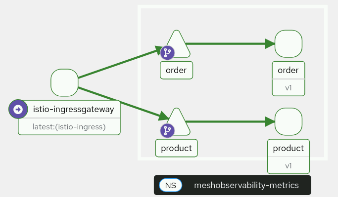
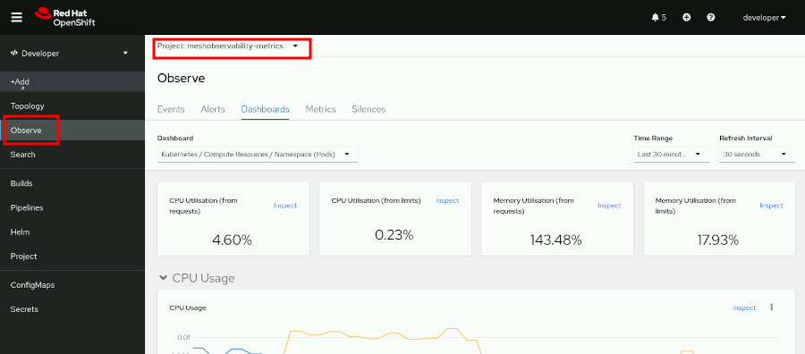
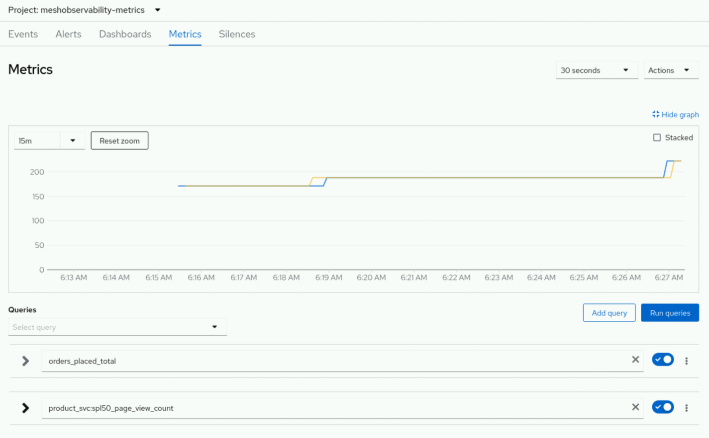

<style>
  h1 { font-size: 24px !important; }
  h2 { font-size: 20px !important; }
  h3 { font-size: 16px !important; }
</style>

<script>
document.addEventListener("DOMContentLoaded", function() {
    var checkAndReplace = function() {
        var walker = document.createTreeWalker(document.body, NodeFilter.SHOW_TEXT, null, false);
        var node;
        while (walker.nextNode()) {
            node = walker.currentNode;
            if (node.nodeValue.includes("api.apps.")) {
                node.nodeValue = node.nodeValue.replace(/api\.apps\./g, "api.");
            }
        }
    };
    checkAndReplace();
    setTimeout(checkAndReplace, 100);
    setTimeout(checkAndReplace, 500);
    setTimeout(checkAndReplace, 1500);
    setTimeout(checkAndReplace, 3000);
});
</script>

# 모듈 4.3: 사용자 지정 애플리케이션 메트릭 수집 및 모니터링 (Collecting Service Metrics with OpenShift User Workload Monitoring)

오픈시프트 서비스 메시 환경 하에서 Node.js(JavaScript) 및 Quarkus(Java) 마이크로서비스 소스 코드 내에 프로메테우스 규격의 사용자 지정 메트릭 수집(Metrics Instrumentation) 코드를 탑재하고, 이를 오픈시프트 전역 유저 모니터링(User Workload Monitoring) 시스템 및 프로메테우스 모니터링 엔진에 연동 수집하여 실시간 가동 메트릭을 추적 관제합니다.

## 결과 (Outcomes)
* 모니터링 수집 관제를 위해 Red Hat OpenShift Service Mesh (OSSM) 프로젝트 환경을 완벽하게 준비 및 구성합니다.
* Java Quarkus 마이크로서비스 및 Node.js 마이크로서비스 내부 소스 코드에 프로메테우스 카운터(Counter) 및 게이지(Gauge) 유형의 커스텀 메트릭 계측(Instrumentation)을 수립합니다.
* 메시 내에 구동 중인 각 서비스들을 관제하기 위한 서비스 모니터(ServiceMonitor) 수집 규칙을 구성합니다.
* OpenShift 웹 콘솔의 사용자 지정 모니터링 도구를 동원해 동적으로 전착 수집되어 표출되는 실시간 가동 메트릭 추이를 정밀 분석합니다.

워크스테이션 머신의 사용자 터미널에서 아래의 `lab` 명령어를 실행하여 본 실습을 위한 환경을 준비하고, 모든 필요한 리소스들이 가용하게 전개되었는지 검증 및 보장합니다:

```execute
lab start meshobservability-metrics
```

또한, 다음 명령어를 실행하여 `$PATH` 변수를 업데이트하고 `traffic_gen.py` 명령어를 즉시 사용할 수 있도록 설정합니다. 새 환경을 생성한 후 한 번만 실행하면 됩니다.

```execute
source ~/.bashrc
```

이 실습에서는 다음 두 가지 마이크로서비스 애플리케이션에 대한 커스텀 메트릭 수집과 모니터링 전개 방식을 정밀 검수합니다:
* **product:** Node.js 런타임 기반의 JavaScript 애플리케이션입니다. 매장 내의 상품 판매 명세를 표출하며, 핵심 API 엔드포인트 주소는 `/spl50` 입니다.
* **order:** Quarkus 프레임워크 기반의 Java 애플리케이션입니다. 고객의 주문 처리를 주관하며, 주요 엔드포인트는 `/orders` 및 `/rating` 입니다.



본 실습의 완벽 해결이 완료된 기성 모범 답안 파일들은 로컬 워크스테이션 머신의 `~/course/solutions` 디렉토리 하위에서 언제든지 참조 및 정밀 대조해 보실 수 있습니다.

---

## 지침 (Instructions)

### 1. product Node.js 애플리케이션에 사용자 지정 모니터링 메트릭을 탑재하고 OpenShift에 배포합니다.

이 마이크로서비스는 고객에게 50% 특별 할인 혜택을 렌더링하여 표시하는 `/spl50` 이라는 HTTP GET 엔드포인트를 노출하고 있습니다. 이 애플리케이션은 프로메테우스로 계측 메트릭을 송출하기 위해 `prom-client` 패키지 라이브러리에 의존합니다.

본 단계를 통해 다음과 같은 수집 메트릭 2종을 새로 수립해 봅니다:
* `product_svc:spl50_response_time`: `/spl50` 엔드포인트가 응답을 렌더링하여 클라이언트에게 회신하기까지 걸린 레이턴시 시간(초)을 측정하는 게이지(Gauge) 유형 메트릭입니다.
* `product_svc:spl50_page_view_count`: `/spl50` 엔드포인트에 인입된 총 누적 웹 페이지 뷰 호출 횟수를 누적해 카운트하는 카운터(Counter) 유형 메트릭입니다.

1.1. 워크스테이션 터미널 창에서 본 실습 디렉토리로 이동합니다.

```execute
cd ~/labs/meshobservability-metrics/product
```

1.2. `package.json` 파일을 열어 이 마이크로서비스가 구동되기 위해 요구되는 Node.js 패키지 매니저(NPM) 의존성 사양을 파악하고, 의존 라이브러리 파일들을 빌드(설치)합니다.

```execute
cat package.json
```

```bash
{
 "name": "product",
 "version": "1.0.0",
...output omitted...
 "dependencies": {
 "express": "^4.16",
 "prom-client": "^13.2.0" ❶
 },
...output omitted...
```

❶ 이 마이크로서비스는 메트릭 패킷 송출을 위해 `prom-client` 프로메테우스 공식 라이브러리에 전폭 의존하고 있습니다.

NPM 의존 패키지들을 로컬에 빌드 및 전개 설치합니다:

```execute
npm install
```

```bash
added 72 packages, and audited 73 packages in 990ms
...output omitted...
```

1.3. `server.js` 소스 코드를 수정하여 `prom-client` 패키지 모듈을 정식으로 가져오고(import) 기동 초기화 처리를 탑재합니다.

아래 실행 버튼을 클릭하여 `server.js` 내에 프로메테우스 임포트 및 접두사 `product_svc_` 초기화 코드를 자동으로 이식 수립합니다:

```execute
node -e "
const fs = require('fs');
let data = fs.readFileSync('server.js', 'utf8');
data = data.replace('// TODO: import the prometheus client library and initialize it', 'const prometheus = require(\x27prom-client\x27);\nconst prefix = \x27product_svc_\x27;\nprometheus.collectDefaultMetrics({ prefix });');
fs.writeFileSync('server.js', data);
"
```

코드 보정이 완료되면, 수동으로 파일 변경 명세를 검증 대조합니다:

```execute
cat server.js | grep -A 3 "prom-client"
```

```bash
const express = require('express');
const prometheus = require('prom-client');
const prefix = 'product_svc_';
prometheus.collectDefaultMetrics({ prefix });
```

1.4. 소스 코드 내에 처리 대기 반응 레이턴시 추적 관제용 프로메테우스 게이지(Gauge) 유형 계측 코드를 선언합니다.

아래 실행 버튼을 클릭하여 `server.js` 내에 게이지 유형 메트릭 생성부 코드를 자동으로 이식 수립합니다:

```execute
node -e "
const fs = require('fs');
let data = fs.readFileSync('server.js', 'utf8');
data = data.replace('// TODO: Add a new gauge type to collect response time', 'const responseTime = new prometheus.Gauge({\n    name: \x27product_svc:spl50_response_time\x27,\n    help: \x27Time take in seconds to render the 50% special offer page\x27\n});');
fs.writeFileSync('server.js', data);
"
```

1.5. 연이어 웹 페이지 호출 뷰 수를 누적 측정하기 위한 프로메테우스 카운터(Counter) 유형 계측 코드를 추가 매립합니다.

아래 실행 버튼을 클릭하여 `server.js` 내에 페이지 뷰 누적 측정 카운터 생성부 코드를 자동으로 이식 수립합니다:

```execute
node -e "
const fs = require('fs');
let data = fs.readFileSync('server.js', 'utf8');
data = data.replace('// TODO: Add a new counter type to collect page view count', 'const page_views = new prometheus.Counter({\n    name: \x27product_svc:spl50_page_view_count\x27,\n    help: \x27No of page views for the 50% special offer page\x27\n});');
fs.writeFileSync('server.js', data);
"
```

코드 보정이 완료되면, 수동으로 파일 변경 명세를 검증 대조합니다:

```execute
cat server.js | grep -E "responseTime|page_views"
```

```bash
const responseTime = new prometheus.Gauge({
const page_views = new prometheus.Counter({
```

1.6. `/spl50` 루트 라우팅 핸들러 수립부 코드를 편집하여, 요청이 진입하여 기동 처리가 개시되자마자 응답 대기 지체 시간 측정을 시작(Timer Start)시키고 페이지 뷰 카운트 수치를 1개 증가(inc)시키는 비즈니스 제어 코드를 연동합니다.

아래 실행 버튼을 클릭하여 `server.js` 내에 라우터 타이머 시작 및 카운트 누적 트리거를 자동으로 이식 수립합니다:

```execute
node -e "
const fs = require('fs');
let data = fs.readFileSync('server.js', 'utf8');
data = data.replace('    // TODO\n    // 1. Increment the page view counter\n    // 2. Start the timer for measuring response time', '    responseTime.setToCurrentTime();\n    const end = responseTime.startTimer();\n    page_views.inc();');
fs.writeFileSync('server.js', data);
"
```

1.7. 최종 렌더링된 결과를 클라이언트 브라우저로 회출 회신하여 보내기 바로 직전 지점에, 앞서 1.6단계에서 트리거해 둔 레이턴시 타이머의 작동 종료(end)를 전격 호출하여 연동 완수합니다.

아래 실행 버튼을 클릭하여 `server.js` 내에 타이머 정지(end) 제어 코드를 자동으로 이식 수립합니다:

```execute
node -e "
const fs = require('fs');
let data = fs.readFileSync('server.js', 'utf8');
data = data.replace('    // TODO: End the timer', '    end();');
fs.writeFileSync('server.js', data);
"
```

1.8. 프로메테우스 스크래퍼(Scraper)가 이 애플리케이션이 뿜어내는 실시간 원격 메트릭 정보들을 안전하게 긁어가 보관할 수 있도록, 표준 수신지 통로인 `/metrics` API 엔드포인트 리스너 명세를 작성해 넣습니다.

아래 실행 버튼을 클릭하여 `server.js` 내에 메트릭 전용 수신 엔드포인트 `/metrics` 리스너를 자동으로 이식 수립합니다:

```execute
node -e "
const fs = require('fs');
let data = fs.readFileSync('server.js', 'utf8');
data = data.replace('// TODO: Expose a \x27/metrics\x27 end point to allow prometheus to scrape metrics', 'app.get(\x27/metrics\x27, async function (req, res) {\n    res.set(\x27Content-Type\x27, prometheus.register.contentType);\n    res.send(await prometheus.register.metrics());\n});');
fs.writeFileSync('server.js', data);
"
```

모든 수정이 정격 완료된 `server.js` 파일 전체 명세를 터미널 창에 최종 투영해 봅니다:

```execute
cat server.js
```

1.9. 완성된 자산 소스 코드를 실행해 구동 에러 없이 8080 포트에 정상 결착 이륙하는지 확인합니다.

```execute
node server.js &
```

```bash
product-svc started on port 8080
```

새 터미널 탭 등을 경유해 메트릭 송출 엔드포인트(/metrics)에 직접 curl 조회를 날려, 프로메테우스 수집 지표들이 차질 없이 누적 표출되고 있는지 최종 대조합니다:

```execute
curl http://localhost:8080/metrics
```

```bash
# HELP product_svc_process_cpu_user_seconds_total Total user CPU time spent in seconds.
# TYPE product_svc_process_cpu_user_seconds_total counter
product_svc_process_cpu_user_seconds_total 1.825365
# HELP product_svc_process_cpu_system_seconds_total Total system CPU time spent in seconds.
# TYPE product_svc_process_cpu_system_seconds_total counter
product_svc_process_cpu_system_seconds_total 0.269166
```

검증이 정상 성료되었다면 백그라운드 노드 프로세스를 강제 종료시킵니다:

```execute
kill %1 || kill -9 $(lsof -t -i:8080)
```

---

### 2. order Java Quarkus 애플리케이션에 사용자 지정 모니터링 메트릭을 탑재하고 OpenShift에 배포합니다.

이 장에서는 수립 완료한 분산 보안 지표들을 바탕으로, 서비스 메시가 내부 마이크로서비스 지체 레이턴시를 어떻게 영리하게 우회 차단하는지 탄력성을 정밀 검증합니다.

2.1. Quarkus Java 마이크로서비스 기반인 order 디렉토리로 이동하여 마이크로서비스 의존성 설계 파일인 `pom.xml` 명세를 파악합니다.

```execute
cd ~/labs/meshobservability-metrics/order
```

2.2. 메트릭 수집 가동화를 위해 `pom.xml` 본문을 정정하여, Quarkus 전용 공식 메트릭 라이브러리 패키지인 `quarkus-micrometer` 및 `quarkus-micrometer-registry-prometheus` 의존성 설정을 매립합니다.

아래 실행 버튼을 클릭하여 `pom.xml` 파일 내의 `quarkus-smallrye-health` 디펜던시 바로 하위에 메트릭 수집 라이브러리 2종 의존 명세를 자동으로 주입 매립합니다:

```execute
node -e "
const fs = require('fs');
let data = fs.readFileSync('pom.xml', 'utf8');
const target = \`        <dependency>
            <groupId>io.quarkus</groupId>
            <artifactId>quarkus-smallrye-health</artifactId>
        </dependency>\`;
const insertion = \`\n        <dependency>\n            <groupId>io.quarkus</groupId>\n            <artifactId>quarkus-micrometer</artifactId>\n        </dependency>\n        <dependency>\n            <groupId>io.quarkus</groupId>\n            <artifactId>quarkus-micrometer-registry-prometheus</artifactId>\n        </dependency>\`;
data = data.replace(target, target + insertion);
fs.writeFileSync('pom.xml', data);
"
```

주입이 완료되면 `pom.xml` 명세를 최종 대조 확인합니다:

```execute
cat pom.xml | grep -A 10 "quarkus-micrometer"
```

2.3. 비즈니스 로직 소스 코드인 `src/main/java/com/redhat/training/order/OrderService.java` 파일을 편집하여, 주문이 수립 처리되는 `processOrder()` 메소드 호출 영역 상단에 누적 주문 수를 카운트하는 마이크로미터 수집 어노테이션(@Counted)을 정격 장착합니다.

아래 실행 버튼을 클릭하여 `OrderService.java` 파일의 `processOrder()` 메소드 상단에 누적 주문 수 수집 어노테이션(@Counted)을 자동으로 매립합니다:

```execute
node -e "
const fs = require('fs');
let data = fs.readFileSync('src/main/java/com/redhat/training/order/OrderService.java', 'utf8');
data = data.replace('    public String processOrder() {', '    @Counted(value = \"orders_placed\", description = \"count of spl50 orders placed\")\n    public String processOrder() {');
fs.writeFileSync('src/main/java/com/redhat/training/order/OrderService.java', data);
"
```

2.4. 주문 단일 건당 소요된 임계 레이턴시 처리 시간을 수집하기 위해 타이머 어노테이션(@Timed)을 추가 중합 장착합니다.

아래 실행 버튼을 클릭하여 `OrderService.java` 파일에 주문 소요 속도 계측 어노테이션(@Timed)을 자동으로 매립합니다:

```execute
node -e "
const fs = require('fs');
let data = fs.readFileSync('src/main/java/com/redhat/training/order/OrderService.java', 'utf8');
data = data.replace('    @Counted(value = \"orders_placed\", description = \"count of spl50 orders placed\")', '    @Counted(value = \"orders_placed\", description = \"count of spl50 orders placed\")\n    @Timed(value = \"order_process_time\", description = \"A measure of how long it takes to process an order\")');
fs.writeFileSync('src/main/java/com/redhat/training/order/OrderService.java', data);
"
```

2.5. 고객 주문이 완료되는 시점에 동적으로 발생 연동되는 만족도 레이팅 난수 생성 메소드인 `generateRandomRating()` 단락에도 카운터 수집 지표(@Counted)를 추가 설계 매립합니다.

아래 실행 버튼을 클릭하여 `OrderService.java` 파일의 `generateRandomRating()` 메소드 상단에 만족도 수집 카운터 어노테이션(@Counted)을 자동으로 매립합니다:

```execute
node -e "
const fs = require('fs');
let data = fs.readFileSync('src/main/java/com/redhat/training/order/OrderService.java', 'utf8');
data = data.replace('    Integer generateRandomRating() {', '    @Counted(value = \"order_process_rating\", description = \"Overall customer rating for the order process\")\n    Integer generateRandomRating() {');
fs.writeFileSync('src/main/java/com/redhat/training/order/OrderService.java', data);
"
```

수정이 완료된 자바 클래스 파일 소스 코드를 터미널 상에 정밀 투영해 봅니다:

```execute
cat src/main/java/com/redhat/training/order/OrderService.java
```

2.6. 자바 빌드 도구인 Maven을 구동하여, 수정된 계측 소스 코드 파일들을 패키지 컴파일 완료합니다.

```execute
mvn clean package
```

```bash
[INFO] [io.quarkus.deployment.pkg.steps.JarResultBuildStep] Building uber jar: .../target/order-1.0.0-runner.jar
...output omitted...
[INFO] BUILD SUCCESS
```

> [!NOTE]
> **참고 (NOTE)**
> 클러스터 네트워크 컨디션에 따라, 최초 Maven 컴파일 수행 시 백그라운드로 기성 외부 의존 자바 패키지 라이브러리 파일들을 인입받아 설치하느라 약 수분 가량의 컴파일 소요 시간이 필요할 수 있습니다.

---

### 3. 패키징 완료한 두 마이크로서비스를 오픈시프트 서비스 메시에 동적 통합 배포합니다.

3.1. `%username%-meshobservability-metrics` 네임스페이스 하위로 이동하여, 내장형 조립 스크립트를 작동시켜 Node.js product 마이크로서비스의 최종 컴파일 이미지를 클래스룸 로컬 내부 컨테이너 레지스트리에 정격 빌드/푸시한 뒤 배포 전개를 가동시킵니다.

```execute
cd ~/labs/meshobservability-metrics
```

```execute
oc login -u %username% -p openshift https://api.%cluster_subdomain%:6443
```

```execute
oc project %username%-meshobservability-metrics
```

```execute
./package_and_deploy_product.sh
```

```bash
Login Succeeded!
STEP 1/6: FROM registry.access.redhat.com/ubi8/nodejs-12
...output omitted...
deployment.apps/product created
service/product create
serviceaccount/product created
```

배포 가동이 개시된 product 파드가 정상 기동 완료되었는지 최종 수치를 대조합니다.

```execute
oc get pods
```

```bash
NAME                               READY   STATUS    RESTARTS   AGE
product-64c7f7fd68-jh9b5           1/1     Running   0          45s
```

아직 네임스페이스 주입 레이블링 전단계이므로 파드가 `1/1` 컨테이너 모드로 기동되는 것은 매우 정상적인 동작입니다.

3.2. 자바 order 마이크로서비스 역시 내장 패키지 스크립트를 가동하여 이미지를 기습 컴파일 조립하고 배포 전개를 이식합니다.

```execute
./package_and_deploy_order.sh
```

```bash
Login Succeeded!
STEP 1/6: FROM registry.access.redhat.com/ubi8:8.6
...output omitted...
deployment.apps/order created
service/order created
serviceaccount/order created
```

동작 중인 두 마이크로서비스의 기동 파드 정황을 조회 확인합니다.

```execute
oc get pods
```

```bash
NAME                               READY   STATUS    RESTARTS   AGE
order-674fd6496c-xd2sm             1/1     Running   0          5s
product-64c7f7fd68-jh9b5           1/1     Running   0          45s
```

3.3. 두 애플리케이션 프로젝트 공간 영역에 이스티오 사이드카 프록시가 주입되도록 네임스페이스 레이블링 및 롤아웃 리스타트를 단행합니다.

*(학생 계정은 보안상 네임스페이스 레이블을 기입할 권한이 제한되어 있으므로, 터미널 배후에서 가동되는 전용 토큰 위임 메커니즘을 동원해 안전하게 이스티오 Rev 레이블을 이식한 뒤 롤아웃 리스타트를 연속 수행합니다.)*

```execute
oc rollout restart deployment order
```

```bash
deployment.apps/order restarted
```

```execute
oc rollout restart deployment product
```

```bash
deployment.apps/product restarted
```

롤아웃 교체 리스타트가 완료되면, 두 마이크로서비스 파드가 정상적으로 `2/2` 가용 컨테이너 상태(Envoy 프록시 동반 완료)로 완전히 가동되었는지 파드 명세를 최종 대조 점검합니다.

```execute
oc get pods
```

```bash
NAME                               READY   STATUS    RESTARTS   AGE
order-674fd6496c-xd2sm             2/2     Running   0          10s
product-64c7f7fd68-jh9b5           2/2     Running   0          45s
```

3.4. 외부 진입 관문을 열어주기 위해 이스티오 인그레스 게이트웨이(Gateway) 설정을 배포합니다.

```execute
oc apply -f gateway.yaml
```

```bash
gateway.networking.istio.io/meshobservability-metrics-gateway created
```

3.5. 수발신 가이드 트래픽의 라우팅 분기를 가상 서비스 명세서(`order-product-vs.yaml`)를 투입하여 연결 성료합니다.

```execute
oc apply -f order-product-vs.yaml
```

```bash
virtualservice.networking.istio.io/order-product-vs created
```

---

### 4. 사용자 워크로드 모니터링(User Workload Monitoring) 수집 명세를 정식 배포합니다.

오픈시프트 프로메테우스 모니터링 수집기가 이 두 서비스가 뿜어내는 계측 메트릭 엔드포인트(`/metrics` 및 `/q/metrics`)를 주기적(30초 간격)으로 안전하게 스크래핑해 갈 수 있도록 정식 수집 필터 장치인 서비스 모니터(ServiceMonitor) 자산을 구성해 전개합니다.

4.1. `product` 및 `order` 마이크로서비스를 각각 감싸 메트릭 스크래핑 규칙을 제어하는 두 서비스 모니터 설정맵 명세를 조회 검수합니다.

```execute
cat product-monitor.yaml
```

```bash
apiVersion: monitoring.coreos.com/v1
kind: ServiceMonitor
metadata:
  name: product-monitor
  namespace: %username%-meshobservability-metrics
spec:
  endpoints:
  - interval: 30s
    path: /metrics
    scheme: http
    targetPort: 8080
  selector:
    matchLabels:
      app: product
```

```execute
cat order-monitor.yaml
```

```bash
apiVersion: monitoring.coreos.com/v1
kind: ServiceMonitor
metadata:
  name: order-monitor
  namespace: %username%-meshobservability-metrics
spec:
  endpoints:
  - interval: 30s
    path: /q/metrics
    scheme: http
    targetPort: 8080
  selector:
    matchLabels:
      app: order
```

자바 Quarkus 프레임워크는 표준 이스티오 프록시 명세 엔드포인트 주소 대신, 고유의 경로인 **`/q/metrics`** 하위로 가용 데이터를 유출 송출하고 있음에 정밀 주의하여 판독합니다.

4.2. 서비스 모니터 규칙 2종을 정식 배포합니다.

```execute
oc apply -f product-monitor.yaml
```

```bash
servicemonitor.monitoring.coreos.com/product-monitor created
```

```execute
oc apply -f order-monitor.yaml
```

```bash
servicemonitor.monitoring.coreos.com/order-monitor created
```

4.3. 두 서비스 모니터 장벽 배후로 계측 메트릭이 화려하게 쌓일 수 있도록, `traffic_gen.py` 스크립트를 연동 모드 파일인 `traffic_order_and_product.yaml` 명세서로 전격 가동하여 복합적인 트래픽을 백그라운드로 쏟아붓기 시작합니다.

```execute-2
traffic_gen.py traffic_order_and_product.yaml
```

```bash
   Mix mode: pattern=round-robin, items=3
   Create orders: curl -s http://istio-ingressgateway-istio-ingress.apps.ocp4.example.com/order
   Product offers: curl -s http://istio-ingressgateway-istio-ingress.apps.ocp4.example.com/spl50
   Get ratings: curl -s http://istio-ingressgateway-istio-ingress.apps.ocp4.example.com/rating
[1] Create orders ✅ HTTP 200 -- Thank you for your order! Your order id is 9375 (0.2s)
[2] Product offers ✅ HTTP 200 -- 50% off on purchase of 100 or more items! (0.9s)
[3] Get ratings ✅ HTTP 200 -- You rated the order process 5 stars. Thank you! (1.4s)
[4] Create orders ✅ HTTP 200 -- Thank you for your order! Your order id is 9400 (2.0s)
...output omitted...
```

---

### 5. 오픈시프트 웹 콘솔 상에서 사용자 지정 메트릭을 추적합니다.

5.1. 오픈시프트 웹 콘솔 상에서 로그인 단계를 완료합니다.
*(참고: 플러그인 메뉴가 완전히 작동하려면 본 주소 링크 <a href="https://console-openshift-console.%cluster_subdomain%" target="_blank">https://console-openshift-console.%cluster_subdomain%</a> 를 클릭해 브라우저 새 탭으로 접속해 활용하시는 것을 적극 권장합니다.)*

5.2. 웹 콘솔 상단의 관점 전환 메뉴를 클릭하여 **Developer** 관점 메뉴로 전향합니다. 이후 왼쪽 탐색 창 메뉴에서 **Observe** 관제판을 클릭합니다. 상단 프로젝트 대상 필터 콤보 박스에서, 오직 본인 고유의 실습 공간인 **`%username%-meshobservability-metrics`** 프로젝트를 수렴 선택해 줍니다.



5.3. 상단의 **Metrics** 탭 메뉴를 클릭하고 화면을 아래로 스크롤 합니다. **Expression** 쿼리 입력창에 아래 카운터 명세를 입력한 뒤 **`Run queries`** 버튼을 클릭하여 수렴된 실시간 그래프 곡선을 감상합니다.
* **입력할 Expression:** `product_svc:spl50_page_view_count`

5.4. **`Add query`** 버튼을 추가로 클릭하여 다른 두 번째 사용자 지정 메트릭 지표를 동일 차트 상에 추가 결합해 봅니다.
* **추가할 Expression:** `orders_placed_total`
* **`Run queries`** 버튼을 누르면 Node.js와 Quarkus 두 가지 서로 다른 이기종 서비스가 내뿜는 가동 메트릭 곡선이 하나의 종합 시각화 지표로 완벽하게 병합 표출되는 아름다운 연계 상태를 관측하실 수 있습니다!



5.5. 트래픽 검증이 완료되었으므로, 백그라운드 터미널 등에서 가동 중인 `traffic_gen.py` 유틸리티 프로세스를 완전히 안전하게 정지시키고 정리합니다.

---

## 실습 완료 (Finish)

워크스테이션 머신에서 다음 명령어를 실행하여 실습을 완전히 정돈하고 종료합니다. 이 정돈 단계는 이전 실습에서 남은 리소스들이 다음 단원에 진행될 실습 환경 구성에 지장을 주거나 간섭하는 일을 미연에 방지하기 위해 매우 중요합니다.

```execute
lab finish meshobservability-metrics
```
